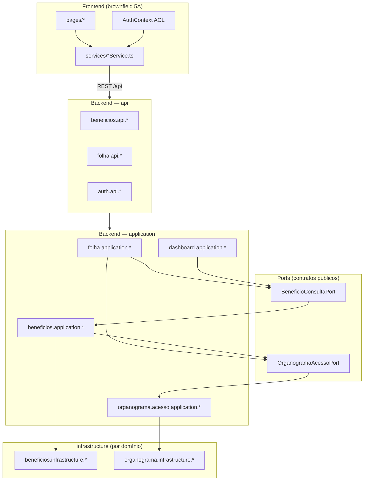

# Architecture

**Pattern:** Monólito modular in-process (Spring Boot API + React SPA), deploy único via Docker Compose

**Analyzed:** 2026-07-26 (modular-monolith P3)

## High-Level Structure

```text
Browser (Vite/React :3000/5173)
    │  HTTPS/HTTP + Bearer JWT
    ▼
Nginx (prod) / Vite (dev)
    │  REST JSON → VITE_API_URL
    ▼
Spring Boot (:8083/api) — monólito Maven único, pacotes por domínio
    │  SecurityFilterChain + JwtAuthenticationFilter
    ▼
{dominio}.api → {dominio}.application → {dominio}.infrastructure
    │                              ↘ ports in-process (cross-domain)
    ▼
Spring Data JPA → PostgreSQL 15
    ▲
Flyway migrations (V1.0–V1.14)
```

**Deploy:** um artefato JAR + um processo JVM + um banco PostgreSQL. Não há multi-módulo Maven nem serviços separados — fronteiras são lógicas (pacotes + ports + ArchUnit).

## Modular Monolith (in-process)

Refatoração **refactor-only** (AD-007): bounded contexts como pacotes Java sob `br.com.techne.sistemafolha.{dominio}.{camada}`.

| Camada | Responsabilidade | Exemplo |
| ------ | ---------------- | ------- |
| `api` | Controllers REST finos, DTOs HTTP | `beneficios.api.BeneficioMensalController` |
| `application` | Regras, orquestração, adapters de port | `folha.application.FolhaTotalizacaoService` |
| `domain` | Entities, exceções de domínio | `cadastros.domain.Funcionario` |
| `infrastructure` | Repositories JPA | `beneficios.infrastructure.BeneficioMensalRepository` |
| `port` | Contrato público cross-domain | `beneficios.port.BeneficioConsultaPort` |

**Domínios migrados:** `auth`, `beneficios`, `cadastros`, `dashboard`, `folha`, `importacao`, `organograma` (+ submodule `organograma.acesso`).

**Shared kernel mínimo:** `config/`, `exception/`, `security/`, `shared/` (ex.: `DomainLogging`).

`SistemaFolhaApplication` permanece na raiz com `@SpringBootApplication` — escaneia todos os subpacotes automaticamente.

### Ordem de migração (3B)

Incremental, build verde a cada leva: Benefícios + ports → Folha → Cadastros → Organograma → Importação → Auth/Dashboard → ArchUnit cumulativo → docs/checklist (P3).

Detalhe: `_docs/specs/features/modular-monolith/design.md` § Architecture Overview.

### Dependências permitidas

Comunicação **cross-domain** exclusivamente via **ports síncronas in-process**. Consumidores não injetam repositories de outros domínios.



**Regras (enforced por ArchUnit):**

- `{dominio}..` não importa `{outro}.infrastructure..` — só `{outro}.port..` quando necessário
- `@RestController` só em pacotes `..api..`, sem campos `*Repository`
- Consumidores de ACL usam `OrganogramaAcessoPort`, não `organograma.application` / `organograma.infrastructure` diretamente

Teste: `backend/src/test/java/.../arch/ModularArchitectureTest.java`

## Public Ports (cross-domain)

### `BeneficioConsultaPort`

**Location:** `beneficios/port/BeneficioConsultaPort.java`  
**Implementação:** `beneficios.application.BeneficioConsultaAdapter`  
**Consumidores:** Folha (`FolhaTotalizacaoService`), Dashboard (`DashboardService`)

Agregações sobre `beneficio_mensal` **somente** — sem entities JPA na superfície da port. Sem lançamentos → zero/false (sem fallback legado).

### `OrganogramaAcessoPort`

**Location:** `organograma/acesso/port/OrganogramaAcessoPort.java`  
**Implementação:** `organograma.acesso.application.OrganogramaAcessoService`  
**Consumidores:** Folha, Benefícios, Dashboard, Auth (`AuthenticationService`, `AcessoUsuarioDTO`)

**Regras ACL (MOD-09):**

| Cenário | Comportamento |
| ------- | ------------- |
| Sem funcionário vinculado | Negar — `motivoNegacao=SEM_FUNCIONARIO` |
| Com funcionário, sem nó no organograma | Negar — `motivoNegacao=SEM_NO_ORGANOGRAMA` |
| Com funcionário e nó | Centros = nó + descendentes; acesso restrito |
| `Set` vazio | **Não** implica acesso total — só `acessoTotal=true` explícito |

## Identified Patterns

### Thin controllers → application services

**Location:** `{dominio}.api.*Controller` → `{dominio}.application.*Service`  
**Purpose:** Borda HTTP sem persistência direta  
**Example:** `folha.api.FolhaPagamentoController` → `folha.application.FolhaPagamentoService`

### Manual DTO mapping (records)

**Location:** DTOs em `{dominio}.api` ou `dto/` legado residual  
**Purpose:** Contrato API tipado sem MapStruct  
**Implementation:** Java `record` + Jakarta validation + `@Schema` OpenAPI

### Soft delete via flag `ativo`

**Location:** entities + repositories  
**Purpose:** Exclusão lógica sem apagar histórico  
**Implementation:** `UPDATE … SET ativo = false`; listagens filtram `ativo = true`

### JWT + refresh token DB-backed

**Location:** `security/`, `auth.application`, `config/SecurityConfig.java`  
**Purpose:** Auth stateless com rotação/revogação de refresh  
**Implementation:** Access JWT (claims `roles`); refresh opaco em tabela; cleanup agendado

### Hierarchical access (organograma) via port

**Location:** `organograma.acesso.port.OrganogramaAcessoPort`  
**Purpose:** Filtrar dados por centros de custo do nó do usuário e descendentes  
**Implementation:** `AccessContextDTO` / `AcessoUsuarioDTO` com sinais distintos; FE nega quando `!temFuncionarioVinculado || !temNoOrganograma`  
**Example:** `GET /auth/acesso`, filtros em folha e benefícios mensais

### Benefícios mensais (fonte única de custo)

**Location:** `beneficios.*` — `TipoBeneficio`, `BeneficioMensal`  
**Purpose:** Lançamentos por competência; custo agregado via `BeneficioConsultaPort`  
**Nota:** Tabela/entity `beneficios` legado removida (Flyway V1.14)

### File-based imports

**Location:** `importacao.application.ImportacaoFolhaAdpService`, `beneficios.application.ImportacaoBeneficioMensalService`  
**Purpose:** Carga em lote sem integração online  
**Implementation:** `MultipartFile` → parse CSV/XLSX → persistência transacional

### Structured logging por domínio

**Location:** `shared.logging.DomainLogging` + application services migrados  
**Purpose:** Observabilidade `domain=<nome>`; WARN em negação ACL com `usuarioId` + `motivoNegacao`

## Data Flow

### Authentication

1. `POST /api/auth/login` (público) → JWT + refresh + `acessoUsuario` tipado  
2. Frontend grava tokens (`TokenService`) + user em `localStorage`  
3. Axios injeta `Authorization: Bearer`  
4. Em 401/403: fila + `POST /auth/refresh`; falha dispara `auth:logout`  
5. `PrivateRoute` redireciona para `/login` se sem usuário

### Folha + totalização com benefícios

1. Importação ADP ou CRUD de `FolhaPagamento`  
2. Consultas agregam linhas por funcionário/competência  
3. `FolhaTotalizacaoService` calcula bruto/líquido/custo; benefícios via `BeneficioConsultaPort` (mensal-only)  
4. Resumos em `resumo_folha_pagamento`

### Benefícios mensais

1. Admin cadastra `TipoBeneficio` (`POST /tipo-beneficio` exige `ADMIN`)  
2. Upload XLSX em `/importacao/beneficios-mensais` ou CRUD `/beneficio-mensal`  
3. UI lista/resumo em `BeneficiosMensais`; tipos em `TiposBeneficio`

### Organograma ACL

1. Login/refresh → `OrganogramaAcessoPort.obterContextoAcesso` → `AcessoUsuarioDTO`  
2. Frontend `AuthContext.podeAcessarCentroCusto` nega contextos inválidos  
3. Backend aplica filtros via port em endpoints sensíveis à hierarquia

## Code Organization

**Backend:** pacotes por domínio `{dominio}.{api|application|domain|infrastructure|port}` — monólito Maven único  
**Frontend:** feature-based brownfield — `pages/<Feature>/index.tsx` + `services/<feature>Service.ts`; pages **não** importam `api.ts` diretamente

**Module boundaries:**

- Cross-domain via ports (`BeneficioConsultaPort`, `OrganogramaAcessoPort`)
- ArchUnit quebra build em violações de fronteira
- Checklist reproduzível: `diversos/scripts/check-modular-compliance.sh`

## Compliance Verification

```bash
# Da raiz do repositório
./diversos/scripts/check-modular-compliance.sh
```

Cobre ports, zero legado, ArchUnit, controllers finos, FE modular (pages, órfãos, ACL) e gates `mvn test` / `npm run build`. Lint FE reportado em seção separada (dívida brownfield pré-existente pode falhar sem invalidar checks modulares — ver saída do script).
