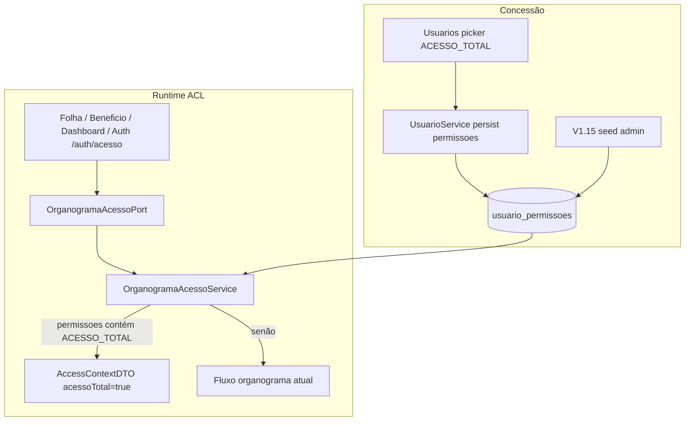

# ACL — Role `ACESSO_TOTAL` Design

**Spec**: `_docs/specs/features/acl-acesso-total-role/spec.md`  
**Context**: `_docs/specs/features/acl-acesso-total-role/context.md`  
**Status**: Approved (Tasks phase opened 2026-07-27)  
**Constraints**: AD-007 (ACL deny sem vínculo), AD-008 (pacotes por domínio), AD-011 (`ACESSO_TOTAL` ≠ `ADMIN`)

---

## Architecture Overview

Ponto único de concessão: `OrganogramaAcessoService.obterContextoAcesso` faz **early-return** quando `usuario.permissoes` contém `ACESSO_TOTAL`, setando `acessoTotal=true` **antes** do fluxo funcionário/nó. Consumidores existentes (Folha, Benefícios, Dashboard) já brancham em `contexto.acessoTotal()` — **sem** alteração de service nesses domínios.

Dados: Flyway `V1.15` seed idempotente. FE: picker + **corrigir ordem** em `AuthContext.podeAcessarCentroCusto` (hoje nega antes de ler `acessoTotal` — incompatível com ATOT-01/10).



**Não muda:** `SecurityConfig` matchers `hasRole("ADMIN")`; JWT claims; `ResumoFolhaPagamentoService` (Deferred ATOT-11).

---

## Code Reuse Analysis

### Existing Components to Leverage

| Component | Location | How to Use |
| --------- | -------- | ---------- |
| `OrganogramaAcessoService` | `organograma/acesso/application/` | Early-return + factory `acessoTotal(...)` |
| `AccessContextDTO` | `organograma/acesso/port/` | Sem mudança de shape; novo caso de preenchimento |
| `Usuario.permissoes` / `getAuthorities()` | `auth/domain/Usuario.java` | Fonte da string `ACESSO_TOTAL` → `ROLE_ACESSO_TOTAL` |
| `UsuarioService` + FE form | `auth` / `pages/Usuarios` | Persistência já grava lista de strings |
| `OrganogramaAcessoServiceTest` | `.../acesso/application/` | Estender cenários ATOT-01/02/08 |
| `FolhaPagamentoService.aplicarFiltroAcesso` | `folha/application/` | Já honra `acessoTotal` primeiro — regressão via teste existente ou 1 caso novo |
| `AuthenticationService` → `AcessoUsuarioDTO` | `auth/application/` | Já mapeia `acessoTotal` do port — zero change se DTO do port estiver correto |
| Flyway `usuario_permissoes` | `V1.4` | PK `(usuario_id, permissao)` → `ON CONFLICT DO NOTHING` |

### Integration Points

| System | Integration Method |
| ------ | ------------------ |
| PostgreSQL | `INSERT … SELECT … WHERE login = 'admin' ON CONFLICT DO NOTHING` |
| Spring Security | Sem novos matchers; `ACESSO_TOTAL` **não** entra em `hasRole` de mutação |
| FE AuthContext | Reordenar checks: `acessoTotal` **antes** de exigir funcionário/nó |
| Consumidores BE | Nenhum diff obrigatório — só testes de regressão |

---

## Components

### OrganogramaAcessoService (extend)

- **Purpose**: Único lugar que seta `acessoTotal=true` a partir de `ACESSO_TOTAL`.
- **Location**: `backend/.../organograma/acesso/application/OrganogramaAcessoService.java`
- **Interfaces** (comportamento):
  - `obterContextoAcesso(Long usuarioId): AccessContextDTO`
    1. Load usuário; se null → `negar(SEM_FUNCIONARIO)` (inalterado)
    2. **NEW:** se `temPermissao(usuario, "ACESSO_TOTAL")` → retornar contexto total (ver Data Models)
    3. Senão → fluxo atual (funcionário → nó → centros)
  - `usuarioPodeAcessarCentroCusto` — já short-circuit em `acessoTotal()`; sem mudança
- **Dependencies**: `UsuarioLookupPort` (já); lê `Usuario.getPermissoes()`
- **Reuses**: `negar` / `negarComFuncionario`; novo helper privado `contextoAcessoTotal(Usuario)`

**Constante:** `public static final String PERMISSAO_ACESSO_TOTAL = "ACESSO_TOTAL";` (ou package-private no service) — evita string mágica espalhada.

### Flyway V1.15

- **Purpose**: Seed `ACESSO_TOTAL` no admin (ATOT-07).
- **Location**: `backend/src/main/resources/db/migration/V1.15__grant_acesso_total_to_admin.sql`
- **SQL (intent):**

```sql
INSERT INTO usuario_permissoes (usuario_id, permissao)
SELECT u.id, 'ACESSO_TOTAL'
FROM usuarios u
WHERE u.login = 'admin'
ON CONFLICT DO NOTHING;
```

- **Dependencies**: Tabela de `V1.4`; usuário seed `admin` de `V1.0`
- **Reuses**: PK existente; sem alteração de entity JPA

### Frontend Usuarios

- **Purpose**: Expor e persistir a permissão (ATOT-09/10).
- **Location**: `frontend/src/pages/Usuarios/index.tsx`
- **Changes**:
  - Adicionar `'ACESSO_TOTAL'` a `permissoesDisponiveis`
  - Chip color: `error` (privilégio alto, alinhado a `ADMIN`)
- **Dependencies**: API usuários existente
- **Reuses**: Checkbox group atual

### Frontend AuthContext (fix obrigatório)

- **Purpose**: Honrar `acessoTotal` sem exigir organograma (ATOT-01/10 no cliente).
- **Location**: `frontend/src/contexts/AuthContext.tsx` (~L143–147)
- **Interfaces**: `podeAcessarCentroCusto(centroCustoId)` — nova ordem:

```text
1. if !acessoUsuario → false
2. if acessoUsuario.acessoTotal → true
3. if !temFuncionarioVinculado || !temNoOrganograma → false
4. return centrosCustoIds.includes(id)
```

- **Risk if skipped:** BE libera folha; UI que usa `podeAcessarCentroCusto` continua bloqueando.

### Testes (gate)

| Test | Asserts | AC |
| ---- | ------- | -- |
| `OrganogramaAcessoServiceTest` — ACESSO_TOTAL sem funcionário | `acessoTotal=true`, `motivoNegacao=null`, `usuarioPodeAcessarCentroCusto(any)=true`; centros vazios OK | ATOT-01, 05 |
| Mesmo — sem ACESSO_TOTAL sem funcionário | deny SEM_FUNCIONARIO (já existe) | ATOT-02 |
| Mesmo — só ADMIN nas permissoes, sem funcionário | `acessoTotal=false` | ATOT-08 |
| `FolhaPagamentoServiceTest` — contexto total sem centros | `consultarPorPeriodo` não filtra fora (já tem `contextoAcessoTotal()`) | ATOT-03 |
| Opcional smoke: ADMIN matcher `SecurityConfigTipoBeneficioTest` intacto | 403/2xx | ATOT-06 |

Não exigir teste de SQL Flyway em CI (padrão do repo); ATOT-07 verificado por review do arquivo + migrate local.

---

## Data Models

### AccessContextDTO — caso `ACESSO_TOTAL` (Agent Discretion locked here)

Quando permissão presente (com ou sem funcionário/nó):

| Campo | Valor |
| ----- | ----- |
| `acessoTotal` | `true` |
| `temFuncionarioVinculado` | `usuario.getFuncionario() != null` (fato, sem mentir) |
| `temNoOrganograma` | `false` se early-return **antes** de resolver nó; se já houver vínculo e quisermos enriquecer metadados, **opcional** — **MVP: early-return puro → `false` / ids null** se sem resolução de nó |
| `centrosCustoIds` | `Set.of()` (vazio; **não** significa total — só a flag) |
| `motivoNegacao` | `null` |
| `noOrganogramaId/Nome/nivel` | `null` |

Justificativa: consumidores BE/FE **devem** checar `acessoTotal` primeiro (L-007 / AD-007). Mentir `temFuncionario=true` mascara estado real e confunde UI.

### Permissão

```text
usuario_permissoes.permissao = 'ACESSO_TOTAL'  -- exact match
→ GrantedAuthority ROLE_ACESSO_TOTAL
```

Sem nova tabela / enum Java obrigatório neste MVP (lista livre como hoje).

---

## Error Handling Strategy

| Error Scenario | Handling | User Impact |
| -------------- | -------- | ----------- |
| Usuário sem `ACESSO_TOTAL` e sem organograma | Deny atual → listas vazias | Mesmo de hoje |
| Login `admin` ausente na base | Migration `INSERT…SELECT` insere 0 rows | Ops aplica seed manual / cria admin |
| Permissão com casing errado | Não concede | Admin corrige na UI |
| FE desatualizado (ordem antiga) | BE ok; UI pode bloquear centros | Fix AuthContext nesta feature |

---

## Risks & Concerns

| Concern | Location | Impact | Mitigation |
| ------- | -------- | ------ | ---------- |
| FE `podeAcessarCentroCusto` ignora `acessoTotal` se sem funcionário/nó | `AuthContext.tsx:143-147` | ATOT-10 falha no cliente | Reordenar checks (componente acima) |
| Resumo folha continua unscoped | `ResumoFolhaPagamentoService` | Gestor restrito vê totais globais | Deferred ATOT-11 (AD-011 trade-off) |
| Roles FE órfãs (`GESTOR`, …) sem enforcement BE | `Usuarios/index.tsx` | Confusão operacional | Out of scope; não expandir |
| Test helper `usuario()` não seta `permissoes` | `OrganogramaAcessoServiceTest:136` | NPE se `getPermissoes()` null | Fixture seta `List.of(...)` / emptyList |
| Concessão via API sem gate “só ADMIN concede ACESSO_TOTAL” | `UsuarioController` | Privilege escalation se operador editar usuários | Deferred CONCERNS; fora do MVP |
| `permissoes` null no Usuario | Entity | NPE no contains | Null-safe: `Optional.ofNullable(permissoes).orElseGet(List::of)` |

---

## Tech Decisions (feature-local)

| Decision | Choice | Rationale |
| -------- | ------ | --------- |
| Onde setar flag | Só `OrganogramaAcessoService` | Um ponto; AD-011; consumidores já leem a flag |
| Shape DTO com total | Fatos reais + `acessoTotal=true` + centros ∅ | Não mentir vínculo; empty ≠ total (AD-007) |
| Early-return | Antes de funcionário/nó | ATOT-01: não exigir vínculo |
| Seed | Por `login = 'admin'`, não hardcode id=1 | Mais seguro se ids divergirem |
| SecurityConfig | Sem matcher novo para `ACESSO_TOTAL` | Escopo de **dados**, não de rota HTTP |
| AuthContext | `acessoTotal` primeiro | Fecha gap FE vs BE |
| Project-level | **Nenhum AD novo** | AD-011 já cobre; design só detalha HOW |

---

## Mapping Spec → Design

| AC | Design element |
| -- | -------------- |
| ATOT-01 | Early-return + DTO table |
| ATOT-02 | Fluxo organograma inalterado após branch |
| ATOT-03/04 | Folha já filtra por flag; testes |
| ATOT-05 | Novos testes service |
| ATOT-06 | Sem mudança SecurityConfig |
| ATOT-07 | V1.15 SQL |
| ATOT-08 | Teste ADMIN-only |
| ATOT-09/10 | FE picker + AuthContext + persist existente |

---

## Next

Após **aprovação** deste design: Medium pode ir direto a **Execute** (tasks implícitas) ou, se preferir, formalizar `tasks.md`.
