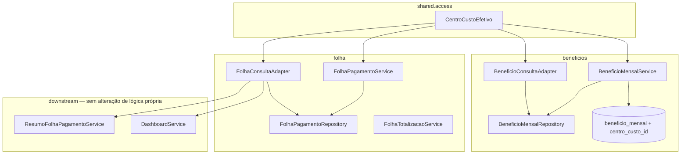
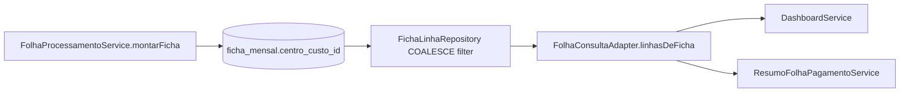

# ACL — Centro de Custo por Competência Design

**Spec**: `_docs/specs/features/acl-cc-competencia/spec.md`  
**Context**: `_docs/specs/features/acl-cc-competencia/context.md`  
**Status**: Approved — Tasks round 2 opened 2026-07-29  
**Constraints**: AD-007 (ACL deny), AD-008 (pacotes + ports cross-domain), AD-010 (dashboard via `*.port`), AD-011 (`ACESSO_TOTAL` ≠ `ADMIN`)

---

## Architecture Overview

**Problema raiz:** múltiplos pontos de filtro ACL usam `funcionario.centroCusto` (cadastro atual) em vez do CC **congelado na linha/lançamento** da competência.

**Solução:** introduzir regra canônica única — `COALESCE(linha.centroCusto, funcionario.centroCusto)` — centralizada em helper puro (`shared`) e aplicada em:

1. **Folha** — ACL in-memory (`FolhaPagamentoService`), port de consulta (`FolhaConsultaAdapter`), query por CC (`FolhaPagamentoRepository`), snapshots/DTO
2. **Benefícios** — migration + snapshot no create; ACL + queries JPQL com COALESCE; DTO alinhado
3. **Downstream** — resumo scoped e dashboard **já** consomem `FolhaConsultaPort`; corrigir o port propaga FCC-07/FCC-08 sem mudar `DashboardService` / `ResumoFolhaPagamentoService`



**Não muda:** `OrganogramaAcessoPort`; contratos HTTP/DTO (campos existentes); import ADP (já grava CC na linha); FE; `SecurityConfig`.

---

## Code Reuse Analysis

### Existing Components to Leverage

| Component | Location | How to Use |
| --------- | -------- | ---------- |
| `FolhaPagamento.centroCusto` | `folha/domain/FolhaPagamento.java` | Já persistido na import — tornar fonte primária do ACL |
| `FolhaImportacaoAdapter.montarFolha` | `folha/application/` | Já seta `folha.centroCusto` — inalterado |
| `FolhaConsultaPort.findLinhasAtivasPorCompetencia` | `folha/port` + adapter | Único ponto de filtro para resumo/dashboard scoped |
| `FolhaTotalizacaoService` | `folha/application/` | Já prefere `referencia.getCentroCusto()` — alinhar com helper |
| `BeneficioMensalService.aplicarFiltroAcesso` | `beneficios/application/` | Refatorar para CC efetivo do lançamento |
| `OrganogramaAcessoPort` / `AccessContextDTO` | `organograma/acesso/port` | Deny / `acessoTotal` / `centrosCustoIds` inalterados |
| Testes espelho | `FolhaPagamentoServiceTest`, `FolhaConsultaAdapterTest`, `BeneficioMensalServiceTest` | Casos discriminatórios FCC-06 / FCC-16 |

### Integration Points

| System | Integration Method |
| ------ | ------------------ |
| Flyway | `V1.25__beneficio_mensal_centro_custo.sql` — coluna nullable + FK + índice |
| JPA | `@ManyToOne CentroCusto centroCusto` nullable em `BeneficioMensal` |
| ArchUnit AD-010 | Helper em `shared` — sem application→foreign infrastructure |
| `ResumoFolhaPagamentoService` / `DashboardService` | Herdam correção via `FolhaConsultaAdapter` |

---

## Components

### CentroCustoEfetivo (novo)

- **Purpose**: Regra canônica A2 — resolver ID efetivo e membership no escopo.
- **Location**: `shared/access/CentroCustoEfetivo.java`
- **Interfaces**:
  - `idOf(Long linhaCentroCustoId, Long funcionarioCentroCustoId): Long` — retorna `null` se ambos null
  - `pertenceAoEscopo(Long centroCustoEfetivoId, Set<Long> centrosCustoIds): boolean` — false se id null ou set null/empty
- **Dependencies**: Nenhuma (Java puro)
- **Reuses**: Padrão de utilitário já usado em `shared/logging/DomainLogging`

### FolhaPagamentoService (alterar)

- **Purpose**: ACL de listagens/totais/delete usa CC efetivo da linha.
- **Location**: `folha/application/FolhaPagamentoService.java`
- **Changes**:
  - `aplicarFiltroAcesso(FolhaPagamento, AccessContextDTO)` → `CentroCustoEfetivo` com `folha.centroCusto` primeiro
  - `consultarPorCentroCusto` → trocar `findByFuncionarioCentroCusto...` por query em `f.centroCusto` (FCC-10)
- **Reuses**: `OrganogramaAcessoPort.usuarioPodeAcessarCentroCusto` inalterado

### FolhaConsultaAdapter (alterar)

- **Purpose**: Port único de linhas scoped + snapshots para dashboard/resumo.
- **Location**: `folha/application/FolhaConsultaAdapter.java`
- **Changes**:
  - `pertenceAosCentros` → CC efetivo via helper (FCC-01, FCC-07, FCC-08)
  - `toLinhaSnapshot` → expor CC/linha de negócio do CC **efetivo da linha** (FCC-12)
- **Reuses**: `findByCompetenciaAndDecimoTerceiroAndAtivoTrue` inalterado

### FolhaPagamentoRepository (alterar)

- **Purpose**: Query explícita por CC da linha no período.
- **Location**: `folha/infrastructure/FolhaPagamentoRepository.java`
- **Changes**:
  - Adicionar/usar `findByCentroCustoAndDataInicioBetweenAndAtivoTrue(CentroCusto, LocalDate, LocalDate)` filtrando `f.centroCusto = :centroCusto`
  - Deprecar uso de `findByFuncionarioCentroCustoAndDataInicioBetweenAndAtivoTrue` em produção (manter método se testes referenciam, ou remover se unused)
- **Reuses**: Query existente `findByCentroCustoAndPeriodo` como referência JPQL

### FolhaTotalizacaoService (alterar — mínimo)

- **Purpose**: Totais por funcionário exibem CC coerente com ACL.
- **Location**: `folha/application/FolhaTotalizacaoService.java`
- **Changes**: Substituir lógica inline `referencia.getCentroCusto() ?? funcionario` por `CentroCustoEfetivo` + resolver entidade CC para descrição
- **Reuses**: Agrupamento existente por funcionário

### BeneficioMensal (entity + migration)

- **Purpose**: Congelar CC no lançamento (FCC-13, A8).
- **Location**: `beneficios/domain/BeneficioMensal.java` + `V1.25__beneficio_mensal_centro_custo.sql`
- **Schema**:

```sql
ALTER TABLE beneficio_mensal
  ADD COLUMN IF NOT EXISTS centro_custo_id BIGINT REFERENCES centros_custo(id);

CREATE INDEX IF NOT EXISTS idx_beneficio_mensal_centro_custo
  ON beneficio_mensal (centro_custo_id);
```

- **Entity**: `@ManyToOne @JoinColumn(name = "centro_custo_id") CentroCusto centroCusto` — **nullable** (fallback A2 para dev sem backfill)

### BeneficioMensalService (alterar)

- **Purpose**: Snapshot no create; ACL e DTO por CC efetivo.
- **Location**: `beneficios/application/BeneficioMensalService.java`
- **Changes**:
  - `criar`: `beneficio.setCentroCusto(funcionario.getCentroCusto())` (FCC-13)
  - `aplicarFiltroAcesso(BeneficioMensal)`: CC efetivo do lançamento (FCC-14, FCC-15)
  - `aplicarFiltroAcesso(Funcionario)`: **mantido** para gate de create (CC atual do funcionário no momento do lançamento — correto)
  - `toDTO`: CC efetivo + linha negócio do CC efetivo (FCC-17)
  - `buscarPorCompetencia` / resumo / competências: delegar a queries com COALESCE
- **Reuses**: Padrão deny/`centrosParaFiltro` inalterado

### BeneficioMensalRepository (alterar)

- **Purpose**: Filtros scoped em SQL com CC efetivo.
- **Location**: `beneficios/infrastructure/BeneficioMensalRepository.java`
- **Changes** — substituir predicados `bm.funcionario.centroCusto.id IN :ids` por:

```jpql
COALESCE(bm.centroCusto.id, bm.funcionario.centroCusto.id) IN :centroCustoIds
```

  Métodos afetados:
  - `findByCompetenciaInicioAndCompetenciaFimAndFuncionarioCentroCustoIdInAndAtivoTrue` → renomear/refatorar para `...CentroCustoEfetivoIdIn...`
  - `resumoPorCompetenciaAndCentroCustoIds`
  - `competenciasResumoAndCentroCustoIds`
  - `sumValorPorCompetenciaECentros`

### BeneficioConsultaAdapter (alterar)

- **Purpose**: Contagens scoped por CC efetivo (dashboard/benefícios).
- **Location**: `beneficios/application/BeneficioConsultaAdapter.java`
- **Changes**:
  - `contarLancamentosAtivosNaCompetenciaPorCentros` → filtro via helper (ou query dedicada)
  - `sumValorPorCompetenciaECentros` → herda query corrigida do repository
- **Reuses**: Validações existentes

---

## Data Models

### FolhaPagamento (existente — sem migration)

| Campo | Uso pós-fix |
| ----- | ----------- |
| `centro_custo_id` | **Primário** para ACL, endpoint por CC, snapshots |
| `funcionario.centro_custo_id` | Fallback A2 quando linha sem CC |

### BeneficioMensal (alteração)

| Campo | Tipo | Uso |
| ----- | ---- | --- |
| `centro_custo_id` | `BIGINT FK centros_custo`, nullable | Snapshot na criação; primário ACL |
| `funcionario.centro_custo_id` | existente | Fallback A2; gate de create |

**Imutabilidade (A8):** updates de valor/observação **não** alteram `centro_custo_id`.

---

## Error Handling Strategy

| Error Scenario | Handling | User Impact |
| -------------- | -------- | ----------- |
| Linha/lançamento e funcionário sem CC | `pertenceAoEscopo` → false | Gestor scoped não vê o registro |
| CC efetivo fora do escopo | Filter exclui / lista vazia | Sem vazamento |
| `acessoTotal=true` | Bypass filtro CC | Visão global inalterada |
| Create benefício sem CC no funcionário | Bean validation `@NotNull` em `Funcionario.centroCusto` impede | 400 antes de persistir |
| Endpoint CC sem permissão organograma | `List.of()` + warn log (atual) | Lista vazia |

---

## Risks & Concerns

| Concern | Location | Impact | Mitigation |
| ------- | -------- | ------ | ---------- |
| ACL duplicado em 4+ classes | `FolhaPagamentoService`, `FolhaConsultaAdapter`, `BeneficioMensalService`, `BeneficioConsultaAdapter` | Divergência futura | Helper único `CentroCustoEfetivo` + testes discriminatórios |
| Queries benefício filtram `funcionario.centroCusto` | `BeneficioMensalRepository` JPQL | Resumo/listagem scoped errados | COALESCE em todas as queries scoped (design locked) |
| `toLinhaSnapshot` usa só funcionário | `FolhaConsultaAdapter:107` | Dashboard stats por CC errados pós-transferência | Corrigir para CC efetivo da linha (FCC-12) |
| Benefício sem coluna CC | `BeneficioMensal` entity | Impossível snapshot histórico | Migration V1.25 + set no create |
| N+1 em filtros stream | `BeneficioConsultaAdapter.contarLancamentos...` | Perf em competências grandes | Preferir query COALESCE no repository; stream só se query não couber |
| Teste existente amarrado a funcionário CC | `FolhaPagamentoServiceTest:180` | Falso verde | Novo caso: linha CC ≠ funcionário CC atual |
| ArchUnit cross-domain | AD-010 | Violação se helper importar entities de outro domínio | Helper só com `Long`; domains resolvem IDs |

---

## Tech Decisions

| Decision | Choice | Rationale |
| -------- | ------ | --------- |
| Local do helper | `shared/access/CentroCustoEfetivo` | Reutilização folha+benefícios sem violar AD-008 (sem port para lógica pura) |
| Filtro SQL vs in-memory | COALESCE em JPQL (benefícios); in-memory OK em folha port (já carrega competência) | Paridade; benefícios tem muitas queries agregadas |
| Migration benefício | Coluna nullable, sem backfill | D confirmado — dev phase |
| Endpoint por CC | `f.centroCusto = :id` estrito (sem COALESCE) | C1 — consulta explícita ao CC da linha na competência |
| Benefício create gate | ACL no funcionário **atual** | Gestor só cria se escopo cobre CC atual hoje |
| Benefício read ACL | CC efetivo do lançamento | FCC-14/15 |
| Downstream resumo/dashboard | Só corrigir `FolhaConsultaAdapter` | Propagação automática FCC-07/08 |

---

## Requirement → Component Map

| Req ID | Component(s) |
| ------ | ------------ |
| FCC-01…06 | `CentroCustoEfetivo`, `FolhaPagamentoService`, `FolhaConsultaAdapter`, tests |
| FCC-07…09 | `FolhaConsultaAdapter` (propaga para `ResumoFolhaPagamentoService`, `DashboardService`) |
| FCC-10…11 | `FolhaPagamentoService.consultarPorCentroCusto`, `FolhaPagamentoRepository` |
| FCC-12 | `FolhaConsultaAdapter.toLinhaSnapshot`, `FolhaTotalizacaoService` |
| FCC-13…17 | Migration, `BeneficioMensal`, `BeneficioMensalService`, `BeneficioMensalRepository`, `BeneficioConsultaAdapter`, tests |

---

## Suggested Tasks (preview for Tasks phase)

Estimativa **7 tasks**, 1 batch — Execute inline sem sub-agents:

| Task | Scope | Req IDs |
| ---- | ----- | ------- |
| T1 | `CentroCustoEfetivo` + unit test | — |
| T2 | Folha ACL (`FolhaPagamentoService`, `FolhaConsultaAdapter`) + testes FCC-06 | FCC-01…06, 07…09, 12 |
| T3 | Repository + endpoint por CC linha | FCC-10, 11 |
| T4 | Flyway V1.25 + entity `BeneficioMensal.centroCusto` | FCC-13 |
| T5 | `BeneficioMensalService` create snapshot + ACL + toDTO | FCC-13…15, 17 |
| T6 | `BeneficioMensalRepository` queries COALESCE | FCC-14 |
| T7 | `BeneficioConsultaAdapter` + testes FCC-16 | FCC-14, 16 |

**Gate por task:** `mvn test -Dtest=...` classes afetadas; commit atômico.

**Verifier (pós-T7):** sensor — mutação `aplicarFiltroAcesso` voltando a `funcionario.getCentroCusto()` deve falhar FCC-06/FCC-16.

---

## Approval

Design **Approved** round 1. Round 2 amendment below.

---

## Round 2 — Ficha path + hygiene (2026-07-29)

### Architecture delta

Estende regra canônica `CentroCustoEfetivo` ao **path materializado** (ficha). Quando `fichaMensalRepository.existsByCompetencia` → `linhasDeFicha` passa a usar CC snapshot da ficha, não CC atual do funcionário.



### Components (new/alter)

| Component | Change |
| --------- | ------ |
| `V1.26__ficha_mensal_centro_custo.sql` | `centro_custo_id BIGINT FK`, nullable, index |
| `FichaMensal` entity | `@ManyToOne CentroCusto centroCusto` nullable |
| `FolhaProcessamentoService.montarFicha` | Set CC efetivo from first ADP line in grupo via COALESCE entity refs |
| `FichaLinhaRepository` | JPQL filter: `COALESCE(fm.centroCusto.id, fm.funcionario.centroCusto.id) IN :ids`; EntityGraph includes `fichaMensal.centroCusto` |
| `FolhaConsultaAdapter.toLinhaSnapshotFromFicha` | CC from `fichaMensal.centroCusto` ?? `funcionario.centroCusto` |
| `BeneficioMensalRepository.countByCompetenciaECentros` | SQL COUNT with COALESCE — mirror `sumValorPorCompetenciaECentros` |
| `BeneficioConsultaAdapter` | Delegate count to repository |
| `BeneficioMensalRepository` | Rename scoped list method → `...CentroCustoEfetivoIdIn...` |
| `FolhaPagamentoRepository` | Remove orphan `findByFuncionarioCentroCusto...` |

### Requirement → Component Map (round 2)

| Req ID | Component(s) |
| ------ | ------------ |
| FCC-18, FCC-21 | Migration V1.26, `FichaMensal`, `FolhaProcessamentoService`, tests |
| FCC-19, FCC-20, FCC-22 | `FichaLinhaRepository`, `FolhaConsultaAdapter`, `FolhaConsultaAdapterTest` |
| FCC-23 | `BeneficioMensalRepository`, `BeneficioConsultaAdapter`, tests |
| FCC-24, FCC-25 | Repository rename + removal, service/test updates |

### Tech decisions (round 2)

| Decision | Choice | Rationale |
| -------- | ------ | --------- |
| CC snapshot granularity | Por `ficha_mensal` (funcionário × competência) | Uma ficha = um funcionário; CC efetivo único por grupo ADP |
| Snapshot source | Primeira linha do grupo ADP (`grupo.get(0)`) COALESCE | Todas linhas ADP do grupo compartilham funcionário; CC da linha ADP primária |
| Ficha legado | Nullable, fallback funcionário | A10 / D paridade |
| Count benefício | SQL COUNT, não stream | Code-review perf; paridade com sum query |

---

## Round 3 — Ficha drill-down ACL (2026-07-29)

### Change

`FolhaFichaConsultaService.podeAcessarFicha` → `CentroCustoEfetivo` com `ficha.centroCusto` + `funcionario.centroCusto`.

`FichaMensalRepository`: `LEFT JOIN FETCH f.centroCusto` em queries usadas pelo drill-down.

### Requirement map

| Req | Component |
| --- | --------- |
| FCC-26…28 | `FolhaFichaConsultaService`, `FichaMensalRepository`, `FolhaFichaConsultaServiceTest` |
