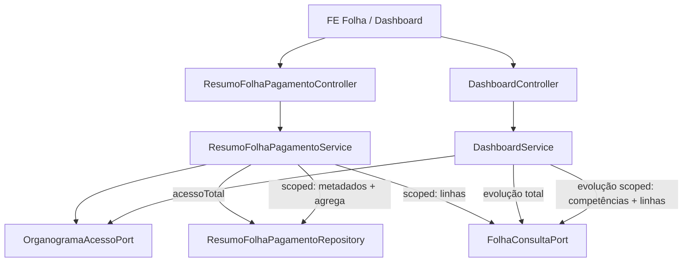

# ACL — Resumo Folha scoped + Dashboard evolução Design

**Spec**: `_docs/specs/features/acl-scoped-folha-resumo/spec.md`  
**Context**: `_docs/specs/features/acl-scoped-folha-resumo/context.md`  
**Status**: Approved (Tasks phase opened 2026-07-27)  
**Constraints**: AD-007 (ACL deny), AD-008 (pacotes + ports cross-domain), AD-010 (dashboard só via `*.port`), AD-011 (`ACESSO_TOTAL` ≠ `ADMIN`; trade-off “resumo unscoped” **fechado por este feature**, sem superseder AD-011)

---

## Architecture Overview

Ponto único de leitura de linhas filtradas: `FolhaConsultaPort.findLinhasAtivasPorCompetencia(inicio, fim, centros)` (`centros == null` ⇒ todas; `Set` ⇒ filtro por CC do funcionário — já usado pelo Dashboard).

1. **`ResumoFolhaPagamentoService`** (domínio `folha`): passa a receber `login`; resolve `AccessContextDTO`; deny → `[]`; `acessoTotal` → mapear snapshot como hoje; senão → para cada competência do repositório de resumos, agregar linhas scoped e montar `ResumoFolhaPagamentoDTO` (encargos `0`, A2 zeros se sem linhas).
2. **`ResumoFolhaPagamentoController`**: injeta `Authentication` e repassa `authentication.getName()` (padrão Folha/Benefícios).
3. **`DashboardService`**: no ramo scoped, **não** retornar `evolucaoMensal = List.of()`; iterar competências da janela atual (`findEvolucaoUltimos12Meses` só como **lista de competências**/metadados) e recalcular empregados/líquido via `findLinhasAtivasPorCompetencia(..., centrosScoped)` + helpers de provento/desconto já existentes.
4. **FE**: zero mudança obrigatória (mesmo DTO/campos).
5. **Benefícios**: nenhuma alteração de produção (D1).



**Não muda:** schema Flyway; import ADP; `SecurityConfig` matchers (já `anyRequest().authenticated()`); contrato de campos do DTO.

---

## Code Reuse Analysis

### Existing Components to Leverage

| Component | Location | How to Use |
| --------- | -------- | ---------- |
| `FolhaConsultaPort.findLinhasAtivasPorCompetencia` | `folha/port` + `FolhaConsultaAdapter` | Fonte única de linhas filtradas por CC (`null` = all) |
| `DashboardService.calcularTotalProventos/Descontos` | `dashboard/application` | Reusar no cálculo de evolução scoped (mesmo critério `PROVENTO`/`DESCONTO`) |
| `OrganogramaAcessoPort` / `AccessContextDTO` | `organograma/acesso/port` | Deny / `acessoTotal` / `centrosCustoIds` |
| `UsuarioLookupPort` | `auth/port` | Resolver login → id |
| `ResumoFolhaPagamentoRepository` | `folha/infrastructure` | Listar competências/snapshots (metadados + caminho total) |
| `BeneficioMensalService` ACL | `beneficios/application` | Padrão deny + `centrosParaFiltro` (referência; não alterar) |
| `ResumoFolhaPagamentoServiceTest` / `DashboardServiceTest` | `src/test/...` | Estender cenários RSF |

### Integration Points

| System | Integration Method |
| ------ | ------------------ |
| Spring Security | `Authentication.getName()` nos controllers de resumo |
| ArchUnit AD-010 | Dashboard continua só em ports; agregação scoped **não** importa `folha.infrastructure` |
| FE `resumoFolhaPagamentoService` / Dashboard | Sem change de URL/shape |

---

## Components

### ResumoFolhaPagamentoController

- **Purpose**: Expor resumos com identidade do usuário.
- **Location**: `folha/api/ResumoFolhaPagamentoController.java`
- **Interfaces**:
  - `listarTodos(Authentication)` → `service.listarTodos(auth.getName())`
  - Idem `periodo`, `competencia`, `latest`
- **Dependencies**: `ResumoFolhaPagamentoService`
- **Reuses**: Padrão `FolhaPagamentoController` / `BeneficioMensalController`

### ResumoFolhaPagamentoService

- **Purpose**: Aplicar ACL e montar DTOs (snapshot vs agregação).
- **Location**: `folha/application/ResumoFolhaPagamentoService.java`
- **Interfaces** (assinaturas passam a incluir login):
  - `listarTodos(String login): List<ResumoFolhaPagamentoDTO>`
  - `consultarPorPeriodo(String login, LocalDate, LocalDate): List<...>`
  - `consultarPorCompetencia(String login, LocalDate, LocalDate): Optional<...>`
  - `listarMaisRecentes(String login): List<...>`
  - privado: `AccessContextDTO contexto(String login)`
  - privado: `boolean acessoNegado(AccessContextDTO)` — espelhar Benefícios/Dashboard (`!acessoTotal && (!temFuncionario \|\| !temNo \|\| centros vazios)`)
  - privado: `ResumoFolhaPagamentoDTO toDtoSnapshot(entity)`
  - privado: `ResumoFolhaPagamentoDTO toDtoScoped(entity, Set<Long> centros)` — chama port; se linhas vazias → zeros (A2); senão agrega; **sempre** `totalEncargos=ZERO` (B1); preserva `id`, datas, `decimoTerceiro`, `dataImportacao`, `ativo` do snapshot
- **Dependencies**: `ResumoFolhaPagamentoRepository`, `FolhaConsultaPort`, `OrganogramaAcessoPort`, `UsuarioLookupPort`
- **Reuses**: Fórmula Dashboard (PROVENTO/DESCONTO); filtro do port

**Agregação (Agent Discretion locked):** helper **package-private** no mesmo pacote `folha.application` (ex. `FolhaLinhaAgregacao`) usado só pelo service de resumo — evita Dashboard importar `folha.application` (AD-008/010). Dashboard **não** usa esse helper; reusa seus métodos privados existentes.

### FolhaLinhaAgregacao (novo, package-private)

- **Purpose**: Dado `List<FolhaLinhaSnapshot>`, calcular empregados distinct, soma PROVENTO, soma DESCONTO, líquido.
- **Location**: `folha/application/FolhaLinhaAgregacao.java` (sem `@Service` — util estático ou componente package-private)
- **Interfaces**: `Totais agregar(List<FolhaLinhaSnapshot>)` → record com 4 campos (sem encargos)
- **Dependencies**: nenhum Spring
- **Reuses**: Mesma regra de string `"PROVENTO"` / `"DESCONTO"` do Dashboard

### DashboardService (evolução)

- **Purpose**: Evolução mensal scoped (RSF-06).
- **Location**: `dashboard/application/DashboardService.java`
- **Change**:
  - Substituir `evolucaoMensal = contexto.acessoTotal() ? calcularEvolucaoMensal() : List.of()`
  - por: `acessoTotal ? calcularEvolucaoMensal() : calcularEvolucaoMensalScoped(centrosScoped)`
  - `calcularEvolucaoMensalScoped(Set<Long> centros)`:
    1. `dataInicio = now.minusMonths(11).withDayOfMonth(1)` (igual hoje)
    2. `competencias = folhaConsultaPort.findEvolucaoUltimos12Meses(dataInicio)` — **usa só** `competenciaInicio` (e ordem); ignora totais globais do snapshot
    3. Para cada item: `linhas = findLinhasAtivasPorCompetencia(competenciaInicio, fimDoMesOuCompetenciaFim?, centros)`  
       **Agent discretion:** o snapshot de evolução hoje só carrega `competenciaInicio` + totais. Para alinhar à competência real (incl. 13º / fim), preferir: carregar resumos da mesma query `findUltimos12Meses` via port **ou** derivar `competenciaFim` como `competenciaInicio.withDayOfMonth(lengthOfMonth())` para competências mensais normais.  
       **Locked recommendation:** estender `FolhaEvolucaoSnapshot` com `competenciaFim` + `decimoTerceiro` (preenchidos no adapter a partir da entity) para o scoped bater a mesma janela das linhas — mudança mínima no record + mapper. Sem isso, risco de 13º desalinhado.
    4. Agregar com helpers existentes → `EvolucaoMensalDTO(label, liquido, empregados)` — competência sem linhas → ponto com 0/0 (consistente A2)
- **Dependencies**: já tem `FolhaConsultaPort`, ACL
- **Reuses**: `calcularTotalProventos/Descontos`, formatter `MMM/yyyy`

### FolhaEvolucaoSnapshot (extend)

- **Purpose**: Permitir agregação scoped na competência correta.
- **Location**: `folha/port/FolhaEvolucaoSnapshot.java`
- **Change**: adicionar `LocalDate competenciaFim` (e opcionalmente `boolean decimoTerceiro`) — atualizar `FolhaConsultaAdapter.toEvolucaoSnapshot` e testes do adapter/dashboard que constroem o record
- **Rationale**: evita chute de `fim = último dia do mês` em competências 13º

### Tests

| Test | Asserts | AC |
| ---- | ------- | -- |
| `ResumoFolhaPagamentoServiceTest` — scoped com linhas no CC A | totais ≠ snapshot; encargos 0; empregados/proventos do A | RSF-01, 05 |
| Mesmo — `acessoTotal` | DTO = snapshot (encargos reais) | RSF-02 |
| Mesmo — deny | lista vazia | RSF-03 |
| Mesmo — snapshot existe, linhas só CC B, usuário CC A | DTO com zeros, id/metadados preservados | RSF-04 |
| `DashboardServiceTest` — scoped evolução | `evolucaoMensal` não vazia; valores das linhas scoped | RSF-06 |
| Mesmo — acessoTotal | evolução via snapshot (regressão) | RSF-07 |
| Gate Full inclui `BeneficioMensalServiceTest` sem change | verde | RSF-09 |

---

## Data Models

### ResumoFolhaPagamentoDTO (inalterado)

Campos atuais. Caminho scoped preenche:

| Campo | Scoped com linhas | Scoped sem linhas (A2) | acessoTotal |
| ----- | ----------------- | ---------------------- | ----------- |
| id | snapshot.id | snapshot.id | snapshot |
| totalEmpregados | distinct funcionarioId | 0 | snapshot |
| totalEncargos | **0** | **0** | snapshot |
| totalPagamentos | Σ PROVENTO | 0 | snapshot |
| totalDescontos | Σ DESCONTO | 0 | snapshot |
| totalLiquido | pagamentos − descontos | 0 | snapshot |
| competência / 13º / ativo / dataImportacao | do snapshot | do snapshot | snapshot |

### FolhaEvolucaoSnapshot (extend)

```text
competenciaInicio, competenciaFim, totalLiquido, totalEmpregados [, decimoTerceiro]
```

Caminho `acessoTotal` no Dashboard continua usando `totalLiquido`/`totalEmpregados` do snapshot; caminho scoped ignora esses totais e recalcula.

---

## Error Handling Strategy

| Error Scenario | Handling | User Impact |
| -------------- | -------- | ----------- |
| Login inexistente / deny ACL | Lista vazia / stats vazias | Tabelas/gráficos vazios |
| Competência sem linhas no escopo | DTO/ponto com zeros | Vê a competência zerada (A2) |
| Usuário `ACESSO_TOTAL` | Snapshot intacto | Números iguais à importação |
| Tipo rubrica fora PROVENTO/DESCONTO | Não entra nas somas (igual Dashboard) | Consistente com custo mensal scoped |

---

## Risks & Concerns

| Concern | Location | Impact | Mitigation |
| ------- | -------- | ------ | ---------- |
| N queries (1 por competência) em `listarTodos` scoped | `ResumoFolhaPagamentoService` | Latência se muitas competências | Aceitável (# competências pequeno); flag follow-up batch se precisar |
| Desalinhamento 13º se só usar `inicio`→fim mês | Evolução scoped | Totais errados | Estender `FolhaEvolucaoSnapshot` com `competenciaFim` |
| Testes atuais de Resumo sem login quebram | `ResumoFolhaPagamentoServiceTest` | Compile fail | Atualizar assinaturas + mocks ACL/port |
| Duplicação leve de fórmula PROVENTO/DESCONTO | folha helper vs dashboard | Drift futuro | Documentar; extrair para port só se surgir 3º consumidor |
| AD-011 trade-off “resumo unscoped” | STATE AD-011 | Doc desatualizada | Nota no handoff/design; **não** supersede AD-011 (ACESSO_TOTAL vs ADMIN permanece) |

---

## Tech Decisions (feature-local)

| Decision | Choice | Rationale |
| -------- | ------ | --------- |
| Onde agregar resumo | `folha.application` + `FolhaConsultaPort` | Same-domain; AD-008; reusa filtro do adapter |
| Helper compartilhado com Dashboard | **Não** via `folha.application` | AD-010: dashboard não depende de application folha |
| Evolução scoped — lista de meses | Competências de `findEvolucaoUltimos12Meses` + recalc linhas | Mesma janela/UX do gráfico atual |
| Extender `FolhaEvolucaoSnapshot` | Sim (`competenciaFim`) | Corrige 13º / fim real |
| FE | Sem change | API mantém DTO |
| Project-level AD | **Nenhum AD novo** | AD-011 intacto; trade-off resumo resolvido na feature |

---

## Mapping Spec → Design

| AC | Design element |
| -- | -------------- |
| RSF-01 | `toDtoScoped` + `FolhaLinhaAgregacao` + port linhas |
| RSF-02 | early branch `acessoTotal` → `toDtoSnapshot` |
| RSF-03 | `acessoNegado` → empty |
| RSF-04 | linhas vazias → zeros + metadados snapshot |
| RSF-05 | testes service |
| RSF-06 | `calcularEvolucaoMensalScoped` |
| RSF-07 | `calcularEvolucaoMensal` intacto |
| RSF-08 | `deveNegarAcesso` / `emptyStats` intactos |
| RSF-09 | sem diff benefícios; gate Full |

---

## Next

Após **aprovação** deste design: Tasks (`tasks.md`) ou Execute Medium com tasks implícitas se ≤3 passos — aqui recomenda-se **Tasks** (controller + service resumo + agregação + evolução + testes ≈ 5–7 tasks).
