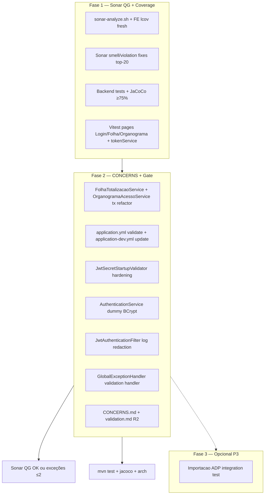

# Adequação da Análise de Projeto — R2 Design

**Spec**: `_docs/specs/features/adequacao-analise-projeto-r2/spec.md`  
**Status**: Complete — Execute PASS 2026-07-29  
**Constraints**: AD-004 (FE skills TARGET — brownfield tests only), AD-010 (ArchUnit), fix-only sem breaking HTTP/DTO

---

## Architecture Overview

R2 continua o modelo **fix-first, test-second, gate-third** da R1, aplicando o **Plano C híbrido** em duas fases sequenciais:

- **Fase 1 (P1):** zerar `new_violations`, elevar cobertura incremental/agregada Sonar, reduzir smells nos arquivos de maior densidade, expandir Vitest nas telas críticas.
- **Fase 2 (P2):** fechar dívidas CONCERNS P1 (self-invocation transacional, `ddl-auto`, JWT hardening, timing login, log hygiene JWT filter) + gates de regressão + sync docs.

Não introduz domínios, ports ou contratos HTTP novos. Toda alteração de produção é localizada nos arquivos já sinalizados pela análise Sonar/CONCERNS ou nos scripts de gate.



### Approach exploration (Large — Plano C locked)

| Approach | Summary | Pros | Cons |
| -------- | ------- | ---- | ---- |
| **A — Plano C híbrido** ⭐ | Fase1 QG/coverage → Fase2 CONCERNS | Alinha spec B2; QG verde antes de ops debt; blast radius controlado | Duas ondas de gate; FE coverage pode precisar 1 exceção documentada |
| B — Sonar-only sprint | Só smells/violations/coverage; adia CONCERNS | QG mais rápido | Viola AAP2-12…17; deploy continua com ddl-auto update e tx proxy quebrado |
| C — CONCERNS-first | Tx/schema/JWT antes de smells | Integridade ops cedo | `new_violations` permanece ERROR; não fecha MVP P1 do spec |

**Recommendation: A (Plano C híbrido)** — já confirmado no spec (B2). Fase 1 desbloqueia QG; Fase 2 elimina riscos operacionais adiados na R1.

---

## Code Reuse Analysis

### Existing Components to Leverage

| Component | Location | How to Use |
| --------- | -------- | ---------- |
| R1 design + tasks | `_docs/specs/features/adequacao-analise-projeto/` | Padrões de teste Mockito, gate scripts, validation.md template |
| `sonar-analyze.sh` | `diversos/scripts/sonar-analyze.sh` | Estender com `npm run test:coverage` (AAP2-06) |
| `check-jacoco-thresholds.sh` | `diversos/scripts/check-jacoco-thresholds.sh` | Subir limiar `global` 65→75 (AAP2-07) |
| `sonar-project.properties` | raiz | lcov path já configurado; manter exclusions |
| `FolhaTotalizacaoServiceTest` | `folha/application/` | Regressão pós refactor tx (AAP2-12) |
| `OrganogramaAcessoServiceTest` | `organograma/acesso/application/` | Regressão pós refactor tx (AAP2-13) |
| `AuthenticationServiceTest` | `auth/application/` | Estender timing dummy hash (AAP2-16) |
| `JwtSecretStartupValidatorTest` | `config/` | Estender profiles blank/default (AAP2-15) |
| `JwtAuthenticationFilterTest` | `security/` | Estender assert log sem token (AAP2-17) |
| `GlobalExceptionHandlerTest` | `exception/` | Adicionar handler validação (AAP2-11) |
| Vitest baseline | `frontend/src/smoke.test.tsx`, `vite.config.ts` | Expandir com MSW-free mocks de services |
| `ModularArchitectureTest` | `arch/` | Gate AAP2-21 após cada task backend |

### Integration Points

| System | Integration Method |
| ------ | ------------------ |
| SonarQube local | `./diversos/scripts/sonar-analyze.sh` → API measures `new_violations`, `new_coverage`, `code_smells`, QG status |
| JaCoCo | `cd backend && mvn test` → `backend/target/site/jacoco/jacoco.xml` |
| Vitest lcov | `cd frontend && npm run test:coverage` → `frontend/coverage/lcov.info` |
| Spring profiles | `application.yml` (default validate) + novo `application-dev.yml` (update) |
| Flyway | Sem migrations R2; schema só via migrações existentes |

---

## Sonar Top-20 Target Matrix (AAP2-05)

Prioridade de remediação por **densidade de issues CRITICAL+MAJOR** com `sinceLeakPeriod=true`, focando pacotes críticos. Execução: export Sonar → ordenar por issues/arquivo → corrigir touch-only (≤50 LOC/refactor senão follow-up CONCERNS).

| Priority | File / area | Expected rules | R2 action |
| -------- | ----------- | -------------- | ----------- |
| P0 | `folha/application/FolhaTotalizacaoService.java` | S2229 self-invocation | Extract private helper (C1) |
| P0 | `organograma/acesso/application/OrganogramaAcessoService.java` | S2229 self-invocation | Extract private helper (C2) |
| P0 | `auth/application/AuthenticationService.java` | S5804, timing | Dummy BCrypt (C5) |
| P0 | `security/JwtAuthenticationFilter.java` | S5145 log sensitive | Redact header (C6) |
| P1 | `config/SecurityConfig.java` | S4502 (suppressed) | Manter suppress + docs; no change unless new violation |
| P1 | `importacao/application/ImportacaoFolhaAdpService.java` | S3776 complexity | Touch-only smells no escopo; no CC refactor |
| P1 | `exception/GlobalExceptionHandler.java` | missing handler | Add validation handler (C7) |
| P1 | `config/JwtSecretStartupValidator.java` | incomplete guard | Harden blank/default (C4) |
| P2 | `folha/application/FolhaPagamentoService.java` | smells | Fix only if in export top-20 |
| P2 | `organograma/application/OrganogramaService.java` | smells | Fix only if in export top-20 |
| P2 | `frontend/src/pages/FolhaPagamento/index.tsx` | S2245 / complexity | Quick fix se ainda presente no export |
| P2 | `frontend/src/pages/Organograma/index.tsx` | complexity | Vitest render + touch-only smells |
| P2 | `frontend/src/pages/Login/index.tsx` | — | Vitest render (coverage) |
| P2 | `frontend/src/services/api.ts` | typing smells | Out of scope unless top-20 |
| P3 | Remaining backend `*.application.*` | assorted | Batch smell fixes até meta ≤230 |

**Workflow gate (AAP2-04/05):** após Fase 1 smell batch, re-export issues; iterar até ≤230 total e zero CR+MAJOR nos top 20.

---

## Components

### C0 — Pipeline Sonar + FE lcov (AAP2-06, AAP2-01…04)

- **Purpose**: Garantir cobertura FE fresh antes do scanner; reproduzir gate R2 end-to-end.
- **Location**: `diversos/scripts/sonar-analyze.sh`
- **Changes**:
  ```bash
  echo "==> Testes frontend + lcov (Vitest)"
  (cd frontend && npm run test:coverage)
  if [[ ! -f frontend/coverage/lcov.info ]]; then
    echo "Aviso: lcov.info não gerado" >&2
  fi
  ```
  Inserir **após** JaCoCo backend e **antes** `docker run sonar-scanner`.
- **Dependencies**: Node/npm, Vitest configurado em `frontend/vite.config.ts`
- **Reuses**: `sonar-project.properties` (`sonar.javascript.lcov.reportPaths=frontend/coverage/lcov.info`)

### C1 — FolhaTotalizacaoService transactional refactor (AAP2-12)

- **Purpose**: Eliminar self-invocation `@Transactional` (`calcularTotalCustoEmpresa` → `calcularTotaisPorFuncionario` via `this`).
- **Location**: `backend/.../folha/application/FolhaTotalizacaoService.java`
- **Pattern** (preferido — zero precedente `@Lazy` no repo):

  ```java
  @Transactional(readOnly = true)
  public List<FolhaTotaisFuncionarioDTO> calcularTotaisPorFuncionario(...) {
      return calcularTotaisPorFuncionarioInterno(...);
  }

  @Transactional(readOnly = true)
  public BigDecimal calcularTotalCustoEmpresa(...) {
      return calcularTotaisPorFuncionarioInterno(...).stream()...
  }

  // sem @Transactional — lógica pura; transação vem do caller público
  private List<FolhaTotaisFuncionarioDTO> calcularTotaisPorFuncionarioInterno(...) { ... }
  ```

- **Tests**: `FolhaTotalizacaoServiceTest` — todos os cenários existentes verdes; sem mudança semântica de totais.
- **Reuses**: Lógica existente movida verbatim para `Interno`.

### C2 — OrganogramaAcessoService transactional refactor (AAP2-13)

- **Purpose**: Eliminar self-invocation (`obterCentrosCustoAcessiveis` / `usuarioPodeAcessarCentroCusto` → `obterContextoAcesso` via `this`).
- **Location**: `backend/.../organograma/acesso/application/OrganogramaAcessoService.java`
- **Pattern**: Extrair corpo de `obterContextoAcesso` para `private AccessContextDTO resolverContextoAcesso(Long usuarioId)` **sem** `@Transactional`. Métodos públicos `@Transactional` delegam ao resolver; callers internos invocam `resolverContextoAcesso` diretamente.
- **Tests**: `OrganogramaAcessoServiceTest` — cenários ACL existentes + scoped CC.
- **Reuses**: Mesmo padrão C1; port interface inalterada.

### C3 — Hibernate ddl-auto profile split (AAP2-14)

- **Purpose**: Default seguro `validate`; `update` só em dev explícito.
- **Location**:
  - `backend/src/main/resources/application.yml` — `ddl-auto: validate`
  - **Novo** `backend/src/main/resources/application-dev.yml`:
    ```yaml
    spring:
      jpa:
        hibernate:
          ddl-auto: update
    ```
- **Activation**: dev local via `SPRING_PROFILES_ACTIVE=dev` ou `-Dspring.profiles.active=dev` (documentar no commit/task).
- **Tests**: Smoke — unit tests atuais não sobem contexto; opcional assert em doc/validation. Nenhum `@SpringBootTest` existente impactado.
- **Reuses**: Flyway como fonte canônica de schema (B6).

### C4 — JwtSecretStartupValidator hardening (AAP2-15)

- **Purpose**: Fail-fast em secret blank **ou** default em qualquer profile ≠ `dev`/`test`.
- **Location**: `backend/.../config/JwtSecretStartupValidator.java`
- **Changes**:
  - Se `jwtSecret.isBlank()` → `IllegalStateException` (todos profiles exceto talvez test com override — test usa ReflectionTestUtils, OK).
  - Se `DEFAULT_JWT_SECRET.equals(jwtSecret)` **e** profile ativo ∉ `{dev, test}` **ou** nenhum profile (default prod-like) → fail (supersede check só `prod`).
  - Manter WARN em dev/test com default.
- **Tests**: `JwtSecretStartupValidatorTest` — casos: blank+default profile fail; staging+default fail; dev+default pass; custom pass.
- **Reuses**: `DEFAULT_JWT_SECRET` constant existente.

### C5 — AuthenticationService timing-safe login (AAP2-16)

- **Purpose**: Caminho constant-time quando usuário inexistente — sempre invocar `passwordEncoder.matches`.
- **Location**: `backend/.../auth/application/AuthenticationService.java`
- **Changes**:
  ```java
  private static final String DUMMY_BCRYPT_HASH =
      "$2a$10$N9qo8uLOickgx2ZMRZoMyeIjZAgcfl7p92ldGxad68LJZdL17lhWy"; // "dummy"

  // authenticate():
  Usuario usuario = usuarioRepository.findByLoginAndAtivoTrue(...).orElse(null);
  String hash = usuario != null ? usuario.getSenha() : DUMMY_BCRYPT_HASH;
  if (usuario == null || !passwordEncoder.matches(loginDTO.senha(), hash)) { ... }
  ```
- **Tests**: `AuthenticationServiceTest` — `verify(passwordEncoder).matches(any(), eq(DUMMY_BCRYPT_HASH))` quando login inexistente; mensagem genérica mantida.
- **Reuses**: Mensagem unificada AAP-08 R1.

### C6 — JwtAuthenticationFilter log redaction (AAP2-17)

- **Purpose**: Não logar valor do header Authorization/token.
- **Location**: `backend/.../security/JwtAuthenticationFilter.java:41`
- **Changes**: Substituir `log.debug("... {}", authHeader)` por mensagem sem payload — ex.: `"Header de autorização ausente ou malformado (Bearer esperado)"`.
- **Tests**: `JwtAuthenticationFilterTest` — assert log/appender ou verificar que chain continua; grep no teste que log não contém substring `"Bearer ey"`.
- **Reuses**: Padrão R1 JwtAuthenticationFilterTest.

### C7 — GlobalExceptionHandler validation (AAP2-11)

- **Purpose**: Handler para Bean Validation (`MethodArgumentNotValidException`).
- **Location**: `backend/.../exception/GlobalExceptionHandler.java`
- **Changes**:
  ```java
  @ExceptionHandler(MethodArgumentNotValidException.class)
  public ResponseEntity<ErrorResponse> handleValidation(MethodArgumentNotValidException ex) {
      String msg = ex.getBindingResult().getFieldErrors().stream()
          .map(fe -> fe.getField() + ": " + fe.getDefaultMessage())
          .collect(Collectors.joining("; "));
      return ResponseEntity.badRequest().body(new ErrorResponse(400, msg));
  }
  ```
- **Tests**: `GlobalExceptionHandlerTest` — construir `MethodArgumentNotValidException` via `BeanPropertyBindingResult` + `FieldError`.
- **Reuses**: `ErrorResponse` record existente.

### C8 — JaCoCo global threshold bump (AAP2-07)

- **Purpose**: Enforce global ≥75% (R1: 71.5%).
- **Location**: `diversos/scripts/check-jacoco-thresholds.sh` — `"global": 75.0`
- **Companion**: Novos/estendidos testes backend onde JaCoCo report mostrar gap (prioridade: classes folha/auth tocadas em Fase 1).
- **Tests**: Script exit 0 pós `mvn test`.
- **Reuses**: Domains R1 floors inalterados (organograma 50, security 40, importacao 75).

### C9 — Frontend Vitest expansion (AAP2-08, AAP2-09, AAP2-10)

- **Purpose**: ≥15 test cases; cobertura lcov nas páginas críticas; elevar agregado Sonar ≥48%.
- **Location** (AD-004 brownfield — colocated tests, sem refactor para `src/features/`):

| Test file | Target | Scope mínimo | Est. cases |
| --------- | ------ | ------------ | ---------- |
| `frontend/src/pages/Login/Login.test.tsx` | `Login` | Render heading + campos login/senha por role; submit disabled/enabled | 3–4 |
| `frontend/src/pages/FolhaPagamento/FolhaPagamento.test.tsx` | `FolhaPagamento` | Mock `folhaPagamentoService`/`resumoFolhaPagamentoService`; render título/aba | 3–4 |
| `frontend/src/pages/Organograma/Organograma.test.tsx` | `Organograma` | Mock services; render toggle lista/gráfico ou heading | 3–4 |
| `frontend/src/services/tokenService.test.ts` | `TokenService` | `isTokenExpired`, `clearTokens`, round-trip localStorage | 4–5 |
| `frontend/src/smoke.test.tsx` | baseline | Manter 2 existentes | 2 |

- **Test harness**:
  - Wrapper helper `frontend/src/test/renderWithProviders.tsx` — `MemoryRouter` + mock `AuthContext` (evita axios real).
  - `vi.mock('../../services/...')` por página — **sem MSW** nesta fase (menor setup).
  - Queries: `getByRole`, `getByLabelText` (brownfield; AD-004 target skills deferred).
- **Dependencies**: `@testing-library/react`, `jsdom`, existing `setup.ts`
- **Reuses**: `vite.config.ts` coverage lcov; R1 smoke pattern.

### C10 — Sonar smell remediation batch (AAP2-04, AAP2-05)

- **Purpose**: 270 → ≤230 smells; zero CR+MAJOR no top-20 leak period.
- **Location**: Arquivos do export Sonar (matriz acima).
- **Rules**: Touch-only; ≤50 LOC por smell; senão registrar em CONCERNS follow-up.
- **Typical fixes**: unused imports, `var`→`final`, collapsible if, logger naming, small extract method.
- **Gate**: Sonar API `code_smells` + issues export JSON.

### C11 — Docs + validation R2 (AAP2-20, AAP2-01)

- **Purpose**: Sync CONCERNS; documentar QG/exceções.
- **Location**: `_docs/specs/CONCERNS.md`, `_docs/specs/features/adequacao-analise-projeto-r2/validation.md` (criado na Execute/Verifier).
- **Changes**: Marcar resolvido: self-invocation tx, ddl-auto, JWT hardening, timing login; atualizar Sonar follow-ups table.
- **Reuses**: Template `adequacao-analise-projeto/validation.md`.

### C12 — Importacao ADP integration test — opcional P3 (AAP2-22)

- **Purpose**: Um teste com DB real complementando fixtures unitárias.
- **Location**: `backend/src/test/java/.../importacao/application/ImportacaoFolhaAdpIntegrationTest.java`
- **Approach** (se P1–P2 verdes):
  - Adicionar `testcontainers` + `postgresql` test scope no `pom.xml`.
  - `@Testcontainers` + `@SpringBootTest` mínimo **ou** `@DataJpaTest` + slice — preferir `@SpringBootTest(webEnvironment=NONE)` com `@Transactional` rollback.
  - Fixture `folha-adp-minimal.txt` (reuse R1).
- **Skip path**: Se Docker/Testcontainers indisponível → documentar N/A em validation.md; não bloqueia R2.
- **Reuses**: `ImportacaoFolhaAdpServiceTest` mocks como referência de asserts.

---

## Data Models (if applicable)

N/A — R2 não altera schema. Perfil YAML apenas:

```yaml
# application.yml (default)
spring.jpa.hibernate.ddl-auto: validate

# application-dev.yml
spring.jpa.hibernate.ddl-auto: update
```

---

## Error Handling Strategy

| Error Scenario | Handling | User Impact |
| -------------- | -------- | ----------- |
| JWT secret blank/default em staging/prod | `IllegalStateException` no startup | App não sobe — fail-fast |
| Login usuário inexistente | `matches` contra dummy hash + mensagem genérica | Mesma resposta que senha errada |
| Bean Validation 400 | Novo handler → `ErrorResponse` 400 com campos | Mensagens de campo concatenadas |
| Sonar QG fail só `new_coverage` | Documentar 1 exceção em validation.md se agregado ≥48% | Merge permitido com plano R3 |
| Refactor tx quebra totalização | Reverter commit; SPEC_DEVIATION | Sem deploy |

---

## Risks & Concerns

| Concern | Location | Impact | Mitigation |
| ------- | -------- | ------ | ---------- |
| Self-invocation tx CRITICAL | `FolhaTotalizacaoService.java:99`, `OrganogramaAcessoService.java:55-61` | Proxy Spring ignorado; semântica tx incorreta em produção | C1/C2 extract private helper; testes regressão |
| `ddl-auto: update` + Flyway | `application.yml:10` | Schema drift entre ambientes | C3 validate default + dev profile |
| JWT default em non-prod | `JwtSecretStartupValidator.java:35-41` | Só bloqueia profile `prod` hoje | C4 fail em qualquer profile ≠ dev/test |
| Timing side-channel login | `AuthenticationService.java:47-48` | Skip `matches` se user null | C5 dummy BCrypt |
| Token logged on bad header | `JwtAuthenticationFilter.java:41` | Secret leakage em logs | C6 redact |
| JaCoCo script global 65% | `check-jacoco-thresholds.sh:26` | Não enforce AAP2-07 (75%) | C8 bump threshold |
| sonar-analyze sem FE tests | `sonar-analyze.sh` | lcov stale / ausente | C0 npm coverage step |
| FE pages heavy deps | `FolhaPagamento/index.tsx` (~850 LOC), `Organograma/index.tsx` (~1100 LOC) | Testes frágeis / lentos | Mock services agressivo; smoke render only |
| Testcontainers absent | `pom.xml` | P3 blocked | C12 optional; add deps only if P3 executed |
| `GlobalExceptionHandler` sem validation | `GlobalExceptionHandler.java` | 400 genérico em `@Valid` failures | C7 handler + test |
| ArchUnit regression | cross-domain imports | CI fail | Run `ModularArchitectureTest` each backend task |
| Beneficio dual model | `FolhaTotalizacaoService` | Fora escopo; confunde coverage | Não refatorar; test only |

---

## Tech Decisions (only non-obvious ones)

| Decision | Choice | Rationale |
| -------- | ------ | --------- |
| Tx self-invocation fix | Private non-`@Transactional` helper | Zero `@Lazy` self-injection no repo; menor complexidade que proxy injection |
| FE test layout | Colocated `*.test.tsx` em `pages/` | AD-004 brownfield; evita refactor estrutural `src/features/` |
| FE mocking | `vi.mock` services, no MSW | Menor setup R2; MSW = R3/AD-004 |
| ddl-auto split | `application-dev.yml` novo | Único profile file hoje; dev explícito |
| JaCoCo global gate | 75% no script | Alinha AAP2-07; R1 passava 65% floor |
| Sonar smell strategy | Top-20 export driven | AAP2-05 mensurável; evita random cleanup |
| P3 Testcontainers | Optional after P2 green | Spec AAP2-22; não bloqueia MVP |
| QG exception | ≤2 documented | B3 pragmatismo se histórico `new_coverage` resistir |

> **Project-level decisions:** Nenhuma nova AD necessária — decisões são feature-local ou extensões de mitigações R1. Se P3 adotar Testcontainers como padrão permanente, considerar AD na Execute.

---

## Requirement → Component Map

| Req | Component(s) | Phase |
| --- | ------------ | ----- |
| AAP2-01…06 | C0, C10, C11 | Fase 1 |
| AAP2-07 | C8 + backend tests | Fase 1 |
| AAP2-08…11 | C9, C7 | Fase 1 |
| AAP2-10 | C0, C9 | Fase 1 |
| AAP2-12 | C1 | Fase 2 |
| AAP2-13 | C2 | Fase 2 |
| AAP2-14 | C3 | Fase 2 |
| AAP2-15 | C4 | Fase 2 |
| AAP2-16 | C5 | Fase 2 |
| AAP2-17 | C6 | Fase 2 |
| AAP2-18…21 | All + gates | Fase 2 |
| AAP2-22 | C12 | Fase 3 optional |

---

## Test Coverage Matrix (R2)

| Code Layer | Required Test Type | Location Pattern | Run Command |
| ---------- | ------------------ | ---------------- | ----------- |
| Tx refactor services | unit (Mockito) | `*FolhaTotalizacaoServiceTest`, `*OrganogramaAcessoServiceTest` | `mvn test -Dtest=...` |
| JWT startup validator | unit | `JwtSecretStartupValidatorTest` | `mvn test -Dtest=JwtSecretStartupValidatorTest` |
| Auth timing | unit | `AuthenticationServiceTest` | `mvn test -Dtest=AuthenticationServiceTest` |
| JWT filter logs | unit | `JwtAuthenticationFilterTest` | `mvn test -Dtest=JwtAuthenticationFilterTest` |
| Validation handler | unit | `GlobalExceptionHandlerTest` | `mvn test -Dtest=GlobalExceptionHandlerTest` |
| FE pages | unit (Vitest) | `pages/*/*.test.tsx` | `cd frontend && npm test` |
| FE service | unit | `services/tokenService.test.ts` | `npm test` |
| ArchUnit | unit | `ModularArchitectureTest` | `mvn test -Dtest=ModularArchitectureTest` |
| JaCoCo gate | script | `check-jacoco-thresholds.sh` | `bash diversos/scripts/...` |
| Sonar gate | script + API | `sonar-analyze.sh` | `./diversos/scripts/sonar-analyze.sh` |
| ADP integration (opt) | integration | `*ImportacaoFolhaAdpIntegrationTest` | `mvn test -Dtest=...` |

---

## Gate Check Commands

| Gate | When | Command |
| ---- | ---- | ------- |
| Quick BE | After tx/JWT/handler task | `cd backend && mvn test -Dtest=<Class>` |
| Full BE | End Fase 2 task | `cd backend && mvn test` (≥359 tests) |
| JaCoCo | After coverage tasks | `bash diversos/scripts/check-jacoco-thresholds.sh` |
| FE | After Vitest task | `cd frontend && npm run test:coverage` |
| Arch | Every backend code task | `cd backend && mvn test -Dtest=ModularArchitectureTest` |
| Sonar | End Fase 1 + final | `./diversos/scripts/sonar-analyze.sh` |

---

## Execution Batches (preview for Tasks)

| Batch | Phase | ~Tasks | Contents |
| ----- | ----- | ------ | -------- |
| 1 | Fase 1 | ~9–10 | C0, C9, C8, C10 (smells), C7, backend coverage gaps, sonar re-scan |
| 2 | Fase 2 | ~9–10 | C1–C6, C11, full gates, validation.md |
| 3 (opt) | Fase 3 | ~1–2 | C12 Testcontainers |

Total estimado: **18–22 tasks** — alinhado ao spec.
