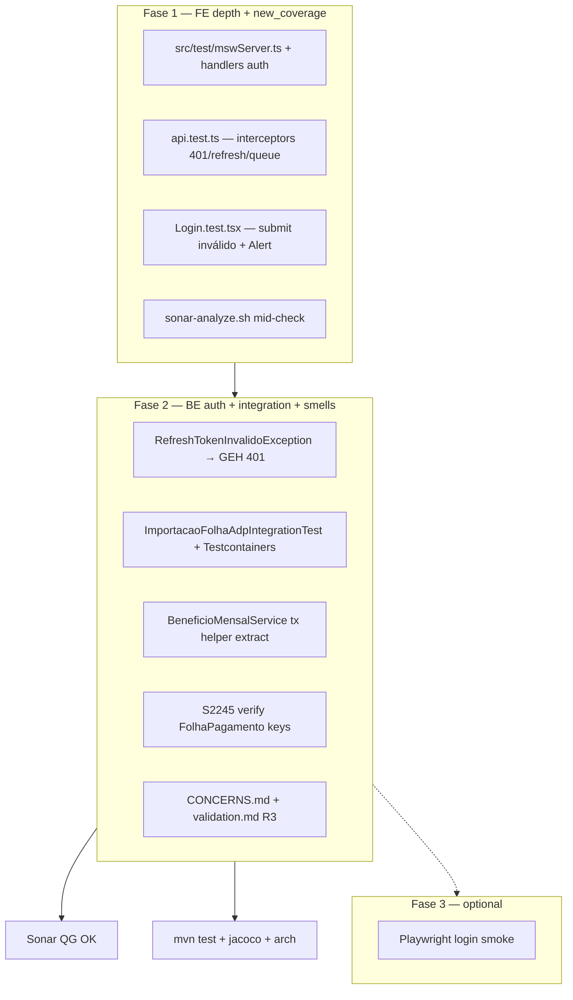

# Adequação da Análise de Projeto — R3 Design

**Spec**: `_docs/specs/features/adequacao-analise-projeto-r3/spec.md`  
**Status**: Draft — Design 2026-07-29  
**Constraints**: AD-004 (FE skills TARGET — brownfield incremental only), AD-010 (ArchUnit), fix-only sem breaking HTTP/DTO

---

## Architecture Overview

R3 continua o modelo **test-first, gate-second, docs-third** da R1/R2, focando em **profundidade de cobertura incremental** (Sonar `new_coverage` ≥ 80%) e **primeiro passo AD-004** (MSW no auth client), sem migrar estrutura de pastas FE.

Três fases sequenciais:

- **Fase 1 (P1):** MSW isolado + testes behavior `api.ts` + Login erro + checkpoint Sonar FE.
- **Fase 2 (P2):** refresh → 401 no backend, integração ADP (carryover T20), follow-ups Sonar/CONCERNS (BeneficioMensal tx, S2245 verify), gates + sync docs.
- **Fase 3 (P3 opcional):** Playwright smoke login.

Não introduz domínios, ports ou contratos HTTP novos além do mapeamento 401 em refresh inválido (correção de status, mesma mensagem genérica já exposta).



### Approach exploration

#### A — Elevar `new_coverage` (P1 bloqueante)

| Approach | Summary | Pros | Cons |
| -------- | ------- | ---- | ---- |
| **A1 — FE depth (MSW + api.ts)** ⭐ | Cobrir linhas novas/leak-period em `api.ts`, Login behavior, manter smokes | Alinha B3/B4; testes discriminatórios; sustentável pós-merge | Pode precisar iterar handlers até ≥80% |
| A2 — BE unit burst only | Mais testes Mockito em services já cobertos | Rápido para JaCoCo | **Não** move `new_coverage` Sonar (gargalo FE/leak-period) |
| A3 — Ops baseline reset only | Re-scan `main` @ `cb6e04a` sem código | QG pode virar OK temporariamente | Fora de escopo R3 (spec); não reduz dívida real |

**Recommendation: A1** — com checkpoint Sonar após Fase 1; se &lt;80%, adicionar 2–3 testes behavior em páginas de maior churn (ex.: `tokenService` paths restantes) antes de escalar escopo.

#### B — Mapear refresh inválido → 401

| Approach | Summary | Pros | Cons |
| -------- | ------- | ---- | ---- |
| **B1 — Domain exception** ⭐ | `RefreshTokenInvalidoException` + handler GEH → 401 | Consistente com exceções existentes; testável; não acopla a `IllegalStateException` genérico | +2 arquivos pequenos |
| B2 — Handler por mensagem | `@ExceptionHandler` filtra `IllegalStateException` por texto | Zero domain class | Frágil; acopla mensagem |
| B3 — Controller try/catch | Lógica no `AuthController` | Localizado | Viola padrão thin controller |

**Recommendation: B1** — `AuthenticationService.refreshToken` lança `RefreshTokenInvalidoException(MENSAGEM_REFRESH_INVALIDO)`; GEH retorna `401` + `ErrorResponse`.

#### C — MSW vs vi.mock para auth client

| Approach | Summary | Pros | Cons |
| -------- | ------- | ---- | ---- |
| **C1 — MSW isolado em `api.test.ts`** ⭐ | `setupServer` local ao arquivo de teste; page tests mantêm `vi.mock` | Spec edge case; zero conflito com 14 page tests R2 | Dois estilos de mock coexistem (brownfield OK) |
| C2 — MSW global em `setup.ts` | Todos os testes via MSW | Unificado | Quebra page tests que mockam services |
| C3 — axios-mock-adapter | Mock transport layer | Simples | Não cumpre AAP3-05 (MSW explícito) |

**Recommendation: C1** — export opcional `src/test/mswServer.ts` reutilizável; **não** alterar `setup.ts` global além de polyfills se necessário.

---

## Code Reuse Analysis

### Existing Components to Leverage

| Component | Location | How to Use |
| --------- | -------- | ---------- |
| R2 design + validation | `adequacao-analise-projeto-r2/` | Padrões tx C1/C2, gate scripts, validation append-only |
| `api.ts` interceptors | `frontend/src/services/api.ts` | Alvo principal AAP3-06; **não refatorar** salvo reset testável |
| `tokenService.test.ts` | `frontend/src/services/` | Estender `isRefreshTokenExpired` / `hasValidTokens` se gap Vitest ≥50 |
| `renderWithProviders.tsx` | `frontend/src/test/` | Login behavior test (AAP3-07) |
| `Login.test.tsx` | `frontend/src/pages/Login/` | Adicionar caso rejeição `mockLogin` |
| `AuthenticationServiceTest` | `auth/application/` | Estender refresh inválido → exceção de domínio |
| `ImportacaoFolhaAdpServiceTest` | `importacao/application/` | Fixtures + mocks reutilizados na integração (asserts de persistência) |
| `folha-adp-minimal.txt` | `backend/src/test/resources/importacao/` | Fixture integração AAP3-11 |
| `FolhaTotalizacaoService` / `OrganogramaAcessoService` | padrão R2 T12/T13 | Template para BeneficioMensal C9 |
| `sonar-analyze.sh` | `diversos/scripts/` | Gate AAP3-01…04, 15, 18 |
| `check-jacoco-thresholds.sh` | `diversos/scripts/` | Gate AAP3-17 (thresholds inalterados vs R2) |
| `ModularArchitectureTest` | `arch/` | Gate AAP3-20 |

### Integration Points

| System | Integration Method |
| ------ | ------------------ |
| SonarQube local | `./diversos/scripts/sonar-analyze.sh` → `new_coverage`, `new_violations`, QG |
| Vitest + lcov | `npm run test:coverage` → `frontend/coverage/lcov.info` |
| MSW 2.x | `msw` + `http`/`HttpResponse`; `setupServer` lifecycle `beforeAll`/`afterEach`/`afterAll` |
| Testcontainers | `org.testcontainers:postgresql` + `@SpringBootTest` (novo no `pom.xml`) |
| Spring Security / JWT | Refresh flow inalterado exceto status code 401 |

---

## Sonar / Coverage Strategy (AAP3-01…04)

**Baseline R3:** `main` @ `cb6e04a` — `new_coverage` **62.2%**, agregado **48.0%**, `new_violations` **0**.

**Hipótese de lift (Fase 1):** `api.ts` (~185 LOC) hoje com cobertura baixa no lcov; 4+ test cases MSW cobrindo interceptors request/response + `refreshAccessToken` path elevam linhas executadas no leak period. Login Alert test (+1 case) e extensões `tokenService` fecham gap Vitest ≥50.

**Checkpoint obrigatório:** após T-F1 (MSW + api tests), rodar `./diversos/scripts/sonar-analyze.sh` e registrar `new_coverage` em notas de task — se &lt;75%, adicionar testes antes de Fase 2; se &lt;80% pós-Fase 1 completa, expandir FE behavior (não BE-only).

**Regressão:** AAP3-03 e AAP3-04 verificados no gate final; qualquer `new_violations` &gt; 0 bloqueia PASS.

---

## Components

### C1 — MSW test harness (AAP3-05)

- **Purpose**: Infraestrutura MSW reutilizável para testes HTTP isolados.
- **Location**:
  - `frontend/src/test/mswServer.ts` — factory `createAuthMswServer()`
  - `frontend/src/test/handlers/authHandlers.ts` — rotas `/auth/refresh`, resource protegido
- **Interfaces**:
  - `createAuthMswServer(): SetupServer` — registra handlers default + override por teste
  - Handlers retornam shapes compatíveis com `LoginResponse` (`types.ts`)
- **Dependencies**: `msw` devDependency (pin compatível Vitest 4 / Node 24)
- **Reuses**: Padrão TARGET em `.agents/skills/testing-a11y/references/msw-handlers.md` (adaptado brownfield paths)

**Lifecycle (por arquivo de teste):**

```typescript
const server = createAuthMswServer();
beforeAll(() => server.listen({ onUnhandledRequest: 'error' }));
afterEach(() => { server.resetHandlers(); TokenService.clearTokens(); /* reset module state */ });
afterAll(() => server.close());
```

### C2 — `api.ts` interceptor tests (AAP3-06)

- **Purpose**: Provar refresh automático, fila concorrente e logout em falha.
- **Location**: `frontend/src/services/api.test.ts`
- **Test matrix (mínimo 4 cases):**

| # | Cenário | MSW setup | Assert spec outcome |
| - | ------- | --------- | ------------------- |
| 1 | 401 → refresh OK → retry | 1ª call 401, refresh 200, 2ª call 200 | Request original reexecutada com `Authorization: Bearer <new>` |
| 2 | Refresh falha | refresh 401/500 | `TokenService` vazio; `auth:logout` event dispatched |
| 3 | Fila durante refresh | 2 requests 401 paralelos; refresh único | Ambos completam após refresh (2 retries) |
| 4 | Refresh endpoint 401 | POST `/auth/refresh` 401 | Logout; tokens cleared |

- **Dependencies**: C1, `TokenService`, jsdom `window.addEventListener`
- **Reuses**: Instância axios default export de `api.ts`

**Module state mitigation:** `api.ts` mantém `isRefreshing` / `failedQueue` em closure de módulo. Testes MUST resetar entre cases via:
- `afterEach` que aguarda `isRefreshing === false` + fila vazia, **ou**
- helper test-only `resetApiAuthState()` exportado com prefixo claro (`/* test-only */`) — preferir helper explícito se race flakes.

### C3 — Login behavior — credenciais inválidas (AAP3-07)

- **Purpose**: Assert erro visível ao usuário; sem navegação pós-falha.
- **Location**: `frontend/src/pages/Login/Login.test.tsx`
- **Changes**: Novo `it` — `mockLogin.mockRejectedValue(...)`, submit form, assert:
  - `screen.getByRole('alert')` com text **"Usuário ou senha inválidos"** (spec outcome exato em `Login/index.tsx:38`)
  - `mockNavigate` **not** called
- **Dependencies**: `renderWithProviders`, mocks existentes
- **Reuses**: Padrão submit happy-path já presente (linhas 38–51)

### C4 — Vitest count floor (AAP3-08)

- **Purpose**: ≥50 test cases passando (baseline 39).
- **Location**: Incremento distribuído — prioridade:
  1. `api.test.ts` (+4 mínimo)
  2. `tokenService.test.ts` — `isRefreshTokenExpired`, `hasValidTokens` (+3–4)
  3. Opcional: 1 case em página existente se contagem &lt;50 após C2/C3
- **Gate**: `cd frontend && npm run test:coverage` — contagem total ≥50

### C5 — RefreshTokenInvalidoException + GEH 401 (AAP3-09, AAP3-10)

- **Purpose**: Refresh inválido/expirado/revogado → HTTP 401, não 500.
- **Location**:
  - `backend/.../auth/domain/RefreshTokenInvalidoException.java` (novo, extends `RuntimeException`)
  - `backend/.../auth/application/AuthenticationService.java` — substituir `IllegalStateException` em `refreshToken`
  - `backend/.../exception/GlobalExceptionHandler.java` — `@ExceptionHandler` → `401` + `ex.getMessage()`
- **Message**: `MENSAGEM_REFRESH_INVALIDO` = **"Refresh token inválido ou expirado"** (já genérica/non-enumerating; distinta de login por design — não revela qual sub-caso)
- **Tests**:
  - `AuthenticationServiceTest` — token ausente/revogado → `RefreshTokenInvalidoException`
  - `AuthControllerWebMvcTest` ou estender teste existente — `POST /auth/refresh` → `401` + body message
- **Reuses**: Padrão `ErrorResponse`; `GlobalExceptionHandlerTest` style

### C6 — ImportacaoFolhaAdp integration (AAP3-11, AAP3-12)

- **Purpose**: Uma linha persistida com DB real; rollback; carryover AAP2-22.
- **Location**:
  - `backend/pom.xml` — Testcontainers BOM + `postgresql` module + `junit-jupiter` integration
  - `backend/src/test/java/.../importacao/application/ImportacaoFolhaAdpIntegrationTest.java`
- **Stack**:

```text
@SpringBootTest(webEnvironment = NONE)
@Testcontainers
@Transactional  // rollback após teste
@EnabledIf("isDockerAvailable")  // custom condition ou testcontainers built-in
class ImportacaoFolhaAdpIntegrationTest
```

- **Flow**: Carregar `folha-adp-minimal.txt` → `ImportacaoFolhaAdpService.importar(...)` → assert ≥1 registro em repositório folha → rollback automático
- **N/A path**: Se Docker indisponível, teste skipped; `validation.md` documenta N/A; `mvn test` full suite verde
- **Reuses**: `ImportacaoFolhaAdpServiceTest` mocks de ports substituídos por contexto real parcial ou service integration com repos reais

**Nota:** Preferir `@DataJpaTest` + Testcontainers **somente** se `@SpringBootTest` for pesado demais (&gt;30s); default `@SpringBootTest` para reutilizar wiring existente (menos decisões).

### C7 — S2245 FolhaPagamento keys (AAP3-13)

- **Purpose**: Confirmar ausência de `Math.random()` em keys React.
- **Location**: `frontend/src/pages/FolhaPagamento/index.tsx`
- **Observação codebase:** R2 cycle-1 já substituiu keys instáveis (`resumo.id`, composite keys). CONCERNS Sonar table pode estar stale.
- **Action**: Grep + Sonar export; se já conforme → teste regressão grep ou comentário de evidência; se encontrado → fix touch-only (≤1 LOC)
- **Reuses**: Padrão keys em `739:739:frontend/src/pages/FolhaPagamento/index.tsx` (`key={resumo.id}`)

### C8 — BeneficioMensalService tx hygiene (AAP3-14)

- **Purpose**: Remover `@SuppressWarnings("java:S6809")`; eliminar self-invocation transacional.
- **Location**: `backend/.../beneficios/application/BeneficioMensalService.java`
- **Pattern (R2 C1/C2):** Auditar métodos `@Transactional` públicos que delegam a outros métodos `@Transactional` via `this`. Extrair helpers **private sem `@Transactional`**:
  - Candidatos: fluxos `*ParaUsuario` → delegação interna; `criar`/`remover` vs helpers
  - `obterContextoAcesso` já é private non-tx — manter
- **Tests**: `BeneficioMensalServiceTest` verde; sem deleção
- **Reuses**: `FolhaTotalizacaoService.calcularTotaisPorFuncionarioInterno` como template

### C9 — Gates + CONCERNS sync (AAP3-15…20, AAP3-19)

- **Purpose**: Regressão zero; documentação alinhada.
- **Location**: `_docs/specs/CONCERNS.md`, `_docs/specs/features/adequacao-analise-projeto-r3/validation.md`
- **CONCERNS updates**:
  - S2245 → Resolved (se C7 confirmado)
  - BeneficioMensal tx → Resolved
  - Test Coverage FE → MSW + api.ts + Vitest ≥50
  - Importação ADP → Mitigated/Resolved se integração entregue
- **Reuses**: Template sync R2 T18

### C10 — Playwright smoke (AAP3-21, P3 optional)

- **Purpose**: 1 spec login E2E ponte futura.
- **Location**:
  - `frontend/package.json` — `@playwright/test` devDep + script `test:e2e`
  - `frontend/playwright.config.ts` (mínimo)
  - `frontend/e2e/login.spec.ts`
- **Scope**: Navegar `/login`, assert heading, fill fields, submit (mock API via route ou ambiente test)
- **Skip**: Se setup &gt; ~2h ou flake, documentar N/A em validation — não bloqueia R3

---

## Data Models (test fixtures)

### MSW — LoginResponse shape

```typescript
// Alinhado a frontend/src/types LoginResponse
interface LoginResponse {
  token: string;
  refreshToken: string;
  tokenExpiration: string;
  refreshExpiration: string;
  login?: string;
}
```

### Backend — ErrorResponse (refresh 401)

```java
// Existente — GlobalExceptionHandler
new ErrorResponse(401, "Refresh token inválido ou expirado")
```

**Relationships**: FE MSW refresh handler retorna mesmo shape que `AuthController` produz hoje via `TokenDTO`.

---

## Error Handling Strategy

| Error Scenario | Handling | User / Client Impact |
| -------------- | -------- | -------------------- |
| Access token expired (401) | Interceptor → refresh → retry | Transparente se refresh válido |
| Refresh token inválido (BE) | `RefreshTokenInvalidoException` → 401 | FE logout + redirect login |
| Refresh HTTP fail (network) | `logoutOnAuthFailure()` | Tokens cleared; `auth:logout` event |
| Login submit inválido | `Login` catch → Alert | Mensagem **"Usuário ou senha inválidos"** |
| Docker indisponível (integração) | `@EnabledIf` skip | Suite verde; validation N/A |
| Sonar `new_coverage` &lt; 80% pós-Fase 1 | Iterar FE tests | Bloqueia fechamento AAP3-02 |

---

## Risks & Concerns

| Concern | Location | Impact | Mitigation |
| ------- | -------- | ------ | ---------- |
| Module-level mutable state in `api.ts` | `frontend/src/services/api.ts:23-27` | Flaky parallel tests; false passes | C2 reset helper + sequential queue tests; `onUnhandledRequest: 'error'` |
| MSW não instalado | `frontend/package.json` | AAP3-05 blocked | Add `msw@^2` devDep; lockfile update in dedicated task |
| Testcontainers nunca usado | `backend/pom.xml` | CI/local Docker variance | `@EnabledIf`; N/A path AAP3-12; document in validation |
| `IllegalStateException` → 500 today | `AuthenticationService.java:93-96` | AAP3-09 fail | C5 domain exception (B1) |
| S2245 possibly already fixed | `FolhaPagamento/index.tsx` | Wasted task | C7 verify-first; grep gate |
| BeneficioMensal suppress masks real tx issue | `BeneficioMensalService.java:48,102` | Data integrity | C8 audit + extract helpers; regression test |
| AD-004 partial vs AGENTS.md TARGET | `frontend/AGENTS.md` | Agent confusion | Design documents brownfield; page tests keep `vi.mock` |
| `new_coverage` 62→80 is steep | Sonar leak period | QG still ERROR mid-R3 | Checkpoint Sonar Fase 1; expand tokenService/page behavior before BE-only |
| Lessons L-009/L-010 (candidates) | Sonar metrics | False PASS | Verifier must check aggregate **and** `new_violations`; gate documents both |

---

## Tech Decisions

| Decision | Choice | Rationale |
| -------- | ------ | --------- |
| MSW scope | Isolated to `api.test.ts` (+ shared `src/test/` helpers) | Spec edge case; avoids breaking 14 page smoke tests |
| MSW version | MSW 2.x (`http`, `HttpResponse`) | Alinhado skill TARGET + docs atuais MSW |
| Refresh error mapping | New `RefreshTokenInvalidoException` → 401 | B1; consistent with domain exceptions |
| Integration test scope | Single ADP import test | AAP3-11; reuse fixture; no test suite explosion |
| Playwright | P3 optional, minimal config | B10; not blocking |
| FE folder structure | Keep `src/pages/`, `src/services/` | AD-004 full deferred; R3 incremental |
| S2245 | Verify-first | Codebase may already comply post-R2 |
| JaCoCo thresholds | Unchanged vs R2 | AAP3-17 maintenance only |

> **Project-level:** Nenhuma decisão R3 exige novo AD em `STATE.md` — conforma AD-004 (incremental brownfield) e AD-010.

---

## Component → Requirement Map

| Component | Requirements |
| --------- | ------------ |
| C1 MSW harness | AAP3-05 |
| C2 api.test.ts | AAP3-06, AAP3-08 (partial) |
| C3 Login behavior | AAP3-07, AAP3-08 (partial) |
| C4 Vitest floor | AAP3-08 |
| Sonar checkpoint | AAP3-01…04, AAP3-15 |
| C5 Refresh 401 | AAP3-09, AAP3-10 |
| C6 ADP integration | AAP3-11, AAP3-12 |
| C7 S2245 | AAP3-13 |
| C8 BeneficioMensal tx | AAP3-14 |
| C9 Gates/docs | AAP3-16…20, AAP3-19 |
| C10 Playwright | AAP3-21 |

---

## Gate Commands (preview for Tasks)

| Gate | Command |
| ---- | ------- |
| Quick FE | `cd frontend && npm test` |
| FE Coverage | `cd frontend && npm run test:coverage` |
| Quick BE | `cd backend && mvn test -Dtest=<Class>` |
| Full BE | `cd backend && mvn test` |
| JaCoCo | `bash diversos/scripts/check-jacoco-thresholds.sh` |
| Sonar | `./diversos/scripts/sonar-analyze.sh` |
| Arch | `cd backend && mvn test -Dtest=ModularArchitectureTest` |
| E2E (P3) | `cd frontend && npm run test:e2e` |

---

## Próximos passos (TLC)

1. ~~**Specify**~~ — `spec.md`
2. ~~**Design**~~ — este documento
3. ~~**Tasks**~~ — `tasks.md` (15 tasks: Fase 1 ×6, Fase 2 ×8, Fase 3 optional ×1)
4. **Execute** — branch `feat/adequacao-analise-projeto` @ `cb6e04a`
