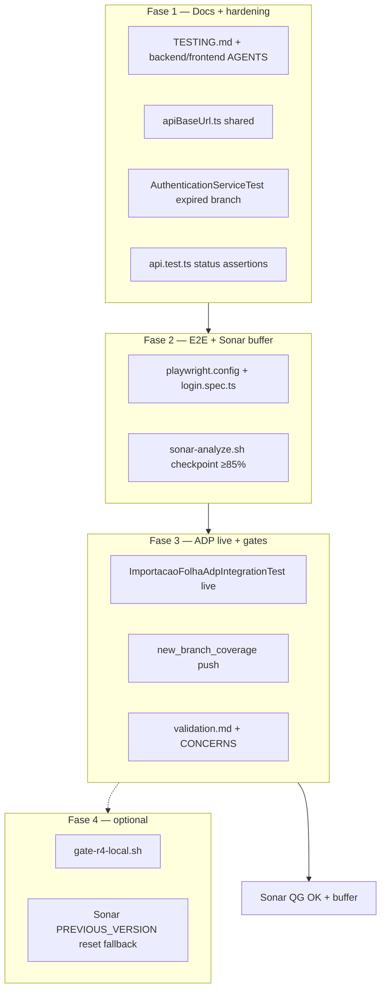

# Adequação da Análise de Projeto — R4 Design

**Spec**: `_docs/specs/features/adequacao-analise-projeto-r4/spec.md`  
**Status**: Draft — Design 2026-07-29  
**Constraints**: AD-004 (FE brownfield), AD-010 (ArchUnit), AD-003 (harness versionado), fix-only sem breaking HTTP/DTO

---

## Architecture Overview

R4 inverte a curva de custo da R3: em vez de **volume** de testes para Sonar, aplica **docs-first + hardening cirúrgico + E2E mínimo + evidência ADP**. O modelo permanece **test/gate/docs**, com meta interna **`new_coverage` ≥ 85%** (QG Sonar continua ≥ 80%).

Quatro fases sequenciais:

- **Fase 1 (P1):** Docs canônicos (`TESTING.md`, `AGENTS`) + `API_BASE_URL` unificado + hardening auth/MSW (≤10 testes novos).
- **Fase 2 (P1):** Playwright login smoke (`page.route` mock) + checkpoint Sonar (meta 85%).
- **Fase 3 (P2):** ADP live (Docker) + branch coverage targeted + gates finais + CONCERNS/validation.
- **Fase 4 (P3 opcional):** `gate-r4-local.sh`; reset Sonar baseline **somente** se 85% inatingível após F1–F3.



---

## Approach Exploration

### A — Elevar `new_coverage` 80% → 85%

| Approach | Summary | Pros | Cons |
| -------- | ------- | ---- | ---- |
| **A1 — Hardening existente** ⭐ | +≤10 testes em auth/api/1 page; assertions mais fortes | Baixo custo; melhora discriminação; cobre branches | Pode não chegar a 85% sozinho |
| A2 — Nova leva page tests (estilo R3 fix-cycle) | +20–40 smokes FE | Sobe métrica rápido | Alto custo; testes rasos; drift brownfield |
| A3 — Sonar baseline reset only | Ops `PREVIOUS_VERSION` | QG alivia instantaneamente | Esconde dívida; fora do espírito R4 |

**Recommendation: A1** com checkpoint Sonar após Fase 2; se &lt;85%, **1–2** branch tests adicionais em `api.test.ts` / `Login.test.tsx` (AAP4-19) antes de considerar Fase 4 reset.

### B — Playwright E2E smoke

| Approach | Summary | Pros | Cons |
| -------- | ------- | ---- | ---- |
| **B1 — Playwright + `page.route()`** ⭐ | Mock `POST */auth/login` no browser; Vite dev/preview | Sem BE/DB; reusa `sampleLoginResponse`; CI-ready | Não exercita stack HTTP real |
| B2 — `webServer` + backend + Postgres | E2E integrado | Máxima fidelidade | Custo alto; flaky; fora budget R4 |
| B3 — `@mswjs/playwright` worker | MSW no browser | Reuso handlers MSW | Setup extra; curva de aprendizado |

**Recommendation: B1** — decisão B3 spec; alinha custo-benefício e reutiliza fixture R3.

### C — Sonar baseline pós-merge R3

| Approach | Summary | Pros | Cons |
| -------- | ------- | ---- | ---- |
| **C1 — Document-first** ⭐ | Scan + baseline block em `validation.md` | Rastreável; zero risco ops | Não move métrica sozinho |
| C2 — Reset imediato pós-merge | Sonar `PREVIOUS_VERSION` @ R3 merge | Leak period limpo | Mascara gaps; sem hardening |
| **C3 — C1 + reset fallback P3** ⭐ | Reset só se A1 esgotado e &lt;85% | Pragmático | Requer critério claro em validation |

**Recommendation: C1 default, C3 fallback** — decisão B9 spec.

### D — `API_BASE_URL` unificado

| Approach | Summary | Pros | Cons |
| -------- | ------- | ---- | ---- |
| **D1 — `src/test/apiBaseUrl.ts`** ⭐ | Export `getApiBaseUrl()` lendo `import.meta.env.VITE_API_URL \|\| default`; `api.ts` e handlers importam | Fonte única; testável | Touch mínimo em `api.ts` |
| D2 — Duplicar env only in handlers | Só handlers leem env | Menor diff | `api.ts` e handlers ainda divergem se env unset |

**Recommendation: D1** — AAP4-16.

---

## Code Reuse Analysis

### Existing Components to Leverage

| Component | Location | How to Use |
| --------- | -------- | ---------- |
| MSW harness R3 | `frontend/src/test/mswServer.ts`, `handlers/authHandlers.ts` | Reuse `sampleLoginResponse`, `API_BASE_URL` → migrar para `apiBaseUrl.ts` |
| api.test.ts R3 | `frontend/src/services/api.test.ts` | Strengthen assertions (AAP4-15); branch coverage |
| Login.test.tsx R3 | `frontend/src/pages/Login/Login.test.tsx` | Optional +1 branch case (invalid + network) |
| AuthenticationServiceTest R3 | `backend/.../AuthenticationServiceTest.java` | Add expired/revoked branch |
| ImportacaoFolhaAdpIntegrationTest | `backend/.../ImportacaoFolhaAdpIntegrationTest.java` | Live gate when Docker UP |
| Gate scripts | `diversos/scripts/sonar-analyze.sh`, `check-jacoco-thresholds.sh` | Extend or wrap in `gate-r4-local.sh` |
| R3 validation template | `adequacao-analise-projeto-r3/validation.md` | Append-only pattern for R4 |

### Integration Points

| System | Integration Method |
| ------ | ------------------ |
| SonarQube local | `./diversos/scripts/sonar-analyze.sh` → API `new_coverage`, `new_branch_coverage`, QG |
| Vitest + lcov | `npm run test:coverage` → `frontend/coverage/lcov.info` |
| Playwright | `@playwright/test` + `playwright.config.ts`; `webServer` → `npm run preview` (build estático, leve) |
| Docker / Testcontainers | `docker info` pre-check; `mvn test -Dtest=ImportacaoFolhaAdpIntegrationTest` |
| Vite env | `VITE_API_URL` default `http://localhost:8083/api` |

---

## Components

### C1 — `apiBaseUrl.ts` (shared URL)

- **Purpose**: Fonte única de base URL para axios client e test handlers.
- **Location**: `frontend/src/test/apiBaseUrl.ts` (ou `frontend/src/lib/apiBaseUrl.ts` se `api.ts` preferir não importar de `test/`)
- **Interfaces**: `export function getApiBaseUrl(): string`
- **Dependencies**: `import.meta.env.VITE_API_URL`
- **Reuses**: Valor default atual `http://localhost:8083/api`
- **Touch**: `api.ts`, `authHandlers.ts` (import shared)

### C2 — Playwright harness

- **Purpose**: E2E smoke login sem backend.
- **Location**: `frontend/playwright.config.ts`, `frontend/e2e/login.spec.ts`
- **Interfaces**:
  - Config: `baseURL` → preview URL; `webServer: { command: 'npm run build && npm run preview', port }`
  - Spec: `test('login page shows heading and submits', ...)`
- **Mock**: `page.route('**/auth/login', route => route.fulfill({ json: sampleLoginResponse() }))`
- **Reuses**: `sampleLoginResponse` from `authHandlers.ts` (import test helper — acceptable for e2e folder)

### C3 — Docs sync

- **Purpose**: Alinhar agent-facing docs ao harness real.
- **Location**: `_docs/specs/TESTING.md`, `backend/AGENTS.md`, nota em `frontend/AGENTS.md`
- **Content highlights**:
  - TESTING: 474 BE / 184 FE, MSW, JaCoCo, Sonar scripts, Testcontainers, Playwright
  - backend AGENTS §4: Testcontainers, `@EnabledIf`, integration test class name
  - frontend AGENTS: brownfield note (MSW isolated; pages use vi.mock)

### C4 — Auth hardening (BE)

- **Purpose**: Cobrir branch `validarRefreshToken == false`.
- **Location**: `AuthenticationServiceTest.java`
- **Pattern**: Mock `refreshTokenService.validarRefreshToken()` → false; assert `RefreshTokenInvalidoException`

### C5 — api.test hardening (FE)

- **Purpose**: Substituir `rejects.toBeDefined()` por status/message assertions em ≥3 casos.
- **Location**: `api.test.ts`
- **Pattern**: `await expect(promise).rejects.toMatchObject({ response: { status: 401 } })` (axios error shape)

### C6 — `gate-r4-local.sh` (P3)

- **Purpose**: Gate reproduzível pré-merge.
- **Location**: `diversos/scripts/gate-r4-local.sh`
- **Behavior**:
  ```bash
  # pseudo
  mvn test && npm test && check-jacoco-thresholds.sh
  optional: --docker → mvn test -Dtest=ImportacaoFolhaAdpIntegrationTest
  optional: --e2e → cd frontend && npm run test:e2e
  optional: --sonar → sonar-analyze.sh
  ```
- **Exit**: 0 only if all invoked steps pass.

---

## Branch Coverage Strategy (AAP4-18/19)

Prioridade (arquivos já no leak-period, **sem** novos page test files):

1. `api.test.ts` — paths 403, refresh expired local, logout edge (branches existentes)
2. `AuthenticationServiceTest` — expired token branch
3. **Opcional 1:** `Login.test.tsx` — 1 caso rede/500 se necessário para +pp

Meta: `new_branch_coverage` **≥ 70%** informacional; não bloqueia PASS se AAP4-01/02 OK.

---

## Sonar / Coverage Strategy (AAP4-01…05)

**Baseline R4 entry:** `main` @ `088a438` — `new_coverage` 80.0%, `new_branch_coverage` 62.5%.

**Hipótese:** Hardening + ≤10 testes novos elevam ~5 pp `new_coverage` via branches em código já no leak-period (auth + api.ts), sem novos arquivos FE grandes.

**Checkpoints:**

1. Após Fase 1 — quick FE/BE tests
2. Após Fase 2 — **`sonar-analyze.sh`**; registrar `new_coverage` / `new_branch_coverage`
3. Fase 3 end — full gates + `validation.md` baseline block

**Fallback (Fase 4):** Se `new_coverage` &lt; 85% após Fase 3 com 0 testes budget restante → documentar gap; **opcional** reset Sonar `PREVIOUS_VERSION` com evidência ops em validation (não automático).

---

## Risks & Concerns

| Risk | Mitigation |
| ---- | ---------- |
| 85% inatingível com ≤10 testes | Checkpoint Fase 2; 1–2 branch tests extras em escopo AAP4-19; fallback B9 documentado |
| Playwright browsers não instalados | `npx playwright install chromium` em TESTING.md; AAP4-08 N/A path |
| Docker ausente no dev | AAP4-13 mantém skip; `--docker` opcional no gate script |
| `api.ts` import from `test/` | Prefer `src/lib/apiBaseUrl.ts` if circular concern; design allows either |
| Playwright flake on preview | Single spec; mock route; timeout generoso (30s) |
| AD-004 TARGET vs brownfield | AAP4-11 explicit note; no structural migration |

---

## Phase → Requirement Mapping

| Phase | Requirements |
| ----- | ------------ |
| F1 | AAP4-09…11, AAP4-14…17, AAP4-16 |
| F2 | AAP4-06…08, AAP4-01…05 (partial checkpoint) |
| F3 | AAP4-12…13, AAP4-18…19, AAP4-20…24, AAP4-01…05 (final) |
| F4 | AAP4-25…26, B9 fallback |

---

## Próximos passos (TLC)

1. ~~**Specify**~~ — confirmado
2. ~~**Design**~~ — este documento
3. ~~**Tasks**~~ — `tasks.md` (T1–T15; aguardando aprovação)
4. **Execute** — `feat/adequacao-analise-projeto` @ `main` `088a438`
