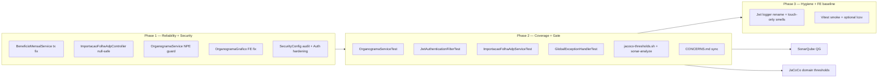

# Adequação da Análise de Projeto Design

**Spec**: `_docs/specs/features/adequacao-analise-projeto/spec.md`  
**Status**: Draft — Design 2026-07-29  
**Constraints**: AD-004 (FE skills TARGET), AD-007/011 (ACL inalterada), AD-010 (ArchUnit), fix-only sem breaking HTTP

---

## Architecture Overview

Feature **fix-first, test-second, gate-third**: três ondas sequenciais que fecham gaps Sonar/JaCoCo/CONCERNS sem refactor estrutural. Não introduz novos domínios nem ports — corrige defects conhecidos, adiciona testes onde a análise apontou fragilidade, e fecha com gate local reproduzível.



### Approach exploration (Large — recommendation locked)

| Approach | Summary | Pros | Cons |
| -------- | ------- | ---- | ---- |
| **A — Surgical fix + targeted tests** ⭐ | Corrigir só issues Sonar + testes nos domínios abaixo do limiar | Baixo blast radius; alinha spec; build verde incremental | QG pode ainda falhar em `new_violations` legadas |
| B — Big-bang quality sprint | Zerar smells + Testcontainers + Vitest amplo | QG verde rápido | Viola out-of-scope; semanas de churn |
| C — Quality gate only | Ajustar Sonar QG thresholds no servidor | QG OK imediato | Não corrige bugs reais; mascara dívida |

**Recommendation: A** — entrega valor da análise sem expandir escopo. AAP-18 permite exceções documentadas (≤3) se QG falhar só em métricas históricas.

---

## Code Reuse Analysis

### Existing Components to Leverage

| Component | Location | How to Use |
| --------- | -------- | ---------- |
| `ImportacaoBeneficioMensalServiceTest` | `beneficios/application/` | Padrão fixture multipart + Mockito para ADP folha |
| `ImportacaoFolhaAdpControllerWebMvcTest` | `importacao/api/` | Estender com caso filename null → 400 |
| `OrganogramaAcessoServiceTest` | `organograma/acesso/application/` | Base ACL; expandir cenários scoped |
| `SecurityConfig*Test` (6 classes) | `config/` | Regressão matchers após audit |
| `ModularArchitectureTest` | `arch/` | Gate obrigatório pós cada task backend |
| `check-modular-compliance.sh` | `diversos/scripts/` | Referência audit SecurityConfig (`/api/beneficios` absent) |
| `sonar-analyze.sh` | `diversos/scripts/` | Gate final AAP-17 |
| `BeneficioMensalServiceTest` | `beneficios/application/` | Assert tx após fix AAP-01 |

### Integration Points

| System | Integration Method |
| ------ | ------------------ |
| SonarQube local | `./diversos/scripts/sonar-analyze.sh` + API `bugs`/`vulnerabilities` |
| JaCoCo | `mvn test` → `backend/target/site/jacoco/jacoco.xml` |
| Spring Security | `SecurityConfig` matchers relativos ao context-path (sem `/api` duplicado) |
| Flyway | Sem migrations nesta feature |
| Frontend | Vitest via Vite plugin (P3); Sonar lcov path opcional |

---

## Components

### C1 — BeneficioMensalService transactional fix (AAP-01)

- **Purpose**: Garantir transação em `criarParaUsuario` / `removerSeAutorizado` sem proxy quebrado (`java:S2229`).
- **Location**: `backend/.../beneficios/application/BeneficioMensalService.java`
- **Changes**:
  - Adicionar `@Transactional` em `criarParaUsuario` e `removerSeAutorizado` (read-write).
  - Manter `@Transactional` em `criar` / `remover` para callers diretos (controller).
  - Alternativa **rejeitada**: self-injection `@Lazy` — zero precedente no repo; complexidade desnecessária.
- **Tests**: `BeneficioMensalServiceTest` — verify `save`/`softDelete` em fluxo autorizado; opcional assert que mock repository rollback em exceção.
- **Reuses**: Padrão existente `@Transactional` em writes no mesmo service.

### C2 — ImportacaoFolhaAdpController null-safe upload (AAP-02)

- **Purpose**: Evitar NPE quando `MultipartFile.getOriginalFilename()` retorna null.
- **Location**: `backend/.../importacao/api/ImportacaoFolhaAdpController.java`
- **Changes**:
  - Extrair `String nomeArquivo = arquivo.getOriginalFilename()`; se null/blank → 400 antes de `.toLowerCase()`.
  - Helper privado `nomeArquivoSeguro(MultipartFile)` retorna `Optional<String>` ou default `"arquivo"`.
- **Tests**: Estender `ImportacaoFolhaAdpControllerWebMvcTest` — multipart sem filename → `status().isBadRequest()`.
- **Reuses**: `ImportacaoFolhaAdpResponseDTO.error` para corpo consistente.

### C3 — OrganogramaService construirArvore guard (AAP-03)

- **Purpose**: Sonar `java:S2259` em `construirArvore` — `toDTOCompleto` pode retornar null; `dto.id()` NPE.
- **Location**: `backend/.../organograma/application/OrganogramaService.java:414-422`
- **Changes**:
  ```java
  NoOrganogramaDTO dto = toDTOCompleto(no);
  if (dto == null || dto.id() == null) continue;
  noMap.put(dto.id(), dto);
  ```
- **Tests**: Novo `OrganogramaServiceTest` — mock repo retorna lista com entity válida; spy/null path se testável via package-private ou indirect via `listarTodos` em árvore.
- **Reuses**: Guard pattern já em `toDTO` (`if (entity == null) return null`).

### C4 — OrganogramaGrafico conditional fix (AAP-04)

- **Purpose**: `borderColor: isExpanded ? 'primary.main' : 'primary.main'` redundante.
- **Location**: `frontend/src/components/OrganogramaGrafico/index.tsx:95`
- **Changes**: Usar expressão distinta — ex.: `borderColor: isExpanded ? 'primary.dark' : 'primary.main'` ou remover ternário.
- **Tests**: Coberto indiretamente por lint/build; Vitest smoke P3 opcional render.

### C5 — SecurityConfig audit + documentation (AAP-06, AAP-07)

- **Purpose**: Confirmar matchers alinhados; documentar CSRF disabled; fechar CONCERNS stale.
- **Location**: `SecurityConfig.java`, `_docs/specs/INTEGRATIONS.md` (nova seção **Security**)
- **Changes**:
  - Audit manual: controllers `@RequestMapping` vs matchers (grep inventory).
  - `/api/beneficios/**` **já removido** (modular-monolith) — AAP-06 = verificação + teste regressão `check-modular-compliance.sh`.
  - Adicionar em INTEGRATIONS.md:
    - JWT stateless + Bearer header
    - CSRF disabled — safe porque sem cookie session; reavaliar se auth cookie
    - Matchers relativos ao context-path
- **Tests**: Nenhum matcher novo; regressão via `SecurityConfigTipoBeneficioTest` etc.
- **Reuses**: `diversos/scripts/check-modular-compliance.sh` pass line SecurityConfig.

### C6 — AuthenticationService anti-enumeration (AAP-08)

- **Purpose**: Mitigar Sonar S5804 — mensagens distintas "Usuário não encontrado" vs "Senha incorreta" nos logs/throws internos.
- **Location**: `backend/.../auth/application/AuthenticationService.java:45-56`
- **Changes**:
  - Unificar throws para mensagem genérica **antes** do catch externo: `"Usuário ou senha inválidos"`.
  - Logs internos: manter `debug` sem distinguir motivo em `error` público; ou log genérico only.
  - Catch final (L80-82) já unifica — alinhar paths internos.
- **Tests**: `AuthenticationServiceTest` (novo) — mock repo + encoder; login inexistente e senha errada → mesma exceção/mensagem.

### C7 — JwtSecretStartupValidator (AAP-09)

- **Purpose**: Fail-fast se `JWT_SECRET` = default em ambiente não-dev.
- **Location**: `backend/.../config/JwtSecretStartupValidator.java` (novo)
- **Changes**:
  - `@Component` `@Order(Ordered.HIGHEST_PRECEDENCE)` lê `jwt.secret` via `@Value`.
  - Compara com default literal do YAML; se igual **e** profile active contém `prod` (ou `!dev`) → `IllegalStateException` no `@PostConstruct`.
  - Dev local (`default` profile) — permitir default com WARN once.
- **Tests**: Unit test com `ReflectionTestUtils` ou `@SpringBootTest` profile prod mock.
- **Reuses**: Padrão startup validation Spring Boot.

### C8 — OrganogramaController debug removal (AAP-10 partial — S4507)

- **Purpose**: Remover `System.out/err` e `printStackTrace` de produção.
- **Location**: `organograma/api/OrganogramaController.java:49-59`
- **Changes**: Substituir por `Logger` debug/warn; remover stack trace ao cliente.
- **Tests**: Compilação; Sonar re-scan.

### C9 — Test suite expansion — organograma (AAP-11)

- **Purpose**: Elevar JaCoCo organograma 22,5% → ≥50%.
- **Location**: `backend/src/test/java/.../organograma/application/OrganogramaServiceTest.java` (novo)
- **Scope mínimo** (prioridade cobertura/linha):
  - `construirArvore` — árvore 2 níveis
  - `cadastrar` — com/sem parent
  - `validarCicloHierarquico` — rejeita ciclo
  - `obterOrganogramaAtivo` — empty vs presente
  - Expandir `OrganogramaAcessoServiceTest` — scoped CC parcial, `usuarioPodeAcessarCentroCusto`
- **Pattern**: `@ExtendWith(MockitoExtension.class)` — sem DB.
- **Reuses**: `OrganogramaAcessoServiceTest` fixtures.

### C10 — Test suite expansion — security (AAP-12)

- **Purpose**: JaCoCo security 12% → ≥40%.
- **Location**:
  - `security/JwtAuthenticationFilterTest.java` (novo)
  - `security/JwtServiceTest.java` (novo, se JwtService puro o suficiente)
- **Scope**:
  - Filter: sem header → chain continua; header inválido → chain continua; token válido → SecurityContext set
  - JwtService: generate/validate round-trip com secret test
- **Reuses**: `SecurityConfigAuthRefreshTest` patterns para tokens.

### C11 — ImportacaoFolhaAdpServiceTest (AAP-13, AAP-14)

- **Purpose**: importacao 65% → ≥75%; primeiro teste dedicado ADP folha.
- **Location**:
  - `backend/src/test/resources/importacao/folha-adp-minimal.txt` (fixture)
  - `importacao/application/ImportacaoFolhaAdpServiceTest.java` (novo)
- **Scope**:
  - Happy path: parse N linhas, mock repos, assert save count
  - Failure: arquivo vazio / layout inválido → exceção esperada
- **Reuses**: `ImportacaoBeneficioMensalServiceTest` structure; não parsear arquivo real gigante.

### C12 — GlobalExceptionHandlerTest (AAP-15)

- **Purpose**: exception package 2,9% → contribui AAP-16 global ≥65%.
- **Location**: `exception/GlobalExceptionHandlerTest.java` (novo)
- **Scope**: Instanciar handler diretamente (sem MVC):
  - `FuncionarioNotFoundException` → 404 + body
  - `IllegalArgumentException` → 400
  - `BeneficioMensalNotFoundException` → 404
- **Reuses**: Padrão unitário direto em `@RestControllerAdvice`.

### C13 — JaCoCo threshold script (AAP-16, AAP-17)

- **Purpose**: Gate numérico reproduzível pós-`mvn test`.
- **Location**: `diversos/scripts/check-jacoco-thresholds.sh` (novo)
- **Behavior**:
  - Parse `backend/target/site/jacoco/jacoco.xml` (Python inline, mesmo algoritmo da análise)
  - Fail se organograma <50%, security <40%, importacao <75%, global <65%
  - Exit 0/1 para CI local
- **Integration**: Documentar em `tasks.md` gate; opcional chamar ao final de `sonar-analyze.sh` pre-step.

### C14 — Sonar Quality Gate strategy (AAP-18)

- **Purpose**: Definir critério PASS da feature.
- **Primary**: bugs=0, vulns CRITICAL+MAJOR=0 (API Sonar).
- **Secondary QG**: Se Sonar QG ERROR por `new_violations`/`new_coverage` históricos → registrar em `validation.md`:
  1. `new_violations` — dívida pré-2026-07-27
  2. `new_coverage` — frontend 0% até AAP-24
  3. (reserva)
- **Não alterar** Quality Gate do servidor nesta feature (out-of-scope ops).

### C15 — JwtAuthenticationFilter logger rename (AAP-21)

- **Purpose**: Sonar blocker S1149 — field `logger` shadows `GenericFilterBean.logger`.
- **Location**: `security/JwtAuthenticationFilter.java:20`
- **Changes**: Renomear para `log` ou `jwtLog` (SLF4J convention `log` with Lombok `@Slf4j` optional — prefer `private static final Logger log = ...`).

### C16 — Vitest baseline (AAP-23, AAP-24)

- **Purpose**: FE test runner mínimo; Sonar FE coverage >0 se viável.
- **Location**: `frontend/package.json`, `frontend/vite.config.ts`, `frontend/src/**/*.test.ts`
- **Changes**:
  - Add devDeps: `vitest`, `@testing-library/react`, `jsdom` (versions aligned with Vite 6 / TS 5.8 — **not** full AGENTS.md target stack yet per AD-004)
  - Scripts: `"test": "vitest run"`, `"test:watch": "vitest"`
  - Smoke: test pure function or `OrganogramaGrafico` borderColor helper if extracted
  - AAP-24: enable `sonar.javascript.lcov.reportPaths=frontend/coverage/lcov.info` in `sonar-project.properties` + vitest coverage config
- **Note**: `frontend/AGENTS.md` describes target stack (Vitest 4, TS 6) — **partial adoption**; document deviation in validation.

---

## Data Models

N/A — sem alteração de schema ou DTOs públicos.

---

## Error Handling Strategy

| Error Scenario | Handling | User Impact |
| -------------- | -------- | ----------- |
| Upload ADP sem filename | 400 + `ImportacaoFolhaAdpResponseDTO.error` | Mensagem clara, sem 500 |
| Login inválido (user/senha) | 401/404 unificado `"Usuário ou senha inválidos"` | Sem enumeração |
| JWT default em prod | Startup `IllegalStateException` | App não sobe |
| Organograma entity null em árvore | Skip node in `construirArvore` | Árvore parcial vs NPE |
| JaCoCo abaixo limiar | Script exit 1 | Dev corrige antes merge |

---

## Risks & Concerns

| Concern | Location | Impact | Mitigation |
| ------- | -------- | ------ | ---------- |
| Tx fix superficial | `BeneficioMensalService` | Rollback silencioso persiste se test fraco | Test assert + Sonar S2229 cleared |
| `ImportacaoFolhaAdpService` CC 71 | `importacao/application/` | Teste fixture não cobre branches | Meta 75% incremental; refactor fora escopo |
| Organograma 50% sem integration | `organograma/` | Meta agressiva vs 22,5% baseline | Matriz C9 mínima; validation evidencia % |
| CONCERNS stale `/api/beneficios` | `CONCERNS.md:26` | Confusão audit | AAP-19 close item |
| FE AGENTS.md vs package.json | `frontend/` | Vitest version drift | P3 minimal; AD-004 preserved |
| QG ERROR histórico | Sonar | Feature "falha" apesar bugs=0 | AAP-18 exceções documentadas |
| `@Transactional` via `this` outros services | `FolhaTotalizacaoService`, `OrganogramaAcessoService` | Smells critical | AAP-22 touch-only ou CONCERNS follow-up |
| Authentication catch swallows | `AuthenticationService:80` | Mascara erros reais | Manter só para auth failures; test paths |

---

## Tech Decisions

| Decision | Choice | Rationale |
| -------- | ------ | --------- |
| Tx fix pattern | `@Transactional` on `criarParaUsuario` / `removerSeAutorizado` | Menor diff; sem self-injection no repo |
| CSRF | Manter disabled + doc | Spec A3; JWT stateless |
| JWT prod guard | `JwtSecretStartupValidator` @PostConstruct | Fail-fast vs silent default |
| Security audit | Compliance script + inventory grep | `/api/beneficios` already gone |
| Coverage gate | Shell script parse jacoco.xml | Reproduz análise chat; no new Maven plugin |
| FE testing | Vitest minimal P3 | AD-004; não full testing-a11y skill |
| Sonar QG | bugs/vulns zero + optional QG exceptions | Pragmatic vs 386 smells |
| ArchUnit | Mandatory each backend task gate | AD-010 regression |

---

## Requirement → Component Map

| Req ID | Component(s) |
| ------ | ------------ |
| AAP-01 | C1 BeneficioMensalService |
| AAP-02 | C2 ImportacaoFolhaAdpController |
| AAP-03 | C3 OrganogramaService |
| AAP-04 | C4 OrganogramaGrafico |
| AAP-05 | C1–C4 + Sonar re-scan |
| AAP-06 | C5 SecurityConfig audit |
| AAP-07 | C5 INTEGRATIONS.md |
| AAP-08 | C6 AuthenticationService |
| AAP-09 | C7 JwtSecretStartupValidator |
| AAP-10 | C5–C8 + Sonar vuln API |
| AAP-11 | C9 OrganogramaServiceTest |
| AAP-12 | C10 Jwt*Test |
| AAP-13 | C11 ImportacaoFolhaAdpServiceTest |
| AAP-14 | C11 fixture + failure case |
| AAP-15 | C12 GlobalExceptionHandlerTest |
| AAP-16 | C13 check-jacoco-thresholds.sh |
| AAP-17 | C13 + sonar-analyze.sh |
| AAP-18 | C14 validation.md strategy |
| AAP-19 | CONCERNS.md update task |
| AAP-20 | All touched files Sonar clean blocker/critical |
| AAP-21 | C15 JwtAuthenticationFilter |
| AAP-22 | Touch-only refactor or CONCERNS entry |
| AAP-23 | C16 Vitest setup |
| AAP-24 | C16 lcov + sonar-project.properties |

---

## Suggested Tasks Preview (for Tasks phase)

Estimativa **~18 tasks**, **3 batches** (~7 tasks each):

| Phase | Tasks | Req IDs |
| ----- | ----- | ------- |
| **1a** Bugs backend | T1 Beneficio tx, T2 ADP null-safe, T3 Organograma NPE | AAP-01…03 |
| **1b** Bugs FE + security doc | T4 OrganogramaGrafico, T5 Security audit+INTEGRATIONS, T6 Auth enum + JwtSecret | AAP-04…10 |
| **1c** Hygiene P1 | T7 OrganogramaController logger | AAP-10 |
| **2a** Tests organograma/security | T8 OrganogramaServiceTest, T9 JwtFilter/JwtService tests | AAP-11…12 |
| **2b** Tests import/exception | T10 ImportacaoFolhaAdpServiceTest, T11 GlobalExceptionHandlerTest | AAP-13…15 |
| **2c** Gate | T12 jacoco-thresholds.sh, T13 sonar gate + CONCERNS | AAP-16…19 |
| **3** Hygiene + FE | T14 Jwt logger, T15 touch smells, T16 Vitest + lcov | AAP-20…24 |

**Gate por task:** `mvn test -Dtest=...` ou `npm test`; commit atômico.

---

## Approval

Design **Draft** — aguarda confirmação do usuário antes de **Tasks**.

**Confirmar:**
1. Approach **A** (surgical fix) vs big-bang
2. `@Transactional` nos entry points como fix tx (vs inner bean)
3. Preview ~18 tasks / 3 batches — ok para Tasks + offer sub-agents?
