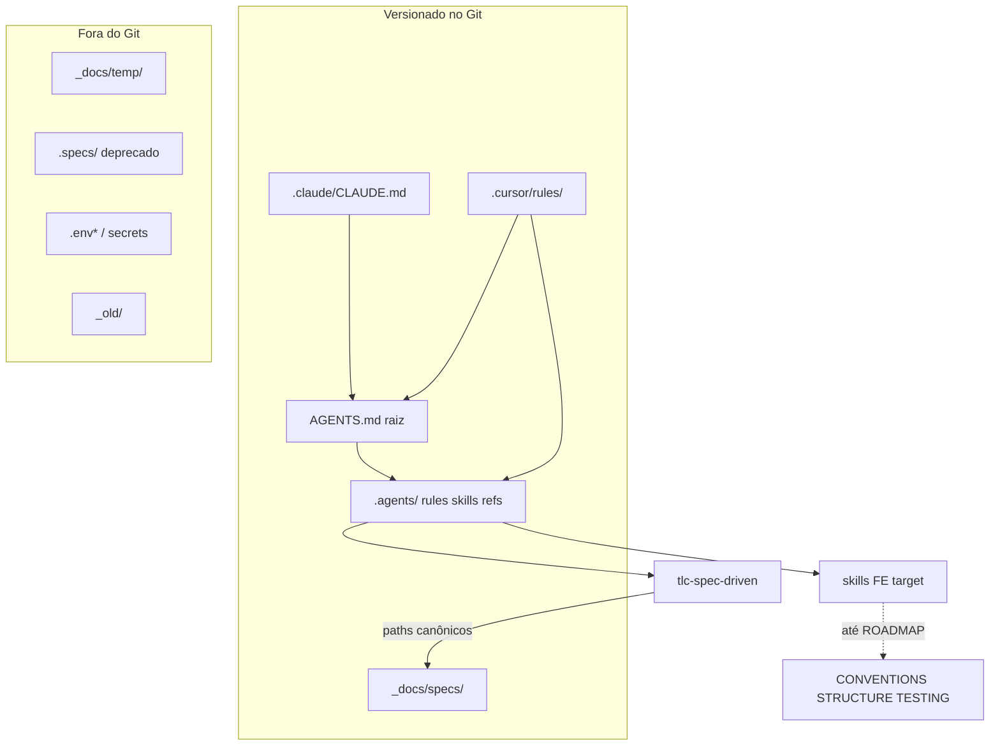

# Ajuste do Harness — Design

**Spec**: `_docs/specs/features/ajuste-harness/spec.md`  
**Context**: `_docs/specs/features/ajuste-harness/context.md`  
**Status**: Execute applied — T1–T13 done; awaiting Verifier

---

## Approach Exploration (Large/Complex)

Todas as abordagens entregam o mesmo escopo (HARN-01..12). Nenhuma reabre a fase 2 (adequar código).

| Approach | Ideia | Prós | Contras |
| -------- | ----- | ---- | ------- |
| **A — Patch in-place (recomendado)** | Ajustar `.gitignore`, patch cirúrgico de paths no TLC, banners nas skills FE, apagar `_docs/AGENTS.md`, corrigir Cursor/Claude, atualizar STATE/AGENTS/ROADMAP | Direto; AD-001 reforçado; um layout só; sem indirection | Diff TLC em muitos `.md` (só strings de path) |
| B — Bootstrap externo | Manter harness gitignored + script `bootstrap-harness.sh` | Repo “limpo” de agent fluff | **Viola 1A**; clone sem governança; rejeitado pelo contexto |
| C — Symlink `.specs` → `_docs/specs` sem patch TLC | Compat sem editar skill | TLC intacta bit-a-bit | Dois nomes para o mesmo lugar; Q1 revisado pediu patch pontual |

**Escolha de Design: Approach A.** Alinha às decisões confirmadas (1A, 2B, Q1 patch TLC, Q2 apagar `_docs/AGENTS.md`).

---

## Architecture Overview

O harness é um **sistema de arquivos + Git + ponteiros de IDE**, não uma app runtime. O fluxo:



**Conformidade com ADs ativos:**

| AD | Ação neste design |
| -- | ----------------- |
| AD-001 (`_docs/specs/`) | **Conform** — TLC passa a gravar/ler esse path |
| AD-002 (`frontend/`/`backend/`) | **Conform** — sem mudança de layout de código |

---

## Code Reuse Analysis

### Existing Components to Leverage

| Component | Location | How to Use |
| --------- | -------- | ---------- |
| Specs layout canônico | `.agents/references/specs-layout.md` | Já correto; TLC deve espelhar |
| Governança mestre | `AGENTS.md` (raiz) | Estender § Spec-driven + checklist Verified (P3); § unificação |
| Brownfield FE | `_docs/specs/{CONVENTIONS,STRUCTURE,TESTING}.md` | Fonte obrigatória até target liberado; reforçar nota “current vs target” se faltar |
| Rule Linear | `.agents/rules/linear_issue_management.md` | Sem mudança de conteúdo nesta feature |
| Skills FE | `.agents/skills/{api-client,forms-validation,component-architecture,routing-perf,testing-a11y}/SKILL.md` | Inserir banner target no topo (após frontmatter) |
| TLC package | `.agents/skills/tlc-spec-driven/**` | Substituir path `.specs/` → `_docs/specs/` |
| Cursor rules | `.cursor/rules/.cursorrules` | Corrigir `_D2TLabs`, listar skills ou apontar para `.agents/skills/` |
| Claude pointer | `.claude/CLAUDE.md` | Já aponta para raiz — manter |

### Integration Points

| System | Integration Method |
| ------ | ------------------ |
| Git | `.gitignore` + `git add` do núcleo na Execute |
| TLC lessons | `scripts/lessons.py` → store em `_docs/specs/lessons.json` + `LESSONS.md` |
| ROADMAP | Nota: “Adequação código ↔ skills target” = feature futura; skills FE = target até lá |
| IDE Antigravity | Sem config obrigatória no P1; quando existir, apontar para `AGENTS.md` raiz |

---

## Components

### C1 — Git ignore & tracking policy

- **Purpose**: Tornar o núcleo do harness clonável; manter temp/secrets fora.
- **Location**: `.gitignore` (raiz)
- **Interfaces** (política):
  - **Track:** `AGENTS.md`, `.agents/**`, `_docs/specs/**`, `.claude/CLAUDE.md`, `.cursor/rules/**`
  - **Ignore:** `_docs/temp/`, `_docs/**` exceto `specs/` (ver padrão abaixo), `.specs/`, `_old/`, `.env*`, `.windsurf/` (pasta removida), secrets
- **Dependencies**: Nenhuma runtime
- **Reuses**: Comentários existentes de “Spec-driven deprecated”
- **Agent decision (gitignore shape)**:

```gitignore
# Spec-driven deprecated layout
.specs/

# Docs: só specs versionadas; temp e scratch fora
_docs/*
!_docs/specs/
!_docs/specs/**

# (remover as linhas que ignoravam:)
# .agents/
# .claude/
# .cursor/
# **/AGENTS.md
# _docs/          ← substituído pelo bloco acima

# Manter:
_old/
.antigravitycli/   # até config real; opcional versionar depois
```

- **Nota:** Relatório `_docs/RELATORIO_CONFORMIDADE_HARNESS_*.md` e pastas vazias `prd/tdd/sdd` **não** entram no Git com este padrão (ficam sob `_docs/*` ignorado). Diagnóstico histórico permanece local ou move-se para `diversos/relatorios/` numa tarefa opcional — **fora do P1 obrigatório**; se o usuário quiser o relatório no Git, tarefa P2 move para `_docs/specs/` ou `diversos/`.

### C2 — TLC path surgical patch

- **Purpose**: Um único layout canônico `_docs/specs/` dentro da skill TLC.
- **Location**: `.agents/skills/tlc-spec-driven/`
- **Interfaces**:
  - `lessons.py`: `STORE_REL` / `RENDER_REL` → `_docs/specs/lessons.json` e `_docs/specs/LESSONS.md`; criar dirs sob `_docs/specs/`; help text `--root`
  - `SKILL.md` + `references/{memory,design,discuss,implement,validate,lessons,sub-agents,specify,tasks}.md`: substituir paths `.specs/` → `_docs/specs/` (incl. árvore de estrutura e exemplos)
- **Dependencies**: AD-001; `.agents/references/specs-layout.md` (já canônico)
- **Reuses**: Conteúdo/fluxo TLC intacto
- **Constraints**: Diff só de path strings; proibido alterar Verifier, auto-sizing, lessons gating rules, sub-agent batch math
- **Verification gate**: `rg -q '\.specs' .agents/skills/tlc-spec-driven` → exit 1 / 0 matches (ou allowlist documentada de migração = preferir 0)

### C3 — FE skills target banners

- **Purpose**: Impedir aplicação obrigatória de skills aspiracionais antes do ROADMAP.
- **Location**: headers de:
  - `api-client/SKILL.md`
  - `forms-validation/SKILL.md`
  - `component-architecture/SKILL.md`
  - `routing-perf/SKILL.md`
  - `testing-a11y/SKILL.md`
- **Interfaces**: Bloco padrão (texto Agent Discretion — conteúdo mínimo):

```markdown
> **Status: TARGET (não obrigatório ainda)**  
> Fonte obrigatória atual: `_docs/specs/CONVENTIONS.md`, `STRUCTURE.md`, `TESTING.md` + código em `frontend/src/pages|services|...`.  
> Só aplique esta skill como obrigação quando o ROADMAP/AD liberar a adequação frontend correspondente.  
> Até lá: use esta skill como referência de destino, não como gate de PR.
```

- **Dependencies**: ROADMAP nota + AD-004
- **Reuses**: Skills existentes sem reescrever corpo

### C4 — Brownfield note sync

- **Purpose**: Deixar explícito no brownfield o dual current/target.
- **Location**: `_docs/specs/STRUCTURE.md` (e 1 parágrafo em `TESTING.md` / `CONVENTIONS.md` se necessário)
- **Interfaces**: Seção curta “Agent skills vs layout atual”
- **Dependencies**: C3
- **Reuses**: Conteúdo STRUCTURE já descreve `pages/` + `services/`

### C5 — AGENTS canônico + limpeza `_docs`

- **Purpose**: Uma governança; `_docs` sem AGENTS permanente.
- **Location**: `AGENTS.md` (raiz); delete `_docs/AGENTS.md`
- **Interfaces**:
  - Atualizar §11 unificação: Cursor path real (`.cursor/rules/`), Claude raiz, Antigravity → raiz quando existir; Windsurf não suportado
  - Regra: não manter `AGENTS.md` sob `_docs/` (transitório só em `_docs/temp/`)
  - P3: checklist “feature Large/Complex fechada ⇒ `_docs/specs/features/[feature]/validation.md`”
- **Dependencies**: C1 (para `AGENTS.md` ser trackeável — remover `**/AGENTS.md` do ignore)
- **Reuses**: Texto atual de AGENTS

### C6 — Tool pointers

- **Purpose**: Cursor/Claude coerentes após clone.
- **Location**: `.cursor/rules/.cursorrules`, `.claude/CLAUDE.md`
- **Interfaces**:
  - Remover `_D2TLabs/`; diagramar `.agents/` real; skills = “ver `.agents/skills/`” (não listar só 2)
  - Claude: manter link `../AGENTS.md`
  - Remover diretório `.windsurf/` (stub)
  - `.antigravitycli/`: manter ignorado ou `.gitkeep` local até config real — sem `_docs/AGENTS.md`
- **Dependencies**: C5
- **Reuses**: `.cursorrules` existente como base

### C7 — Project memory (STATE / HANDOFF / ROADMAP)

- **Purpose**: Memória viva do harness (P2).
- **Location**: `_docs/specs/STATE.md`, `HANDOFF.md` (criar se ausente), `ROADMAP.md`
- **Interfaces**:
  - Append AD-003..AD-006 (ver Tech Decisions)
  - Current Work → ajuste-harness
  - ROADMAP: item “Adequação do código às skills FE target” sob M2/M3 Deferred ou Planned (feature futura); marcar “Benefícios mensais” alinhado à realidade numa linha se tocarmos ROADMAP — **só se necessário**; preferir não expandir escopo — no máximo uma linha “Harness agents — IN PROGRESS”
- **Dependencies**: Aprovação Design
- **Reuses**: Formato AD existente

---

## Data Models (if applicable)

N/A — sem modelo de domínio de aplicação. Artefatos de processo:

| Artifact | Path |
| -------- | ---- |
| Specs / memory | `_docs/specs/**` |
| Lessons store | `_docs/specs/lessons.json` |
| Lessons render | `_docs/specs/LESSONS.md` |
| Validation reports | `_docs/specs/features/[feature]/validation.md` |

---

## Error Handling Strategy

| Error Scenario | Handling | User Impact |
| -------------- | -------- | ----------- |
| `.gitignore` negation errada (specs não trackeiam) | Gate: `git check-ignore -v _docs/specs/STATE.md` deve **não** ignorar | Clone sem specs — corrigir ignore antes de merge |
| Patch TLC incompleto (writer ainda em `.specs/`) | Gate: `rg -q '\.specs'` na skill = 0 | Dois layouts — bloquear task |
| Recriar `_docs/AGENTS.md` | AGENTS/processo: rejeitar; apagar | Drift de governança |
| Skill FE aplicada como obrigação precoce | Banner + CONVENTIONS | PR de refatoração indevida — reverter escopo |
| `_docs/temp` commitado | Ignore + review | Segredos/scratch no Git — deny |

---

## Risks & Concerns

| Concern | Location | Impact | Mitigation |
| ------- | -------- | ------ | ---------- |
| `**/AGENTS.md` no gitignore impede versionar o canônico | `.gitignore:118` | AGENTS nunca entra no Git | Remover padrão; track só raiz |
| `_docs/` blanket ignore | `.gitignore:119` | Specs fora do Git | Negation `!_docs/specs/**` |
| TLC com ~10+ arquivos referenciando `.specs/` | `tlc-spec-driven/**` | Patch largo mas mecânico | Replace controlado + `rg` gate; sem refator de lógica |
| Skills FE description no YAML ainda soa obrigatória | frontmatter `description:` | Agente dispara skill em todo FE | Banner no body + opcional prefixo na description “(TARGET)” |
| Relatório de conformidade fica órfão (não versionado) | `_docs/RELATORIO_*.md` | Perde-se em outra máquina | Aceito no P1; Deferred: mover para `diversos/relatorios/` se útil |
| Versionar `.cursor/` / `.claude/` pode conflitar com prefs locais | `.cursor/`, `.claude/` | Noise em PRs | Versionar **só** rules/CLAUDE.md; não user settings |
| `_docs/prd|tdd|sdd` vazios continuam locais | `_docs/prd` etc. | Confusão “existem mas vazios” | Fora do Git com ignore; AGENTS já diz “quando existirem” |

---

## Tech Decisions (non-obvious)

| Decision | Choice | Rationale |
| -------- | ------ | --------- |
| Gitignore shape | `_docs/*` + `!_docs/specs/**` | Versiona specs; temp/relatórios/prd vazios fora; simples |
| TLC patch method | Replace path strings + constants em `lessons.py` | Cirúrgico; sem symlink |
| Lessons path | `_docs/specs/lessons.json` + `LESSONS.md` | Junto da memória do projeto (AD-001) |
| FE skills | Banner TARGET; corpo intacto | 2B sem reescrever skills |
| Tooling versionado | `.claude/CLAUDE.md` + `.cursor/rules/` | HARN-08 em clone fresco |
| Windsurf | Remover pasta stub | Sem suporte real |
| Relatório conformidade | Não versionar no P1 | Está sob `_docs/` fora de `specs/` |
| Approach | **A — Patch in-place** | Ver exploration |

### Project-level ADs to append on Design approval / Execute start

| ID | Decision |
| -- | -------- |
| **AD-003** | Núcleo do harness versionado: `AGENTS.md`, `.agents/`, `_docs/specs/`, ponteiros `.claude/` + `.cursor/rules/` |
| **AD-004** | Skills FE listadas = TARGET até ROADMAP/AD liberar; brownfield docs + código = obrigação atual |
| **AD-005** | TLC usa `_docs/specs/` como path canônico (patch de path na skill); `.specs/` permanece deprecado/gitignored |
| **AD-006** | `AGENTS.md` só na raiz; `_docs/` não hospeda governança permanente (só `specs/` + `temp/` transitório) |

*(AD-001 permanece active; AD-005 a reforça operacionalmente na skill.)*

---

## Requirement → Component map

| ID | Component(s) |
| -- | ------------ |
| HARN-01, HARN-02 | C1 |
| HARN-03, HARN-04 | C2 |
| HARN-05, HARN-06 | C3, C4 |
| HARN-07, HARN-08, HARN-09 | C5, C6 |
| HARN-10 | Processo (já cumprido na Specify; Execute gated) |
| HARN-11 | C7 |
| HARN-12 | C5 (checklist em AGENTS) |

---

## Out of scope reminder (Design)

- Sem mudanças em `backend/` ou `frontend/` de produto
- Sem popular PRD/TDD/SDD
- Sem config plena Antigravity
- Sem alterar lógica TLC além de paths

---

## Next

1. **Usuário aprova este Design** (Approach A + gitignore negation + componentes C1–C7)  
2. Então: **Tasks** (`tasks.md`)  
3. Execute **somente** após aprovação explícita das tasks (e HARN-10)
