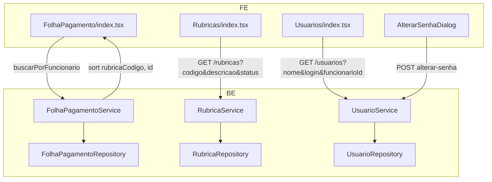

# Ajustes — Listagens, Filtros e UX — Design

**Spec**: `_docs/specs/features/ajustes-listagens/spec.md`  
**Status**: Draft

---

## Architecture Overview

Entrega **incremental** em quatro frentes independentes, sem nova camada nem migração de banco. Padrão dominante: **espelhar `FuncionarioService` + `FuncionarioRepository.findByFiltros`** para Rubricas e Usuários; **ordenar no service** (stream) para Folha; **ajuste local de UI** para `AlterarSenhaDialog`.



**Fluxo de dados (listagens):** UI envia filtros via query params → service normaliza strings (trim, `%pattern%`) → repositório JPQL com `ILIKE` + tri-state `ativo` → `ORDER BY` fixo na query ou pós-filtro ACL (Folha).

---

## Code Reuse Analysis

### Existing Components to Leverage

| Component | Location | How to Use |
| --------- | -------- | ---------- |
| Filtro tri-state status | `FuncionarioStatusFiltro.java` | Copiar padrão → `RubricaStatusFiltro` (ATIVO / INATIVO / TODOS) |
| Query dinâmica com ILIKE | `FuncionarioRepository.findByFiltros` | Modelo para `RubricaRepository` e `UsuarioRepository` |
| Card de filtros MUI | `Funcionarios/index.tsx`, `Usuarios/index.tsx` | Layout de referência para `Rubricas/index.tsx` |
| Toggle senha (olhinho) | `Usuarios/index.tsx` (dialog cadastro) | Copiar `Visibility`/`VisibilityOff` + `InputAdornment` em `AlterarSenhaDialog` |
| `usuarioService.listar(filtros)` | `frontend/src/services/usuarioService.ts` | Já monta query params — **sem mudança de contrato** |
| ACL Folha inalterada | `FolhaPagamentoService.consultarPorFuncionario` | Ordenar **após** `filter(aplicarFiltroAcesso)` |

### Integration Points

| System | Integration Method |
| ------ | ------------------ |
| `GET /rubricas` | Estender assinatura existente com `@RequestParam` opcionais; manter compatibilidade (sem params = status ATIVO, ordenado) |
| `GET /usuarios` | Substituir `listarTodos()` por `listar(nome, login, funcionarioId)`; params já consumidos pelo FE |
| `GET /folha-pagamento/funcionario/...` | Sem mudança de contrato; ordem garantida no service |
| Auth | Rotas cadastro continuam `AdminRoute`; Folha mantém ACL organograma (AD-011) |

---

## Components

### 1. Folha — ordenação de rubricas no detalhe

- **Purpose**: Retornar linhas de folha por funcionário ordenadas por `rubricaCodigo` ↑, desempate `id` ↑.
- **Location**: `backend/.../folha/application/FolhaPagamentoService.java`
- **Interfaces**:
  - `consultarPorFuncionario(...)` → `List<FolhaPagamentoDTO>` já existente; adicionar `.sorted(comparator)` antes do `collect`.
- **Dependencies**: `FolhaPagamentoRepository`, ACL existente.
- **Reuses**: Comparator inline (2 campos); sem util compartilhado.

**FE defensivo** (`FolhaPagamento/index.tsx`):
- Após `setRubricasFuncionario`, opcionalmente reordenar com `localeCompare('pt-BR')` em `rubricaCodigo` — **redundante** se BE garantir; incluir apenas se teste E2E manual exigir paridade imediata. **Decisão:** BE é fonte da verdade; FE renderiza lista como recebida.

**Comparator (BE):**

```java
Comparator.comparing(FolhaPagamentoDTO::rubricaCodigo, Comparator.nullsLast(String.CASE_INSENSITIVE_ORDER))
    .thenComparing(FolhaPagamentoDTO::id, Comparator.nullsLast(Comparator.naturalOrder()))
```

---

### 2. Rubricas — filtros e ordenação

- **Purpose**: Listar rubricas filtradas por código, descrição e status; ordenar por `codigo`.
- **Location**:
  - `cadastros/api/RubricaStatusFiltro.java` *(novo)*
  - `cadastros/infrastructure/RubricaRepository.java`
  - `cadastros/application/RubricaService.java`
  - `cadastros/api/RubricaController.java`
  - `frontend/src/pages/Rubricas/index.tsx`
  - `frontend/src/services/rubricaService.ts`
- **Interfaces**:

| Camada | Assinatura |
| ------ | ---------- |
| Controller | `GET /rubricas?codigo=&descricao=&status=ATIVO\|INATIVO\|TODOS` |
| Service | `listar(String codigo, String descricao, RubricaStatusFiltro status)` |
| Repository | `findByFiltros(codigoPattern, descricaoPattern, ativo)` → `ORDER BY r.codigo ASC` |
| FE service | `listar(filtros?: RubricaFiltros)` com `URLSearchParams` |

- **Dependencies**: Nenhuma cross-domain.
- **Reuses**: `resolverAtivo(RubricaStatusFiltro)` idêntico a `FuncionarioService.resolverAtivo`.

**JPQL proposta (`RubricaRepository`):**

```sql
SELECT r FROM Rubrica r
WHERE (:ativo IS NULL OR r.ativo = :ativo)
  AND (:codigoPattern IS NULL OR r.codigo ILIKE :codigoPattern)
  AND (:descricaoPattern IS NULL OR r.descricao ILIKE :descricaoPattern)
ORDER BY r.codigo ASC
```

**FE — filtros (`Rubricas/index.tsx`):**
- Card `Filtros` acima da tabela (mesmo markup de `Usuarios/index.tsx`: `Card` → `Typography h6` → `form` → `flexWrap gap={2}` → Filtrar/Limpar).
- Campos: `codigo` (TextField), `descricao` (TextField), `status` (Select: Ativo/Inativo/Todos, default ATIVO).
- `react-hook-form` + `handleSubmit` → `rubricaService.listar(filtros)`.
- Estado vazio: `"Nenhuma rubrica encontrada"`.

---

### 3. Usuários — filtros funcionais e ordem alfabética

- **Purpose**: Honrar query params que o FE já envia; ordenar por `nome`, desempate `login`.
- **Location**:
  - `auth/infrastructure/UsuarioRepository.java`
  - `auth/application/UsuarioService.java`
  - `auth/api/UsuarioController.java`
  - `frontend/src/pages/Usuarios/index.tsx` *(ajuste mínimo, se necessário)*
- **Interfaces**:

| Camada | Assinatura |
| ------ | ---------- |
| Controller | `GET /usuarios?nome=&login=&funcionarioId=` |
| Service | `listar(String nome, String login, Long funcionarioId)` — substitui `listarTodos()` na rota GET |
| Repository | `findByFiltros(nomePattern, loginPattern, funcionarioId)` |

**JPQL proposta (`UsuarioRepository`):**

```sql
SELECT u FROM Usuario u
LEFT JOIN u.funcionario f
WHERE u.ativo = true
  AND (:nomePattern IS NULL OR u.nome ILIKE :nomePattern)
  AND (:loginPattern IS NULL OR u.login ILIKE :loginPattern)
  AND (:funcionarioId IS NULL OR f.id = :funcionarioId)
ORDER BY u.nome ASC, u.login ASC
```

- **Nota**: Listagem continua **somente usuários ativos** (comportamento atual de `listarTodos`). Filtros não expõem inativos — fora do escopo.
- **FE**: Nenhuma mudança estrutural esperada; validar que `handleFilter` / `carregarDados` continuam funcionando.

---

### 4. Alterar senha — visibilidade de nova senha

- **Purpose**: Toggle olho em Nova senha e Confirmar; senha atual sempre oculta.
- **Location**: `frontend/src/components/AlterarSenhaDialog/index.tsx`
- **Interfaces**: Componente existente; adicionar state local:
  - `showNovaSenha: boolean` (default `false`)
  - `showConfirmarSenha: boolean` (default `false`)
- **Dependencies**: `@mui/icons-material` (`Visibility`, `VisibilityOff`), `IconButton`, `InputAdornment`.
- **Reuses**: Padrão literal de `Usuarios/index.tsx` linhas ~538–577.

**Reset de toggles:** no `useEffect` quando `open === true` e em `handleClose`, setar ambos `false` (além do `reset()` do form).

**Sem componente compartilhado** nesta entrega — extração para `PasswordFieldWithToggle` fica deferred (YAGNI).

---

## Data Models

### RubricaStatusFiltro (novo enum BE)

```java
public enum RubricaStatusFiltro {
    ATIVO, INATIVO, TODOS
}
```

Mapeamento service: `ATIVO→true`, `INATIVO→false`, `TODOS→null`.

### RubricaFiltros (novo tipo FE)

```typescript
export interface RubricaFiltros {
  codigo?: string;
  descricao?: string;
  status?: 'ATIVO' | 'INATIVO' | 'TODOS';
}
```

### UsuarioFiltros (existente — sem alteração)

```typescript
export interface UsuarioFiltros {
  nome?: string;
  login?: string;
  funcionarioId?: number;
}
```

---

## Error Handling Strategy

| Error Scenario | Handling | User Impact |
| -------------- | -------- | ----------- |
| API filtros Rubricas/Usuários falha | `toast.error` / `showNotification` (padrão da tela) | Mensagem genérica; lista anterior ou vazia |
| Filtros com strings só espaços | Service faz `trim`; vazio → `null` pattern | Critério ignorado |
| Status Rubricas inválido na query | Spring converte enum; 400 se valor desconhecido | Erro HTTP padrão |
| Senha atual incorreta (dialog) | Comportamento existente (`Alert` + status 400) | Inalterado |

---

## Risks & Concerns

| Concern | Location | Impact | Mitigation |
| ------- | -------- | ------ | ---------- |
| FE envia filtros Usuários que BE ignorava | `UsuarioController.listarTodos()` | Filtros “quebrados” hoje | Design corrige BE; FE já correto |
| `listarTodas()` Rubricas só retorna ativos | `RubricaService.java:22` | Inativos invisíveis até filtro TODOS | Nova query com tri-state |
| Sem testes FE no repo | `frontend/` | Gate FE = build/typecheck apenas | BE unit tests cobrem lógica de filtro/ordem; dialog senha validado via build + teste manual na validation |
| Ordenação Folha pós-ACL | `FolhaPagamentoService` | Ordem correta só nas linhas visíveis | Sort **after** `filter(aplicarFiltroAcesso)` |
| `UsuarioService` loga hash de senha | `UsuarioService.alterarSenha` | Risco de segurança pré-existente | Fora do escopo (STATE.md deferred); não expandir logging nesta feature |
| Breaking change `GET /rubricas` | Controller | Clientes sem params devem ver mesmo default | `defaultValue = "ATIVO"` no `@RequestParam status` |

---

## Tech Decisions

| Decision | Choice | Rationale |
| -------- | ------ | ----------- |
| Onde ordenar Folha | Service stream pós-ACL | Evita duplicar ORDER BY em 2 queries JPA; volume por funcionário é pequeno |
| Onde ordenar Rubricas/Usuários | JPQL `ORDER BY` | Consistência com `FuncionarioRepository`; full-load atual |
| Enum status Rubricas | `RubricaStatusFiltro` separado | Espelha padrão existente; evita acoplamento cross-domain |
| Filtro código = ILIKE contains | `%valor%` case-insensitive | Spec + paridade Funcionários |
| "Id da rubrica" | Campo `codigo` / `rubricaCodigo` | Assunção da spec |
| FE sort defensivo Folha | Não implementar | BE é fonte da verdade; evita duplicação |
| Password toggle | State local no dialog | Escopo mínimo; padrão já provado em Usuarios |
| Testes | BE unit (Mockito) por service | Repo sem Vitest configurado/sem specs FE |

---

## Test Plan (Design → Execute)

| Req IDs | Teste | Gate |
| ------- | ----- | ---- |
| FOLHA-ORD-* | `FolhaPagamentoServiceTest`: linhas retornadas ordenadas por `rubricaCodigo` then `id` | `mvn test -Dtest=FolhaPagamentoServiceTest` |
| RUB-* | `RubricaServiceTest` *(novo)*: patterns ILIKE, tri-state status, delegação repo | `mvn test -Dtest=RubricaServiceTest` |
| USR-* | `UsuarioServiceTest`: listar com nome/login/funcionarioId, ordem repo | `mvn test -Dtest=UsuarioServiceTest` |
| SENHA-VIS-* | Build FE + verificação manual na validation | `npm run build` (frontend) |

---

## Execute Phases (preview for Tasks)

| Phase | Tasks | Deps |
| ----- | ----- | ---- |
| **T1 — BE Folha** | Comparator em `FolhaPagamentoService` + teste | — |
| **T2 — BE Rubricas** | Enum + Repository query + Service + Controller + `RubricaServiceTest` | — |
| **T3 — BE Usuários** | Repository query + Service + Controller + testes `UsuarioServiceTest` | — |
| **T4 — FE Rubricas** | Card filtros + `rubricaService.listar` | T2 |
| **T5 — FE Senha** | Toggles em `AlterarSenhaDialog` | — |
| **T6 — FE Usuários** | Smoke/ajuste se necessário após T3 | T3 |

**Total: 6 tasks** → cabe em **1 batch inline** (≤ ~8); Tasks formal opcional.

**Commits:** 1 por task (contrato TLC Execute).

---

## Requirement Traceability (Design)

| Requirement ID | Component | Status |
| -------------- | --------- | ------ |
| FOLHA-ORD-01..03 | FolhaPagamentoService sort | In Design |
| RUB-01..11 | Rubrica* + Rubricas page | In Design |
| USR-01..08 | Usuario* + Usuarios page | In Design |
| SENHA-VIS-01..06 | AlterarSenhaDialog | In Design |
