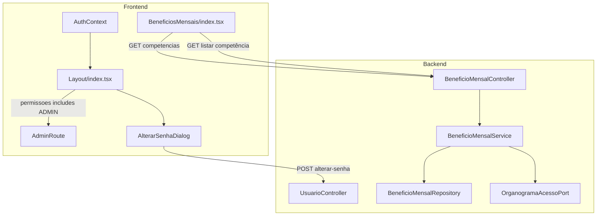

# Ajustes Sistema Design

**Spec**: `_docs/specs/features/ajustes-sistema/spec.md`  
**Status**: Approved

---

## Architecture Overview

Feature **Large** com três frentes independentes (podem executar em paralelo após contratos definidos):

| Frente | Escopo | Camada principal |
| ------ | ------ | ---------------- |
| **A — Menu Cadastros ADMIN** | Ocultar sidebar + guard de rota | Frontend |
| **B — Troca de senha** | Dialog no Layout + fix contrato API | Frontend (+ alinhamento service) |
| **C — Benefícios drill-down** | Novo endpoint competências + refactor página | Backend + Frontend |

**Abordagens consideradas (Large):**

| Área | Opções | Escolha | Motivo |
| ---- | ------ | ------- | ------ |
| Guard Cadastros | (1) Só FE Layout + AdminRoute · (2) FE + `SecurityConfig` hasRole em todas rotas cadastro | **(1) FE-only** | Spec limita escopo ao menu/rotas UI; BE cadastro já é `authenticated()` — hardening BE fica follow-up |
| Listagem competências Benefícios | (1) JPQL agregada no repo · (2) Reutilizar `GET /` + agrupar no client · (3) Nova tabela resumo | **(1) JPQL agregada** | Paridade com Folha sem over-fetch; spec exclui tabela nova |
| Senha self-service | (1) Dialog no Layout · (2) Página dedicada `/alterar-senha` | **(1) Dialog no Layout** | Spec pede menu AccountCircle; menor friction |

Conformidade **AD-011**: `ADMIN` controla menu Cadastros; `ACESSO_TOTAL` continua sendo apenas bypass de organograma — **não** concede Cadastros.



---

## Code Reuse Analysis

### Existing Components to Leverage

| Component | Location | How to Use |
| --------- | -------- | ---------- |
| Sidebar Cadastros | `frontend/src/components/Layout/index.tsx` | Condicionar render com `isAdmin(user)` |
| Drill-down Folha | `frontend/src/pages/FolhaPagamento/index.tsx` | **Template UX**: state `mostrarFuncionarios`, filtros RHF, cards, dialog detalhe |
| PrivateRoute | `frontend/src/routes/index.tsx` | Modelo para novo `AdminRoute` |
| AuthContext | `frontend/src/contexts/AuthContext.tsx` | `user.permissoes`, `user.id` |
| useNotification + Notification | `frontend/src/hooks/useNotification.ts`, `components/Notification/index.tsx` | Redirect acesso negado + feedback senha |
| Validação senha (Usuários) | `frontend/src/pages/Usuarios/index.tsx` | Mesmas regras: min 6, confirmação |
| usuarioService.alterarSenha | `frontend/src/services/usuarioService.ts` | Corrigir para POST + query params |
| beneficioMensalService | `frontend/src/services/beneficioMensalService.ts` | Adicionar `listarCompetencias(ano, mes?)` |
| ACL Benefícios | `BeneficioMensalService.obterContextoAcesso` | Reutilizar em novo método `listarCompetenciasParaUsuario` |
| Resumo Folha por ano | `ResumoFolhaPagamentoService.periodoDe` | Copiar lógica de filtro ano/mês (record `PeriodoCompetencia`) |
| Filtros linha/CC | `centroCustoService`, `linhaNegocioService` | Mesmos imports da Folha |
| BeneficioMensalServiceTest | `backend/.../BeneficioMensalServiceTest.java` | Estender com testes de competências ACL |
| Índice competência | `V1.13__create_beneficio_mensal.sql` | `idx_beneficio_mensal_competencia` já cobre agregação |

### Integration Points

| System | Integration Method |
| ------ | ------------------ |
| Permissões usuário | `Usuario.permissoes` → Spring `ROLE_*`; FE lê array string |
| Troca senha | `POST /api/usuarios/{id}/alterar-senha?senhaAtual=&novaSenha=` (existente) |
| Benefícios competências | **Novo** `GET /api/beneficio-mensal/competencias?ano=&mes=` |
| Benefícios lançamentos | **Existente** `GET /api/beneficio-mensal?competenciaInicio=&competenciaFim=` (step 2→3) |
| Organograma ACL | `OrganogramaAcessoPort.obterContextoAcesso` — mesmo pipeline dos métodos atuais |

---

## Components

### Frente A — `isAdmin` helper

- **Purpose**: Centralizar checagem `ADMIN` no frontend
- **Location**: `frontend/src/utils/permissions.ts` (novo, utilitário mínimo — brownfield; AD-004 evita `src/shared/` até refactor)
- **Interfaces**:
  - `isAdmin(user: Usuario | null): boolean` — `user?.permissoes?.includes('ADMIN') ?? false`
  - `CADASTRO_ROUTES: readonly string[]` — lista das 8 rotas de cadastro
- **Dependencies**: tipo `Usuario` de `types/index.ts`
- **Reuses**: padrão de strings em `Usuarios/index.tsx` (`permissoesDisponiveis`)

### Frente A — `AdminRoute`

- **Purpose**: Guard de rota para cadastros (MENU-02, MENU-03)
- **Location**: `frontend/src/routes/AdminRoute.tsx` (novo)
- **Interfaces**:
  - Wrapper `<AdminRoute />` usando `useAuth()`, `useNavigate()`, `useLocation()`
  - Se `!isAdmin(user)` → `Navigate` to `/dashboard` com `state: { acessoNegado: true }`
- **Dependencies**: `AuthContext`, `isAdmin`
- **Reuses**: estrutura de `PrivateRoute` em `routes/index.tsx`

### Frente A — Layout (Cadastros condicional)

- **Purpose**: Ocultar seção Cadastros para não-ADMIN (MENU-01)
- **Location**: `frontend/src/components/Layout/index.tsx`
- **Interfaces**:
  - Render `{isAdmin(user) && (<> Divider + Collapse Cadastros </>)}`
- **Dependencies**: `isAdmin(user)`
- **Reuses**: arrays `cadastroItems` existentes

### Frente A — Notificação redirect

- **Purpose**: Informar acesso negado após redirect do AdminRoute
- **Location**: `frontend/src/pages/Dashboard/index.tsx` (ou `Layout` — preferir Dashboard para não acoplar snackbar global)
- **Interfaces**:
  - `useEffect` lê `location.state?.acessoNegado` → `showNotification('Acesso negado. Apenas administradores.', 'warning')` → `navigate('.', { replace: true, state: {} })`
- **Dependencies**: `useNotification`, `useLocation`
- **Reuses**: padrão Relatórios/Usuarios

### Frente B — `AlterarSenhaDialog`

- **Purpose**: Self-service troca de senha (SENHA-01…04)
- **Location**: `frontend/src/components/AlterarSenhaDialog/index.tsx` (novo)
- **Interfaces**:
  - Props: `open: boolean`, `onClose: () => void`, `userId: number`
  - Form RHF: `senhaAtual`, `novaSenha`, `confirmarSenha`
  - Submit → `usuarioService.alterarSenha(userId, senhaAtual, novaSenha)`
- **Dependencies**: `usuarioService`, MUI Dialog/TextField
- **Reuses**: validação de `Usuarios/index.tsx`; campos type `password`

### Frente B — Layout (menu item)

- **Purpose**: Entrada "Alterar senha" no menu AccountCircle
- **Location**: `frontend/src/components/Layout/index.tsx`
- **Interfaces**:
  - State `alterarSenhaOpen`
  - `MenuItem` "Alterar senha" entre nome e Sair
  - Render `<AlterarSenhaDialog open={...} userId={user!.id} />`
- **Dependencies**: `AlterarSenhaDialog`, `user` do AuthContext

### Frente B — `usuarioService.alterarSenha` (fix)

- **Purpose**: Alinhar FE ao contrato BE existente
- **Location**: `frontend/src/services/usuarioService.ts`
- **Interfaces**:
  ```typescript
  alterarSenha(id: number, senhaAtual: string, novaSenha: string): Promise<void>
  // POST /usuarios/{id}/alterar-senha?senhaAtual=...&novaSenha=...
  ```
- **Dependencies**: `api` axios instance
- **Reuses**: padrão query params de outros services

### Frente C — `BeneficioMensalCompetenciaResumoDTO` (backend)

- **Purpose**: Contrato do novo endpoint de competências (BEN-06)
- **Location**: `backend/.../beneficios/api/BeneficioMensalCompetenciaResumoDTO.java`
- **Interfaces**:
  ```java
  record BeneficioMensalCompetenciaResumoDTO(
      LocalDate competenciaInicio,
      LocalDate competenciaFim,
      long totalFuncionarios,
      BigDecimal totalBeneficios,
      long qtdLancamentos
  )
  ```
- **Dependencies**: nenhuma
- **Reuses**: campos alinhados ao spec; `BigDecimal` como demais DTOs de valor

### Frente C — Repository query `competenciasResumo`

- **Purpose**: Agregação ACL-aware por par de competência
- **Location**: `backend/.../beneficios/infrastructure/BeneficioMensalRepository.java`
- **Interfaces**:
  - Projection `BeneficioMensalCompetenciaProjection` (competenciaInicio, competenciaFim, totalFuncionarios, totalBeneficios, qtdLancamentos)
  - Query JPQL:
    ```sql
    SELECT bm.competenciaInicio, bm.competenciaFim,
           COUNT(DISTINCT bm.funcionario.id),
           SUM(bm.valor),
           COUNT(bm)
    FROM BeneficioMensal bm
    WHERE bm.ativo = true
      AND bm.competenciaInicio >= :dataInicio
      AND bm.competenciaFim <= :dataFim
      [AND bm.funcionario.centroCusto.id IN :centroCustoIds]
    GROUP BY bm.competenciaInicio, bm.competenciaFim
    ORDER BY bm.competenciaInicio DESC
    ```
  - Variante sem filtro de centro quando `acessoTotal`
- **Dependencies**: índice `idx_beneficio_mensal_competencia`
- **Reuses**: padrão dual-query (com/sem centros) de `resumoPorCompetencia`

### Frente C — `BeneficioMensalService.listarCompetenciasParaUsuario`

- **Purpose**: Orquestrar ACL + filtro ano/mês (BEN-06, BEN-07)
- **Location**: `backend/.../beneficios/application/BeneficioMensalService.java`
- **Interfaces**:
  - `listarCompetenciasParaUsuario(String login, Integer ano, Integer mes): List<BeneficioMensalCompetenciaResumoDTO>`
  - Reutiliza `obterContextoAcesso`, `acessoNegado`, `centrosParaFiltro`, `periodoDe(ano, mes)` (método privado espelhando Folha)
- **Dependencies**: repository, OrganogramaAcessoPort, UsuarioLookupPort
- **Reuses**: pipeline ACL idêntico a `listarPorCompetenciaParaUsuario`

### Frente C — Controller endpoint

- **Purpose**: Expor competências via REST
- **Location**: `backend/.../beneficios/api/BeneficioMensalController.java`
- **Interfaces**:
  - `GET /competencias?ano=&mes=` → `ResponseEntity<List<BeneficioMensalCompetenciaResumoDTO>>`
  - Validação `@Min/@Max` em ano (2000–2100) e mes (1–12), espelhando `ResumoFolhaPagamentoController`
- **Dependencies**: BeneficioMensalService, Authentication

### Frente C — Extensão `BeneficioMensalDTO` (cargo + linha)

- **Purpose**: Paridade dos cards de funcionário com Folha (BEN-03)
- **Location**: `backend/.../beneficios/api/BeneficioMensalDTO.java` + `toDTO()` no service
- **Interfaces**:
  - Campos adicionais opcionais: `cargoDescricao`, `linhaNegocioId`, `linhaNegocioDescricao`
  - Populados de `funcionario.cargo.descricao` e `funcionario.centroCusto.linhaNegocio`
- **Dependencies**: joins lazy — garantir fetch ou acesso dentro `@Transactional(readOnly=true)` no service
- **Reuses**: shape de `FolhaPagamentoDTO`

### Frente C — Refactor `BeneficiosMensais` page

- **Purpose**: UX drill-down Resumo → Funcionários → Dialog (BEN-01…05)
- **Location**: `frontend/src/pages/BeneficiosMensais/index.tsx` (rewrite in-place)
- **Interfaces**:
  - State: `mostrarFuncionarios`, `competenciaSelecionada`, `funcionariosResumo[]`, `lancamentos[]`, `openDetalhesDialog`, `funcionarioSelecionado`
  - Step 1: `beneficioMensalService.listarCompetencias(ano, mes?)`
  - Step 2: `beneficioMensalService.listar(params)` → reduce client-side por `funcionarioId` (total valor, qtd tipos)
  - Step 3: filter `lancamentos` por funcionário → dialog tabela
  - Filtros step 2: copiar lógica `filteredFuncionarios` da Folha (linha, CC, busca)
- **Dependencies**: services, RHF, MUI components
- **Reuses**: **FolhaPagamento/index.tsx** como blueprint (~80% estrutural)

### Frente C — `beneficioMensalService.listarCompetencias`

- **Purpose**: Cliente HTTP do novo endpoint
- **Location**: `frontend/src/services/beneficioMensalService.ts`
- **Interfaces**:
  ```typescript
  interface BeneficioMensalCompetenciaResumo {
    competenciaInicio: string;
    competenciaFim: string;
    totalFuncionarios: number;
    totalBeneficios: number;
    qtdLancamentos: number;
  }
  listarCompetencias(ano: number, mes?: number): Promise<BeneficioMensalCompetenciaResumo[]>
  ```
- **Dependencies**: `api` axios

---

## Data Models

### Frontend — `BeneficioMensalCompetenciaResumo`

```typescript
interface BeneficioMensalCompetenciaResumo {
  competenciaInicio: string; // ISO date
  competenciaFim: string;
  totalFuncionarios: number;
  totalBeneficios: number;
  qtdLancamentos: number;
}
```

**Relationships**: chave de drill-down para `BeneficioMensalCompetenciaParams`; não persiste localmente além do state da página.

### Frontend — `FuncionarioBeneficioResumo` (local state)

```typescript
interface FuncionarioBeneficioResumo {
  funcionarioId: number;
  funcionarioNome: string;
  cargoDescricao?: string;
  centroCustoDescricao?: string;
  linhaNegocioDescricao?: string;
  totalBeneficios: number;
  qtdLancamentos: number;
  competenciaInicio: string;
  competenciaFim: string;
}
```

**Relationships**: agregado client-side a partir de `BeneficioMensal[]`; equivalente a `FuncionarioResumo` da Folha.

### Backend — `BeneficioMensalCompetenciaResumoDTO`

```java
record BeneficioMensalCompetenciaResumoDTO(
    LocalDate competenciaInicio,
    LocalDate competenciaFim,
    long totalFuncionarios,
    BigDecimal totalBeneficios,
    long qtdLancamentos
) {}
```

**Relationships**: derivado de `beneficio_mensal`; sem entity JPA.

### Backend — `BeneficioMensalDTO` (extended)

```java
// campos existentes +
String cargoDescricao,
Long linhaNegocioId,
String linhaNegocioDescricao
```

---

## Error Handling Strategy

| Error Scenario | Handling | User Impact |
| -------------- | -------- | ----------- |
| Não-ADMIN acessa rota cadastro | `AdminRoute` redirect + state flag | Snackbar "Acesso negado…" no Dashboard |
| Senha atual incorreta | BE 400; FE catch axios error | "Senha atual incorreta" no dialog |
| Senha nova inválida (FE) | RHF validation | Erro inline no campo; sem request |
| API senha indisponível | catch genérico | "Não foi possível alterar a senha. Tente novamente." |
| Competências vazias | lista `[]` | Mensagem empty state na tabela resumo |
| ACL negado (benefícios) | service retorna `[]` | Empty state (consistente com hoje) |
| Erro de rede benefícios | catch em fetch | Typography color error (padrão Folha) |

---

## Risks & Concerns

| Concern | Location | Impact | Mitigation |
| ------- | -------- | ------ | ---------- |
| Guard Cadastros só no FE | `routes/index.tsx` | Non-admin ainda chama APIs de cadastro via Postman | Documentado out-of-scope; follow-up BE `hasRole ADMIN` em mutações |
| Endpoint senha permite qualquer `id` | `UsuarioController:77` | Usuário autenticado poderia alterar senha alheia | UI usa `user.id`; follow-up: validar `id == authentication principal` no service |
| Logs de senha em debug | `UsuarioService:143-163` | Vazamento em logs | Não expandir; follow-up remover debug de hash (spring-security skill) |
| `BeneficioMensalDTO` sem cargo/linha | `BeneficioMensalService.toDTO:225` | Cards incompletos vs Folha | Extender DTO + toDTO nesta feature |
| LazyInitialization em toDTO | `Funcionario.cargo`, `CentroCusto.linhaNegocio` | 500 em runtime | `@Transactional(readOnly=true)` nos métodos de listagem ou `@EntityGraph` |
| Página Benefícios monolítica | `BeneficiosMensais/index.tsx` (~650 linhas Folha) | Manutenção | Aceitar paridade Folha; extrair subcomponentes só se >800 linhas |
| Contrato FE senha quebrado | `usuarioService.ts:60` | Feature senha não funciona hoje | Fix explícito na task B |
| Testes FE inexistentes para Layout/routes | brownfield | Regressão menu | Testes Vitest mínimos para `isAdmin` + AdminRoute (opcional P2 se tempo) |

---

## Tech Decisions

| Decision | Choice | Rationale |
| -------- | ------ | --------- |
| Checagem ADMIN | `permissoes.includes('ADMIN')` only | AD-011: `ACESSO_TOTAL` ≠ admin UI |
| Guard de rota | `AdminRoute` wrapper + redirect state | Reuso PrivateRoute; evita duplicar guard em 8 rotas inline |
| Notificação acesso negado | Dashboard consome `location.state` | Layout não tem Notification hoje; Dashboard já é landing pós-login |
| Senha API | Manter POST + `@RequestParam` (BE); corrigir FE | Menor diff; BE já implementado |
| Form senha | RHF sem Zod (brownfield) | AD-004: forms-validation é target; Usuarios usa RHF manual |
| Competências BE | JPQL GROUP BY competência | Eficiente; índice existente; ACL via filtro centro |
| Filtro ano/mês | Copiar `periodoDe` da Folha | Comportamento idêntico documentado |
| Agregação funcionários | Client-side reduce pós `GET /beneficio-mensal` | Mesmo padrão Folha (`fetchFuncionariosPorResumo`); evita endpoint extra |
| Remover UX expandível atual | Substituir in-place | Spec pede paridade Folha; código expand/Collapse removido |

---

## Requirement Mapping (Design Complete)

| Requirement ID | Component(s) | Notes |
| -------------- | ------------ | ----- |
| MENU-01 | Layout + isAdmin | Sidebar condicional |
| MENU-02 | AdminRoute | Redirect não-admin |
| MENU-03 | AdminRoute + Dashboard notification | URL direta bloqueada |
| SENHA-01 | Layout menu item | Nova opção |
| SENHA-02 | AlterarSenhaDialog | Modal 3 campos |
| SENHA-03 | AlterarSenhaDialog + usuarioService | Erro senha atual |
| SENHA-04 | AlterarSenhaDialog RHF | Validação client |
| BEN-01 | BeneficiosMensais step 1 | Tabela + filtros ano/mês |
| BEN-02 | CompetenciaResumoDTO + tabela | Colunas domínio benefícios |
| BEN-03 | BeneficiosMensais step 2 + DTO extend | Cards + filtros |
| BEN-04 | BeneficiosMensais dialog | Detalhe lançamentos |
| BEN-05 | handleVoltar | Preserva filtros resumo |
| BEN-06 | GET /competencias | Novo endpoint |

**Suggested execution order (Tasks phase):**

1. **BE** — competências endpoint + DTO extend + tests  
2. **FE-B** — usuarioService fix + AlterarSenhaDialog + Layout menu  
3. **FE-A** — isAdmin + AdminRoute + Layout cadastros + Dashboard notification  
4. **FE-C** — refactor BeneficiosMensais (depende de 1)

Estimativa: **~4 tasks atômicas** (cabem 1 batch Execute ≤8).
