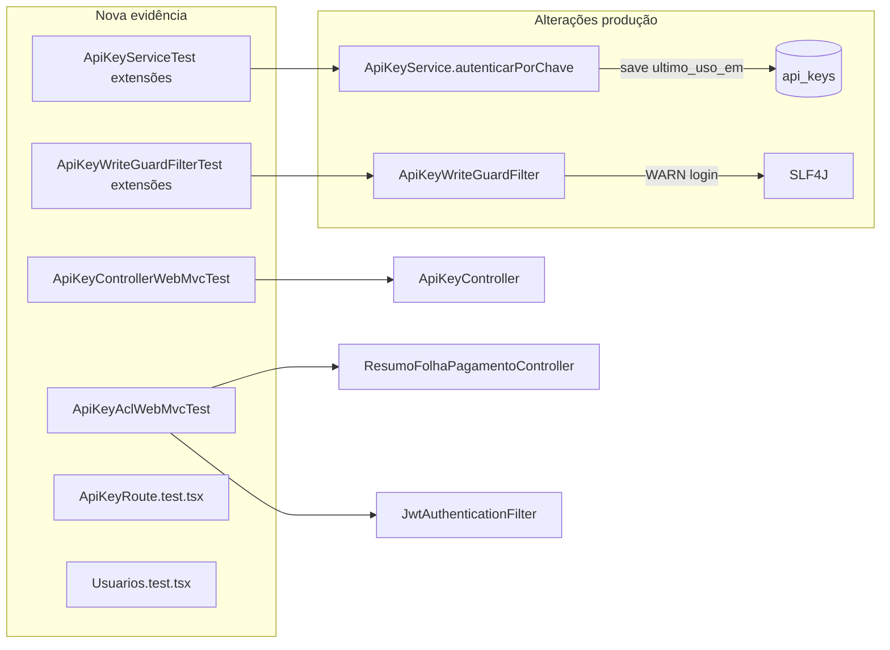

# auth-api-keys-fix1 Design

**Spec**: `_docs/specs/features/auth-api-keys-fix1/spec.md`  
**Parent design**: `_docs/specs/features/auth-api-keys/design.md`  
**Status**: Approved 2026-07-30 — tasks em `_docs/specs/features/auth-api-keys-fix1/tasks.md`  
**Constraints**: AD-008 (pacotes `auth.*` / `security/`); AD-014 (read-only); brownfield FE (AD-004)

---

## Architecture Overview

Fix1 é um **incremento cirúrgico** sobre o MVP já entregue: duas mudanças de produção pequenas (`ultimo_uso_em`, log do write-guard) e **camada de evidência automatizada** (WebMvc + Vitest + testes de filter/service). Não altera Approach A, filtros, schema Flyway, contratos HTTP públicos nem UI funcional.



**Invariantes preservados:** dual-path Bearer; marker `ROLE_API_KEY_READONLY`; write-guard após JWT filter; CRUD keys só via JWT efetivo.

---

## Code Reuse Analysis

### Existing Components to Leverage

| Component | Location | How to Use (fix1) |
| --------- | -------- | ----------------- |
| `SecurityConfigAuthRefreshTest` | `config/SecurityConfigAuthRefreshTest.java` | Template `@WebMvcTest` + `@Import(SecurityConfig, GlobalExceptionHandler)` + `@MockBean ApiKeyService` |
| `OrganogramaControllerWebMvcTest` | `organograma/api/` | Mesmo padrão de mocks (`JwtService`, `UserDetailsService`, `ApiKeyService`) |
| `GlobalExceptionHandler` | `exception/` | 403 `AccessDeniedException`, 400 `MethodArgumentNotValidException` já mapeados (fix-cycle-1) |
| `ApiKeyServiceTest` | `auth/application/` | `ListAppender` + `ArgumentCaptor` para secret-not-logged → reutilizar em write-guard log |
| `FolhaAclParidadeResumoCardsTest` | `folha/application/` | Padrão mock `OrganogramaAcessoPort` + login scoped |
| `ResumoFolhaPagamentoService` | `folha/application/` | ACL deny → `200` + lista vazia (`acessoNegado`) — endpoint FIX1-06 |
| `AdminRoute.test.tsx` | `frontend/src/routes/` | Template Vitest route guard (mock `useAuth`, `MemoryRouter`) |
| `Usuarios.test.tsx` | `frontend/src/pages/Usuarios/` | Estender com assert em `permissoesDisponiveis` |
| `DomainLogging` | `shared/logging/` | Prefixo opcional em log write-guard (`security` ou `auth`) |

### Integration Points

| System | Integration Method |
| ------ | ------------------ |
| PostgreSQL | Coluna `ultimo_uso_em` já existe (`V1.27`); **sem nova migration** |
| Spring Security | WebMvc importa `SecurityConfig` real; filter chain autentica Bearer `sf_live_*` via `ApiKeyService` mock |
| Organograma ACL | Indireto via `authentication.getName()` → service folha; paridade HTTP JWT vs API Key |
| Vitest | Co-localizado; sem MSW global |

---

## Components

### 1. `ApiKeyControllerWebMvcTest` (novo)

- **Purpose**: Evidência HTTP FIX1-01…05 no contrato `/auth/api-keys`
- **Location**: `backend/src/test/java/.../auth/api/ApiKeyControllerWebMvcTest.java`
- **Setup**:
  ```java
  @WebMvcTest(controllers = ApiKeyController.class)
  @Import({SecurityConfig.class, GlobalExceptionHandler.class})
  ```
- **Mocks**: `ApiKeyService`, `JwtService`, `UserDetailsService`
- **Casos**:

| Teste | Auth | Stub service | Assert |
| ----- | ---- | ------------ | ------ |
| POST sem `API_KEY` | `@WithMockUser("user")` | `resolverUsuarioPorLogin` → user sem perm; `criar` → `AccessDeniedException` **ou** stub só resolver + real throw via service | **403** |
| POST nome vazio | `@WithMockUser` + perm | body `{"nome":"","diasValidade":30}` | **400** |
| POST dias 0 / 366 | idem | body inválido | **400** |
| POST válido | idem | `criar` → `ApiKeyCreatedDTO` com `escopo=READ` | **201** + jsonPath fields |
| GET list | idem | `listar` → lista sem `chave` | **200** + jsonPath |

- **Nota**: `@Valid` no controller exige `GlobalExceptionHandler` importado; validação de dias inválidos deve passar pelo DTO (`@Min/@Max`), não pelo `IllegalArgumentException` do service — alinha FIX1-03 com spec (Bean Validation HTTP 400).

---

### 2. `ApiKeyAclWebMvcTest` (novo)

- **Purpose**: FIX1-06/06b/06c — paridade HTTP JWT vs Bearer API Key no **mesmo login**
- **Location**: `backend/src/test/java/.../auth/api/ApiKeyAclWebMvcTest.java` (ou `folha/api/` — preferir pacote do controller sob teste)
- **Endpoint fixo (decisão)**: `GET /resumo-folha-pagamento?ano=2024`
  - **Rationale**: `ResumoFolhaPagamentoController.listarTodos` passa `authentication.getName()` ao service; deny ACL → **`200` + `[]`** (não 403) — comportamento estável documentado em `ResumoFolhaPagamentoService.acessoNegado`
  - Nome do teste SHALL incluir `ResumoFolhaPagamento` para rastreabilidade se endpoint mudar
- **Setup**:
  ```java
  @WebMvcTest(controllers = ResumoFolhaPagamentoController.class)
  @Import({SecurityConfig.class, GlobalExceptionHandler.class})
  ```
- **Mocks**: `ResumoFolhaPagamentoService`, `ApiKeyService`, `JwtService`, `UserDetailsService`
- **Fluxo JWT (FIX1-06)**:
  - `@WithMockUser(username = "gestor", roles = "USER")`
  - `when(resumoService.listarTodos(eq("gestor"), any(), any())).thenReturn(List.of())`
  - `mockMvc.perform(get("/resumo-folha-pagamento").param("ano", "2024"))` → **200**, `$` length 0
- **Fluxo API Key (FIX1-06b)**:
  - `when(apiKeyService.autenticarPorChave(startsWith("sf_live_"))).thenReturn(Optional.of(gestorUsuario))`
  - Mesmo stub `listarTodos("gestor", ...)` → **200**, `$` length 0
  - `mockMvc.perform(get(...).header("Authorization", "Bearer sf_live_testkey..."))`
- **Discriminação (FIX1-06c)**:
  - Teste adicional: se stub service retornasse lista com 1 item para JWT, API Key com mesmo login **deve** receber o mesmo body (paridade simétrica); mutação que retorna dados só para API Key deve falhar

- **Escopo ACL explícito**: lógica `OrganogramaAcessoPort` permanece coberta por testes de service folha existentes; fix1 prova que **o login propagado pelo filter JWT/API Key é idêntico** e produz a **mesma resposta HTTP**.

---

### 3. `ApiKeyService.autenticarPorChave` — `ultimo_uso_em` (alteração)

- **Purpose**: FIX1-08/08b/08c
- **Location**: `auth/application/ApiKeyService.java`
- **Change**:
  - Anotar método com `@Transactional` (write leve)
  - Após validações OK, antes de `return Optional.of(usuario)`:
    ```java
    apiKey.setUltimoUsoEm(LocalDateTime.now());
    apiKeyRepository.save(apiKey);
    ```
  - Falhas (hash, revogada, expirada, sem perm) → **sem save** (early return existente)
- **Listagem**: `toListDTO` já mapeia `ultimoUsoEm` — sem alteração DTO/UI
- **Testes**: estender `ApiKeyServiceTest` — captor `save` após auth OK; assert `ultimoUsoEm != null`; cenário falha → `verify(repository, never()).save` ou captor vazio

---

### 4. `ApiKeyWriteGuardFilter` — log observabilidade (alteração)

- **Purpose**: FIX1-07/07b/07c
- **Location**: `security/ApiKeyWriteGuardFilter.java`
- **Change**: antes de `sendError(403)`:
  ```java
  logger.warn("API Key write blocked login={} method={} uri={}",
      authentication.getName(), request.getMethod(), request.getRequestURI());
  ```
- **Regras**: nunca logar `Authorization`, token, `sf_live_`, nem `request.getHeader("Authorization")`
- **Logger**: `LoggerFactory.getLogger(ApiKeyWriteGuardFilter.class)` — sem dados sensíveis na mensagem
- **Testes**: `ListAppender` no filter test; assert WARN contém login; assert não contém `sf_live_`

---

### 5. `ApiKeyWriteGuardFilterTest` — PUT/PATCH (extensão)

- **Purpose**: FIX1-12
- **Location**: existente `security/ApiKeyWriteGuardFilterTest.java`
- **Add**: dois casos espelhando POST/DELETE — `PUT` e `PATCH` + marker read-only → 403, `verify(filterChain, never())`
- **Opcional**: `@ParameterizedTest` para `{POST, PUT, PATCH, DELETE}` (refactor local se reduzir duplicação sem expandir escopo)

---

### 6. `ApiKeyRoute.test.tsx` (novo)

- **Purpose**: FIX1-09/10
- **Location**: `frontend/src/routes/ApiKeyRoute.test.tsx`
- **Pattern**: copiar estrutura `AdminRoute.test.tsx`
- **Casos**:
  - user `{ permissoes: ['USER'] }` → `dashboard-page`
  - user `{ permissoes: ['API_KEY'] }` → child content renderizado
  - user `{ permissoes: ['ADMIN'] }` sem `API_KEY` → child renderizado (`canAccessApiKeysPage`)
  - loading → `progressbar`

---

### 7. `Usuarios.test.tsx` (extensão)

- **Purpose**: FIX1-11
- **Approach**: importar constante/array de permissões se extraída; senão abrir formulário de create/edit e assert checkbox/label `API_KEY` presente **ou** test unitário exportando `permissoesDisponiveis` se refactor mínimo for necessário
- **Preferência**: assert via UI (role/label) sem exportar constante — alinha testing-a11y; se array for inline fechado, usar `within(dialog)` após abrir "Novo usuário"

---

## Data Models

Sem alteração de schema. Campo existente:

```java
// ApiKey.java — já mapeado
@Column(name = "ultimo_uso_em")
private LocalDateTime ultimoUsoEm;
```

Runtime inalterado (marker `ROLE_API_KEY_READONLY`).

---

## Error Handling Strategy

| Cenário | Handling fix1 | Evidência |
| ------- | ------------- | --------- |
| POST sem `API_KEY` | 403 via `AccessDeniedException` handler | FIX1-01 WebMvc |
| POST body inválido | 400 Bean Validation | FIX1-02/03 WebMvc |
| ACL deny folha | 200 + `[]` (comportamento existente) | FIX1-06 WebMvc |
| Write-guard block | 403 + WARN log | FIX1-07 + filter test |
| Auth key fail | sem update `ultimo_uso_em` | FIX1-08b unit |

---

## Risks & Concerns

| Concern | Location | Impact | Mitigation |
| ------- | -------- | ------ | ---------- |
| WebMvc + `SecurityConfig` pesado | Novos `*WebMvcTest` | Context load lento / beans faltando | Reutilizar mock set padrão (`ApiKeyService`, `JwtService`, `UserDetailsService`); gate por classe |
| ACL test só paridade HTTP | FIX1-06 | Não re-exercita `OrganogramaAcessoPort` no WebMvc | Documentado: deny real já em `ResumoFolhaPagamentoServiceTest`; fix1 prova paridade auth→login |
| Write extra por request API Key | `autenticarPorChave` | +1 UPDATE/`save` por auth OK | Aceitável MVP; volume baixo; `@Transactional` único |
| BCrypt + save na hot path | Auth filter | Latência | Fora escopo fix1 (parent assumption); não otimizar |
| `@WithMockUser` vs permissoes reais | WebMvc ApiKey | Stub via `ApiKeyService` resolver/criar, não authorities Spring | Mock service retorna `Usuario` com `permissoes` corretas |
| Vitest `permissoesDisponiveis` inline | `Usuarios/index.tsx` | Teste frágil se array mover | Assert por label visível na UI de create |

---

## Tech Decisions

| Decision | Choice | Rationale |
| -------- | ------ | --------- |
| Endpoint ACL smoke | `GET /resumo-folha-pagamento?ano=2024` | Usa `OrganogramaAcessoPort` via service; deny = 200 `[]`; estável |
| Evidência ACL | WebMvc paridade JWT vs Bearer | Spec FIX1-06b; filter real + mock service |
| HTTP ApiKey tests | `@WebMvcTest` controller isolado | Padrão repo; FIX1-01…05 |
| `ultimo_uso_em` | Sync save em `autenticarPorChave` | Spec FIX1-08; coluna já exposta |
| Log write-guard | SLF4J WARN, login + method + uri | Parent observability; sem secret |
| UI tests | Vitest route + Usuarios | AD-004 brownfield; sem Playwright |
| Flyway | Nenhuma migration | Coluna já existe |
| Branch/commits | `feat/auth-api-keys`, prefixo `fix1:` | Convenção execute parent |

> **Project-level:** nenhuma decisão nova exige AD; conforma AD-008/AD-014.

---

## Requirement → Component Map

| ID | Componente / artefato |
| -- | --------------------- |
| FIX1-01…05 | `ApiKeyControllerWebMvcTest` |
| FIX1-06/06b/06c | `ApiKeyAclWebMvcTest` + `ResumoFolhaPagamentoController` |
| FIX1-07/07b/07c | `ApiKeyWriteGuardFilter` + `ApiKeyWriteGuardFilterTest` |
| FIX1-08/08b/08c | `ApiKeyService.autenticarPorChave` + `ApiKeyServiceTest` |
| FIX1-09/10 | `ApiKeyRoute.test.tsx` |
| FIX1-11 | `Usuarios.test.tsx` |
| FIX1-12 | `ApiKeyWriteGuardFilterTest` |

---

## Gate Check Commands (fix1)

| Gate | Command |
| ---- | ------- |
| Backend fix1 quick | `cd backend && mvn test -Dtest=ApiKeyControllerWebMvcTest,ApiKeyAclWebMvcTest,ApiKeyServiceTest,ApiKeyWriteGuardFilterTest,JwtAuthenticationFilterTest` |
| Frontend fix1 | `cd frontend && npm test -- ApiKeyRoute Usuarios` |
| Full regression slice | Quick + `mvn test -Dtest=SecurityConfigAuthRefreshTest,ModularArchitectureTest` + `npm run build` |

---

## Next

Aprovar design → **Tasks** (estimativa ~8–10 tasks, 1 worker batch possível) → **Execute** em `feat/auth-api-keys` com commits `fix1:`.
