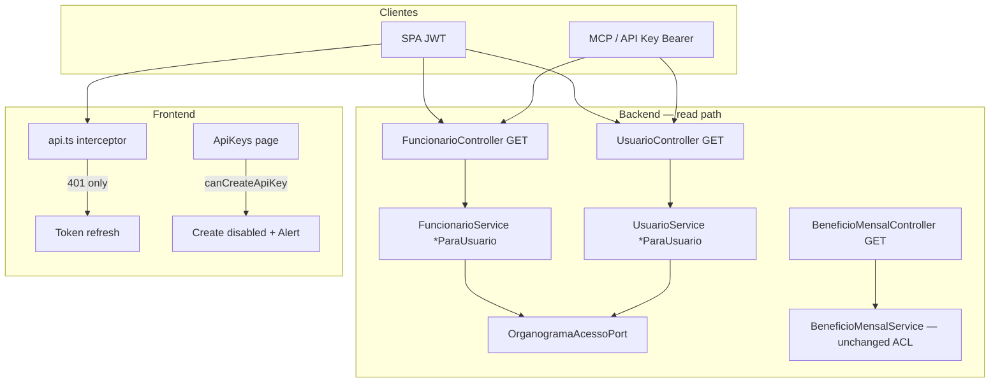

# auth-api-keys-fix2 Design

**Spec**: `_docs/specs/features/auth-api-keys-fix2/spec.md`  
**Context**: `_docs/specs/features/auth-api-keys-fix2/context.md` (OQ-1/OQ-2 locked)  
**Parent**: `auth-api-keys` MVP + fix1 Verified  
**Status**: Approved 2026-07-30 — pronto para Tasks

**Constraints:** AD-008 (ports cross-domain); AD-011 (`ACESSO_TOTAL` ≠ `ADMIN`); AD-014 (API Key read-only); FIX2-CTX-01…05

---

## Architecture Overview

Fix2 é um **incremento brownfield** em três frentes paralelas (BE ACL cadastro, BE validação HTTP, FE interceptor + UX). Sem migration, sem novos endpoints, sem alterar write-guard ou gate `API_KEY` no create.



**Invariantes:** JWT e Bearer API Key do mesmo login passam pelo mesmo `*ParaUsuario(login)`; mutações cadastro/auth inalteradas; folha/benefícios ACL existente intacto.

---

## Code Reuse Analysis

### Existing Components to Leverage

| Component | Location | How to Use (fix2) |
| --------- | -------- | ------------------- |
| `BeneficioMensalService` | `beneficios/application/` | Template `obterContextoAcesso`, `acessoNegado`, `centrosVazios`, `aplicarFiltroAcesso(Funcionario)` |
| `FolhaPagamentoService` | `folha/application/` | Padrão `consultar*ParaUsuario(login)` + CC fora escopo → vazio/404 |
| `CentroCustoEfetivo` | `shared/access/` | `pertenceAoEscopo` para funcionário CC |
| `OrganogramaAcessoPort` | `organograma/acesso/port/` | Único contrato ACL cross-domain |
| `UsuarioLookupPort` | `auth/port/` | Resolver login → `usuarioId` |
| `ApiKeyAclWebMvcTest` | `folha/api/` | Template paridade JWT vs Bearer `sf_live_*` |
| `GlobalExceptionHandler` | `exception/` | Estender com `MissingServletRequestParameterException` → 400 |
| `api.test.ts` | `frontend/src/services/` | Estender asserts 401 vs 403 |
| `ApiKeyRoute.test.tsx` | `frontend/src/routes/` | Padrão mock `useAuth` para `ApiKeys` tests |
| `permissions.ts` | `frontend/src/utils/` | Adicionar `canCreateApiKey` |

### Integration Points

| System | Integration Method |
| ------ | ------------------ |
| PostgreSQL | Sem DDL; queries JPA estendidas ou pós-filtro em memória |
| Spring Security | `Authentication.getName()` nos controllers GET; API Key já autentica como login do dono |
| ArchUnit | `cadastros.application` / `auth.application` → `OrganogramaAcessoPort` (mesmo padrão folha/benefícios) |

---

## Components

### 1. `FuncionarioService` — ACL read path

- **Purpose**: Filtrar listagens/consultas GET por escopo organograma (FIX2-01…04)
- **Location**: `backend/.../cadastros/application/FuncionarioService.java`
- **New dependencies**: `OrganogramaAcessoPort`, `UsuarioLookupPort`
- **New methods**:
  - `listarParaUsuario(String login, nome, cargoId, centroCustoId, linhaNegocioId, status)`
  - `buscarPorIdParaUsuario(String login, Long id)`
- **Logic**:
  1. `contexto = organogramaAcessoPort.obterContextoAcesso(usuarioId)`
  2. Se `!temFuncionarioVinculado || !temNoOrganograma` → lista vazia / 404
  3. Se `acessoTotal` → delegar `listar` / `buscarPorId` atuais
  4. Se scoped e `centrosCustoIds` vazio → lista vazia
  5. Se `centroCustoId` query **fora** do escopo → lista vazia (FIX2 edge)
  6. Scoped list: `findByFiltros` + `stream().filter(f -> CentroCustoEfetivo.pertenceAoEscopo(f.getCentroCusto()?.getId(), centros))`
  7. Scoped get: carregar entidade; se CC null ou fora escopo → `FuncionarioNotFoundException`
- **Reuses**: `findByFiltros`, `CentroCustoEfetivo`, exceções existentes
- **Mutations**: `cadastrar/atualizar/remover` **sem** alteração (JWT admin)

### 2. `FuncionarioController` — wire Authentication

- **Purpose**: Passar login ao service nos GETs
- **Changes**:
  - `listar(..., Authentication auth)` → `funcionarioService.listarParaUsuario(auth.getName(), ...)`
  - `buscarPorId(id, Authentication auth)` → `buscarPorIdParaUsuario`
- **Reuses**: assinaturas query existentes

### 3. `UsuarioService` — ACL read path

- **Purpose**: Filtrar usuários GET por CC do funcionário vinculado (FIX2-05…08, FIX2-CTX-01)
- **Location**: `backend/.../auth/application/UsuarioService.java`
- **New dependencies**: `OrganogramaAcessoPort` (já tem `FuncionarioConsultaPort`)
- **New methods**:
  - `listarParaUsuario(String login, nome, loginFilter, funcionarioId)`
  - `buscarPorIdParaUsuario(String login, Long id)`
  - `buscarPorLoginParaUsuario(String login, String alvoLogin)`
  - `buscarPorFuncionarioParaUsuario(String login, Long funcionarioId)`
- **Logic scoped**:
  - Usuário **sem** `funcionario` → excluído da lista; get → `UsuarioNotFoundException`
  - Com funcionário: CC deve ∈ `centrosCustoIds`
  - `acessoTotal` → métodos atuais
- **Reuses**: `findByFiltros`, `UsuarioNotFoundException`

### 4. `UsuarioController` — wire Authentication (todos GET)

- **Purpose**: ACL em list, by id, by login, by funcionarioId
- **Changes**: cada `@GetMapping` recebe `Authentication` e chama `*ParaUsuario`

### 5. `GlobalExceptionHandler` — missing query param

- **Purpose**: FIX2-09/10 — `GET /beneficio-mensal` sem params → **400**, não 500
- **Change**:
  ```java
  @ExceptionHandler(MissingServletRequestParameterException.class)
  public ResponseEntity<ErrorResponse> handleMissingParam(MissingServletRequestParameterException ex) {
      return ResponseEntity.badRequest()
          .body(new ErrorResponse(400, ex.getParameterName() + ": obrigatório"));
  }
  ```
- **Note**: Handler deve registrar **antes** do `@ExceptionHandler(Exception.class)` catch-all (ordem Spring resolve por especificidade — OK)

### 6. `api.ts` — interceptor 401 vs 403

- **Purpose**: FIX2-11…13
- **Change**:
  ```typescript
  const shouldRefreshToken = (...) =>
    axiosError.response?.status === 401  // remove 403
    && originalRequest != null
    && !originalRequest._retry
    && !isRefreshRequest;
  ```
- **Test**: `api.test.ts` — mock 403 → tokens intactos, sem `auth:logout`; mock 401 → refresh path

### 7. `permissions.ts` + `ApiKeys/index.tsx`

- **Purpose**: FIX2-14/15, FIX2-CTX-02
- **New**:
  ```typescript
  export function canCreateApiKey(user: Usuario | null | undefined): boolean {
    return user?.permissoes?.includes('API_KEY') ?? false;
  }
  ```
- **UI**:
  - `const canCreate = canCreateApiKey(user)`
  - Botão “Nova API Key”: `disabled={!canCreate}`
  - Se `isAdmin(user) && !canCreate`: `Alert severity="warning"` com copy FIX2-CTX-02
  - List/revoke admin: inalterado

---

## Test Plan (design-level)

| AC | Test class / file | Strategy |
| -- | ----------------- | -------- |
| FIX2-01…04 | `FuncionarioServiceTest` + `FuncionarioAclWebMvcTest` | Mock port: scoped CC {793,825} → N items; acessoTotal → full; Bearer parity |
| FIX2-05…08 | `UsuarioServiceTest` + `UsuarioAclWebMvcTest` | Usuário sem funcionário excluído; out-of-scope → 404 |
| FIX2-09/10 | `BeneficioMensalControllerWebMvcTest` (novo ou extensão) | GET sem params → 400 |
| FIX2-11…13 | `api.test.ts` | MSW/fetch mock status codes |
| FIX2-14/15 | `ApiKeys.test.tsx` | ADMIN-only vs API_KEY user button state |

**Paridade API Key (FIX2-04/08):** reutilizar setup `ApiKeyAclWebMvcTest` — `@MockBean ApiKeyService`, Bearer header `sf_live_test`, mesmo login `@WithMockUser`.

---

## Error Handling Strategy

| Scenario | Handling | HTTP | User/agent impact |
| -------- | -------- | ---- | ----------------- |
| Scoped list, CC fora escopo (query param) | Lista vazia | 200 `[]` | Agente não infere deny |
| GET by id out of scope | `*NotFoundException` | 404 | Sem vazamento de existência |
| Scoped, sem vínculo organograma | Lista vazia | 200 `[]` | Paridade folha |
| Benefício sem params | `MissingServletRequestParameterException` | 400 | Agente corrige query |
| Create key sem `API_KEY` (SPA) | Interceptor não desloga; UI desabilitada | 403 se chamado | Sessão preservada |
| API Key POST cadastro | Write-guard existente | 403 | Sem regressão |

---

## Risks & Concerns

| Concern | Location | Impact | Mitigation |
| ------- | -------- | ------ | ---------- |
| Pós-filtro em memória (410 funcionários) | `FuncionarioService.listarParaUsuario` | Perf aceitável hoje; degradar se base crescer | fix2 usa filter stream; follow-up: query `IN :centros` se necessário |
| `UsuarioRepository.findByFiltros` sem CC no SQL | `UsuarioService` | Lista scoped carrega todos ativos then filter | Volume ~411 OK; documentar follow-up query com JOIN CC |
| ArchUnit cross-domain | `cadastros.application` | Build fail se importar infra organograma | Usar só `OrganogramaAcessoPort` |
| Catch-all `Exception` → 500 | `GlobalExceptionHandler:151` | Mascara erros de binding | Handler específico `MissingServletRequestParameterException` |
| ADMIN revoga mas não cria | `ApiKeys/index.tsx` | Confusão se só desabilitar create | Alert explícito FIX2-CTX-02; revoke habilitado |
| Regressão JWT cadastro admin | Controllers | Admin com `ACESSO_TOTAL` deve ver tudo | Teste FIX2-03/07 com `acessoTotal=true` |

---

## Tech Decisions

| Decision | Choice | Rationale |
| -------- | ------ | --------- |
| OQ-1 usuários sem funcionário | Excluir scoped | FIX2-CTX-01; menor vazamento |
| OQ-2 UX ADMIN | Botão disabled + Alert | FIX2-CTX-02; não relaxa backend |
| ACL implementation | `*ParaUsuario` nos services | Padrão BeneficioMensal/Folha; mutações intactas |
| Out-of-scope GET | 404 not 403 | Spec + brownfield cadastro |
| CC query param outside scope | 200 empty | Paridade folha centro-custo |
| Benefício 400 | Explicit exception handler | Fecha 500 observado no MCP smoke |
| FE auth errors | 401 refresh only | Semântica HTTP correta |
| Shared ACL helper class | **Não** extrair no fix2 | Duplicar 3 privates por service; YAGNI |

> Nenhum novo AD project-level — conformidade com AD-008/AD-011/AD-014.

---

## Task Phases (preview for Tasks)

| Phase | Scope | Est. tasks |
| ----- | ----- | ---------- |
| **P1-BE-ACL** | Funcionario + Usuario services/controllers + tests | T1–T4 |
| **P1-BE-HTTP** | GlobalExceptionHandler + Beneficio WebMvc | T5 |
| **P1-FE** | api.ts + api.test.ts | T6 |
| **P2-FE-UX** | permissions + ApiKeys UI + test | T7 |
| **P1-Gate** | Full gate + docs handoff | T8 |

Total ~8 tasks → **single worker batch** (≤ ~8); Execute inline sem sub-agent offer obrigatório.
