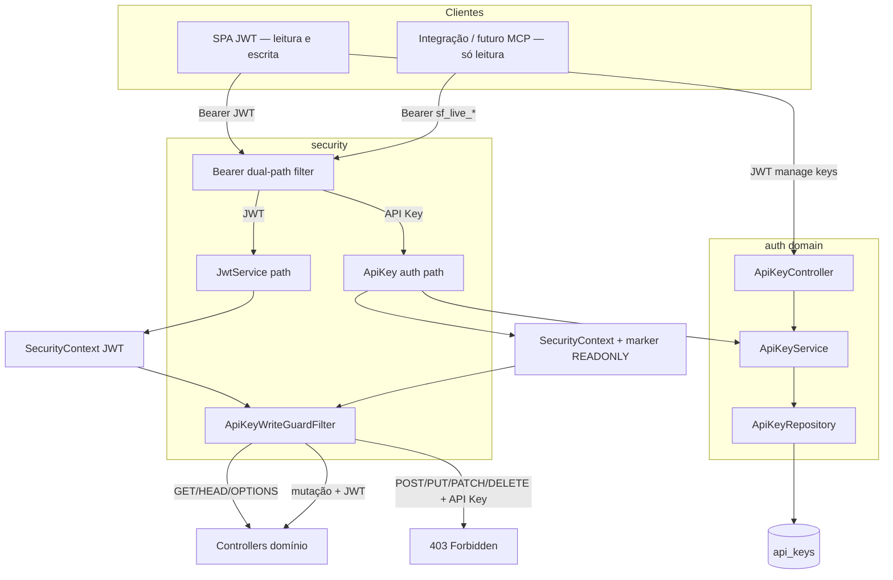

# Auth — API Keys Design

**Spec**: `_docs/specs/features/auth-api-keys/spec.md`  
**Context**: `_docs/specs/features/auth-api-keys/context.md`  
**Status**: Executed — Approach A + READ-ONLY (T1–T16, branch `feat/auth-api-keys`, 2026-07-30)  
**Constraints**: AD-001…AD-012; Approach A; **AD-014** (supersede AD-013 — API Key sempre READ-ONLY)

---

## Architecture Overview

**Approach A + read-only:** Bearer dual-path (`sf_live_*` → API Key; senão JWT); CRUD de keys no domínio `auth` via **JWT**; toda autenticação via API Key é marcada como read-only; filtro `ApiKeyWriteGuardFilter` bloqueia `POST`/`PUT`/`PATCH`/`DELETE` com **403**.



**Não muda:** matchers `hasRole("ADMIN")` para quem usa JWT; ACL organograma; `refresh_tokens`; servidor MCP.

---

## Code Reuse Analysis

### Existing Components to Leverage

| Component | Location | How to Use |
| --------- | -------- | ---------- |
| `JwtAuthenticationFilter` | `security/` | Dual-path Bearer; ao autenticar API Key, setar marker read-only |
| `JwtAuthenticationFilterTest` | `security/` | Regressão JWT + API Key + write-guard cases |
| `RefreshToken` + V1.5 | `auth` | Espelhar lifecycle; tabela nova |
| `PasswordEncoder` BCrypt | `AuthenticationConfig` | Hash do secret |
| `Usuario` / authorities | `auth/domain` | ACL leitura; gate `API_KEY` |
| `AuthController` | `auth/api` | Padrão controller |
| `GlobalExceptionHandler` | `exception/` | `ApiKeyNotFoundException` → 404 |
| FE `AdminRoute` / `isAdmin` | `routes/`, `utils/permissions.ts` | `ApiKeyRoute` + `canAccessApiKeysPage` |
| `Layout` / `Usuarios` | FE | Menu + chip `API_KEY` |

### Integration Points

| System | Integration Method |
| ------ | ------------------ |
| PostgreSQL | `V1.27__create_api_keys.sql` (+ coluna `escopo`) |
| Spring Security | Bearer filter + **write-guard** na chain após auth |
| Organograma ACL | Indireto em GETs com API Key |
| FE | `/api-keys` fora de `AdminRoute` |

---

## Components

### Flyway `api_keys`

- **Location**: `V1.27__create_api_keys.sql`
- **Schema**: como design anterior + `escopo VARCHAR(16) NOT NULL DEFAULT 'READ'`
- **Regra MVP**: create sempre grava `READ`; sem valor FULL

### `ApiKey` / `ApiKeyRepository` / DTOs / `ApiKeyService` / `ApiKeyController`

- Iguais ao design anterior para create/list/revoke/**autenticarPorChave**
- Create/list/revoke exigem caller autenticado por **JWT** na prática (write-guard bloqueia se vier API Key)
- `ApiKeyCreatedDTO` / list DTO expõem `escopo: "READ"`
- `autenticarPorChave` retorna usuário; o **filtro** adiciona o marker read-only ao `Authentication`

### Bearer dual-path filter

- **Location**: `JwtAuthenticationFilter` (estendido)
- Se `sf_live_*` válido → `SecurityContext` com `UserDetails` do dono **e** marker de API Key read-only (authority `ROLE_API_KEY_READONLY` **ou** details tipados — discretion)
- Se inválido → não autentica; não tenta JWT
- JWT path inalterado (sem marker API Key)

### `ApiKeyWriteGuardFilter` (**novo**)

- **Purpose**: Bloquear mutações quando a autenticação for via API Key.
- **Location**: `backend/.../security/ApiKeyWriteGuardFilter.java`
- **Interfaces**:
  - Após autenticação: se marker API Key presente **e** método ∈ {POST, PUT, PATCH, DELETE} → `response.sendError(403)` (ou `AccessDeniedException`) e **não** seguir a chain
  - GET/HEAD/OPTIONS → `filterChain.doFilter`
  - Sem marker (JWT/anônimo) → passa (anônimo continua 401 nos endpoints autenticados)
- **Wiring**: `SecurityConfig` — `addFilterAfter(writeGuard, JwtAuthenticationFilter.class)` (ou equivalente)
- **Dependencies**: leitura do `SecurityContext` apenas
- **Reuses**: padrão `OncePerRequestFilter`

### FE

- Página `/api-keys` com badge/texto **“Somente leitura”**
- Resto inalterado (route, menu, chip, service)

---

## Data Models

### `ApiKey`

```java
Long id;
Usuario usuario;
String nome;
String prefixo;
String hashChave;
String escopo; // sempre "READ" no MVP
LocalDateTime dataExpiracao;
boolean revogado;
LocalDateTime ultimoUsoEm;
LocalDateTime dataCriacao;
```

### Auth marker (runtime, não persistido)

```text
Authentication autenticada via API Key
  → authorities do Usuario (ROLE_ADMIN, etc. para ACL de leitura)
  → + ROLE_API_KEY_READONLY (ou ApiKeyAuthDetails.readonly=true)
```

### DTOs

Incluem `escopo: "READ"`. Create request **não** aceita escopo do cliente (ignorado/rejeitado se enviado — preferir não expor campo no request).

---

## Error Handling Strategy

| Error Scenario | Handling | User Impact |
| -------------- | -------- | ----------- |
| Sem `API_KEY` no create (JWT) | 403 | Acesso negado |
| Validação nome/dias | 400 | Erro de campo |
| Key alheia não-ADMIN | 404 | Não encontrado |
| Revoke idempotente (JWT) | 204 | Sucesso |
| API Key inválida | 401 | Não autorizado |
| **API Key + mutação HTTP** | **403** | **Somente leitura** |
| JWT + mutação | Fluxo atual | SPA ok |
| Persist create fail | Rollback; sem secret | 500 |

---

## Risks & Concerns

| Concern | Impact | Mitigation |
| ------- | ------ | ---------- |
| Filtro JWT crítico | Regressão SPA | Testes JWT + path `sf_live_` |
| Write-guard mal posicionado | Mutação vaza ou JWT bloqueado | Testes APIKEY-17/17b/17c; guard só se marker API Key |
| `POST /auth/login` público | N/A ao guard (sem auth API Key) | — |
| Multipart import via API Key | 403 | Intencional |
| Secret em log | LGPD | Nunca logar Bearer |
| `/api-keys` em AdminRoute | Não-admin bloqueado | Rota fora de AdminRoute |
| Prompt injection no MCP futuro | Agente força tool de escrita | Key read-only no backend; tools MCP só GET (feature MCP) |

---

## Tech Decisions

| Decision | Choice | Rationale |
| -------- | ------ | --------- |
| Abordagem | A + write-guard | Confirmada; C supersedida |
| Escopo MVP | Sempre READ; sem FULL | Mitigar agente/prompt injection |
| Enforcement | Filtro HTTP method + marker auth | Um ponto; cobre todos os controllers |
| Revoke/create keys | Só efetivo com JWT | API Key não gerencia a si (403) |
| Coluna `escopo` | `READ` default | Forward-compat |
| Project decision | **AD-014** supersede AD-013 | STATE.md |

---

## Requirement → Component Map

| ID | Component(s) |
| -- | ------------ |
| APIKEY-01..04 | Service criar, Controller, Flyway, DTOs |
| APIKEY-05..08 | Bearer filter + `autenticarPorChave` + testes |
| APIKEY-09..11, 10b | list/revoke + write-guard em DELETE |
| APIKEY-12..14 | Usuarios chip |
| APIKEY-15/15b | ADMIN list/revoke JWT |
| APIKEY-16* | FE ApiKeys + badge read-only |
| APIKEY-17/17b/17c | `ApiKeyWriteGuardFilter` + testes |

---

## Next

Tasks atualizadas (T1–T16) com write-guard — aprovar e Execute.
