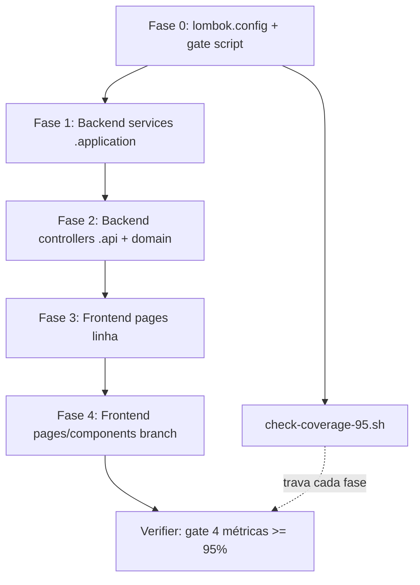

# Cobertura de Testes 95% Design

**Spec**: `_docs/specs/features/cobertura-testes-95/spec.md`
**Status**: Draft

---

## Architecture Overview

Esta feature é de **teste**, não de produto: nenhum comportamento de produção muda. A "arquitetura" é a **estratégia de fechamento de gap** e o **mecanismo de gate**. A abordagem central (AD-014, confirmada) já está aplicada: `backend/lombok.config` remove código gerado do denominador. O resto é escrever/expandir testes até 95% (linha + branch, BE + FE) e travar com um gate reproduzível.

**Ordem racional:** linha antes de branch dentro de cada stack (branch reaproveita os testes de linha); backend antes de frontend (menor gap, valida o gate primeiro). Cada fase termina com o gate rodando para a métrica que ela fecha.

---

## Approach Exploration (Large/Complex)

A decisão arquitetural central — **como tratar o código gerado pelo Lombok** — já foi explorada e confirmada com o usuário na fase Design via 3 abordagens (excluir gerado / EqualsVerifier / escalonar meta). **Escolhido: excluir gerado (AD-014).** Baseline pós-decisão medida e registrada. As demais decisões (ordem de fases, formato do gate) são de implementação, detalhadas abaixo — não exigem nova rodada de exploração.

---

## Code Reuse Analysis

### Existing Components to Leverage

| Componente | Localização | Como usar |
| ---------- | ----------- | --------- |
| Padrão de teste unitário BE (Mockito) | `backend/src/test/java/**/*ServiceTest.java` (ex.: `AuthenticationServiceTest`) | Copiar o padrão `@ExtendWith(MockitoExtension.class)` + `@Mock` repos + `assertThrows` com mensagens PT para os services com gap |
| Padrão WebMvc BE (controllers) | `*ControllerWebMvcTest.java` / `*AclWebMvcTest.java` (ex.: `BeneficioMensalControllerWebMvcTest`) | Reusar para os `*.api` controllers quase sem teste (`cadastros/api`, `organograma/api`, `folha/api`) |
| Testcontainers ADP | `ImportacaoFolhaAdpIntegrationTest` (`@EnabledIf("isDockerAvailable")`) | Manter Docker-gated; cobertura N/A quando Docker down (A8) |
| Padrão de teste FE de página | `frontend/src/pages/**/*.test.tsx` (todas as 15 páginas já têm arquivo) | **Expandir** os arquivos existentes — nenhum from-scratch |
| MSW por arquivo | `frontend/src/test/mswServer.ts` + `handlers/authHandlers.ts` | Reusar `createAuthMswServer()` para novos cenários de erro/estado |
| Testing Library helpers | `frontend/src/test/testProviders.tsx` | Reusar wrapper de providers nos novos casos |
| Gate JaCoCo existente | `diversos/scripts/check-jacoco-thresholds.sh` (75%) | **Substituir** por `check-coverage-95.sh` (AD-014 supersede) |
| Parser JaCoCo | (novo, inline no gate) | XML `LINE`/`BRANCH` counters — mesmo padrão que usei para medir a baseline |

### Integration Points

| Sistema | Método de integração |
| ------- | -------------------- |
| JaCoCo XML | `backend/target/site/jacoco/jacoco.xml` — counters `LINE`/`BRANCH` no nível `report` |
| Vitest v8 | `frontend/coverage/coverage-summary.json` (adicionar reporter `json-summary`) — chave `total.lines.pct` / `total.branches.pct` |
| Sonar | `sonar-project.properties` — `@lombok.Generated` já excluído automaticamente; sem mudança de config exigida por AD-014 |
| STATE.md | AD-014 registrado; `TESTING.md` atualizado ao fim (COV success criteria) |

---

## Components

### C1 — `backend/lombok.config` (JÁ CRIADO no Design)

- **Purpose**: Anotar métodos gerados pelo Lombok com `@lombok.Generated` para JaCoCo/Sonar os ignorarem.
- **Location**: `backend/lombok.config`
- **Conteúdo**: `lombok.addLombokGeneratedAnnotation = true` + `config.stopBubbling = true`
- **Dependências**: Lombok (já no classpath), JaCoCo 0.8.12 (já configurado)
- **Reuses**: Filtragem automática de `@Generated` do JaCoCo — nenhum código novo

### C2 — `diversos/scripts/check-coverage-95.sh`

- **Purpose**: Gate único que valida as 4 métricas (BE linha/branch, FE linha/branch) contra 95% e falha o build com mensagem clara.
- **Location**: `diversos/scripts/check-coverage-95.sh`
- **Interfaces**:
  - Lê `backend/target/site/jacoco/jacoco.xml` → extrai `LINE` e `BRANCH` do `<report>`-level counter
  - Lê `frontend/coverage/coverage-summary.json` → `total.lines.pct`, `total.branches.pct`
  - `exit 0` se todas ≥ 95; `exit 1` + lista das que falharam, com valor medido
  - Flag `--threshold N` (default 95) para reuso; imprime tabela das 4 métricas sempre (COV-15)
- **Dependências**: `python3` (parse XML/JSON — já usado no projeto), relatórios já gerados
- **Reuses**: Lógica de parse que validei na medição da baseline; substitui `check-jacoco-thresholds.sh`

### C3 — Testes backend `.application` (services)

- **Purpose**: Fechar o maior gap de branch backend — lógica de negócio nos services.
- **Location**: `backend/src/test/java/br/com/techne/sistemafolha/{dominio}/application/*Test.java`
- **Alvos priorizados (por branch missed):** `folha/application` (99), `beneficios/application` (70), `cadastros/application` (50), `importacao/application` (44), `organograma/application` (30), `auth/application` (35), `dashboard/application` (12), `organograma/acesso/application` (4)
- **Dependências**: Mockito, mensagens de exceção PT existentes
- **Reuses**: Padrão `*ServiceTest` existente

### C4 — Testes backend `.api` (controllers) + `.domain` residual

- **Purpose**: Fechar controllers quase sem teste (linha) e branches de domínio escritos à mão remanescentes.
- **Location**: `backend/src/test/java/**/api/*WebMvcTest.java`, `**/domain/*Test.java`
- **Alvos:** `cadastros/api` (82 ln), `organograma/api` (64 ln), `beneficios/api` (21 ln), `folha/api` (30 ln), `auth/api` (23 ln); domínio residual (`organograma/domain` 10 br, exceções com lógica)
- **Reuses**: Padrão `*WebMvcTest` + `@WebMvcTest` slice

### C5 — Testes frontend páginas/serviços (linha)

- **Purpose**: Elevar linha/statements FE a 95%.
- **Location**: `frontend/src/pages/**/*.test.tsx`, `frontend/src/services/*.test.ts` (expandir existentes)
- **Alvos (por linha):** `Funcionarios` (35%), `Importacao` (35.67%), `Relatorios` (37.73%), `Organograma` (42.56%), `Usuarios` (44.66%), `ApiKeys` (42.22%), `Dashboard` (68.18%), `OrganogramaGrafico` (67.18%)
- **Reuses**: MSW por arquivo, Testing Library, `testProviders.tsx`

### C6 — Testes frontend branch (estados condicionais)

- **Purpose**: Elevar branch FE a 95% — estados de loading/erro/vazio, permissões, validação de formulário.
- **Location**: mesmos arquivos de C5
- **Alvos (por branch):** `Funcionarios` (5.37%), `OrganogramaGrafico` (19.44%), `Dashboard` (23.33%), `Importacao` (22.44%), `Relatorios` (30%), `Usuarios` (31.34%), `Organograma` (32.23%)
- **Reuses**: mesmos helpers de C5

---

## Data Models (if applicable)

N/A — feature de teste; nenhum modelo de dados novo. O único "contrato" novo é o formato de saída do gate (tabela de 4 métricas), documentado em C2.

---

## Error Handling Strategy

| Cenário de erro | Tratamento | Impacto |
| --------------- | ---------- | ------- |
| Relatório JaCoCo/Vitest ausente ao rodar o gate | `check-coverage-95.sh` falha com mensagem "relatório não encontrado; rode `mvn test` / `npm run test:coverage` antes" | Dev sabe o passo faltante |
| Métrica < 95% | `exit 1` + linha por métrica reprovada com valor medido (COV-14) | Build/PR barrado |
| Docker down (Testcontainers ADP) | `@EnabledIf` skipa; gate mede sem essa cobertura; N/A documentado (A8) | Suite verde sem Docker |
| Branch inatingível (guard defensivo) | Documentado em `validation.md` com justificativa (COV-09); não forçar teste artificial | Verifier aceita como N/A justificado |

---

## Risks & Concerns

| Concern | Localização | Impacto | Mitigação |
| ------- | ----------- | ------- | --------- |
| Alta complexidade ciclomática | `ImportacaoFolhaAdpService` (CC 71, `CONCERNS.md`) | Muitos branches → muitos casos de teste; fase importação será a mais longa do backend | Testes parametrizados (`@ParameterizedTest`/`@MethodSource`) por ramo; refactor fora de escopo (spec Out of Scope) |
| Páginas FE grandes | `Organograma/index.tsx` (1113 ln), `Importacao` (831), `Funcionarios` (751) | Volume alto de cenários para 95% branch | Expandir arquivo de teste existente incrementalmente; MSW por cenário |
| Teste de baixo valor forçado pela meta | DTOs/records com pouca lógica após excluir Lombok | Testes triviais inflam contagem sem valor | AD-014 já removeu o grosso (Lombok); residual é getter com lógica real — cobrir junto do service consumidor |
| Regressão futura da meta | Todo o codebase | Próximo PR pode baixar de 95% sem detecção | C2 (`check-coverage-95.sh`) — gate reproduzível; CI remoto fica para ROADMAP M3 (Out of Scope) |
| `check-jacoco-thresholds.sh` (75%) órfão | `diversos/scripts/` | Dois gates divergentes confundem | C2 substitui; atualizar referências em `TESTING.md` (success criteria) |

---

## Tech Decisions (only non-obvious ones)

| Decisão | Escolha | Racional |
| ------- | ------- | -------- |
| Excluir código gerado Lombok | `lombok.config` + `@lombok.Generated` | AD-014 (confirmado usuário); branch BE 35%→68.7% sem escrever teste de boilerplate |
| Fonte de métrica FE | `coverage-summary.json` (reporter `json-summary`) | Parse estável de `total.*.pct`; evita raspar texto do stdout do Vitest |
| Ordem linha→branch por stack | Linha primeiro | Testes de linha já cobrem muitos branches de graça; evita retrabalho |
| Gate único BE+FE | `check-coverage-95.sh` substitui `check-jacoco-thresholds.sh` | Um só gate coerente com AD-014; consolida 4 métricas |
| Testcontainers permanece opcional | `@EnabledIf` mantido | A8 — não introduzir Docker obrigatório (mudaria infra CI, fora de escopo) |

> **Project-level decision:** AD-014 já registrado em `_docs/specs/STATE.md`. A troca de gate (`check-coverage-95.sh`) e o reporter `json-summary` são feature-local (ficam nesta tabela).

---

## Phasing → Tasks (input para a fase Tasks)

| Fase | Foco | Requisitos | Componentes | Métrica alvo |
| ---- | ---- | ---------- | ----------- | ------------ |
| 0 | Infra: lombok.config (feito) + gate | COV-13/14/15 | C1, C2 | gate roda e reprova baseline |
| 1 | Backend services | COV-01/02/03, COV-07/08 | C3 | BE linha↑, branch↑ (services) |
| 2 | Backend controllers + domínio | COV-01/02, COV-07/09 | C4 | BE linha ≥ 95%, branch ≥ 95% |
| 3 | Frontend páginas (linha) | COV-04/05/06 | C5 | FE linha ≥ 95% |
| 4 | Frontend branch | COV-10/11/12 | C6 | FE branch ≥ 95% |
| V | Verifier | todos | — | 4 métricas ≥ 95%; `TESTING.md` sync |

**Estimativa de tamanho:** > 8 tasks (provavelmente ~20-30, dado o volume por pacote/página) → dispara **oferta de sub-agentes** na fase Execute (um worker por batch de ~7 tasks / fases consecutivas). A ser confirmado na fase Tasks.
