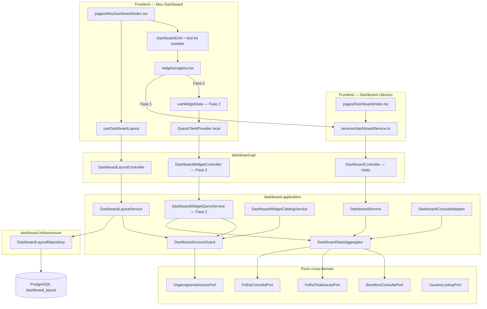

# Dashboard Customizável — Design

**Spec**: `_docs/specs/features/dashboard-customizavel/spec.md`  
**Context**: `_docs/specs/features/dashboard-customizavel/context.md`  
**Status:** Approved — tasks.md ready for Execute  
**Constraints**: AD-001…AD-016; **AD-008** (estender `dashboard.{camada}`); **AD-010** (application só via `*.port`); **AD-011** (`ACESSO_TOTAL` explícito); **AD-013** (`GET /dashboard/stats` preservado para API Key)

---

## Approach Exploration

### 1. Persistência do layout

| Approach | Descrição | Prós | Contras |
| -------- | --------- | ---- | ------- |
| **A — Tabela única + JSONB** ⭐ | `dashboard_layout.widgets JSONB`, leitura/escrita atômica do array inteiro | Absorve evolução de `config` na Fase 2 sem migration; baixa cardinalidade (~1 row/usuário); alinha AD-DC-03 | Primeiro JSONB do projeto — sem precedente local |
| **B — Normalizado** | `dashboard_layout` + `dashboard_layout_widget` | Mais “correto” relacionalmente | N+1 ou join extra; migration a cada campo novo de `config`; payload sempre lido inteiro anyway |
| **C — TEXT + JSON string** | Coluna `TEXT` com parse manual | Evita tipo JSONB | Sem validação PG; pior que JSONB em todo aspecto |

**Recomendação: Approach A.** Hibernate 6 (Spring Boot 3.2) mapeia nativamente via `@JdbcTypeCode(SqlTypes.JSON)` — **sem dependência nova**. O risco “primeiro JSONB” é mitigado com teste de integração de round-trip e AD-017 registrando o padrão.

### 2. Carregamento de dados (Fase 1 vs Fase 2)

| Approach | Descrição | Prós | Contras |
| -------- | --------- | ---- | ------- |
| **A — Monolítico → por widget** ⭐ | Fase 1: uma chamada `GET /dashboard/stats`; Fase 2: `GET /dashboard/widgets/{widgetId}/data` por widget visível | Fase 1 entrega valor rápido; Fase 2 cumpre DASHC-40; transição sem quebrar layout | Duas origens de dado no frontend (props vs react-query) — resolvido pelo registry |
| **B — Por widget desde o dia 1** | Endpoints granulares já na Fase 1 | Custo proporcional cedo | Over-engineering; 11 requests no primeiro acesso |
| **C — Monolítico para sempre** | Só `/dashboard/stats` | Simples | Falha DASHC-40; não parametriza por widget |

**Recomendação: Approach A.** Interface do registry idêntica entre fases; só muda a origem do dado (AD-DC-07).

### 3. Motor de grid

| Approach | Descrição | Prós | Contras |
| -------- | --------- | ---- | ------- |
| **A — `@dnd-kit/sortable` + CSS Grid 12 col** ⭐ | Reordenação por arraste; largura por presets `colSpan` | Zero deps novas; `KeyboardSensor` nativo; serializável | Time não tem precedente de *reordenação* com sortable (Organograma usa só `core`) |
| **B — `react-grid-layout`** | Resize livre pronto | Padrão de mercado | +40 kB; CSS imperativo; fora do ecossistema MUI |
| **C — Botões subir/descer** | Sem DnD | Trivial | Falha DASHC-07/08 (arraste + teclado) |

**Recomendação: Approach A.** PoC de reordenação com sortable na primeira task de frontend; fallback para botões só se acessibilidade falhar nos testes.

---

## Resolução das open questions (spec Assumptions)

| Item | Decisão |
| ---- | ------- |
| Rota / menu | `/meu-dashboard`, item **"Meu Dashboard"** imediatamente abaixo de "Dashboard" |
| Persistência | JSONB (Approach A) — ver AD-017 |
| Competência global | **Só sessão** (`useState` + `sessionStorage` opcional para sobreviver refresh); **não** gravada no layout |
| Override por widget | Persistido em `config.competencia` (`yyyy-MM`) no JSONB |
| Limite de widgets | **30** (`MAX_WIDGETS = 30`) |
| Widget Funcionários por Cargo | **Incluído no catálogo**, fora do layout padrão |
| Erros HTTP | **400** + `ErrorResponse` (convenção existente) |
| ACL tela nova | **403** via `DashboardAcessoNegadoException` — diverge do clássico (200 + zeros) **de propósito** |
| Notificações FE | `useNotification` + `Notification` (não `react-toastify`) |

---

## Architecture Overview

Dois sub-sistemas no domínio `dashboard` existente: **layout** (persistência por usuário) e **widget data** (Fase 2). Frontend brownfield em `pages/MeuDashboard/`, convivendo com `pages/Dashboard/` intacto salvo remoção dos chips falsos (DASHC-06).



**Fluxo Fase 1 (layout + stats monolítico):**

```text
1. GET /dashboard/layout
   → DashboardAccessGuard.assertEscopo(login) — 403 se negado
   → se ausente: cria layout padrão (11 widgets) e persiste
   → retorna DashboardLayoutDTO

2. GET /dashboard/widgets/catalog
   → catálogo filtrado por AccessContextDTO

3. PUT /dashboard/layout
   → valida widgetIds, bounds, max 30
   → substitui widgets inteiro (atômico)
   → 400 se inválido

4. Página carrega GET /dashboard/stats uma vez
   → reparte props para widgets via registry
```

**Fluxo Fase 2 (dado por widget):**

```text
1. Seletor global de competência (estado local da página)
2. Para cada widget visível:
   GET /dashboard/widgets/{widgetId}/data?competencia=&topN=&...
   → DashboardAccessGuard + validação whitelist de params
   → DashboardWidgetQueryService delega a DashboardStatsAggregator
   → widget com config.competencia ignora query param global
3. react-query cache key: [widgetId, instanceId, resolvedConfig]
```

---

## Code Reuse Analysis

### Existing Components to Leverage

| Component | Location | How to Use |
| --------- | -------- | ---------- |
| `DashboardStatsAggregator` | `dashboard/application/DashboardStatsAggregator.java` | Fonte única de agregação; Fase 2 extrai slices por widget |
| `DashboardConsultaPort` + adapter | `dashboard/port/`, `application/DashboardConsultaAdapter.java` | Competência parametrizada já implementada |
| `DashboardService.deveNegarAcesso` | `dashboard/application/DashboardService.java:105-116` | Extrair para `DashboardAccessGuard` compartilhado |
| `Dashboard/index.tsx` blocos visuais | `frontend/src/pages/Dashboard/index.tsx` | **Referência visual** para extração em `MeuDashboard/widgets/` — clássico permanece, chips falsos removidos (DASHC-06) |
| `formatMoneyDisplay` | `frontend/src/utils/money.ts` | KPIs e listas |
| `theme.palette.charts` | MUI theme tokens | Cores de gráficos consistentes |
| `useNotification` + `Notification` | `hooks/useNotification.ts`, `components/Notification/` | Erros de save e feedback |
| `lerTemaSalvo` / `gravarTema` pattern | `frontend/src/theme/storage.ts` | Modelo para `MeuDashboard/storage.ts` (cache de layout) |
| `AcessoUsuario` no AuthContext | `frontend/src/contexts/AuthContext.tsx` | Gate de menu/rota no FE (espelha `deveNegarAcesso`) |
| `RelatorioAcessoNegadoException` pattern | `relatorios/domain/` + `GlobalExceptionHandler` | Modelo para `DashboardAcessoNegadoException` → 403 |
| `ModularArchitectureTest` | `arch/ModularArchitectureTest.java` | Novo `dashboard.infrastructure` permitido no mesmo domínio |
| `@dnd-kit` sensors | `Organograma/index.tsx:1090-1097` | Reutilizar padrão `PointerSensor` + `KeyboardSensor` |

### Integration Points

| System | Integration Method |
| ------ | ------------------ |
| PostgreSQL | Flyway `V1.29__create_dashboard_layout.sql` |
| Spring Security | Endpoints `/dashboard/layout`, `/dashboard/widgets/**` → `authenticated()`; API Key read-only continua só em `/dashboard/stats` |
| Organograma ACL | `OrganogramaAcessoPort.obterContextoAcesso` — mesma regra de CC efetivo (A2) |
| Auth FE | `acessoUsuario` persistido no login → helper `podeAcessarMeuDashboard()` |
| `workspace-usuario` (futuro) | Reutiliza `WidgetDefinition`, layout JSONB e catálogo — **não duplicar** |

---

## Components

### Backend

#### `DashboardAccessGuard`

- **Purpose**: Centraliza resolução de escopo e negação de acesso; elimina duplicação entre `DashboardService`, `DashboardConsultaAdapter`, `DashboardLayoutService` e `DashboardWidgetQueryService`.
- **Location**: `dashboard/application/DashboardAccessGuard.java`
- **Interfaces**:
  - `ResolvedDashboardAccess resolve(String login)` → `{ denied, contexto, centrosScoped, usuarioId }`
  - `void assertEscopo(String login)` → lança `DashboardAcessoNegadoException` se negado
- **Reuses**: Lógica idêntica a `deveNegarAcesso` existente; **refator** de `DashboardService` e `DashboardConsultaAdapter` para delegar aqui

#### `DashboardLayoutService`

- **Purpose**: CRUD do layout por usuário; layout padrão de paridade; normalização de ordem; validação de catálogo.
- **Location**: `dashboard/application/DashboardLayoutService.java`
- **Interfaces**:
  - `DashboardLayoutDTO obterOuCriarPadrao(String login)`
  - `DashboardLayoutDTO salvar(String login, DashboardLayoutDTO dto)`
  - `void restaurarPadrao(String login)` — DELETE lógico = substitui widgets pelo default factory
- **Dependencies**: `DashboardLayoutRepository`, `DashboardWidgetCatalogService`, `DashboardAccessGuard`
- **Regras**:
  - `usuarioId` **nunca** vem do DTO — só de `resolve(login).usuarioId()`
  - Normaliza `ordem` → `0..n-1` na gravação
  - `versao_schema`: reader normaliza v1→atual em memória; regrava no próximo PUT
  - Default factory retorna os 11 widgets com `colSpan`/`rowSpan` da tabela abaixo

#### `DashboardWidgetCatalogService`

- **Purpose**: Catálogo server-side filtrado por ACL (DASHC-14/15).
- **Location**: `dashboard/application/DashboardWidgetCatalogService.java`
- **Interfaces**:
  - `List<WidgetCatalogItemDTO> listarParaUsuario(String login)`
  - `boolean isWidgetPermitido(String login, String widgetId)`
  - `Set<String> widgetIdsValidos(String login)` — usado na validação do PUT
- **Implementation**: enum/registry estático `WidgetCatalogEntry` em `dashboard/domain/WidgetCatalog.java` — **não** tabela DB

#### `DashboardLayoutController`

- **Purpose**: Endpoints REST de layout.
- **Location**: `dashboard/api/DashboardLayoutController.java`
- **Endpoints**:

| Método | Path | Auth | Response |
| ------ | ---- | ---- | -------- |
| GET | `/dashboard/layout` | escopo OK | `DashboardLayoutDTO` |
| PUT | `/dashboard/layout` | escopo OK | `DashboardLayoutDTO` |
| DELETE | `/dashboard/layout` | escopo OK | 204 |
| GET | `/dashboard/widgets/catalog` | escopo OK | `List<WidgetCatalogItemDTO>` |

#### `DashboardWidgetQueryService` (Fase 2)

- **Purpose**: Resolve dado de um widget com params whitelist + ACL reaplicada.
- **Location**: `dashboard/application/DashboardWidgetQueryService.java`
- **Interfaces**:
  - `WidgetDataDTO consultar(String login, String widgetId, WidgetQueryParams params)`
- **Dependencies**: `DashboardStatsAggregator`, `DashboardAccessGuard`, `FolhaConsultaPort`
- **Regras**:
  - Params validados por tipo de widget — enum `WidgetQueryParam` whitelist
  - `centroCustoId` / `linhaNegocioId` devem ∈ escopo do usuário
  - Competência: resolve via `FolhaConsultaPort.findResumoPorCompetencia` ou mais recente se ausente
  - Sem dados na competência → DTO com flag `semDados=true` (FE renderiza empty state, DASHC-30)

#### `DashboardWidgetController` (Fase 2)

- **Purpose**: Endpoint único parametrizado por `widgetId`.
- **Location**: `dashboard/api/DashboardWidgetController.java`
- **Endpoint**: `GET /dashboard/widgets/{widgetId}/data` + query params tipados

#### `DashboardLayout` (entity) + repository

- **Purpose**: Persistência 1:1 usuário↔layout.
- **Location**: `dashboard/domain/DashboardLayout.java`, `dashboard/infrastructure/DashboardLayoutRepository.java`

---

### Frontend

#### `MeuDashboard/index.tsx`

- **Purpose**: Orquestra layout, modo edição, competência global (Fase 2), toolbar Salvar/Cancelar/Restaurar.
- **Location**: `frontend/src/pages/MeuDashboard/index.tsx`
- **State machine**:
  - `viewing` ↔ `editing` (dirty flag para `beforeunload`)
  - Fase 1: `useEffect` → `getDashboardStats()` once
  - Fase 2: `QueryClientProvider` **local** (só esta página — não altera `main.tsx` global)

#### `DashboardGrid.tsx`

- **Purpose**: CSS Grid 12 colunas; monta `DndContext`/`SortableContext` **somente** em `editMode`.
- **Location**: `frontend/src/pages/MeuDashboard/DashboardGrid.tsx`
- **Grid CSS**: `display: grid; gridTemplateColumns: repeat(12, 1fr); gap: theme.spacing(3)`
- **Responsivo**: `@media (max-width: md)` → todo item `gridColumn: span 12` (DASHC-12) sem alterar layout salvo

#### `WidgetFrame.tsx`

- **Purpose**: Moldura: título, drag handle (modo edição), menu largura P/M/G/Full, remover, painel config (Fase 2).
- **Presets**: P=3, M=4, G=6, Full=12

#### `widgets/registry.tsx`

- **Purpose**: `widgetId` → componente + metadados; contrato estável Fase 1↔2.

```typescript
export interface WidgetDefinition {
  id: string;
  titulo: string;
  categoria: 'KPI' | 'GRAFICO' | 'LISTA';
  colSpanPadrao: number;
  rowSpanPadrao: number;
  Component: React.ComponentType<WidgetProps>;
}

export interface WidgetProps {
  instance: WidgetInstance;
  // Fase 1 — preenchido pela página:
  stats?: DashboardStats;
  // Fase 2 — preenchido pelo widget via useWidgetData:
  data?: WidgetData;
  competenciaGlobal?: string; // yyyy-MM, sessão
  editMode: boolean;
}
```

#### `useDashboardLayout.ts`

- **Purpose**: Carrega layout + catálogo; draft local em edição; PUT explícito no Salvar.
- **Cache**: `localStorage` chave `sistema-folha:meu-dashboard-layout` — espelha padrão de `theme/storage.ts`

#### `DashboardCustomRoute` + menu gate

- **Purpose**: Protege rota; oculta item de menu se sem escopo.
- **Location**: `frontend/src/routes/DashboardCustomRoute.tsx`, helper `utils/dashboardAccess.ts`
- **Regra FE** (espelha BE):

```typescript
export function podeAcessarMeuDashboard(acesso: AcessoUsuario | null): boolean {
  if (!acesso) return false;
  if (acesso.acessoTotal) return true;
  if (acesso.motivoNegacao) return false;
  if (!acesso.temFuncionarioVinculado || !acesso.temNoOrganograma) return false;
  return acesso.centrosCustoIds.length > 0;
}
```

---

## Data Models

### Flyway `V1.29__create_dashboard_layout.sql`

```sql
CREATE TABLE IF NOT EXISTS dashboard_layout (
    id              BIGSERIAL PRIMARY KEY,
    usuario_id      BIGINT NOT NULL REFERENCES usuarios(id) ON DELETE CASCADE,
    nome            VARCHAR(100) NOT NULL DEFAULT 'Meu dashboard',
    widgets         JSONB NOT NULL DEFAULT '[]'::jsonb,
    versao_schema   INTEGER NOT NULL DEFAULT 1,
    data_criacao    TIMESTAMP NOT NULL DEFAULT CURRENT_TIMESTAMP,
    data_atualizacao TIMESTAMP NOT NULL DEFAULT CURRENT_TIMESTAMP
);

CREATE UNIQUE INDEX IF NOT EXISTS idx_dashboard_layout_usuario
    ON dashboard_layout(usuario_id);
```

Sem coluna `ativo` — 1 row por usuário; reset = substituir `widgets` pelo default (mais simples que soft delete do estudo).

### Entity JPA

```java
@Entity
@Table(name = "dashboard_layout")
public class DashboardLayout {
    @Id @GeneratedValue(strategy = GenerationType.IDENTITY)
    private Long id;

    @Column(name = "usuario_id", nullable = false, unique = true)
    private Long usuarioId;

    @Column(nullable = false, length = 100)
    private String nome = "Meu dashboard";

    @JdbcTypeCode(SqlTypes.JSON)
    @Column(name = "widgets", nullable = false, columnDefinition = "jsonb")
    private List<WidgetInstancePayload> widgets = List.of();

    @Column(name = "versao_schema", nullable = false)
    private Integer versaoSchema = 1;

    @Column(name = "data_criacao", nullable = false, updatable = false)
    private LocalDateTime dataCriacao;

    @Column(name = "data_atualizacao", nullable = false)
    private LocalDateTime dataAtualizacao;
    // @PrePersist / @PreUpdate — padrão Funcionario
}
```

```java
public record WidgetInstancePayload(
    String widgetId,
    String instanceId,
    Integer ordem,
    Integer colSpan,
    Integer rowSpan,
    Map<String, Object> config
) {}
```

### API DTOs

```java
public record DashboardLayoutDTO(
    Long id,
    String nome,
    @Size(max = 30) List<@Valid WidgetInstanceDTO> widgets
) {}

public record WidgetInstanceDTO(
    @NotBlank String widgetId,
    @NotBlank String instanceId,
    @NotNull @Min(0) Integer ordem,
    @NotNull @Min(1) @Max(12) Integer colSpan,
    @NotNull @Min(1) @Max(3) Integer rowSpan,
    Map<String, Object> config
) {}

public record WidgetCatalogItemDTO(
    String widgetId,
    String titulo,
    String descricao,
    String categoria,
    Integer colSpanPadrao,
    Integer rowSpanPadrao
) {}
```

### Widget catalog (12 entradas)

| widgetId | Categoria | Default layout | colSpan | rowSpan | Notas |
| -------- | --------- | -------------- | ------- | ------- | ----- |
| `kpi-total-funcionarios` | KPI | sim (ordem 0) | 3 | 1 | |
| `kpi-custo-empresa` | KPI | sim (1) | 3 | 1 | |
| `kpi-beneficios-ativos` | KPI | sim (2) | 3 | 1 | |
| `kpi-relacao-pd` | KPI | sim (3) | 3 | 1 | |
| `grafico-evolucao-mensal` | GRAFICO | sim (4) | 12 | 2 | |
| `grafico-funcionarios-por-cc` | GRAFICO | sim (5) | 3 | 2 | |
| `grafico-funcionarios-por-linha` | GRAFICO | sim (6) | 3 | 2 | |
| `grafico-custo-por-cc` | GRAFICO | sim (7) | 3 | 2 | |
| `grafico-custo-por-linha` | GRAFICO | sim (8) | 3 | 2 | |
| `lista-top-proventos` | LISTA | sim (9) | 6 | 2 | |
| `lista-top-descontos` | LISTA | sim (10) | 6 | 2 | |
| `grafico-funcionarios-por-cargo` | GRAFICO | **não** | 6 | 2 | Só catálogo; `porCargo` já calculado |

`instanceId` default: UUID curto (8 hex) gerado na factory.

### Widget `config` schema (Fase 2)

```typescript
interface WidgetConfig {
  competencia?: string;       // yyyy-MM — override persistido
  topN?: number;                // 1..50, default por tipo
  dimensao?: 'CENTRO_CUSTO' | 'LINHA_NEGOCIO' | 'CARGO';
  metrica?: 'FUNCIONARIOS' | 'CUSTO';
  tipoVisualizacao?: 'PIE' | 'BAR';
  centroCustoId?: number;       // ∈ escopo ACL
  linhaNegocioId?: number;
}
```

Defaults Fase 2 alinhados ao clássico: `topN=5` (func CC), `topN=6` (demais distribuições), `topN=5` (listas).

### Fase 2 query params → `GET /dashboard/widgets/{widgetId}/data`

| Param | Tipo | Validação |
| ----- | ---- | --------- |
| `competencia` | `yyyy-MM` | opcional; resolve resumo folha |
| `topN` | int | 1..50 |
| `dimensao` | enum | whitelist por widget |
| `metrica` | enum | whitelist por widget |
| `tipoVisualizacao` | `PIE`\|`BAR` | só widgets de distribuição |
| `centroCustoId` | long | ∈ escopo |
| `linhaNegocioId` | long | ∈ escopo |

---

## Error Handling Strategy

| Error Scenario | Handling | User Impact |
| -------------- | -------- | ----------- |
| Sem escopo de dados | `DashboardAcessoNegadoException` → 403 | Menu oculto; rota direta mostra erro; clássico continua |
| `widgetId` inválido no PUT | Bean Validation / service check → 400 `ErrorResponse` | Mensagem indicando campo; layout não muda |
| Falha rede no PUT | FE catch; permanece em editMode | Notification error; draft preservado |
| Widget data falha (Fase 2) | react-query error state | Widget isolado com “Recarregar”; demais OK |
| Competência sem folha | `semDados=true` no DTO | Empty state explícito — não zeros |
| Payload > 30 widgets | 400 | “Limite de 30 widgets atingido” |

---

## Risks & Concerns

| Concern | Location | Impact | Mitigation |
| ------- | -------- | ------ | ---------- |
| Primeiro JSONB no backend | projeto inteiro | Padrão desconhecido; serialização pode surpreender | AD-017; teste integração round-trip; `@JdbcTypeCode(SqlTypes.JSON)` documentado |
| `deveNegarAcesso` duplicado | `DashboardService.java:105`, `DashboardConsultaAdapter.java:62` | Drift entre clássico e custom | Extrair `DashboardAccessGuard` nesta feature |
| Dashboard clássico retorna 200+zeros vs custom 403 | Comportamento intencional divergente | Confusão em suporte | Documentado; clássico **não muda**; custom é opt-in com gate |
| `@dnd-kit/sortable` sem precedente de reordenação | FE novo | Curva de aprendizado; bugs a11y | PoC na 1ª task FE; testes teclado DASHC-08; KeyboardSensor |
| 603 linhas monolíticas | `Dashboard/index.tsx` | Regressão visual na extração | Extração mecânica widget a widget; snapshot tests; clássico só perde chips falsos |
| N+1 queries Fase 2 (até 30 widgets) | FE+BE | Latência | react-query cache 5min; batch endpoint só se medição falhar (Out of Scope) |
| Chips falsos no clássico | `Dashboard/index.tsx:199,227,255` | DASHC-06 exige remoção global | Quick edit no clássico na mesma entrega FE |
| `react-query` ocioso | `package.json` | Provider mal configurado | Provider **local** em `MeuDashboard` — escopo mínimo |
| ArchUnit novo pacote `infrastructure` | `dashboard/` | Violation se cross-infra | Entity+repo no domínio dashboard; application usa repo do mesmo domínio (permitido AD-010) |
| API Key chama `/dashboard/stats` | AD-013 | Não quebrar integradores | Endpoint intacto; `@Deprecated` JavaDoc apenas |

---

## Tech Decisions

| Decision | Choice | Rationale |
| -------- | ------ | --------- |
| Persistência layout | JSONB tabela única | Approach A; evolução de `config` sem migration |
| ACL tela nova | 403 explícito | Spec/context: sem escopo = sem tela; diferente do clássico |
| Dado Fase 1 | `GET /dashboard/stats` único | Paridade rápida; zero rework no aggregator |
| Dado Fase 2 | `GET /dashboard/widgets/{id}/data` | DASHC-40; params whitelist |
| Competência global | Sessão only | Exploratório; override por widget persistido |
| Grid | dnd-kit sortable + CSS Grid 12 | AD-DC-01; zero deps |
| Catálogo | Enum Java + filtro ACL | AD-DC-04; não hardcoded no FE |
| Rota FE | `/meu-dashboard` | Nome user-facing; evita `-v2` |
| QueryClient | Provider local na página | AD-004 brownfield; não polui bootstrap global |
| Limite widgets | 30 | Guard-rail payload + requests |
| Widget por cargo | Catálogo only | Custo BE zero; enriquece “adicionar widget” |

> **Project-level:** AD-017 (JSONB) registrado em `STATE.md`.

---

## Faseamento de entrega (referência para Tasks)

| Fase | Backend | Frontend | Reqs |
| ---- | ------- | -------- | ---- |
| **1a** | V1.29, entity, repo, guard, layout service, layout+catalog controllers, testes ACL/validação | — | DASHC-19…27 parcial |
| **1b** | Default factory + testes paridade | Extração widgets, registry, página shell | DASHC-01…06 |
| **1c** | — | Grid DnD, catálogo drawer, edit mode, save/cancel/reset, menu+rota | DASHC-07…18, 03…05 |
| **1d** | — | Remover chips falsos (clássico+novo), E2E persistência | DASHC-06, 20 |
| **2a** | WidgetQueryService, widget controller, competência, testes ACL por endpoint | — | DASHC-40…44, 28…31 |
| **2b** | — | react-query, seletor competência, config panel, multi-instance | DASHC-29…39, 32…38 |

---

## Requirement Traceability (Design)

Todos os 44 requisitos `DASHC-01…44` mapeiam para componentes acima. Status atualizado para **In Design** em `spec.md` na aprovação deste documento.
