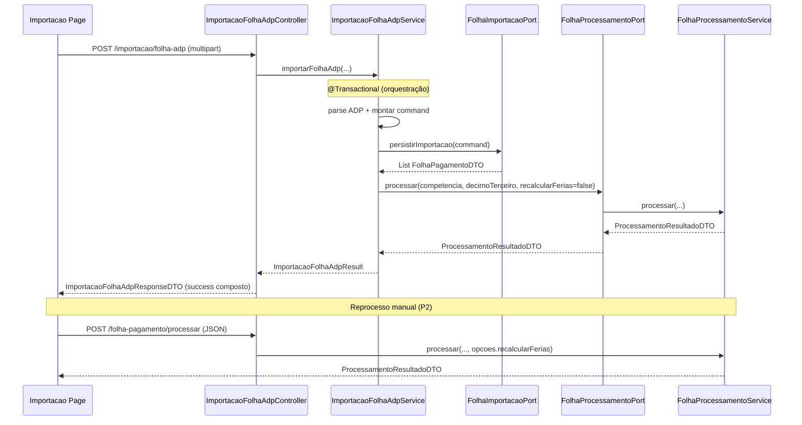

# folha-custo-clt-fix1 Design

**Spec**: `_docs/specs/features/folha-custo-clt-fix1/spec.md`  
**Context**: `_docs/specs/features/folha-custo-clt-fix1/context.md`  
**Status**: Draft — aguardando aprovação antes de Tasks/Execute

---

## Architecture Overview

Encadear **importação ADP → materialização de ficha** numa única operação transacional, respeitando AD-010 (cross-domain só via `*.port`). O orquestrador permanece em `importacao.application`; o domínio Folha expõe **`FolhaProcessamentoPort`** espelhando o padrão de `FolhaImportacaoPort`. A UI em `/importacao` reflete o pipeline completo no upload ADP e ganha seção de **reprocessamento manual** que reutiliza `POST /folha-pagamento/processar` inalterado.

Complexidade **Medium** — sem exploração de abordagens alternativas; uma única arquitetura alinhada ao modular-monolith existente.



**Transação (FIX1-CTX-02):** `ImportacaoFolhaAdpService.importarFolhaAdp` mantém `@Transactional`. `FolhaImportacaoAdapter.persistirImportacao` e `FolhaProcessamentoAdapter.processar` usam `@Transactional` com propagação **REQUIRED** (default) — join na mesma TX JVM. Falha em qualquer passo após início da persistência → rollback de importação **e** ficha.

**Ordem obrigatória:** parse → `persistirImportacao` → `FolhaProcessamentoPort.processar` com **mesma** `competenciaInicio`, `competenciaFim`, `decimoTerceiro` da importação e `recalcularFerias=false` (FIX1-CTX-04).

---

## Code Reuse Analysis

### Existing Components to Leverage

| Component | Location | How to Use |
| --------- | -------- | ---------- |
| `FolhaImportacaoPort` + adapter | `folha/port/FolhaImportacaoPort.java`, `folha/application/FolhaImportacaoAdapter.java` | Padrão a espelhar para `FolhaProcessamentoPort` |
| `FolhaProcessamentoService` | `folha/application/FolhaProcessamentoService.java` | Motor de materialização; delegado pelo novo adapter |
| `ProcessamentoResultadoDTO` | `folha/api/ProcessamentoResultadoDTO.java` | Retorno da port e do endpoint manual |
| `ProcessamentoRequestDTO` / `ProcessamentoOpcoes` | `folha/api/` | Contrato do reprocesso manual (sem alteração) |
| `FolhaProcessamentoController` | `folha/api/FolhaProcessamentoController.java` | Reuso direto para FIX1-09…13 |
| `ImportacaoFolhaAdpService` | `importacao/application/ImportacaoFolhaAdpService.java` | Orquestrador — adicionar chamada pós-`persistirImportacao` |
| `ImportacaoFolhaAdpResponseDTO` | `importacao/api/ImportacaoFolhaAdpResponseDTO.java` | Estender campos de processamento (FIX1-CTX-05) |
| `Importacao` page | `frontend/src/pages/Importacao/index.tsx` | Helpers `MESES`, `competenciaParams`, `UploadState` |
| `importacaoService` | `frontend/src/services/importacaoService.ts` | Timeout 5 min já configurado |
| `folhaPagamentoService` | `frontend/src/services/folhaPagamentoService.ts` | Adicionar `processarCompetencia` |
| `SecurityConfig` | `backend/.../config/SecurityConfig.java` | `POST /folha-pagamento/processar` já exige `ADMIN` |
| `AdminRoute` | `frontend/src/routes/AdminRoute.tsx` | `/importacao` já protegida |

### Integration Points

| System | Integration Method |
| ------ | ------------------ |
| Importação ADP | `ImportacaoFolhaAdpService` injeta `FolhaProcessamentoPort`; chama após `FolhaImportacaoPort` |
| Folha (write) | `FolhaProcessamentoAdapter` delega a `FolhaProcessamentoService` (repos folha internos) |
| API manual | Frontend → `POST /folha-pagamento/processar` (contrato existente) |
| ArchUnit AD-010 | Zero imports de `folha.infrastructure` em `importacao.application` |

---

## Components

### FolhaProcessamentoPort

- **Purpose**: Contrato cross-domain para materializar ficha mensal a partir de linhas ADP já persistidas.
- **Location**: `backend/src/main/java/br/com/techne/sistemafolha/folha/port/FolhaProcessamentoPort.java`
- **Interfaces**:

```java
public interface FolhaProcessamentoPort {
    ProcessamentoResultadoDTO processar(
        LocalDate competenciaInicio,
        LocalDate competenciaFim,
        boolean decimoTerceiro,
        boolean recalcularFerias);
}
```

- **Dependencies**: Nenhuma (interface pura).
- **Reuses**: Assinatura alinhada a `FolhaProcessamentoService.processar`; `recalcularFerias` mapeia para `ProcessamentoOpcoes` no adapter.

### FolhaProcessamentoAdapter

- **Purpose**: Implementação in-process da port; ownership de TX no domínio Folha.
- **Location**: `backend/src/main/java/br/com/techne/sistemafolha/folha/application/FolhaProcessamentoAdapter.java`
- **Interfaces**:
  - `processar(...)` — delega a `FolhaProcessamentoService.processar(..., new ProcessamentoOpcoes(recalcularFerias))`
- **Dependencies**: `FolhaProcessamentoService` (same domain).
- **Reuses**: Padrão `FolhaImportacaoAdapter` (`@Service`, `@RequiredArgsConstructor`, `@Transactional` no método da port).

### ImportacaoFolhaAdpService (evoluído)

- **Purpose**: Orquestrar parse ADP → persistência → processamento numa TX; garantir FIX1-01…05.
- **Location**: `importacao/application/ImportacaoFolhaAdpService.java`
- **Interfaces**:
  - `ImportacaoFolhaAdpResult importarFolhaAdp(MultipartFile, Boolean decimoTerceiro, Boolean confirmarSubstituicao)` — **retorno alterado** (ver Data Models)
  - Fluxo interno inalterado até `folhaImportacaoPort.persistirImportacao(command)`; em seguida invoca `folhaProcessamentoPort.processar(dataInicio, dataFim, isDecimoTerceiro, false)`
  - Se import falhar antes de persistir → port de processamento **não** é chamada (FIX1-04)
- **Dependencies**: `CadastrosImportLookupPort`, `FolhaConsultaPort`, `FolhaImportacaoPort`, **`FolhaProcessamentoPort`** (nova).
- **Reuses**: Parse, conflito 409, substituição confirmada — sem refactor de LOC.

### ImportacaoFolhaAdpResult (novo)

- **Purpose**: Resultado interno do service com stats de importação e processamento.
- **Location**: `importacao/application/ImportacaoFolhaAdpResult.java` (record package-private ou public no mesmo pacote)
- **Interfaces**:

```java
public record ImportacaoFolhaAdpResult(
    List<FolhaPagamentoDTO> folhasPagamento,
    ProcessamentoResultadoDTO processamento
) {}
```

### ImportacaoFolhaAdpController (evoluído)

- **Purpose**: Mapear resultado composto para response HTTP; mensagens FIX1-02/03.
- **Location**: `importacao/api/ImportacaoFolhaAdpController.java`
- **Interfaces**:
  - Sucesso: `ImportacaoFolhaAdpResponseDTO.success(...)` com mensagem composta, ex.: *"Importação concluída: N registros ADP; ficha processada: X fichas, Y linhas"*
  - Falha processamento: capturar exceção propagada da TX (rollback automático) → `error("Falha no processamento da ficha: …", arquivo)` com status **500** ou **422** (preferir **500** se exceção não mapeada; manter `success=false`)
  - Falha importação (pré-processamento): comportamento atual preservado
- **Dependencies**: `ImportacaoFolhaAdpService`.
- **Reuses**: Tratamento `FolhaDuplicadaException` → 409 inalterado.

### ImportacaoFolhaAdpResponseDTO (evoluído)

- **Purpose**: Contrato HTTP estendido com stats de processamento (FIX1-CTX-05, FIX1-02).
- **Location**: `importacao/api/ImportacaoFolhaAdpResponseDTO.java`
- **Interfaces** — campos adicionais no record:

```java
Integer fichasProcessadas,   // null em conflict/error; totalFichas em success encadeado
Integer linhasProcessadas,   // idem
```

- Factory `success(...)` passa a receber `ProcessamentoResultadoDTO` ou ints derivados e compor `message`.
- **Reuses**: Campos existentes (`registrosProcessados`, `folhasPagamento`, etc.) mantidos para compatibilidade wire.

### folhaPagamentoService.processarCompetencia (novo método FE)

- **Purpose**: Cliente HTTP para reprocesso manual (FIX1-10).
- **Location**: `frontend/src/services/folhaPagamentoService.ts`
- **Interfaces**:

```typescript
processarCompetencia: async (params: {
  competenciaInicio: string;
  competenciaFim: string;
  decimoTerceiro: boolean;
  recalcularFerias: boolean;
}): Promise<{ totalFichas: number; totalLinhas: number; totalFuncionarios: number }>
```

- **Dependencies**: `api` axios instance.
- **Reuses**: POST `/folha-pagamento/processar` com body `ProcessamentoRequestDTO`.

### Importacao Page — seção upload ADP (evoluída)

- **Purpose**: Feedback FIX1-06…08 no fluxo encadeado.
- **Location**: `frontend/src/pages/Importacao/index.tsx`
- **Interfaces**:
  - Loading: texto *"Importando e processando ficha…"* (substituir *"Importando…"* no botão/state ADP)
  - Sucesso: toast usa `response.message` da API (composta) ou template local incluindo `fichasProcessadas`/`linhasProcessadas`
  - Erro FIX1-03: exibir `response.message` / axios error; **não** setar `success: true`
- **Dependencies**: `importacaoService`, tipo `ImportacaoResponse` estendido.
- **Reuses**: `UploadState`, conflict dialog 409, timeout 5 min.

### Importacao Page — seção "Processar ficha da competência" (nova)

- **Purpose**: Reprocesso manual sem reupload (FIX1-09…13, FIX1-CTX-01).
- **Location**: `frontend/src/pages/Importacao/index.tsx` — **abaixo** do card Folha ADP (novo `Card` ou bloco no mesmo card após upload).
- **Interfaces**:
  - Select mês/ano (reutilizar `MESES`, `gerarAnosDisponiveis`, `competenciaParams`)
  - Checkbox *"Marcar como folha de 13º salário"*
  - Checkbox *"Recalcular férias proporcionais"* → `opcoes.recalcularFerias=true` (FIX1-12)
  - Botão **Processar** → `folhaPagamentoService.processarCompetencia`
  - Loading / toast sucesso: *"Ficha processada: X fichas, Y linhas"* (FIX1-13)
  - Erro 403: mensagem de permissão (FIX1-11)
- **Dependencies**: `folhaPagamentoService`.
- **Reuses**: Padrão visual dos selects de benefícios mensais; `toast` existente.

---

## Data Models

### ImportacaoFolhaAdpResponseDTO (wire — estendido)

```java
public record ImportacaoFolhaAdpResponseDTO(
    boolean success,
    String message,
    String arquivo,
    Long tamanho,
    int registrosProcessados,
    List<FolhaPagamentoDTO> folhasPagamento,
    boolean conflict,
    String competenciaInicio,
    String competenciaFim,
    Boolean decimoTerceiro,
    Integer fichasProcessadas,    // NEW — nullable
    Integer linhasProcessadas     // NEW — nullable
) {}
```

**Relationships**: `registrosProcessados` = linhas ADP importadas; `fichasProcessadas`/`linhasProcessadas` espelham `ProcessamentoResultadoDTO.totalFichas`/`totalLinhas`.

### ImportacaoResponse (frontend — estendido)

```typescript
export interface ImportacaoResponse {
  success: boolean;
  message: string;
  arquivo?: string;
  tamanho?: number;
  registrosProcessados?: number;
  fichasProcessadas?: number;
  linhasProcessadas?: number;
  erros?: string[];
}
```

### ProcessamentoRequestDTO (inalterado — reprocesso manual)

```java
public record ProcessamentoRequestDTO(
    @NotNull LocalDate competenciaInicio,
    @NotNull LocalDate competenciaFim,
    boolean decimoTerceiro,
    ProcessamentoOpcoes opcoes
) {}
```

---

## Error Handling Strategy

| Error Scenario | Handling | User Impact |
| -------------- | -------- | ----------- |
| Parse/validação ADP falha antes de persistir | Exception atual; TX não commitada; processamento **não** invocado | Toast erro importação; sem menção a ficha (FIX1-04) |
| Duplicidade sem confirmação | `FolhaDuplicadaException` → 409 | Dialog substituição (existente) |
| Persistência OK, processamento falha | TX rollback; controller retorna `success=false`, mensagem prefixo *"Falha no processamento da ficha"* | Toast erro; sem estado verde parcial (FIX1-03) |
| Import encadeado OK | 200 + stats compostos | Toast sucesso composto (FIX1-06) |
| Reprocesso manual 403 | Spring Security | Toast permissão (FIX1-11) |
| Reprocesso manual 4xx/5xx | Axios error handler | Toast com `detail`/`message` RFC 7807 |
| Competência sem linhas CLT | `totalFichas=0`, `success=true` | Toast informa zeros; detalhe pode continuar sem ficha para não-CLT |

---

## Risks & Concerns

| Concern | Location | Impact | Mitigation |
| ------- | -------- | ------ | ---------- |
| God-class importação (~434 LOC) | `ImportacaoFolhaAdpService.java` | Regressão no parse | **Não** refatorar parse; adicionar só injeção da port + 5–10 linhas pós-persist; testes existentes + novos casos encadeamento |
| Operação síncrona longa | Upload ADP + processamento | Timeout cliente | Manter timeout 5 min em `importacaoService.ts`; operação continua sync (escopo) |
| TX aninhada join | Adapters + service | Rollback parcial se propagação errada | Verificar `@Transactional` REQUIRED nos adapters; teste unitário simula falha na port → `persistirImportacao` revertido (mock throws) |
| Mensagem genérica no controller | `ImportacaoFolhaAdpController.java:66-69` | FIX1-03 impreciso | Catch dedicado ou prefixo explícito para falhas pós-persistência |
| FE sem testes da página Importação | `frontend/src/pages/Importacao/` | FIX1-06…13 sem gate | Adicionar Vitest com MSW na fase Execute (testing-a11y) |
| `folhaPagamentoService` sem `processar` | `folhaPagamentoService.ts` | Duplicação de client HTTP | Um método novo no service existente; não criar service paralelo |
| Substituição competência | Import delete folha_pagamento → process delete ficha | Ordem correta se import antes process | Ordem fixa persist → process; `FolhaProcessamentoService` já faz delete-by-competência |

---

## Tech Decisions

| Decision | Choice | Rationale |
| -------- | ------ | --------- |
| Cross-domain call | `FolhaProcessamentoPort` + adapter | AD-010, FIX1-CTX-03; espelha `FolhaImportacaoPort` |
| TX orquestração | Single `@Transactional` no orquestrador | FIX1-CTX-02; rollback import se process falhar |
| `recalcularFerias` auto | `false` | FIX1-CTX-04; checkbox só no manual |
| Retorno service | `ImportacaoFolhaAdpResult` record | Separa stats import vs process sem poluir port |
| Endpoint manual | Inalterado `POST /folha-pagamento/processar` | FIX1-CTX-01/05; evita duplicar API |
| Local UI reprocesso | `/importacao` abaixo card ADP | FIX1-CTX-01 |
| Status HTTP falha process | 500 (ou 422 se exception mapeada) | `success=false` na body; UI não trata como sucesso |
| Port assinatura | `boolean recalcularFerias` vs `ProcessamentoOpcoes` | Port evita dependência de `folha.api` em consumidores futuros; adapter traduz |

> **Project-level:** Nenhuma decisão nova além de AD-010 já ativo. Padrão port confirmado; não requer AD-NNN adicional.

---

## Requirement → Component Map

| Requirement | Component(s) |
| ----------- | ------------ |
| FIX1-01 | `ImportacaoFolhaAdpService` → `FolhaProcessamentoPort` pós-persist |
| FIX1-02 | `ImportacaoFolhaAdpResponseDTO`, controller success factory |
| FIX1-03 | TX orquestrador + controller error message |
| FIX1-04 | Guard: process só após persist bem-sucedido |
| FIX1-05 | `FolhaProcessamentoService` (via port) — já materializa ficha |
| FIX1-06…08 | `Importacao/index.tsx` upload ADP |
| FIX1-09…13 | `Importacao/index.tsx` seção manual + `folhaPagamentoService.processarCompetencia` |

---

## Verification Hooks (for Tasks phase)

| Gate | Command / artefato |
| ---- | ------------------ |
| Unit import encadeamento | `mvn test -Dtest=ImportacaoFolhaAdpServiceTest` — casos: happy path chama port com competência correta; falha port não deixa persist; duplicidade confirmada encadeia |
| Unit processamento | `FolhaProcessamentoServiceTest` — regressão zero |
| ArchUnit AD-010 | `mvn test -Dtest=ModularArchitectureTest` |
| Security ADMIN | `SecurityConfigFolhaProcessamentoTest` — regressão |
| FE Importação | Vitest + MSW — toast/loading/mensagem 403 manual |

**Cross-ref Execute:** Atualizar traceability FCLT-04 em `folha-custo-clt/spec.md` (FIX1-CTX-06).
