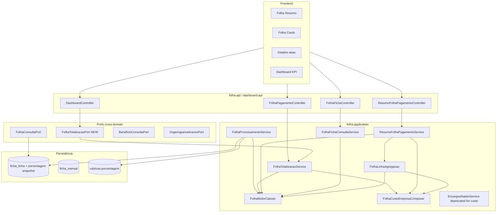

# folha-custo-clt-fix2 — Custo Techne por % de rubrica Design

**Spec**: `_docs/specs/features/folha-custo-clt-fix2/spec.md`  
**Context**: `_docs/specs/features/folha-custo-clt-fix2/context.md`  
**Status**: Approved (Tasks opened 2026-07-29)  
**Constraints**: AD-007 (ACL deny), AD-008 (`{dominio}.{camada}` + ports cross-domain), AD-010 (dashboard/importação só via `*.port`), AD-011 (`ACESSO_TOTAL` ≠ `ADMIN`), **AD-012** (custo = valor × op_custo × %/100 + benefícios; bruto/líquido sem %; sem rateio ADP)

---

## Architecture Overview

Correção **incremental** sobre o motor `folha-custo-clt`: estender `FolhaMotorCalculo` com `porcentagem` **somente no eixo custo**, persistir snapshot em `ficha_linha`, e **retirar `EncargosRateioService` da composição de `custoEmpresa`** em todos os caminhos (cards, resumo scoped/global, dashboard, detalhe). Bruto e líquido permanecem `valorOriginal × operador_*` — sem regressão RSF-01.

Paridade resumo ↔ cards (FIX2-CTX-09): global e scoped passam a agregar `totalBruto` / `totalLiquido` / `totalCustoEmpresa` como **Σ dos totais por funcionário** calculados pelo mesmo motor que alimenta `/totais-funcionarios`, nunca mapeando `resumo.totalPagamentos` → `totalBruto` quando existirem linhas operador-based.



**Pipeline revisado (competência):**

```text
Import ADP ──► folha_pagamento + resumo_folha_pagamento (total_encargos informativo)
                      │
POST /processar ◄─────┘
      │ 1. Materializar ficha_linha (ADP + CUSTO_FIXO + CALCULADO)
      │    snapshot: operadores + porcentagem da rubrica mestre
      │ 2. Motor FIX2: bruto/liquido = Σ valor×op_* ; custoFolha = Σ valor×op_custo×(%/100)
      │ 3. Persistir bruto/liquido/custo_folha em ficha_mensal
      ▼
Consulta
      │ custoEmpresa = FolhaCustoEmpresaComposer.compor(custoFolha, ZERO, custoBeneficios)
      │ encargosRateados DTO = 0.00 (deprecated)
      │ resumo totalizadores = Σ cards (mesmo motor, mesmo ACL)
      ▼
Paridade card ↔ aba Custo ↔ API ↔ resumo
```

---

## Approach Exploration (Large)

| # | Abordagem | Resumo | Prós | Contras |
| --- | --- | --- | --- | --- |
| **A (recomendada)** | **Estender motor único + snapshot `%` + remover rateio na composição** | Evoluir `FolhaMotorCalculo`, coluna `ficha_linha.porcentagem`, unificar agregação resumo via `FolhaLinhaAgregacao`/`FolhaTotalizacaoService` com encargos=0; expor `FolhaTotalizacaoPort` para dashboard (AD-010) | Menor diff; uma fonte de fórmula; reaproveita ACL dual-path e testes RSF/FCLT | `FolhaLinhaSnapshot` ganha campo; todos mappers de snapshot precisam atualização |
| B | **Motor de custo separado** | `FolhaMotorCusto` distinto de bruto/líquido | Separação conceitual | Duplica grouping, arredondamento e inputs; risco de divergência card vs resumo |
| C | **`%` live do cadastro na consulta** | Ler `Rubrica.porcentagem` em GET sem snapshot | Sem migration | Rejeitado FIX2-CTX-03; quebra auditoria histórica |

**Recomendação: A.** Entrega AD-012 com diff cirúrgico; supersede D4-CLT sem reabrir `folha-custo-clt-fix1`.

**Resumo global — sub-decisão:**

| # | Abordagem | Recomendação |
| --- | --- | --- |
| A1 | Substituir `toDtoGlobalFromFicha` (soma `ficha_mensal` + rateio) por `toDtoFromLinhas` + agregação com encargos=0 | **Sim** — mesmo caminho que scoped; garante FIX2-22…24 |
| A2 | Manter soma de `ficha_mensal` persistida | Não — diverge se `%` mudar sem reprocesso; oculta benefícios no resumo global |

---

## Code Reuse Analysis

### Existing Components to Leverage

| Component | Location | How to Use |
| --- | --- | --- |
| `FolhaMotorCalculo` | `folha/application/FolhaMotorCalculo.java` | Estender `LinhaCalculoInput` com `porcentagem`; custo aplica `%`, bruto/líquido não |
| `FolhaCustoEmpresaComposer` | `folha/application/FolhaCustoEmpresaComposer.java` | Manter assinatura; callers passam `encargosRateados = ZERO` |
| `FolhaProcessamentoService` | `folha/application/FolhaProcessamentoService.java` | Copiar `%` nos três `montarLinha*`; recalcular `custo_folha` com motor novo |
| `FolhaTotalizacaoService` | `folha/application/FolhaTotalizacaoService.java` | Remover invocação de rateio para composição; DTO `encargosRateados = 0` |
| `FolhaLinhaAgregacao` | `folha/application/FolhaLinhaAgregacao.java` | Passar encargos zerados; motor já centraliza totais resumo scoped |
| `ResumoFolhaPagamentoService` | `folha/application/ResumoFolhaPagamentoService.java` | Unificar global→linhas+agregação; eliminar fallback `totalPagamentos`→`totalBruto` quando linhas existem |
| `FolhaFichaConsultaService` | `folha/application/FolhaFichaConsultaService.java` | Detalhe Custo usa motor com `%`; Bruto/Líquido inalterados |
| `FolhaConsultaAdapter` | `folha/application/FolhaConsultaAdapter.java` | Mapear `porcentagem` snapshot (ficha) ou live (fallback ADP) em `FolhaLinhaSnapshot` |
| `EncargosRateioService` | `folha/application/EncargosRateioService.java` | **Manter classe** (testes utilitários); **não** chamar para `custoEmpresa`; `@Deprecated` no javadoc de composição |
| `FolhaAclParidadeResumoCardsTest` | `src/test/.../FolhaAclParidadeResumoCardsTest.java` | Estender scoped + **global `acessoTotal`** (FIX2-22…24) |
| `FolhaMotorCalculoTest` | idem | Caso 138,63% FIX2-03; `%` null → 100 no custo |
| `FolhaTotalizacaoServiceTest` | idem | Atualizar expectativas encargos=0; sensor rateio |
| `DashboardService` | `dashboard/application/DashboardService.java` | Delegar KPI via **`FolhaTotalizacaoPort`** (elimina loop duplicado + rateio) |
| `Rubrica` / CRUD | `cadastros/domain/Rubrica.java` | Campo `porcentagem` já existe; P2 seed FIX2-17 |
| FE `folhaPagamentoService.ts` | `frontend/src/services/` | P2: subtexto `salCustoFolha` + `salCustoBeneficios`; não exibir `encargosRateados` |

### Integration Points

| System | Integration Method |
| --- | --- |
| Import ADP | Inalterado; `total_encargos` permanece informativo no snapshot |
| Processamento pós-import (`fix1`) | Inalterado como gatilho; `fix2` altera **conteúdo** da ficha |
| Benefícios INT-1 | `BeneficioConsultaPort` inalterado na composição |
| ACL organograma | Dual-path preservado; encargos=0 em **todos** os caminhos |
| ArchUnit AD-010 | Dashboard consome **`FolhaTotalizacaoPort`** (novo), não `folha.infrastructure` |
| Flyway | `V1.22__ficha_linha_porcentagem.sql` (+ P2 seed opcional `V1.23`) |
| Spec pai | Nota superseded em `folha-custo-clt/spec.md` na Execute (não reabrir feature) |

---

## Components

### FolhaMotorCalculo (evoluído)

- **Purpose**: Fonte única de fórmulas bruto/líquido/custo e contribuição por linha.
- **Location**: `folha/application/FolhaMotorCalculo.java`
- **Interfaces**:
  - `LinhaCalculoInput(BigDecimal valor, short opBruto, short opLiquido, short opCusto, BigDecimal porcentagem)` — `porcentagem` nullable; default **100** só no eixo custo
  - `TotaisFuncionario calcularPorLinhas(List<LinhaCalculoInput>): TotaisFuncionario`
  - `BigDecimal contribuicao(LinhaCalculoInput, Totalizador): BigDecimal` — GROSS/NET: `valor×op`; COMPANY_COST: `valor×op_custo×(%/100)`
  - `BigDecimal porcentagemEfetiva(BigDecimal porcentagem): BigDecimal` — null → `100.00`
- **Dependencies**: nenhum Spring
- **Reuses**: HALF_UP scale 2 existente

### FolhaCustoEmpresaComposer (comportamento revisado)

- **Purpose**: Compor custo empresa = folha + benefícios; encargos deprecated.
- **Location**: `folha/application/FolhaCustoEmpresaComposer.java`
- **Interfaces**:
  - `compor(custoFolha, encargosRateados, custoBeneficios)` — **callers SHALL pass `ZERO` em encargosRateados**; parâmetro mantido 1 release (FIX2-CTX-01)
- **Dependencies**: `FolhaMotorCalculo.arredondar`
- **Reuses**: Assinatura existente; testes atualizados

### FolhaProcessamentoService (snapshot `%`)

- **Purpose**: Materializar `ficha_linha.porcentagem` e persistir `custo_folha` com fórmula FIX2.
- **Location**: `folha/application/FolhaProcessamentoService.java`
- **Interfaces**:
  - `processar(...)` — inalterado contrato HTTP
  - `montarLinhaAdp|CustoFixo|FeriasCalculada` — `linha.setPorcentagem(rubrica.getPorcentagem())` (nullable OK)
  - `toInput(FichaLinha)` — inclui `porcentagem` snapshot
- **Dependencies**: repositories, `CadastrosLookupPort`, motor
- **Reuses**: Padrão snapshot de operadores FCLT-07

### FolhaConsultaAdapter + FolhaLinhaSnapshot

- **Purpose**: Propagar `%` na leitura unificada de linhas.
- **Location**: `folha/port/FolhaLinhaSnapshot.java`, `folha/application/FolhaConsultaAdapter.java`
- **Interfaces**:
  - `FolhaLinhaSnapshot` + campo `BigDecimal porcentagem` (nullable)
  - `toLinhaSnapshotFromFicha` → `linha.getPorcentagem()`
  - `toLinhaSnapshotFromFolhaPagamento` → `rubrica.getPorcentagem()` (fallback pré-processamento)
- **Dependencies**: repositories ficha/folha
- **Reuses**: Preferência ficha vs ADP existente

### FolhaTotalizacaoService + FolhaTotalizacaoPort (novo)

- **Purpose**: Totais por funcionário (cards) e agregação reutilizável por dashboard/resumo.
- **Location**: `folha/application/FolhaTotalizacaoService.java`, `folha/port/FolhaTotalizacaoPort.java`, adapter fino se necessário
- **Interfaces**:
  - `List<FolhaTotaisFuncionarioDTO> calcularTotaisPorFuncionario(...)` — existente; **sem** `encargosRateioService.ratear*` para composição
  - `BigDecimal calcularTotalCustoEmpresa(List<FolhaLinhaSnapshot>, competenciaInicio, competenciaFim, AccessContextDTO)` — novo no port para dashboard FIX2-09
  - `encargosRateados` no DTO **sempre `0.00`**
- **Dependencies**: `BeneficioConsultaPort`; **remover** injeção/uso de `EncargosRateioService` na composição (manter bean para testes isolados)
- **Reuses**: Loop por funcionário existente

### ResumoFolhaPagamentoService (paridade Σ cards)

- **Purpose**: Resumo scoped e global com totalizadores = soma dos cards.
- **Location**: `folha/application/ResumoFolhaPagamentoService.java`
- **Interfaces**:
  - `toDtoGlobal` — quando fichas/linhas existem: **delegar** a `toDtoFromLinhas(..., ZERO)` em vez de `toDtoGlobalFromFicha` + rateio
  - `toDtoFromLinhas` — encargos snapshot **ignorado** na composição (`Map` zerado)
  - Fallback legado (sem linhas): **não** setar `totalBruto = totalPagamentos` se `findLinhasAtivasPorCompetencia` retornar não-vazio
  - Campos ADP `totalPagamentos`/`totalDescontos` permanecem informativos no DTO
- **Dependencies**: `FolhaConsultaPort`, `FolhaLinhaAgregacao`, `BeneficioConsultaPort`
- **Reuses**: `FolhaAclParidadeResumoCardsTest` como gate

### FolhaFichaConsultaService (detalhe)

- **Purpose**: Abas Bruto/Líquido/Custo com paridade card.
- **Location**: `folha/application/FolhaFichaConsultaService.java`
- **Interfaces**:
  - `listarLinhasPorTotalizador` — `valor` = `valorOriginal`; `contribuicao` via motor (`%` só em COMPANY_COST)
  - Benefícios na aba Custo: `contribuicao = valor` (inalterado)
  - **Não** injetar linha sintética de encargos rateados (FIX2-13)
- **Dependencies**: ACL, `BeneficioConsultaPort`, motor
- **Reuses**: `FichaLinhaDetalheDTO` existente

### DashboardService (via port)

- **Purpose**: KPI `custoMensalFolha` alinhado à composição FIX2.
- **Location**: `dashboard/application/DashboardService.java`
- **Interfaces**:
  - Substituir `calcularCustoEmpresa` inline por `folhaTotalizacaoPort.calcularTotalCustoEmpresa(...)`
  - Remover `ratearEncargos` local
- **Dependencies**: `FolhaConsultaPort`, **`FolhaTotalizacaoPort`**, `BeneficioConsultaPort`, ACL ports
- **Reuses**: AD-010 boundary

### EncargosRateioService (deprecated para composição)

- **Purpose**: Utilitário de rateio proporcional — **fora** de `custoEmpresa` pós-fix2.
- **Location**: `folha/application/EncargosRateioService.java`
- **Interfaces**: inalteradas; javadoc `@deprecated composição custoEmpresa — use % rubrica (AD-012)`
- **Dependencies**: nenhum
- **Reuses**: `EncargosRateioServiceTest` permanece para algoritmo isolado

### Frontend — card decomposição (P2)

- **Purpose**: Exibir opcionalmente folha vs benefícios no card.
- **Location**: `frontend/src/pages/FolhaPagamento/` (componente de card existente)
- **Interfaces**: render subtexto quando `salCustoFolha` / `salCustoBeneficios` presentes; ocultar `encargosRateados`
- **Dependencies**: API `/totais-funcionarios` (campos já existem no DTO)
- **Reuses**: types em `folhaPagamentoService.ts`

---

## Data Models

### Migration `ficha_linha.porcentagem`

```sql
-- V1.22__ficha_linha_porcentagem.sql
ALTER TABLE ficha_linha
  ADD COLUMN IF NOT EXISTS porcentagem NUMERIC(7, 4);

COMMENT ON COLUMN ficha_linha.porcentagem IS
  'Snapshot da rubrica.porcentagem no processamento; null tratado como 100 no custo';
```

Backfill: **não** necessário — reprocesso repopula. Linhas existentes pré-migration: leitura trata null como 100 no motor (FIX2-01).

### Entity `FichaLinha`

```java
@Column(precision = 7, scale = 4)
private BigDecimal porcentagem;  // nullable; snapshot FIX2-CTX-03
```

### Record `FolhaLinhaSnapshot`

```java
public record FolhaLinhaSnapshot(
    // ... campos existentes ...
    BigDecimal porcentagem  // nullable; ficha snapshot ou rubrica live (fallback ADP)
) {}
```

### Motor input (package-private)

```java
record LinhaCalculoInput(
    BigDecimal valor,
    short operadorBruto,
    short operadorLiquido,
    short operadorCusto,
    BigDecimal porcentagem  // nullable
) {}
```

**Relationships**: `ficha_linha.porcentagem` ← `rubricas.porcentagem` no processamento; consulta **não** relê cadastro após snapshot.

### P2 seed legado (FIX2-17)

```sql
-- V1.23__seed_rubrica_porcentagem_legado.sql (exemplo documentado)
UPDATE rubricas SET porcentagem = 138.63 WHERE codigo = '0010' AND ativo = TRUE;
-- Comentário: mapeamento mínimo homologação; demais códigos RH manual
```

---

## Error Handling Strategy

| Error Scenario | Handling | User Impact |
| --- | --- | --- |
| `porcentagem` null na linha/cadastro | Motor usa **100** no custo | Custo = valor×op_custo (comportamento atual) |
| `porcentagem = 0` | Contribuição custo 0; linha omitida na aba se op_custo≠0 mas contrib=0 | Linha invisível na aba Custo |
| `operador_custo = 0` | Linha excluída do custo mesmo com `%>0` | Sem impacto bruto/líquido |
| Competência sem ficha | Fallback ADP com `%` live da rubrica | Custo reflete cadastro atual até reprocesso |
| Alteração `%` no cadastro | Exige reprocesso para snapshot | Totais card/resumo atualizam após POST `/processar` |
| `total_encargos > 0` no snapshot ADP | Persiste; **não** compõe custo | Campo informativo no resumo import |

---

## Risks & Concerns

| Concern | Location | Impact | Mitigation |
| --- | --- | --- | --- |
| **Fórmula duplicada no dashboard** | `DashboardService.java:174-196` | KPI diverge de cards após fix2 | `FolhaTotalizacaoPort` delegando ao motor (FIX2-09) |
| **Resumo global soma ficha + rateio** | `ResumoFolhaPagamentoService.java:134-171` | ~R$ 1.860 fantasma; totalBruto≠Σ cards | Unificar via `toDtoFromLinhas` + encargos=0 (FIX2-08, FIX2-22…24) |
| **Fallback `totalPagamentos`→`totalBruto`** | `ResumoFolhaPagamentoService.java:121-131` | Resumo ≠ cards quando linhas existem | Guard: se linhas não-vazias, usar agregação operador-based (FIX2-24) |
| **`FolhaLinhaSnapshot` breaking change** | port + ~8 test files | Compilação quebra em massa | Tarefa única de migration de construtores; grep `new FolhaLinhaSnapshot` |
| **`EncargosRateioService` reintroduzido** | callers futuros | Regressão D4-CLT | Teste discrimination FIX2-10 (mock verify zero calls / encargos=0) |
| **`Double` vs `BigDecimal` em `%`** | `Rubrica.porcentagem` | Arredondamento 138,63% | Converter para `BigDecimal` no boundary; caso FIX2-03 como teste âncora |
| **Competências sem reprocesso pós-deploy** | DB existente | `ficha_linha.porcentagem` null | Motor default 100; homologação reprocessa mai/2026 antes de validar Thyago |
| **Cobertura global ACL** | `FolhaAclParidadeResumoCardsTest` | Só scoped hoje | Estender teste global `acessoTotal` FIX2-22…24 |

---

## Tech Decisions

| Decision | Choice | Rationale |
| --- | --- | --- |
| Onde aplicar `%` | Só `COMPANY_COST` no motor | FIX2-CTX-02; bruto/líquido inalterados |
| Snapshot vs live `%` | Snapshot em `ficha_linha` | FIX2-CTX-03; paridade operadores FCLT-07 |
| Encargos ADP | Fora de `custoEmpresa`; DTO `encargosRateados=0` | AD-012; compat API 1 release |
| Tipo coluna `%` | `NUMERIC(7,4)` | Precisão para 138,63 sem float drift |
| Default `%` null | 100 **apenas no custo** | FIX2-01; bruto/líquido não escalam |
| Resumo global | Mesmo agregador que scoped (linhas + motor) | FIX2-CTX-09; elimina `toDtoGlobalFromFicha` especial |
| Dashboard KPI | `FolhaTotalizacaoPort` | AD-010; remove duplicação |
| `EncargosRateioService` | Manter bean; deprecated na composição | Testes utilitários; sensor discrimination |
| Seed legado | Flyway P2 separado (FIX2-17) | Separa mecanismo de carga RH |
| FE breakdown | P2 opcional FIX2-19 | Campos API já existem |

> **Project-level:** AD-012 já registra a decisão de composição. Nenhum AD novo nesta feature — decisões locais de implementação ficam nesta tabela.

---

## Suggested Task Phases (for Tasks phase)

| Phase | Scope | Requirements |
| --- | --- | --- |
| **1 — Schema + motor** | Flyway V1.22, entity, motor, processamento, tests FIX2-01…05, FIX2-20 | MVP base |
| **2 — Remover rateio** | Composer callers, totalização, agregação, discrimination FIX2-06…10 | Elimina fantasma |
| **3 — Detalhe + consulta** | Snapshot port, ficha consulta FIX2-11…13, FIX2-21 | Auditabilidade aba |
| **4 — Resumo paridade** | Resumo global/scoped, ACL test estendido FIX2-14…16, FIX2-22…24 | Σ cards |
| **5 — Dashboard port** | `FolhaTotalizacaoPort` + DashboardService FIX2-09 | KPI alinhado |
| **6 — P2 dados + FE** | Seed V1.23, card subtexto FIX2-17…19 | Homologação Thyago |

**Gate commands:** `mvn test -Dtest=FolhaMotorCalculoTest,FolhaTotalizacaoServiceTest,FolhaAclParidadeResumoCardsTest,FolhaFichaConsultaServiceTest,ResumoFolhaPagamentoServiceTest,DashboardServiceTest,FolhaCustoEmpresaComposerTest`

**Verifier focus:** discrimination rateio (FIX2-10); paridade resumo global (FIX2-22…24); caso 138,63% (FIX2-03); bruto/líquido baseline inalterado (FIX2-02, FIX2-15).

---

## Approval

**Status: Draft** — revisar abordagem A e fases sugeridas antes de abrir `tasks.md`.
