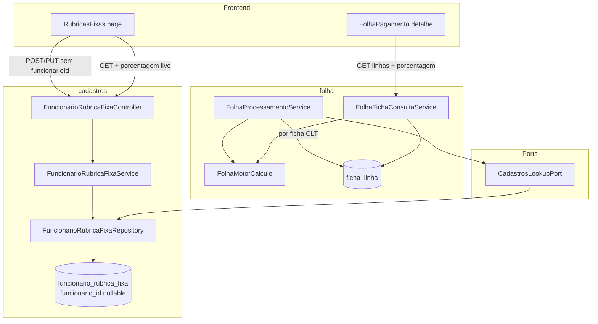

# folha-custo-clt-fix3 — Rubrica fixa global + UX detalhe Design

**Spec**: `_docs/specs/features/folha-custo-clt-fix3/spec.md`  
**Context**: `_docs/specs/features/folha-custo-clt-fix3/context.md`  
**Status**: Approved (Tasks opened 2026-07-29)  
**Constraints**: AD-007 (ACL deny), AD-008 (`{dominio}.{camada}` + ports), AD-010 (cross-domain só via `*.port`), AD-011 (`ACESSO_TOTAL` ≠ `ADMIN`), **AD-012** (custo = valor × op_custo × %/100 + benefícios; bruto/líquido sem %; paridade card ↔ aba)

---

## Architecture Overview

Evolução **incremental** em três frentes sobre `folha-custo-clt` + fix2:

1. **Backend cadastros** — `funcionario_id` nullable em `funcionario_rubrica_fixa`; CRUD aceita fixa **global**; validação de vigência bifurcada (individual vs global).
2. **Backend folha** — `FolhaProcessamentoService` aplica fixas globais vigentes a **cada** ficha CLT do loop ADP, com prioridade **individual > global > skip ADP** (FIX3-CTX-02); `FichaLinhaDetalheDTO` expõe snapshot `%`.
3. **Frontend** — Rubricas Fixas (form reorder, funcionário opcional, coluna % live); detalhe folha unifica layout Bruto/Líquido/Custo (agrupamento, %, subtotais, total = card).

Motor de cálculo (`FolhaMotorCalculo`) **não muda** — fixa global reutiliza `montarLinhaCustoFixo` existente; `%` no detalhe continua snapshot de `ficha_linha.porcentagem` (fix2).



**Pipeline processamento (fixa global):**

```text
findVigentesNaCompetencia(competência)
      │
      ├─► individuais ──► groupBy funcionario_id
      └─► globais (funcionario_id IS NULL) ──► lista única

POST /processar
  para cada funcionário CLT com linhas ADP:
    1. Materializar linhas ADP → rubricasAdp
    2. Aplicar fixas individuais vigentes → rubricasFixasAplicadas
       (skip se rubrica ∈ rubricasAdp — WARN)
    3. Aplicar fixas globais vigentes
       (skip se rubrica ∈ rubricasAdp — WARN)
       (skip se rubrica ∈ rubricasFixasAplicadas — individual vence)
    4. CALCULADO (férias) + motor AD-012
```

**Pipeline consulta detalhe (3 abas):**

```text
GET /folha-pagamento/fichas/{id}/linhas?totalizer=GROSS|NET|COMPANY_COST
  → FichaLinhaDetalheDTO { valor, porcentagem, contribuicao, origemLinha, ... }
  → FE agrupa por origemLinha (ORIGEM_LABELS)
  → subtotal origem = Σ contribuicao do grupo
  → total aba = Σ contribuicao (deve = salBruto | salLiquido | custoEmpresa do card ± R$ 0,01)
```

---

## Approach Exploration (Large)

### Fixa global no processamento

| # | Abordagem | Resumo | Prós | Contras |
| --- | --- | --- | --- | --- |
| **A (recomendada)** | **Estender loop existente** — particionar vigentes em individual/global no `FolhaProcessamentoService`; reutilizar `montarLinhaCustoFixo` | Diff mínimo; mesma materialização `CUSTO_FIXO`; testes fix2 intactos | Loop ganha ~15 linhas de prioridade | Lógica de prioridade fica no service |
| B | **Expandir `CadastrosLookupPort`** com `findIndividuais` / `findGlobais` | Separação de consulta | Mais interface + adapter + mocks | Não reduz complexidade do loop |
| C | **Expandir globais em N registros individuais no cadastro** | Pré-materializar por funcionário | — | Rejeitado: N writes, histórico confuso, fora de escopo |

**Recomendação: A.** Entrega FIX3-04…08 sem novo domínio ou port.

### Detalhe folha — layout unificado (FE)

| # | Abordagem | Recomendação |
| --- | --- | --- |
| **A1** | Extrair `renderDetalheAgrupado(totalizer, linhas, cardTotal)` — **todas** as abas usam o mesmo renderer com colunas Rubrica \| Valor \| Percentual \| Contribuição + subtotal + total | **Sim** — elimina bifurcação atual (Custo agrupado vs Bruto/Líquido flat) |
| A2 | Três componentes separados por aba | Não — duplica FIX3-17…24 |

**Recomendação: A1.**

### Percentual na listagem de fixas

| # | Abordagem | Recomendação |
| --- | --- | --- |
| **B1** | Campo `porcentagem` read-only no `FuncionarioRubricaFixaDTO` (join rubrica no `toDTO`) | **Sim** — FIX3-CTX-10; evita N+1 no FE; query já faz `JOIN FETCH rubrica` |
| B2 | FE resolve via mapa de rubricas carregado | Não — duplicidade e risco de drift |

**Recomendação: B1.**

---

## Code Reuse Analysis

### Existing Components to Leverage

| Component | Location | How to Use |
| --- | --- | --- |
| `FuncionarioRubricaFixa` entity + service | `cadastros/domain`, `cadastros/application` | Tornar `funcionario` nullable; bifurcar validação vigência |
| `FuncionarioRubricaFixaRepository.findVigentesNaCompetencia` | `cadastros/infrastructure` | Retorna individuais **e** globais; particionar no consumer |
| `FolhaProcessamentoService.montarLinhaCustoFixo` | `folha/application` | Inalterado — global usa mesmo builder |
| `FolhaMotorCalculo.contribuicao` | `folha/application` | Inalterado — `%` só afeta COMPANY_COST (AD-012) |
| `FolhaFichaConsultaService.listarLinhasPorTotalizador` | `folha/application` | Adicionar `porcentagem` ao DTO; benefício continua sem `%` |
| `ORIGEM_LABELS` + agrupamento Custo | `frontend/src/pages/FolhaPagamento/index.tsx` | Generalizar para GROSS/NET/COMPANY_COST |
| `formatMoneyDisplay` | `frontend/src/utils/money.ts` | Valor, contribuição, subtotais, total |
| `FuncionarioRubricaFixaServiceTest` / `FolhaProcessamentoServiceTest` | `backend/src/test/...` | Estender padrão Mockito existente |
| Flyway skill pattern | `V1.19`, `V1.22` | Próxima migration `V1.24__funcionario_rubrica_fixa_global.sql` |

### Integration Points

| System | Integration Method |
| --- | --- |
| `funcionario_rubrica_fixa` | `ALTER funcionario_id DROP NOT NULL`; FK opcional; índice parcial global |
| `CadastrosLookupPort` | Sem mudança de contrato — query vigentes já inclui globais |
| `FolhaProcessamentoService` | Particionar lista vigente; aplicar globais após individuais |
| `GET .../linhas` | Estender `FichaLinhaDetalheDTO` + OpenAPI implícita |
| ACL organograma | Inalterado — processamento só materializa fichas de CLT no loop ADP visível ao motor |
| Rubricas Fixas FE | Tipos + service payload com `funcionarioId` opcional |

---

## Components

### V1.24 Flyway — nullable `funcionario_id`

- **Purpose**: Persistir fixa global (`funcionario_id IS NULL`).
- **Location**: `backend/src/main/resources/db/migration/V1.24__funcionario_rubrica_fixa_global.sql`
- **Interfaces**: DDL idempotente
- **Dependencies**: `V1.19__funcionario_rubrica_fixa.sql`
- **Reuses**: Padrão Flyway do projeto (partial index `WHERE ativo = TRUE`)

**DDL proposto:**

```sql
ALTER TABLE funcionario_rubrica_fixa
    ALTER COLUMN funcionario_id DROP NOT NULL;

CREATE INDEX IF NOT EXISTS idx_funcionario_rubrica_fixa_global_vigencia
    ON funcionario_rubrica_fixa (rubrica_id, vigencia_inicio, vigencia_fim)
    WHERE ativo = TRUE AND funcionario_id IS NULL;

COMMENT ON COLUMN funcionario_rubrica_fixa.funcionario_id IS
    'NULL = fixa global (todos CLT processados na competência); NOT NULL = fixa individual';
```

Sobreposição de intervalos permanece **validação de aplicação** (como individual hoje), não UNIQUE constraint — intervalos abertos exigem lógica de overlap.

---

### `FuncionarioRubricaFixa` (entity)

- **Purpose**: Suportar vínculo opcional com funcionário.
- **Location**: `cadastros/domain/FuncionarioRubricaFixa.java`
- **Interfaces**: JPA `@JoinColumn(name = "funcionario_id", nullable = true)`
- **Dependencies**: —
- **Reuses**: Demais campos inalterados

---

### `FuncionarioRubricaFixaRepository`

- **Purpose**: Queries compatíveis com `funcionario_id` null; overlap global.
- **Location**: `cadastros/infrastructure/FuncionarioRubricaFixaRepository.java`
- **Interfaces**:
  - `findByFiltros` — trocar `JOIN FETCH f.funcionario` por **`LEFT JOIN FETCH`**
  - `existsVigenciaSobreposta(...)` — individual (comportamento atual)
  - `existsVigenciaSobrepostaGlobal(rubricaId, vigenciaInicio, vigenciaFim, excludeId)` — **novo**; filtra `funcionario IS NULL`
  - `findVigentesNaCompetencia` — **LEFT JOIN FETCH** funcionario (globais não quebram fetch)
- **Dependencies**: Entity
- **Reuses**: Predicado de overlap de intervalos existente

---

### `FuncionarioRubricaFixaDTO`

- **Purpose**: Contrato API com funcionário opcional e `%` live na listagem.
- **Location**: `cadastros/api/FuncionarioRubricaFixaDTO.java`
- **Interfaces**:

```java
public record FuncionarioRubricaFixaDTO(
    Long id,
    @Schema(description = "ID do funcionário; omitir/null = fixa global")
    Long funcionarioId,  // sem @NotNull
    @NotNull Long rubricaId,
    BigDecimal valor,
    @NotNull LocalDate vigenciaInicio,
    LocalDate vigenciaFim,
    String comentario,
    Boolean ativo,
    @Schema(readOnly = true) String funcionarioNome,  // null → FE exibe "Todos"
    @Schema(readOnly = true) String rubricaCodigo,
    @Schema(readOnly = true) String rubricaDescricao,
    @Schema(readOnly = true, description = "Live rubricas.porcentagem; default 100 se null")
    Double porcentagem
) {}
```

- **Dependencies**: Bean Validation
- **Reuses**: Record pattern existente

---

### `FuncionarioRubricaFixaService`

- **Purpose**: CRUD global + individual; validação bifurcada.
- **Location**: `cadastros/application/FuncionarioRubricaFixaService.java`
- **Interfaces**:
  - `criar(dto)` — se `funcionarioId == null`: skip lookup funcionário; `entity.setFuncionario(null)`; `validarSobreposicaoGlobal(...)`; senão fluxo atual
  - `atualizar(id, dto)` — mesma bifurcação; permitir transição individual↔global
  - `toDTO(entity)` — `funcionarioNome = entity.getFuncionario() != null ? nome : null`; `porcentagem = entity.getRubrica().getPorcentagem()`
  - `validarSobreposicaoGlobal(rubricaId, vigenciaInicio, vigenciaFim, excludeId)` — 409 via exception
- **Dependencies**: Repository, ports
- **Reuses**: `validarValor`, `validarVigencia`, `isRubricaCalculada`

---

### `FuncionarioRubricaFixaVigenciaConflictException`

- **Purpose**: Mensagens distintas para toast FE (FIX3-16).
- **Location**: `cadastros/domain/FuncionarioRubricaFixaVigenciaConflictException.java`
- **Interfaces**:
  - `forIndividual()` — mensagem atual
  - `forGlobal()` — *"Já existe rubrica fixa global ativa com vigência sobreposta para esta rubrica"*
- **Dependencies**: —
- **Reuses**: Handler 409 existente

**Nota:** `FuncionarioRubricaFixaController` hoje engole o body do 409 (`ResponseEntity.status(409).build()`). Tasks devem **propagar** a exception ao `GlobalExceptionHandler` (ou retornar `ErrorResponse`) para o FE ler `message`.

---

### `FolhaProcessamentoService` — aplicação global

- **Purpose**: Injetar fixas globais em cada ficha CLT com prioridade correta.
- **Location**: `folha/application/FolhaProcessamentoService.java`
- **Interfaces** — pseudocódigo do loop:

```java
List<FuncionarioRubricaFixa> vigentes = cadastrosLookupPort.findRubricasFixasVigentesNaCompetencia(...);

List<FuncionarioRubricaFixa> globais = vigentes.stream()
    .filter(f -> f.getFuncionario() == null).toList();

Map<Long, List<FuncionarioRubricaFixa>> individuaisPorFunc = vigentes.stream()
    .filter(f -> f.getFuncionario() != null)
    .collect(groupingBy(f -> f.getFuncionario().getId()));

// dentro do for por funcionário:
Set<Long> rubricasFixasIndividuais = new HashSet<>();
for (FuncionarioRubricaFixa fixo : individuaisPorFunc.getOrDefault(funcionario.getId(), List.of())) {
    if (rubricasAdp.contains(fixo.getRubrica().getId())) { warn dedup ADP; continue; }
    // aplicar + rubricasFixasIndividuais.add(rubricaId)
}
for (FuncionarioRubricaFixa global : globais) {
    if (rubricasAdp.contains(...)) { warn; continue; }
    if (rubricasFixasIndividuais.contains(...)) { continue; } // individual > global
    montarLinhaCustoFixo(...)
}
```

- **Dependencies**: `CadastrosLookupPort`, repositórios folha
- **Reuses**: `montarLinhaCustoFixo`, dedup ADP WARN existente

---

### `FichaLinhaDetalheDTO` + `FolhaFichaConsultaService`

- **Purpose**: Expor snapshot `%` para coluna Percentual no FE (FIX3-09…11).
- **Location**: `folha/api/FichaLinhaDetalheDTO.java`, `folha/application/FolhaFichaConsultaService.java`
- **Interfaces**:

```java
public record FichaLinhaDetalheDTO(
    BigDecimal valor,
    BigDecimal contribuicao,
    String origemLinha,
    String rubricaCodigo,
    String rubricaDescricao,
    @Schema(description = "Snapshot ficha_linha.porcentagem; null para BENEFICIO")
    BigDecimal porcentagem
) {}
```

  - Linhas ficha: `porcentagem = linha.getPorcentagem()` (pode ser null → FE trata como 100% exceto BENEFICIO)
  - Benefícios (COMPANY_COST): `porcentagem = null` — FE exibe **—**
  - `contribuicao` inalterada — GROSS/NET sem `%` (testes fix2)

- **Dependencies**: `FolhaMotorCalculo`
- **Reuses**: Filtro operador=0, sort por código

---

### Frontend — `RubricasFixas` page

- **Purpose**: UX cadastro/listagem fixa global + % live.
- **Location**: `frontend/src/pages/RubricasFixas/index.tsx`, `frontend/src/services/funcionarioRubricaFixaService.ts`
- **Interfaces**:
  - Form field order: Rubrica → Valor → Vigência Início → Vigência Fim → Funcionário (opcional) → Comentário
  - Select Funcionário: primeira opção vazia **"Todos os funcionários (mesmo valor)"**; remover `rules.required`
  - Submit: omitir `funcionarioId` quando vazio/null
  - Listagem: colunas Funcionário (**"Todos"** se null), **Percentual** (`porcentagem ?? 100` + `%`), demais inalteradas
  - 409 toast: distinguir mensagem global vs individual via `response.data.message`
- **Dependencies**: API cadastros
- **Reuses**: `formatMoneyDisplay`, React Hook Form pattern atual

**Tipos FE:**

```typescript
export interface FuncionarioRubricaFixa {
  funcionarioId?: number | null;
  porcentagem?: number | null;
  // ...
}
export interface FuncionarioRubricaFixaFormData {
  funcionarioId?: number | '';
  // ...
}
```

---

### Frontend — `FolhaPagamento` detalhe unificado

- **Purpose**: Paridade visual Bruto/Líquido/Custo (FIX3-17…24).
- **Location**: `frontend/src/pages/FolhaPagamento/index.tsx`, `frontend/src/services/folhaPagamentoService.ts`
- **Interfaces**:
  - `ORIGEM_ORDER = ['FOLHA_ADP', 'CUSTO_FIXO', 'CALCULADO', 'BENEFICIO']` — filtrar grupos vazios; BENEFICIO só em COMPANY_COST
  - `formatPercentual(p: string | number | null | undefined, origem: string): string` — null/`BENEFICIO` → **—**; else `138,63%` (pt-BR, 2 casas)
  - `renderDetalheAgrupado(totalizer, linhas, cardTotal)`:
    - agrupa por `origemLinha`
    - tabela: Rubrica | Valor | Percentual | Contribuição
    - rodapé grupo: **Subtotal** = Σ contribuições
    - rodapé aba: **Total** = Σ contribuições; exibir `formatMoneyDisplay(cardTotal)` alinhado ao card
  - `cardTotal` por aba: Bruto → `funcionarioSelecionado.salBruto`; Líquido → `salLiquido`; Custo → `custoEmpresa`
  - Empty state: Total **R$ 0,00**
- **Dependencies**: `FichaLinhaDetalhe.porcentagem` na API
- **Reuses**: `ORIGEM_LABELS`, `formatMoneyDisplay`, tabs/dialog existentes

---

## Data Models

### `funcionario_rubrica_fixa` (alteração)

| Campo | Tipo | Notas |
| --- | --- | --- |
| `funcionario_id` | BIGINT **NULL** | NULL = global |
| demais | — | inalterados |

**Relacionamentos:** global não referencia funcionário; individual mantém FK.

### `FuncionarioRubricaFixaDTO` (API)

Campos descritos acima — `funcionarioId` e `funcionarioNome` nullable; `porcentagem` read-only live.

### `FichaLinhaDetalheDTO` (API)

Campo `porcentagem` adicionado — snapshot competência, não live.

---

## Error Handling Strategy

| Error Scenario | Handling | User Impact |
| --- | --- | --- |
| POST fixa global sem valor (rubrica não calculada) | 400 `IllegalArgumentException` | Toast validação |
| Overlap vigência individual | 409 `VigenciaConflictException.forIndividual()` | Toast específico individual |
| Overlap vigência global | 409 `VigenciaConflictException.forGlobal()` | Toast específico global |
| POST com `funcionarioId` inválido | 404 FuncionarioNotFound | Toast erro |
| Processamento: rubrica ADP + fixa | WARN log; skip fixa | Sem erro UI |
| Processamento: individual + global mesma rubrica | Global silenciosamente ignorada | João individual, demais global |
| Detalhe ficha fora ACL | 404 | Mensagem existente |

---

## Risks & Concerns

| Concern | Location | Impact | Mitigation |
| --- | --- | --- | --- |
| `JOIN FETCH f.funcionario` quebra com null | `FuncionarioRubricaFixaRepository:17` | Listagem/query vigentes falha para globais | LEFT JOIN FETCH em queries afetadas |
| `toDTO` NPE em `entity.getFuncionario().getNome()` | `FuncionarioRubricaFixaService:141` | 500 ao listar global | Null-check no mapper |
| Controller 409 sem body | `FuncionarioRubricaFixaController:57` | FE não distingue conflito global vs individual | Propagar ao `GlobalExceptionHandler` ou retornar `ErrorResponse` |
| `@NotNull funcionarioId` no DTO | `FuncionarioRubricaFixaDTO:11` | 400 antes de chegar ao service | Remover constraint; validação custom |
| Loop processamento agrupa só individual | `FolhaProcessamentoService:62-65` | Globais nunca aplicadas | Particionar vigentes (design acima) |
| FE Bruto/Líquido sem agrupamento | `FolhaPagamento/index.tsx:371` | FIX3-17 não atendido | Unificar renderer (A1) |
| Soma monetária FE com `Number` | `money.ts` | Drift ±0,01 no total exibido | Somar contribuições como strings normalizadas ou helper dedicado; total **exibido** vem do card (paridade visual) |
| Testes `rubricaFixa()` helper exige funcionário | `FolhaProcessamentoServiceTest:450` | Novos testes globais | Overload helper com `funcionario=null` |
| Cobertura FE Vitest | AD-004 | Sem testes automatizados FE | Gate lint/build; ACs manuais conforme spec |

---

## Tech Decisions

| Decision | Choice | Rationale |
| --- | --- | --- |
| Representação global | `funcionario_id IS NULL` | FIX3-CTX-01; sem tabela nova |
| Prioridade conflito | ADP skip → individual → global | FIX3-CTX-02; preserva FCLT-23 |
| Overlap global | Query `existsVigenciaSobrepostaGlobal` | Mesmo padrão individual; intervalos abertos |
| % listagem fixas | Campo no DTO (join rubrica) | FIX3-CTX-10; query já fetch rubrica |
| % detalhe ficha | Snapshot em `FichaLinhaDetalheDTO` | FIX3-CTX-04; auditável fix2 |
| Layout detalhe FE | Renderer único 3 abas | FIX3-CTX-06/07; DRY |
| Migration number | `V1.24` | Próximo após `V1.23` |
| Motor cálculo | Sem alteração | AD-012 já correto |
| ACL global | Sem bypass | Universo = CLT no loop ADP; scoped igual fix2 |

> Decisões feature-local — nenhum novo AD project-level necessário (AD-012 já cobre `%`).

---

## Requirement Mapping (Design coverage)

| Req | Componente principal |
| --- | --- |
| FIX3-01 | Flyway V1.24 + entity |
| FIX3-02…03, 07 | Service + DTO + Repository overlap |
| FIX3-04…06, 08 | FolhaProcessamentoService |
| FIX3-09…11 | FichaLinhaDetalheDTO + FolhaFichaConsultaService |
| FIX3-12…16 | RubricasFixas FE + service types |
| FIX3-17…24 | FolhaPagamento `renderDetalheAgrupado` |

---

## Verification Notes (for Tasks)

**Backend gate:** `mvn test` — novos casos mínimos:

- Service: criar global null funcionario; 409 overlap global; individual inalterado
- Processamento: 2 CLT + 1 global → ambos CUSTO_FIXO; individual sobrescreve global; dedup ADP WARN
- Consulta: GROSS/NET retornam `porcentagem` snapshot; COMPANY_COST benefício `porcentagem` null

**Frontend gate:** `npm run lint && npm run build` (AD-004).

**Manual UAT:** cenário spec Independent Test P1 global + Thyago mai/2026 abas paridade.
