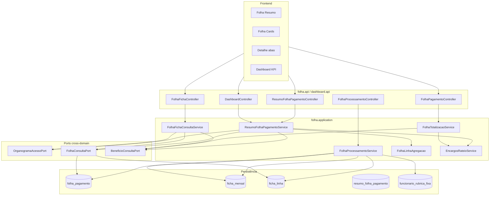

# Folha CLT — Bruto, Líquido e Custo Empresa Design

**Spec**: `_docs/specs/features/folha-custo-clt/spec.md`  
**Context**: `_docs/specs/features/folha-custo-clt/context.md`  
**Status**: Approved (Tasks opened 2026-07-28)  
**Constraints**: AD-007 (ACL deny), AD-008 (`{dominio}.{camada}` + ports cross-domain), AD-010 (dashboard/importação só via `*.port`), AD-011 (`ACESSO_TOTAL` ≠ `ADMIN`); herda RSF-01…08 / B1 de `acl-scoped-folha-resumo`

---

## Architecture Overview

Estender o monólito modular existente com **um motor de totalização operador-based**, **projeção materializada** `ficha_mensal`/`ficha_linha` pós-processamento (ARCH-1 Opção B), e **composição de custo empresa na leitura** (encargos rateados + benefícios via port). O contrato ACL dual-path de `acl-scoped-folha-resumo` permanece invariante: scoped recalcula de linhas filtradas; global usa snapshot/ficha persistida; encargos = 0 no scoped (B1).



**Pipeline de dados (competência):**

```text
Import ADP ──► folha_pagamento + resumo_folha_pagamento
                      │
POST /processar ◄─────┘
      │ 1. Copiar ADP → ficha_linha (origem=FOLHA_ADP, operadores snapshot)
      │ 2. Injetar CUSTO_FIXO (funcionario_rubrica_fixa vigente)
      │ 3. Injetar CALCULADO (férias 2,5 se opcoes.recalcularFerias)
      │ 4. Motor → persistir bruto/liquido/custoFolha em ficha_mensal
      ▼
Consulta (GET resumo / totais / fichas / dashboard)
      │ Global: ficha_mensal + encargos rateados + BeneficioConsultaPort
      │ Scoped: Σ ficha_linha filtradas × operador + benefícios scoped + 0 encargos
      ▼
DTOs com totalBruto / totalLiquido / totalCustoEmpresa (ou custoEmpresa por funcionário)
```

**Fonte de linhas na consulta (ARCH-1):** `FolhaConsultaPort` lê **`ficha_linha` quando existir ficha para a competência**; caso contrário faz fallback para `folha_pagamento` mapeado com operadores **live** da rubrica (pré-processamento). Scoped **nunca** lê totais persistidos de `ficha_mensal` sem recalcular (ACL-1).

---

## Approach Exploration (Large)

| # | Abordagem | Resumo | Prós | Contras |
| --- | --- | --- | --- | --- |
| **A (recomendada)** | **Motor único + port estendida** — evoluir `FolhaTotalizacaoService` + `FolhaLinhaAgregacao` para operadores; `FolhaConsultaPort` unifica linhas (ficha ou fallback ADP); `FolhaProcessamentoService` materializa ficha; composição custo empresa num helper `FolhaCustoEmpresaComposer` package-private | Menor diff; reaproveita ACL dual-path testado; alinha AD-008/010 | Risco de `FolhaTotalizacaoService` crescer — mitigar extraindo `EncargosRateioService` e composer | |
| B | **Serviços separados por camada de leitura** — `FolhaMotorCalculo` (puro) + `FolhaLeituraService` (ACL + composição) + `FolhaProcessamentoService` | Separação clara write/read | Mais classes/mappers; duplicação de grouping por funcionário entre motor e agregação resumo | |
| C | **Ficha-only após import** — import ADP já grava `ficha_linha`; elimina fallback `folha_pagamento` na consulta | Uma única fonte na leitura | Big-bang no import (ARCH-1 Opção A); maior risco na transição ADP | |

**Recomendação: A.** Entrega ARCH-1 Opção B (import intacto), estende padrões de `acl-scoped-folha-resumo`, e concentra fórmulas num motor reutilizado por resumo, cards, dashboard e detalhe — eliminando as 4 implementações paralelas atuais (totalização, agregação resumo, dashboard helpers, FE reduce).

---

## Code Reuse Analysis

### Existing Components to Leverage

| Component | Location | How to Use |
| --- | --- | --- |
| `ResumoFolhaPagamentoService` dual-path | `folha/application/ResumoFolhaPagamentoService.java` | Estender mapeamento DTO com 3 totalizadores; scoped continua via port + agregação |
| `FolhaLinhaAgregacao` | `folha/application/FolhaLinhaAgregacao.java` | Evoluir de PROVENTO/DESCONTO para operadores; adicionar `bruto`, `custoFolha`, hook benefícios |
| `FolhaTotalizacaoService` | `folha/application/FolhaTotalizacaoService.java` | Substituir `coeficientesDe(tipoRubrica)` por operadores snapshot/linha; adicionar encargos rateados |
| `FolhaConsultaPort` + adapter | `folha/port/`, `folha/application/FolhaConsultaAdapter.java` | Fonte única de linhas ACL; estender snapshot com operadores + `origemLinha`; preferir `ficha_linha` |
| `FolhaPagamentoService.aplicarFiltroAcesso` | `folha/application/FolhaPagamentoService.java` | Padrão ACL para totais/cards; alinhar com port (evitar divergência) |
| `BeneficioConsultaPort` | `beneficios/port/BeneficioConsultaPort.java` | INT-1 — compor `custoBeneficios` na leitura |
| `OrganogramaAcessoPort` | `organograma/acesso/port/` | Deny / `acessoTotal` / `centrosCustoIds` |
| `ImportacaoFolhaAdpService` | `importacao/application/` | Inalterado na transição; dispara reprocess opcional pós-import |
| `ResumoFolhaPagamentoServiceTest` | `src/test/.../folha/application/` | Estender RSF + FCLT-ACL-06 discrimination |
| `FolhaTotalizacaoServiceTest` | idem | FCLT-08 operadores, DESCONTO, arredondamento |
| `DashboardService` | `dashboard/application/DashboardService.java` | Trocar KPI para custo empresa via port/helper folha (AD-010) |
| `Rubrica` / `RubricaService` | `cadastros/` | Estender entity + CRUD com operadores |
| FE `FolhaPagamento/index.tsx` | `frontend/src/pages/FolhaPagamento/` | Remover reduce local; consumir totais API |

### Integration Points

| System | Integration Method |
| --- | --- |
| Import ADP | Continua gravando `folha_pagamento` + `resumo_folha_pagamento`; pós-import pode chamar processamento (sync ou manual) |
| Benefícios mensais | `BeneficioConsultaPort` na camada de composição; batch por competência+CC para resumo scoped |
| Spring Security | `Authentication.getName()` → ACL em todos controllers folha/resumo/ficha |
| ArchUnit AD-010 | Dashboard e importação não acessam `folha.infrastructure`; novos readers via port |
| OpenAPI / FE types | Regenerar ou estender types; deprecar `salCustoTechne` → `custoEmpresa` |

---

## Components

### FolhaMotorCalculo (package-private, dentro de `folha.application`)

- **Purpose**: Fórmulas puras de totalização — única fonte de verdade para bruto/líquido/custoFolha.
- **Location**: `folha/application/FolhaMotorCalculo.java`
- **Interfaces**:
  - `TotaisFuncionario calcularPorLinhas(List<LinhaCalculoInput> linhas): TotaisFuncionario` — `bruto`, `liquido`, `custoFolha` com HALF_UP scale 2
  - `LinhaContribuicao contribuicao(LinhaCalculoInput linha, Totalizador totalizer): BigDecimal` — `valor × operador`
- **Dependencies**: nenhum Spring
- **Reuses**: Extrai loop de `FolhaTotalizacaoService` (linhas 56–66)

### EncargosRateioService

- **Purpose**: Rateio D4-CLT (FCLT-13/14) — proporcional ao bruto CLT; última parcela ajusta centavos.
- **Location**: `folha/application/EncargosRateioService.java`
- **Interfaces**:
  - `Map<Long, BigDecimal> ratearPorFuncionario(List<FichaMensal> fichas, BigDecimal totalEncargosSnapshot): Map<Long, BigDecimal>`
  - `BigDecimal rateioParaFuncionario(Long funcionarioId, ...)` — wrapper
- **Dependencies**: nenhum port externo
- **Reuses**: `totalEncargos` de `ResumoFolhaPagamento`; só invocado quando `acessoTotal=true`

### FolhaCustoEmpresaComposer (package-private)

- **Purpose**: Composição na leitura (FCLT-06, INT-1, ACL-2/5).
- **Location**: `folha/application/FolhaCustoEmpresaComposer.java`
- **Interfaces**:
  - `BigDecimal compor(BigDecimal custoFolha, BigDecimal encargosRateados, BigDecimal custoBeneficios): BigDecimal`
- **Dependencies**: nenhum
- **Reuses**: Chamado por totalização, resumo scoped/global, dashboard

### FolhaTotalizacaoService (refatorado)

- **Purpose**: Totais por funcionário para cards (`GET /totais-funcionarios`).
- **Location**: `folha/application/FolhaTotalizacaoService.java`
- **Interfaces**:
  - `calcularTotaisPorFuncionario(List<FolhaLinhaSnapshot> linhas, boolean decimoTerceiro, AccessContextDTO contexto, BigDecimal totalEncargosSnapshot): List<FolhaTotaisFuncionarioDTO>`
  - Input passa a ser **`FolhaLinhaSnapshot`** (não entity), alimentado pelo port
- **Dependencies**: `BeneficioConsultaPort`, `EncargosRateioService`, `FolhaMotorCalculo`, `FolhaCustoEmpresaComposer`
- **Reuses**: Agrupamento por `funcionarioId`; benefícios por competência

### FolhaLinhaAgregacao (evoluído)

- **Purpose**: Agregar totais de competência a partir de linhas (resumo scoped + paridade cards).
- **Location**: `folha/application/FolhaLinhaAgregacao.java`
- **Interfaces**:
  - `TotaisResumo agregar(List<FolhaLinhaSnapshot> linhas, Map<Long, BigDecimal> custoBeneficiosPorFuncionario, Map<Long, BigDecimal> encargosPorFuncionario): TotaisResumo`
  - Record `TotaisResumo`: `empregados`, `totalBruto`, `totalLiquido`, `totalCustoFolha`, `totalCustoBeneficios`, `totalCustoEmpresa`, `totalEncargos` (0 scoped)
- **Dependencies**: `FolhaMotorCalculo`, `FolhaCustoEmpresaComposer`
- **Reuses**: Distinct empregados; substitui lógica PROVENTO/DESCONTO

### FolhaProcessamentoService

- **Purpose**: Materializar ficha pós-import; injetar INT-2 e CALCULADO (FCLT-04, 16, 22–23).
- **Location**: `folha/application/FolhaProcessamentoService.java`
- **Interfaces**:
  - `ProcessamentoResultado processar(LocalDate competenciaInicio, LocalDate competenciaFim, boolean decimoTerceiro, ProcessamentoOpcoes opcoes): ProcessamentoResultado`
  - Idempotente: delete+insert fichas da competência em `@Transactional`
- **Dependencies**: `FolhaPagamentoRepository`, `FichaMensalRepository`, `FichaLinhaRepository`, `FuncionarioRubricaFixaRepository`, `RubricaRepository`, `FolhaMotorCalculo`
- **Reuses**: Padrão replace-by-competência de `FolhaImportacaoAdapter`

**Regras de injeção:**
1. Copiar linhas ADP ativas → `ficha_linha` (`origemLinha=FOLHA_ADP`, operadores copiados da rubrica).
2. Para cada `funcionario_rubrica_fixa` vigente na competência → linha `CUSTO_FIXO` (dedup: se mesma rubrica já veio ADP → skip fixo, log WARN).
3. Se `opcoes.recalcularFerias` → calcular férias 2,5 → linha `CALCULADO` (rubrica cod. `5000` ou config).
4. Recalcular e persistir `ficha_mensal.bruto/liquido/custoFolha`.

### FolhaProcessamentoController

- **Purpose**: Expor processamento mensal.
- **Location**: `folha/api/FolhaProcessamentoController.java`
- **Interfaces**:
  - `POST /folha-pagamento/processar` — body: competência, `decimoTerceiro`, `opcoes.recalcularFerias`
- **Dependencies**: `FolhaProcessamentoService`, Spring Security (authenticated; mutação ADMIN ou role RH conforme padrão existente)
- **Reuses**: Padrão `FolhaPagamentoController`

### FolhaFichaConsultaService

- **Purpose**: Detalhe por totalizador com ACL (FCLT-ACL-12…15).
- **Location**: `folha/application/FolhaFichaConsultaService.java`
- **Interfaces**:
  - `List<FichaLinhaDetalheDTO> listarLinhasPorTotalizador(String login, Long fichaMensalId, Totalizador totalizer): List<...>`
  - `FichaMensalDTO obterFicha(String login, Long funcionarioId, competência...): Optional<...>`
  - Filtra `contribuicao ≠ 0`; aba COMPANY_COST inclui benefícios via port (`origem=BENEFICIO` no DTO, não persistido)
- **Dependencies**: `OrganogramaAcessoPort`, `FichaMensalRepository`, `BeneficioConsultaPort`, `FolhaMotorCalculo`
- **Reuses**: `aplicarFiltroAcesso` critério de `FolhaPagamentoService`

### FolhaFichaController

- **Purpose**: REST detalhe ficha/linhas.
- **Location**: `folha/api/FolhaFichaController.java`
- **Interfaces**:
  - `GET /folha-pagamento/fichas/{id}/linhas?totalizer=GROSS|NET|COMPANY_COST`
  - `GET /folha-pagamento/fichas?funcionarioId=&competenciaInicio=&competenciaFim=&decimoTerceiro=`
- **Dependencies**: `FolhaFichaConsultaService`

### ResumoFolhaPagamentoService (estendido)

- **Purpose**: Resumo com três totalizadores + ACL (FCLT-ACL-01…06).
- **Location**: `folha/application/ResumoFolhaPagamentoService.java`
- **Interfaces** (alterações):
  - Global (`acessoTotal`): estender `toDtoSnapshot` com `totalBruto`, `totalLiquido`, `totalCustoEmpresa` agregados de `ficha_mensal` + encargos + benefícios totais da competência
  - Scoped: `FolhaConsultaPort` → `FolhaLinhaAgregacao` com benefícios batch + encargos=0
  - Preservar A2 zeros e deny `[]`
- **Dependencies**: existentes + `BeneficioConsultaPort` (batch), `EncargosRateioService` (global only)

### FolhaConsultaPort (estendido)

- **Purpose**: Fonte única de linhas e metadados de competência.
- **Location**: `folha/port/FolhaConsultaPort.java`
- **New interfaces**:
  - `List<FolhaLinhaSnapshot> findLinhasFichaPorCompetencia(...)` — preferencial pós-processamento
  - `Optional<FolhaResumoTotaisSnapshot> findTotaisFichaGlobal(competencia, decimoTerceiro)` — soma fichas para global
  - `List<FichaMensalSnapshot> findFichasPorCompetencia(..., Set<Long> centrosCustoIds)` — cards ACL
- **Adapter**: JOIN fetch rubrica/tipo; índices em `(competencia_inicio, decimo_terceiro, funcionario_id)`

### FolhaConsultaAdapter (estendido)

- **Purpose**: Implementar dual source ficha vs folha_pagamento fallback.
- **Location**: `folha/application/FolhaConsultaAdapter.java`
- **Behavior**: Se `existsFicha(competencia)` → ler `ficha_linha`; senão mapear `folha_pagamento` com operadores live da rubrica e `origemLinha=FOLHA_ADP`.

### BeneficioConsultaPort (estendido)

- **Purpose**: Evitar N+1 no resumo scoped (concern existente).
- **Location**: `beneficios/port/BeneficioConsultaPort.java`
- **New interfaces**:
  - `Map<Long, BigDecimal> somarValorPorFuncionariosECompetencia(Set<Long> funcionarioIds, LocalDate inicio, LocalDate fim)`
  - `BigDecimal somarValorPorCompetenciaECentros(LocalDate inicio, LocalDate fim, Set<Long> centrosCustoIds)` — resumo scoped agregado
- **Adapter**: query JPQL com filtro CC join funcionário

### RubricaService + RubricaController (estendido)

- **Purpose**: CRUD operadores (FCLT-02, FCLT-03).
- **Location**: `cadastros/application/RubricaService.java`, `cadastros/api/RubricaController.java`
- **Interfaces**: validar `operador* ∈ {-1,0,1}`; DTO expõe três campos

### FuncionarioRubricaFixaService + Controller (novo)

- **Purpose**: CRUD custos fixos INT-2 (FCLT-18…21).
- **Location**: `cadastros/application/FuncionarioRubricaFixaService.java`, `cadastros/api/FuncionarioRubricaFixaController.java`
- **Interfaces**: CRUD, overlap → 409, vigência validation

### DashboardService (estendido)

- **Purpose**: KPI custo empresa real (FCLT-ACL-16…18).
- **Location**: `dashboard/application/DashboardService.java`
- **Change**: `custoMensalFolha` passa a refletir custo empresa via `FolhaConsultaPort` + composição (scoped e global); evolução mensal scoped usa custo empresa, respeita `decimoTerceiro` no snapshot de evolução
- **Dependencies**: apenas ports (AD-010)

### Frontend — FolhaPagamento

- **Purpose**: Consumir API; zero agregação local (FE-1).
- **Location**: `frontend/src/pages/FolhaPagamento/index.tsx`, `frontend/src/services/folhaPagamentoService.ts`
- **Interfaces**:
  - `buscarTotaisPorFuncionario(dataInicio, dataFim, decimoTerceiro?)`
  - Resumo: colunas Bruto, Líquido, Custo Empresa
  - Cards: três valores da API
  - Detalhe: tabs `Bruto | Líquido | Custo` com `totalizer` query param
  - Valores monetários como **string** decimal (FCLT-12)

### Frontend — Dashboard

- **Purpose**: Label "Custo Empresa"; exibir string da API.
- **Location**: `frontend/src/pages/Dashboard/index.tsx`

### Frontend — Rubricas + Rubricas Fixas

- **Purpose**: Operadores no cadastro rubrica; CRUD rubricas fixas.
- **Location**: `frontend/src/pages/Rubricas/`, nova rota `RubricasFixas/` (lazy via routing-perf target)

---

## Data Models

### Schema migrations (Flyway V1.17+)

| Migration | Conteúdo | Req |
| --- | --- | --- |
| `V1.17__rubrica_operadores.sql` | `operador_bruto`, `operador_liquido`, `operador_custo SMALLINT` + backfill from `tipo_rubrica` | FCLT-01 |
| `V1.18__ficha_mensal_linha.sql` | `ficha_mensal`, `ficha_linha`, enum `origem_linha`, operadores snapshot na linha | FCLT-04, 07 |
| `V1.19__funcionario_rubrica_fixa.sql` | tabela INT-2 + unique parcial vigência | FCLT-18 |
| `V1.20__regime_trabalho.sql` | seed CLT + FK funcionário | FCLT-15 |
| `V1.21__folha_pagamento_reconcile.sql` | Auditar/alinhar colunas `folha_pagamento` (rubrica_id, valor) se ausentes no Flyway histórico | de-risk ddl-auto |

**Índices recomendados:**
- `ficha_mensal (competencia_inicio, competencia_fim, decimo_terceiro, funcionario_id)` UNIQUE
- `ficha_linha (ficha_mensal_id)`, `(origem_linha)`
- `funcionario_rubrica_fixa (funcionario_id, rubrica_id)` WHERE ativo

### FichaMensal (entity)

```java
@Entity @Table(name = "ficha_mensal")
class FichaMensal {
  Long id;
  Funcionario funcionario;
  LocalDate competenciaInicio;
  LocalDate competenciaFim;
  boolean decimoTerceiro;
  BigDecimal bruto;      // persistido pós-processamento
  BigDecimal liquido;
  BigDecimal custoFolha;
  boolean ativo;
  // custoEmpresa NÃO persistido como canônico (INT-1)
}
```

### FichaLinha (entity)

```java
enum OrigemLinha { FOLHA_ADP, CUSTO_FIXO, CALCULADO }

@Entity @Table(name = "ficha_linha")
class FichaLinha {
  Long id;
  FichaMensal fichaMensal;
  Rubrica rubrica;
  BigDecimal valor;
  OrigemLinha origemLinha;
  short operadorBruto;    // snapshot da rubrica no processamento
  short operadorLiquido;
  short operadorCusto;
  boolean ativo;
}
```

### FuncionarioRubricaFixa (entity)

```java
@Entity @Table(name = "funcionario_rubrica_fixa")
class FuncionarioRubricaFixa {
  Long id;
  Funcionario funcionario;
  Rubrica rubrica;
  BigDecimal valor;           // nullable se rubrica calculada
  LocalDate vigenciaInicio;
  LocalDate vigenciaFim;      // nullable = aberta
  String comentario;
  boolean ativo;
}
```

### Rubrica (extend)

```java
// campos adicionais
short operadorBruto;
short operadorLiquido;
short operadorCusto;
```

### FolhaLinhaSnapshot (extend port record)

```java
record FolhaLinhaSnapshot(
  Long funcionarioId,
  Long fichaMensalId,          // nullable pré-ficha
  // ... campos existentes ...
  BigDecimal valor,
  short operadorBruto,
  short operadorLiquido,
  short operadorCusto,
  String origemLinha           // FOLHA_ADP | CUSTO_FIXO | CALCULADO
) {}
```

### API DTOs (extend)

```java
// ResumoFolhaPagamentoDTO — adicionar
BigDecimal totalBruto;
BigDecimal totalLiquido;
BigDecimal totalCustoEmpresa;

// FolhaTotaisFuncionarioDTO — renomear/adicionar
BigDecimal bruto;           // era salBruto
BigDecimal liquido;
BigDecimal custoFolha;
BigDecimal custoBeneficios;
BigDecimal encargosRateados; // novo, 0 scoped
BigDecimal custoEmpresa;    // era salCustoTechne — manter alias deprecated 1 release

// FichaLinhaDetalheDTO
BigDecimal valor;
BigDecimal contribuicao;
String origemLinha;         // inclui BENEFICIO só na consulta aba Custo
String rubricaCodigo;
String rubricaDescricao;
```

**Relationships**: `ficha_mensal` 1:N `ficha_linha`; N:1 `funcionario`; `funcionario_rubrica_fixa` N:1 `funcionario`, N:1 `rubrica`; benefícios permanecem em módulo `beneficios` sem FK para ficha.

---

## Error Handling Strategy

| Error Scenario | Handling | User Impact |
| --- | --- | --- |
| Operador ∉ {-1,0,1} | Bean Validation 400 + `errors[]` | Mensagem por campo na UI Rubricas |
| Ficha fora do escopo ACL | 404 ou lista vazia (mesmo critério `aplicarFiltroAcesso`) | "Sem permissão" / vazio |
| Vigência fixa sobreposta | 409 Conflict | Toast com conflito de vigência |
| Custo fixo sem valor (rubrica não calculada) | 400 | Validação inline no form |
| Competência sem ficha (pré-processamento) | Fallback linhas ADP; totais ficha null no global até processar | Operador vê dados ADP; custo fixo ausente até processar |
| totalizer inválido | 400 enum | — |
| Deny ACL | 200 lista vazia (resumo) / 403 conforme endpoint existente | Sem vazamento de metadados |
| Dedup ADP vs fixo | WARN log domínio `folha`; preferir ADP | Linha fixa ignorada silenciosamente na ficha |

---

## Risks & Concerns

| Concern | Location | Impact | Mitigation |
| --- | --- | --- | --- |
| **4 implementações paralelas de totais** | `FolhaTotalizacaoService`, `FolhaLinhaAgregacao`, `DashboardService`, FE reduce | Divergência ACL/números | Motor único + API-only FE (Approach A); remover reduce no FE |
| **N+1 benefícios por funcionário** | `FolhaTotalizacaoService:68-71` | Lentidão cards/resumo | Estender `BeneficioConsultaPort` com batch |
| **Coeficientes por string tipo_rubrica** | `FolhaTotalizacaoService.coeficientesDe`, `FolhaLinhaAgregacao:34-40` | Quebra se seed mudar | Operadores persistidos; migration backfill |
| **Schema drift folha_pagamento** | Entity vs Flyway V1.0 | Migração falha em prod | V1.21 reconcile antes de ficha |
| **Lazy fetch N+1 no adapter** | `FolhaConsultaAdapter` | Timeout listagens scoped | `@EntityGraph` / projeção DTO na query ficha |
| **decimoTerceiro ausente em totais** | `FolhaPagamentoController` totais | Mix 13º + regular | Query param `decimoTerceiro` obrigatório default false |
| **Dashboard evolução hardcoded DT13=false** | `DashboardService` scoped evolution | KPI errado em 13º | Estender `FolhaEvolucaoSnapshot` com flag (padrão acl-scoped design) |
| **Test gap discrimination** | Sem ficha ainda | Regressão scoped lê global | FCLT-ACL-06: verify never `FichaMensalRepository` no scoped |
| **Import sem processamento automático** | Pipeline | Custos fixos ausentes pós-import | Documentar: operador dispara processar; optional hook pós-import |
| **Benefícios count por CC in-memory** | `BeneficioConsultaAdapter` | Escala | Nova query repository com join CC |

---

## Tech Decisions (non-obvious)

| Decision | Choice | Rationale |
| --- | --- | --- |
| Fonte linhas consulta | `ficha_linha` se existir, senão `folha_pagamento` | ARCH-1 Opção B; import intacto |
| Motor vs serviços separados | Motor package-private + composer | Approach A — menor diff, testável |
| Persistir custoEmpresa? | **Não** — compor na leitura | INT-1; benefícios atualizam sem reprocess |
| Snapshot operadores na linha | Copiar no processamento | FCLT-07; auditoria se rubrica mudar depois |
| Encargos scoped | Sempre 0 | B1 herdado; context ACL-2 |
| Rateio encargos global | Proporcional bruto CLT; ajuste última parcela | D4-CLT |
| DTO naming | `custoEmpresa`; deprecar `salCustoTechne` | Spec + alinhamento semântico |
| Dashboard KPI | Reutilizar composição via port, não importar application folha | AD-010 |
| Processamento trigger | Manual `POST /processar` (hook pós-import opcional P2) | Menor risco na importação ADP |
| FE money | String decimal end-to-end | FCLT-12; evita float |
| Rubricas fixas UI | Rota dedicada `RubricasFixas` | Separação INT-2 vs benefícios |

> Decisões ARCH-1, ACL-1…5, INT-1/2, FE-1 permanecem em `context.md` — não reabertas neste design.

---

## Phased Implementation Hint (for Tasks)

| Phase | Escopo | Requirements |
| --- | --- | --- |
| **1 — Fundação** | Migrações operadores + ficha schema; motor; processamento básico (ADP → ficha) | FCLT-01, 04, 05, 07, 08 |
| **2 — ACL read path** | Port estendida; resumo 3 totais; totais-funcionarios; encargos global | FCLT-ACL-01…11, 13, 14, INT-01 |
| **3 — Detalhe + Dashboard** | Ficha API totalizer; dashboard custo empresa | FCLT-ACL-12…18 |
| **4 — Custos fixos + férias** | CRUD fixa; injeção; férias 2,5; regime CLT | FCLT-15, 16, 18…25, INT-02 |
| **5 — Frontend** | Resumo, cards, abas, rubricas, rubricas fixas, dashboard label | FCLT-03, 09…12, 21 |
| **6 — Verifier** | FCLT-ACL-06 sensor + validation.md | — |

---

## Approval

Revise a **Approach A** e as decisões de schema/API acima. Após aprovação, status → **Approved** e abrir fase **Tasks**.
