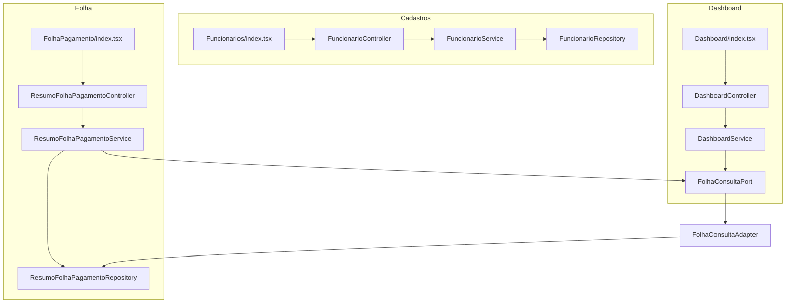

# Funcionários, Folha e Dashboard — UX Design

**Spec**: `_docs/specs/features/funcionarios-folha-dashboard-ux/spec.md`  
**Status**: Approved  
**Constraints**: AD-008 (pacotes `{dominio}.{camada}`), AD-010 (dashboard só via `*.port`), AD-011 (`ACESSO_TOTAL` ≠ `ADMIN`)

---

## Architecture Overview

Três incrementos **independentes por domínio**, sem schema Flyway, compartilhando apenas padrões existentes (soft-delete `ativo`, ACL via `OrganogramaAcessoPort`, FE monolítico em `pages/`).



**Ordem de implementação recomendada:** Cadastros BE → Cadastros FE → Folha BE (ano) → Folha FE → Dashboard BE (13º) → Dashboard FE (remover mock).

---

## Approach Exploration

### A1 — Filtro de status de funcionário

| Approach | Descrição | Prós | Contras |
| -------- | --------- | ---- | ------- |
| **A (recomendada)** | Enum query `status=ATIVO\|INATIVO\|TODOS`, default `ATIVO`; service mapeia para `Boolean ativo` nullable na query | Sem ambiguidade tri-state; backward compat (omitido = ATIVO); OpenAPI legível | Enum novo no pacote `cadastros.api` |
| B | `Boolean ativo` opcional + flag `todos=true` | Menos tipos | Dois params; fácil combinar errado |
| C | Rotas separadas `/ativos`, `/inativos` | Explícito | Quebra contrato REST existente; duplica controller |

**Escolha: A** — unifica `listar()` e `listarComFiltros()` em um único fluxo `listar(filtros + status)`.

### A2 — Exclusão de 13º na evolução

| Approach | Descrição | Prós | Contras |
| -------- | --------- | ---- | ------- |
| **A (recomendada)** | Predicate SQL em `findUltimos12Meses` (ou método dedicado `findUltimos12MesesRegulares`) | Um ponto; beneficia total e scoped; indexável | Só usado por evolução hoje — OK |
| B | Filter `.stream()` no `FolhaConsultaAdapter` | Diff mínimo | Carrega 13º do DB à toa |
| C | Filter no `DashboardService` | Localizado | Duplicado se port mudar; scoped ainda itera competências 13º |

**Escolha: A** — renomear query para deixar intenção explícita:

```java
// ResumoFolhaPagamentoRepository
@Query("""
    SELECT r FROM ResumoFolhaPagamento r
    WHERE r.ativo = true
      AND r.competenciaInicio >= :dataInicio
      AND (r.decimoTerceiro = false OR r.decimoTerceiro IS NULL)
    ORDER BY r.competenciaInicio ASC
    """)
List<ResumoFolhaPagamento> findUltimos12MesesRegulares(@Param("dataInicio") LocalDate dataInicio);
```

`FolhaConsultaPort.findEvolucaoUltimos12Meses` passa a usar esse método (substituir `findUltimos12Meses` — único consumidor).

**Nota scoped:** Linhas (`FolhaPagamento`) não têm flag 13º; excluir resumos 13º da lista de competências evita iterar dezembro duplicado. Se regular e 13º compartilham mesmas datas, `findLinhasAtivasPorCompetencia` ainda pode misturar linhas — **limitação de modelo** documentada; mitigação futura = flag na linha ou competência distinta na importação.

### A3 — Filtro de ano na Folha

| Approach | Descrição | Prós | Contras |
| -------- | --------- | ---- | ------- |
| **A (recomendada)** | Param `ano` (+ opcional `mes`) em `GET /resumo-folha-pagamento`; service deriva bounds e delega a `consultarPorPeriodo` | ACL scoped já implementada em `consultarPorPeriodo`; reutiliza índice `competenciaInicio` | Breaking: omitir `ano` passa a retornar ano corrente, não todos |
| B | FE só chama `/periodo?dataInicio&dataFim` | Zero mudança no controller root | OpenAPI incompleto; `listarTodos` permanece footgun |
| C | Filtro só client-side | Nenhum BE | Viola spec (performance + ACL) |

**Escolha: A** — `ano` default `LocalDate.now().getYear()` quando omitido; `mes` opcional (1–12) restringe ao mês dentro do ano.

---

## Code Reuse Analysis

### Existing Components to Leverage

| Component | Location | How to Use |
| --------- | -------- | ---------- |
| Soft-delete `ativo` | `FuncionarioService.remover()` | Sem alteração de lógica |
| `FuncionarioDTO.ativo` | `cadastros/api/FuncionarioDTO.java` | Já exposto na API |
| `findByFiltros` JPQL | `FuncionarioRepository` | Estender com `:ativo IS NULL OR f.ativo = :ativo` |
| `consultarPorPeriodo` + ACL | `ResumoFolhaPagamentoService` | Ano/mês derivam bounds e chamam este método |
| `findUltimos12Meses` | `ResumoFolhaPagamentoRepository` | Evoluir para `findUltimos12MesesRegulares` |
| `FolhaConsultaPort` | `folha/port` + adapter | Dashboard continua só via port (AD-010) |
| `calcularEvolucaoMensal*` | `DashboardService` | Sem mudança de assinatura pública; beneficia do port |
| Ano default + Select | `BeneficiosMensais/index.tsx` | Copiar padrão `gerarAnosDisponiveis()`, default `getFullYear()` |
| Chip inativo | `TiposBeneficio/index.tsx` | Referência visual para chip **Inativo** |
| `funcionarioService.filtrar` | `frontend/src/services/funcionarioService.ts` | Estender params com `status` |

### Integration Points

| System | Integration Method |
| ------ | ------------------ |
| Spring Security | Sem mudança — `/funcionarios/**` autenticado; resumo com `Authentication` |
| ACL organograma | `ResumoFolhaPagamentoService.obterContextoAcesso` — filtro ano **antes** de `mapear()` |
| ArchUnit AD-010 | Dashboard não importa `folha.infrastructure` |
| OpenAPI / springdoc | Documentar `status`, `ano`, `mes` nos controllers |

---

## Components

### FuncionarioStatusFiltro (enum, novo)

- **Purpose**: Representar tri-state do filtro de listagem.
- **Location**: `cadastros/api/FuncionarioStatusFiltro.java`
- **Values**: `ATIVO`, `INATIVO`, `TODOS`
- **Mapping** (service): `ATIVO → true`, `INATIVO → false`, `TODOS → null`

### FuncionarioController (alteração)

- **Purpose**: Expor filtro de status unificado.
- **Location**: `cadastros/api/FuncionarioController.java`
- **Interfaces**:
  - `GET /funcionarios?nome=&cargoId=&centroCustoId=&linhaNegocioId=&status=ATIVO|INATIVO|TODOS`
  - Default `status=ATIVO` quando omitido
- **Change**: Remover bifurcação listar vs listarComFiltros; sempre delegar a `funcionarioService.listar(...)`.
- **OpenAPI**: `@Parameter` descrevendo enum e default.

### FuncionarioService (alteração)

- **Purpose**: Listagem com filtro de status + filtros existentes.
- **Location**: `cadastros/application/FuncionarioService.java`
- **Interfaces**:
  - `listar(String nome, Long cargoId, Long centroCustoId, Long linhaNegocioId, FuncionarioStatusFiltro status): List<FuncionarioDTO>`
  - Privado: `Boolean resolverAtivo(FuncionarioStatusFiltro status)`
- **Reuses**: `toDTO`, `findByFiltros` estendido; quando todos filtros vazios e `ATIVO`, equivalente a `findByAtivoTrue()` atual.

### FuncionarioRepository (alteração)

- **Purpose**: Query parametrizada por `ativo` nullable.
- **Location**: `cadastros/infrastructure/FuncionarioRepository.java`
- **JPQL change**:

```java
@Query("""
    SELECT f FROM Funcionario f
    LEFT JOIN f.cargo c
    LEFT JOIN f.centroCusto cc
    LEFT JOIN cc.linhaNegocio ln
    WHERE (:ativo IS NULL OR f.ativo = :ativo)
      AND (:nomePattern IS NULL OR f.nome ILIKE :nomePattern)
      AND (:cargoId IS NULL OR c.id = :cargoId)
      AND (:centroCustoId IS NULL OR cc.id = :centroCustoId)
      AND (:linhaNegocioId IS NULL OR ln.id = :linhaNegocioId)
    ORDER BY f.nome
    """)
List<Funcionario> findByFiltros(..., @Param("ativo") Boolean ativo);
```

- **Reuses**: Mesma query para listagem simples (`nomePattern` etc. null).

### ResumoFolhaPagamentoController (alteração)

- **Purpose**: Listagem com filtro de ano obrigatório na prática (default corrente).
- **Location**: `folha/api/ResumoFolhaPagamentoController.java`
- **Interfaces**:
  - `GET /resumo-folha-pagamento?ano={yyyy}&mes={1-12}` — `mes` opcional
  - `ano` opcional na assinatura; service aplica default ano corrente
- **Validation**: `@Min(2000) @Max(2100)` em `ano`; `@Min(1) @Max(12)` em `mes`; `IllegalArgumentException` → 400 via handler existente.

### ResumoFolhaPagamentoService (alteração)

- **Purpose**: Derivar período a partir de ano/mês e reutilizar ACL.
- **Location**: `folha/application/ResumoFolhaPagamentoService.java`
- **Interfaces**:
  - `listarTodos(String login, Integer ano, Integer mes)` — substitui overload sem filtros
  - Privado: `PeriodoCompetencia periodoDe(Integer ano, Integer mes)` → record `(LocalDate inicio, LocalDate fim)`
    - Só ano: `YYYY-01-01` … `YYYY-12-31`
    - Ano + mês: primeiro/último dia do mês
  - Delega: `consultarPorPeriodo(login, inicio, fim)`
- **Reuses**: Toda lógica ACL + `mapear()` existente.

### ResumoFolhaPagamentoRepository (alteração)

- **Purpose**: Query de evolução excluindo 13º.
- **Location**: `folha/infrastructure/ResumoFolhaPagamentoRepository.java`
- **Interfaces**:
  - `findUltimos12MesesRegulares(LocalDate dataInicio)` — substitui `findUltimos12Meses`
- **Deprecate/remove**: `findUltimos12Meses` após migrar adapter.

### FolhaConsultaAdapter (alteração mínima)

- **Purpose**: Port de evolução usa query regular-only.
- **Location**: `folha/application/FolhaConsultaAdapter.java`
- **Change**: `findEvolucaoUltimos12Meses` → `findUltimos12MesesRegulares`.

### DashboardService (sem alteração de código esperada)

- **Purpose**: Evolução total e scoped herdam exclusão via port.
- **Location**: `dashboard/application/DashboardService.java`
- **Note**: Testes devem provar ausência de 13º; código pode não mudar se port filtrar.

### Frontend — Funcionarios/index.tsx (alteração)

- **Purpose**: Filtro status + card cinza + ações condicionais.
- **Location**: `frontend/src/pages/Funcionarios/index.tsx`
- **Changes**:
  1. Estado/form `statusFiltro: 'ATIVO' | 'INATIVO' | 'TODOS'`, default `'ATIVO'`
  2. `Select` MUI no card de filtros (antes de Filtrar/Limpar)
  3. `funcionarioService.filtrar({ ..., status })` → query `status=`
  4. `Limpar`: reset inclui `statusFiltro = 'ATIVO'`
  5. Card `sx` condicional:

```tsx
const inativo = funcionario.ativo === false;
sx={{
  bgcolor: inativo ? 'grey.100' : undefined,
  opacity: inativo ? 0.85 : 1,
  color: inativo ? 'text.disabled' : undefined,
  // ... hover existente
}}
```

  6. Chip ou `PersonOff` icon com `aria-label="Inativo"` no header do card inativo
  7. `{funcionario.ativo !== false && ( <> Editar + Inativar </> )}`

### Frontend — funcionarioService.ts (alteração)

- **Purpose**: Propagar param `status`.
- **Interfaces**:
  - `filtrar({ ..., status?: 'ATIVO' | 'INATIVO' | 'TODOS' })` → append `status` to URLSearchParams
  - `listar()` passa a incluir `status=ATIVO` explicitamente (ou omitir — backend default)

### Frontend — FolhaPagamento/index.tsx (alteração)

- **Purpose**: Ano obrigatório, default corrente, fetch server-side.
- **Changes**:
  1. `defaultValues: { mes: '', ano: String(new Date().getFullYear()) }`
  2. `useEffect` inicial: `fetchResumosFolha({ ano: anoCorrente })`
  3. Substituir `listarTodos()` + filter client-side por `buscarPorAno(ano, mes?)`
  4. Validação RHF: `ano` required (regex 4 dígitos ou Select)
  5. Preferir `Select` de ano (padrão Benefícios) — últimos 6 anos
  6. `Limpar`: reset ano = corrente, mes = '', refetch

### Frontend — resumoFolhaPagamentoService.ts (alteração)

- **Purpose**: Cliente para param `ano`/`mes`.
- **Interfaces**:
  - `listarPorAno(ano: number, mes?: number): Promise<ResumoFolhaPagamento[]>`
  - `GET /resumo-folha-pagamento?ano=&mes=` (mes omitido se vazio)
- **Note**: Manter `listarTodos` deprecated internamente ou remover uso; não chamar sem `ano`.

### Frontend — Dashboard/index.tsx (alteração menor)

- **Purpose**: Cumprir DASH-05 — sem mock quando `evolucaoMensal` vazio.
- **Change**: Remover array hardcoded (linhas 85–92); usar `areaData = stats.evolucaoMensal.map(...)` ou `[]` + empty state no chart.

---

## Data Models

### API — Funcionario (sem mudança de shape)

```typescript
interface Funcionario {
  id: number
  nome: string
  cpf: string
  // ...
  ativo: boolean  // já existe
}
```

### API — Query params (novos)

```typescript
// GET /funcionarios
type FuncionarioStatusFiltro = 'ATIVO' | 'INATIVO' | 'TODOS'  // default ATIVO

// GET /resumo-folha-pagamento
interface ResumoListParams {
  ano: number      // default server-side: ano corrente
  mes?: number     // 1-12, opcional
}
```

### Java enum

```java
public enum FuncionarioStatusFiltro { ATIVO, INATIVO, TODOS }
```

**Relationships**: Nenhuma entidade JPA nova; filtros derivados de colunas existentes `funcionarios.ativo`, `resumo_folha_pagamento.decimo_terceiro`, `competencia_inicio`.

---

## Error Handling Strategy

| Error Scenario | Handling | User Impact |
| -------------- | -------- | ----------- |
| Inativar funcionário já inativo | `FuncionarioNotFoundException` → 404 | Toast "Funcionário não encontrado" |
| `ano` inválido (&lt;2000 ou &gt;2100) | `IllegalArgumentException` → 400 | Mensagem de validação no form |
| `mes` inválido | 400 | Validação inline |
| `status` enum inválido | Spring `MethodArgumentTypeMismatchException` → 400 | Fallback para ATIVO ou erro claro |
| Lista vazia (inativos / ano sem dados) | 200 + `[]` | Empty state orientativo na UI |
| ACL negado (folha) | `[]` (padrão existente) | Tabela vazia |

---

## Risks & Concerns

| Concern | Location | Impact | Mitigation |
| ------- | -------- | ------ | ---------- |
| Controller bifurca listar/filtros | `FuncionarioController.java:31-37` | Duplicação; status só em um ramo | Unificar em A1 |
| Mock hardcoded no dashboard | `Dashboard/index.tsx:85-92` | DASH-05 violado; QA falso positivo | Remover mock; empty state |
| `listarTodos` folha carrega tudo | `FolhaPagamento/index.tsx:147` | Performance; ACL client-side impossível | A3 server-side |
| Linhas folha sem flag 13º | Modelo `FolhaPagamento` | Scoped pode misturar linhas se datas iguais | Excluir resumos 13º; documentar limitação; follow-up opcional |
| `findUltimos12Meses` nome genérico | Repository | Confusão futura | Renomear `Regulares` |
| Testes FuncionarioService | `FuncionarioServiceTest` | Sem cobertura `remover`/filtro | Tasks incluem testes FUNC/DASH/FOLH |
| Breaking API resumo sem `ano` | `GET /resumo-folha-pagamento` | Clientes legados perdem "todos os anos" | Default ano corrente documentado OpenAPI; `/periodo` intacto para range custom |
| FE monolítico `pages/` | AD-004 skills target | Sem refactor para `features/` nesta entrega | Manter padrão brownfield |

---

## Tech Decisions

| Decision | Choice | Rationale |
| -------- | ------ | --------- |
| Param status funcionário | Enum `FuncionarioStatusFiltro` | Tri-state explícito; default ATIVO preserva compat |
| Exclusão 13º | SQL no repository (método `Regulares`) | Único consumidor; beneficia total + scoped via port |
| Filtro ano folha | Param `ano` no GET root + delegate `consultarPorPeriodo` | Reusa ACL scoped; evita duplicar agregação |
| Default ano API | Ano corrente quando omitido | Alinha FOLH-01/FOLH-04; breaking controlado |
| UI ano folha | Select (6 anos) como Benefícios | UX consistente; evita ano vazio |
| Ícone inativo | MUI `PersonOff` + Chip "Inativo" | Spec permite ícone; a11y via `aria-label` |
| Cards inativos | Somente leitura | Spec assumption; oculta Editar/Inativar |
| Dashboard code change | Preferir só repository/port | AD-010; service dashboard unchanged se port filtrar |

---

## Requirement Mapping (Design → Spec)

| Req ID | Component(s) |
| ------ | ------------ |
| FUNC-01, FUNC-02 | `Funcionarios/index.tsx` (ações condicionais; fluxo DELETE existente) |
| FUNC-03, FUNC-04, FUNC-05 | `FuncionarioController`, `Service`, `Repository`, FE filter |
| FUNC-06, FUNC-07 | `Funcionarios/index.tsx` card styling |
| DASH-01, DASH-02 | `ResumoFolhaPagamentoRepository.findUltimos12MesesRegulares`, `FolhaConsultaAdapter` |
| DASH-05 (spec AC) | `Dashboard/index.tsx` remove mock |
| FOLH-01, FOLH-02, FOLH-03 | `ResumoFolhaPagamentoController/Service`, `FolhaPagamento/index.tsx` |
| FOLH-04 | OpenAPI `@Parameter` + validation annotations |

---

## Testing Strategy (for Tasks phase)

| Area | Test class | Cenários spec-anchored |
| ---- | ---------- | ---------------------- |
| Status filter | `FuncionarioServiceTest` | ATIVO default; INATIVO só false; TODOS mixed; combinado com nome |
| Inativar | `FuncionarioServiceTest` | `remover` seta ativo=false; segundo remove → 404 |
| 13º evolução | `DashboardServiceTest` | Resumo 13º + regular dez; evolução só regular; scoped idem |
| Port | `FolhaConsultaAdapterTest` (se existir) ou service test via mock | Query regulares |
| Ano folha | `ResumoFolhaPagamentoServiceTest` | Default ano corrente; filtro mes; ano inválido; ACL scoped |

---

## Out of Design Scope

- Reativar funcionário
- Editar inativo
- Excluir 13º de KPIs fora de `evolucaoMensal`
- Refactor FE para `src/features/`
- Regenerar tipos OpenAPI (`npm run gen:api-types`) — opcional pós-merge backend
