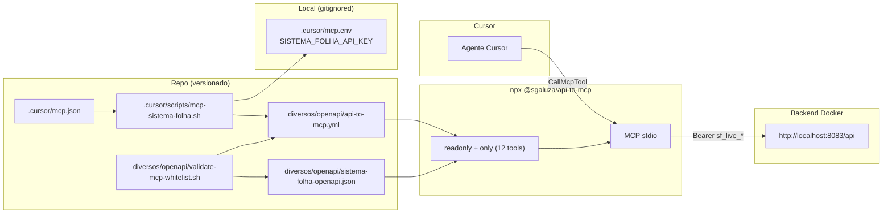
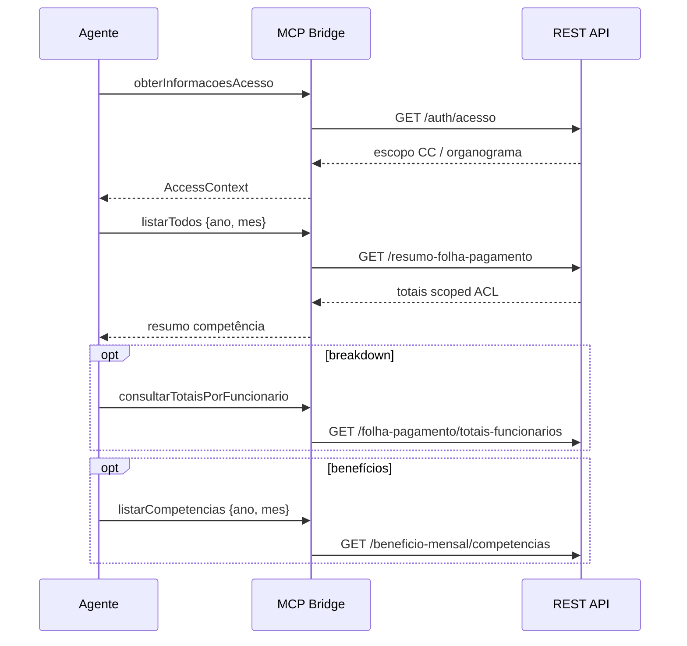

# mcp-agent-tools Design

**Spec**: `_docs/specs/features/mcp-agent-tools/spec.md`  
**Status**: Approved — tasks geradas 2026-08-01

---

## Architecture Overview

**Approach A (chosen):** Filtrar no **bridge MCP** (`@sgaluza/api-to-mcp`) com config YAML versionada — `readonly` + whitelist `only` — sobre a OpenAPI completa existente. Sem alteração no backend Spring.

Alternativas descartadas:

| Approach | Por que não |
| -------- | ----------- |
| B — Spec OpenAPI filtrada (JSON duplicado) | Dois artefatos para manter; regen exige script extra |
| C — Grupo springdoc `/api-docs/mcp` | Correto a longo prazo, mas exige Java + rebuild; fora do MVP |



**Fluxo do agente (consulta folha):**



---

## Code Reuse Analysis

### Existing Components to Leverage

| Component | Location | How to Use |
| --------- | -------- | ---------- |
| Launcher MCP | `.cursor/scripts/mcp-sistema-folha.sh` | Estender: manter carga de env + PATH; trocar `exec` para `api-to-mcp` |
| Cursor wiring | `.cursor/mcp.json` | **Sem mudança** — continua apontando para o script bash |
| OpenAPI spec | `diversos/openapi/sistema-folha-openapi.json` | Input único; regen via `curl api-docs` (README existente) |
| API Key auth | `.cursor/mcp.env` + AD-013 | `export OPENAPI_BEARER_TOKEN` antes do `exec` (alias legado suportado por `api-to-mcp`) |
| Smoke reference | Conversa MCP 2026-07-30 (Humberto) | Baseline de verificação MCP-07: 10 emp, líquido R$ 66.040,32 em 05/2026 |
| Script patterns | `diversos/scripts/*.sh` | Padrão bash `set -euo pipefail` para `validate-mcp-whitelist.sh` |

### Integration Points

| System | Integration Method |
| ------ | ------------------ |
| REST API (Spring Boot) | Bridge HTTP → `servers[0].url` da spec (`http://localhost:8083/api`) |
| API Key (Bearer) | Env `OPENAPI_BEARER_TOKEN` ← `SISTEMA_FOLHA_API_KEY` no script |
| Cursor MCP | stdio via `.cursor/mcp.json` → bash script |
| OpenAPI regen | Manual/CI: `curl …/api-docs` sobrescreve JSON; validate script detecta drift |

---

## Components

### 1. MCP launcher script

- **Purpose**: Carregar secret local, validar pré-requisitos e iniciar bridge filtrado.
- **Location**: `.cursor/scripts/mcp-sistema-folha.sh`
- **Interfaces**:
  - Entrada: env `SISTEMA_FOLHA_API_KEY` ou `OPENAPI_BEARER_TOKEN`; arquivos `.cursor/mcp.env` / `~/.config/sistema-folha/mcp.env`
  - Saída: processo stdio MCP (substitui processo via `exec`)
- **Dependencies**: `npx`, `@sgaluza/api-to-mcp`, `diversos/openapi/api-to-mcp.yml`, spec JSON
- **Reuses**: Lógica atual de resolução de token e PATH asdf

**Mudança principal:**

```bash
# antes
exec npx -y @sgaluza/openapi-mcp-bridge "${SPEC}"

# depois
CONFIG="${ROOT}/diversos/openapi/api-to-mcp.yml"
exec npx -y @sgaluza/api-to-mcp rest --config "${CONFIG}"
```

Token: manter `export OPENAPI_BEARER_TOKEN="${TOKEN}"` (alias legado documentado em `api-to-mcp`).

---

### 2. Bridge config (whitelist)

- **Purpose**: Declarar spec, modo readonly e lista curada de `operationId`.
- **Location**: `diversos/openapi/api-to-mcp.yml`
- **Interfaces** (estrutura):

```yaml
spec: sistema-folha-openapi.json   # relativo ao diretório do config
options:
  readonly: true
  only:
    - obterInformacoesAcesso
    - listarTodos
    - consultarPorCompetencia
    - consultarPorPeriodo
    - listarMaisRecentes
    - consultarTotaisPorFuncionario
    - consultarPorPeriodo_1
    - buscarFichaPorFuncionario
    - listarCompetencias
    - resumoPorCompetencia
    - listar_2
    - listar
```

- **Dependencies**: Spec sibling no mesmo diretório
- **Reuses**: Curated tool set da spec (12 tools → MCP-04 ≤15, ≥10)

**Nota:** Não colocar bearer/API key no YAML (secret fica só em `mcp.env`).

---

### 3. Whitelist validator script

- **Purpose**: Falhar cedo se regen OpenAPI remover/renomear `operationId` da whitelist (MCP-14, MCP-15).
- **Location**: `diversos/openapi/validate-mcp-whitelist.sh`
- **Interfaces**:
  - Entrada: `api-to-mcp.yml` + `sistema-folha-openapi.json` (paths default ou args)
  - Saída: exit 0 (OK) ou exit 1 + lista de IDs faltantes em stderr
- **Dependencies**: `python3` (stdlib: `json`; PyYAML se disponível, senão parser mínimo para bloco `only:`)
- **Reuses**: Mesmo diretório da spec; invocável manualmente ou pós-regen OpenAPI

**Algoritmo:**

1. Extrair lista `options.only` do YAML
2. Coletar todos `operationId` da spec OpenAPI (`paths.*.*.operationId`)
3. `missing = only - spec_ids`
4. Se `missing` não vazio → exit 1 + print

---

### 4. Operator documentation

- **Purpose**: Setup MCP + roteamento agente (MCP-11…13).
- **Location**: `diversos/openapi/README.md`
- **Interfaces**: Markdown — tabelas fluxo recomendado, distinção folha/cadastro/fora-MCP
- **Dependencies**: Conteúdo alinhado a `api-to-mcp.yml`
- **Reuses**: Seção MCP existente; **corrigir** nota obsoleta sobre `/funcionarios` sem ACL (fix2 aplicou ACL)

**Conteúdo novo (estrutura):**

| Pergunta do usuário | Tool(s) | Ordem |
| ------------------- | ------- | ----- |
| Qual meu escopo? | `obterInformacoesAcesso` | 1 |
| Totais da folha MM/AAAA? | `listarTodos` ou `consultarPorCompetencia` | 2 |
| Por funcionário? | `consultarTotaisPorFuncionario` | 3 |
| Benefícios? | `listarCompetencias` | 4 |
| Ficha de um funcionário? | `buscarFichaPorFuncionario` | opcional |
| Quantos no cadastro vs folha? | `listar_2` (cadastro) — **não** confundir com folha | opcional |

---

## Data Models

N/A — feature de config/infra; sem persistência nem DTOs novos.

**Contrato implícito (whitelist):** conjunto de 12 strings `operationId` estáveis até springdoc renomear métodos Java.

---

## Error Handling Strategy

| Error Scenario | Handling | User Impact |
| -------------- | -------- | ----------- |
| API key ausente | Script exit 1 + mensagem existente (MCP-10) | Cursor MCP status Error; operador cria `mcp.env` |
| Spec JSON ausente | Script exit 1 | Mensagem com path da spec |
| `operationId` faltando pós-regen | `validate-mcp-whitelist.sh` exit 1 | Maintainer atualiza YAML antes de merge |
| API down / connection refused | Bridge retorna erro HTTP na tool result | Agente vê falha na chamada; README menciona Docker |
| API key expirada/revogada | API 401/403 | Tool falha; operador renova key na UI |
| Cursor cache de tools antigas | Documentar Refresh em Settings → MCP | Operador clica Refresh após mudança de whitelist |
| `only` + `readonly` conflito com spec | Bridge ignora ops fora da lista | Só 12 tools expostas |

---

## Risks & Concerns

| Concern | Location | Impact | Mitigation |
| ------- | -------- | ------ | ---------- |
| `operationId` genéricos (`listar_2`) | springdoc / controllers Java | Agente escolhe tool errada dentro das 12 | README roteamento; overrides P3 futuro |
| Spec sem `securitySchemes` | `sistema-folha-openapi.json` | Bridge depende 100% de env Bearer | Manter export no script; documentar |
| Base URL `localhost:8083` fixa na spec | `servers[0].url` | MCP falha se API não estiver up | README: subir Docker antes; `options.baseUrl` override futuro se necessário |
| Path relativo da spec no YAML | `api-to-mcp.yml` | Bridge pode não achar spec se cwd errado | Config path absoluto no script; spec sibling no mesmo dir |
| README desatualizado (ACL funcionários) | `diversos/openapi/README.md:37` | Operador desconfia de `listar_2` | Atualizar na task de docs |
| Cursor cache MCP | Comportamento IDE | Lista 90 tools após deploy | Instruir Refresh; smoke manual pós-merge |
| Pacote npm `@sgaluza/openapi-mcp-bridge` referenciado em docs | README | Confusão | Substituir referências (MCP-13) |

---

## Tech Decisions

| Decision | Choice | Rationale |
| -------- | ------ | --------- |
| Bridge npm | `@sgaluza/api-to-mcp` (substitui `openapi-mcp-bridge`) | `--readonly`, `--only`, config YAML; aliases `OPENAPI_*` |
| Filtro | `readonly: true` + `only:` (12 IDs) | Readonly sozinho = 43 GETs; whitelist atinge MCP-04 |
| Onde vive a whitelist | `diversos/openapi/api-to-mcp.yml` | Revisável em PR; script fino |
| Auth secret | Env only (não no YAML) | AD-013; evita commit acidental |
| Validador | Bash wrapper + Python3 | Sem deps npm; roda offline |
| `.cursor/mcp.json` | Inalterado | Menor diff; script é o único ponto de mudança |
| Overrides de descrição | Adiado (P3 spec) | 12 tools + README suficientes no MVP |

**Conformidade AD-013:** MCP continua usando API Key Bearer read-only; nenhuma tool mutável exposta (defesa em profundidade além do write-guard backend).

---

## Requirement → Component Mapping

| Req ID | Component(s) | Verificação |
| ------ | ------------ | ----------- |
| MCP-01, MCP-02 | `api-to-mcp.yml` (`readonly: true`) | Lista MCP sem POST/PUT/DELETE |
| MCP-03, MCP-07 | Script + bridge + API | Smoke `CallMcpTool` |
| MCP-04, MCP-05, MCP-06 | `api-to-mcp.yml` (`only:`) | Contagem 12; presença/ausência de IDs |
| MCP-08, MCP-09, MCP-10 | YAML + script | Arquivos existem; exec sobe |
| MCP-11, MCP-12, MCP-13 | README | Revisão documental |
| MCP-14, MCP-15 | `validate-mcp-whitelist.sh` | Exit code + missing IDs |

---

## Execute Preview (for Tasks phase)

Estimativa **6 tasks** (1 batch, sem sub-agents):

| Task | Entrega |
| ---- | ------- |
| T1 | Criar `api-to-mcp.yml` com whitelist 12 tools |
| T2 | Atualizar `mcp-sistema-folha.sh` → `api-to-mcp` |
| T3 | Criar `validate-mcp-whitelist.sh` + gate local |
| T4 | Atualizar `diversos/openapi/README.md` |
| T5 | Smoke MCP manual (folha 05/2026) — evidência MCP-07 |
| T6 | Verifier + `validation.md` |

**MCPs/skills Execute:** MCP nativo Cursor para smoke T5; skills N/A (infra bash/yaml).
