# Modular ACL / Security Fix — Design

**Spec**: `_docs/specs/features/modular-acl-security-fix/spec.md`  
**Status**: Draft (Tasks drafted — awaiting user approve of Design+Tasks → Execute)  
**Approach**: **A** (short-circuit ACL before unscoped query + SecurityConfig refresh `permitAll` + Folha `remover` espelho benefícios)  
**Constraints**: AD-007 (ACL empty≠total), AD-008 (ports only), AD-009 (não expandir allowlist; não reintroduzir foreign infra)

---

## Architecture Overview

Fix-only em três superfícies já existentes — sem novos pacotes, ports ou tabelas. Sibling `modular-monolith-fix` permanece intocado em ArchUnit/ports.

```mermaid
flowchart TB
  subgraph beneficio [Benefício mensal ACL]
    CTRL_B[BeneficioMensalController]
    SVC_B[BeneficioMensalService]
    PORT_A[OrganogramaAcessoPort]
    REPO_B[BeneficioMensalRepository]
    CTRL_B --> SVC_B
    SVC_B --> PORT_A
    SVC_B -->|"acessoTotal"| REPO_B
    SVC_B -->|"restrito + centros"| REPO_B
    SVC_B -->|"restrito + empty → List.of()"| X[no unscoped]
  end

  subgraph auth [Auth refresh]
    FE[api.ts fetch sem Bearer]
    SEC[SecurityConfig permitAll POST /auth/refresh]
    AUTH_C[AuthController.refresh]
    AUTH_S[AuthenticationService.refreshToken]
    FE --> SEC --> AUTH_C --> AUTH_S
  end

  subgraph folha [Folha delete ACL]
    CTRL_F[FolhaPagamentoController.remover + Authentication]
    SVC_F[FolhaPagamentoService.removerSeAutorizado]
    PORT_A2[OrganogramaAcessoPort]
    REPO_F[FolhaPagamentoRepository.softDelete]
    CTRL_F --> SVC_F --> PORT_A2
    SVC_F -->|"allow"| REPO_F
    SVC_F -->|"deny"| N[false → 404]
  end
```



**Medium sizing:** uma abordagem recomendada (sem exploration multi-path). Alternativas descartadas abaixo.

| Option | Idea | Why not |
| ------ | ---- | ------- |
| A ✅ | Short-circuit em `*ParaUsuario` quando restrito+empty; `buscar*` inalterado para total/`emptySet` explícito | Mínimo blast; preserva API interna `listarPorCompetencia(..., emptySet)` = total |
| B | Mudar `buscarPorCompetencia` para exigir `AccessContextDTO` | Acopla repo helpers ao ACL; mais diff |
| C | Sentinela/`Optional` no `centrosParaFiltro` | Correto mas mais abstrato que short-circuit no call site user-facing |

---

## Code Reuse Analysis

### Existing Components to Leverage

| Component | Location | How to Use |
| --------- | -------- | ---------- |
| `acessoNegado` / `aplicarFiltroAcesso` | `BeneficioMensalService` | Manter; acrescentar guard restrito+empty **antes** de `centrosParaFiltro` |
| `removerSeAutorizado` | `BeneficioMensalService` L80–89 | Template Folha: find → filter ACL → soft-delete / false |
| Benefício DELETE HTTP | `BeneficioMensalController` L69–76 | Espelho: `Authentication` + 204/404 |
| Folha GET ACL | `FolhaPagamentoController` já passa `authentication.getName()` | Só DELETE falta o mesmo padrão |
| `SecurityConfigTipoBeneficioTest` | `config/` | Padrão `@WebMvcTest` + `@Import(SecurityConfig)` + `@MockBean` |
| `JwtAuthenticationFilter` | `security/` | Sem Bearer → continua cadeia (não alterar) |
| `AuthController.refresh` + `RefreshTokenRequest` | `auth/api/` | Já existe; só abrir matcher |
| Ports sibling | `UsuarioLookupPort`, `OrganogramaAcessoPort`, etc. | **Não** trocar por repos |

### Integration Points

| System | Integration Method |
| ------ | ------------------ |
| Spring Security 6 | `.requestMatchers(HttpMethod.POST, "/auth/refresh").permitAll()` ao lado de `/auth/login` (Context7: `permitAll()` = anyone; paths sem `/api` duplicado) |
| FE `api.ts` | Nenhuma mudança — contrato MODACL-09 |
| ArchUnit AD-009 | Gate pós-diff: `ModularArchitectureTest` verde; zero novos imports foreign infra |

---

## Components

### 1. `BeneficioMensalService` — empty-set guard (MODACL-01–05)

- **Purpose:** Impedir que restrito+`centrosCustoIds` vazio colida com `centros.isEmpty()` → find-all.
- **Location:** `beneficios/application/BeneficioMensalService.java`
- **Interfaces (behavior):**

```text
listarPorCompetenciaParaUsuario / resumoPorCompetenciaParaUsuario:
  1. obterContextoAcesso(login)
  2. if acessoNegado → List.of()          // existing
  3. if !acessoTotal && centros vazios/null → List.of()   // NEW — MODACL-01/02
  4. else → listar/resumo(..., centrosParaFiltro(contexto))
     // acessoTotal → emptySet → unscoped (MODACL-03)
     // restrito + IDs → query In (MODACL-04)
```

- **Dependencies:** `OrganogramaAcessoPort`, `UsuarioLookupPort`, same-domain repo (unchanged).
- **Reuses:** Existing deny path; tests helpers `contextoRestrito` / `contextoNegado`.
- **Tests:** New cases restrito+`Set.of()` (and null-safe) asserting empty + `never()` on unscoped methods; keep total + non-empty cases green.

### 2. `SecurityConfig` + security test refresh (MODACL-06–08)

- **Purpose:** Restaurar superfície pública de refresh alinhada ao FE e a MOD-13.
- **Location:**
  - `config/SecurityConfig.java` — add matcher after login
  - `config/SecurityConfigAuthRefreshTest.java` (or `auth/api/AuthControllerRefreshSecurityTest.java`) — new
- **Interfaces:**

```java
.requestMatchers(HttpMethod.POST, "/auth/login").permitAll()
.requestMatchers(HttpMethod.POST, "/auth/refresh").permitAll()  // NEW
```

- **Test plan:**
  1. Anon `POST /auth/refresh` + body JSON + `@MockBean AuthenticationService` returning `TokenDTO` → **not** 401 (expect 200).
  2. Regression: existing `SecurityConfigTipoBeneficioTest` still 403/2xx for ADMIN.
  3. Optional: authenticated route without user still 401 (smoke that `anyRequest().authenticated()` intact).
- **Dependencies:** Same JWT filter; no FE change.
- **Skill note (`spring-security`):** abrir `permitAll` é decisão explícita — aqui **restaura** AC MOD-13 (não amplia superfície além do contrato SPA já em produção). Confirmado no Design approve = autorização para Execute aplicar o matcher.

### 3. Folha soft-delete ACL (MODACL-10–13)

- **Purpose:** Paridade com benefícios no DELETE.
- **Location:**
  - `folha/api/FolhaPagamentoController.java` — `remover(id, Authentication)`
  - `folha/application/FolhaPagamentoService.java` — `remover(String login, Long id)` ou `removerSeAutorizado`
- **Interfaces:**

```text
Controller:
  DELETE /{id} + Authentication
  → service.removerSeAutorizado(login, id) ? 204 : 404

Service:
  obterContextoAcesso(login)
  findById → filter ativo → filter aplicarFiltroAcesso
  → softDelete / false
  acessoTotal=true → allow any found active row
```

- **Dependencies:** Existing `OrganogramaAcessoPort`, `UsuarioLookupPort`.
- **Reuses:** `BeneficioMensalService.removerSeAutorizado` + controller pattern; Folha `aplicarFiltroAcesso` already on reads.
- **Tests:** `FolhaPagamentoServiceTest` deny (wrong centro → never softDelete) + allow; compile controller with `Authentication`.

---

## Data Models

Nenhuma mudança de schema/DTO. Reuso:

| Type | Role |
| ---- | ---- |
| `AccessContextDTO` | Flags ACL + `centrosCustoIds` |
| `RefreshTokenRequest` / `TokenDTO` | Body refresh já existente |
| Soft-delete flags | `FolhaPagamento` / repo `softDelete` existentes |

---

## Error Handling Strategy

| Error Scenario | Handling | User Impact |
| -------------- | -------- | ----------- |
| Restrito + centros vazios (benefício) | Early return `List.of()` / resumo vazio | Lista vazia — sem leak |
| Refresh sem Bearer + token válido | Security permite; service emite novos tokens | 200 + TokenDTO |
| Refresh token inválido/expirado | Service lança / controller erro negócio | 4xx negócio — **não** 401 por “unauthenticated” |
| Folha delete fora do centro | `false` → 404 | Mesmo contrato benefícios (não 403) |
| Folha id inexistente | `false` → 404 | Sem side-effect |
| Login usuário não encontrado em ACL path | `RuntimeException` pré-existente | Fora de escopo deste fix (deferred hygiene) |

---

## Risks & Concerns

| Concern | Location | Impact | Mitigation |
| ------- | -------- | ------ | ---------- |
| Empty/total conflation | `BeneficioMensalService` L157–161, L196–208 | Data leak cross-centro | Short-circuit Approach A + MODACL-05 tests |
| MOD-13 Verifier false positive | Parent validation login-only | Refresh quebrado em prod SPA | Matcher + MockMvc security proof |
| `permitAll` misuse | `SecurityConfig` | Abrir demais | Só `POST /auth/refresh`; keep ADMIN tests; skill confirm on Design approve |
| Folha DELETE privilege escalation | `FolhaPagamentoService.remover` L121–127 | Soft-delete cross-centro | Espelho `removerSeAutorizado` |
| Port regression | Consumers pós-sibling | ArchUnit FAIL / AD-009 | Diff não toca adapters; gate `ModularArchitectureTest` |
| Test gap restrito+empty | `BeneficioMensalServiceTest` | Leak sem red flag | New tests MODACL-05 (distinct from SEM_FUNCIONARIO) |
| `RuntimeException` user-not-found | `obterContextoAcesso` | 500 genérico | Out of scope (spec Out of Scope / deferred) |

---

## Tech Decisions (non-obvious)

| Decision | Choice | Rationale |
| -------- | ------ | --------- |
| Empty-set fix site | Short-circuit em `*ParaUsuario` | Preserva `listarPorCompetencia(..., emptySet)` = total; menor risco |
| Folha HTTP deny | 404/`false` (não 403) | Paridade benefícios; evita enumeração além do contrato atual |
| Refresh test style | `@WebMvcTest` AuthController + mock service | Prova filtro Security sem `@SpringBootTest`; espelha tipo-beneficio |
| FE change | None | MODACL-09 |
| New AD? | **No** | Conforma AD-007/008/009; não cria convenção nova de projeto |

---

## Success Criteria (Design → Execute)

- [ ] Approach A implemented for MODACL-01–05 with discriminating tests
- [ ] `POST /auth/refresh` permitAll + security test (MODACL-06–08); FE untouched (MODACL-09)
- [ ] Folha DELETE ACL parity (MODACL-10–13)
- [ ] `mvn test` + `ModularArchitectureTest` green
- [ ] Independent Verifier → `validation.md`

---

## Sizing reminder

| Item | Value |
| ---- | ----- |
| Scope | Medium (+ Design written by user request) |
| Tasks | **Still skip** — ≤5 implicit Execute steps in spec |
| Next | User approves this Design → Execute (or ask for formal `tasks.md`) |

**Implicit Execute order (unchanged):**

1. Benefício empty-set + tests  
2. SecurityConfig refresh + security test  
3. Folha remover ACL + tests  
4. Gate suite + ArchUnit  
5. Verifier
