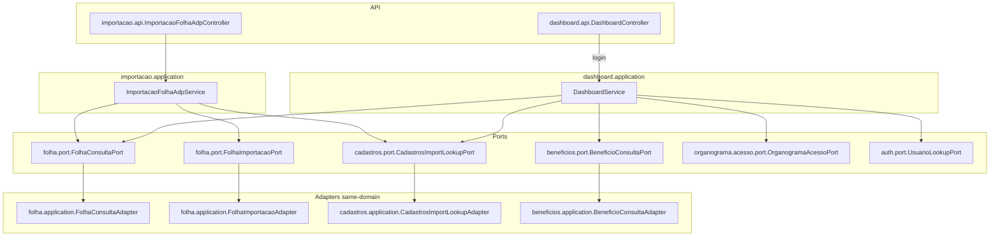

# Modular Boundary Hardening — Design

**Spec**: `_docs/specs/features/modular-boundary-hardening/spec.md`  
**Status**: Approved (Approach A — 2026-07-27)  
**Approach**: **A** — Ports agregadoras (Folha consulta densa + Folha importação command + Cadastros import lookup) + ACL short-circuit no dashboard + ArchUnit sem allowlist

---

## Architecture Overview

Fecha a dívida AD-009 sem microserviços (AD-007) e sem relaxar AD-008: consumidores `dashboard` e `importacao` passam a depender **somente** de `*.port`.

1. **`FolhaConsultaPort`** — leituras densas (competência, linhas denormalizadas, evolução, conflitos CPF). Adapter em `folha.application` agrega a partir de repos folha; **não** retorna `@Entity`.
2. **`FolhaImportacaoPort`** — comando de substituição/persistência de competência. Ownership de write e `@Transactional` no adapter folha; orquestrador importação **join** a mesma TX JVM.
3. **`CadastrosImportLookupPort`** — lookup por `idExterno` + find-or-create rubrica (DTOs de contrato, sem entity na superfície). Contagem de ativos para path “sem resumo” do dashboard.
4. **Dashboard** — resolve ACL (`UsuarioLookupPort` + `OrganogramaAcessoPort`); short-circuit deny/empty → stats zerados; senão monta `DashboardStatsDTO` a partir das ports (agregação in-memory sobre **snapshots**, não entities).
5. **Benefícios** — estender `BeneficioConsultaPort` com contagem scoped por centros (ACL dashboard).
6. **ArchUnit** — regras `dashboard.application` e `importacao.application` simétricas aos demais; AD-010 supersede AD-009 no Execute (MODBH-30).
7. **P2** — mover `*StatsDTO` de `cadastros.api` → `dashboard.api` (wire JSON idêntico). **P3** compliance grep — **defer**.



**Constraints:** Conform AD-001…AD-008. Supersede AD-009 via **AD-010** no Execute quando ArchUnit verde sem allowlist.

---

## Code Reuse Analysis

### Existing Components to Leverage

| Component | Location | How to Use |
| --------- | -------- | ---------- |
| `BeneficioConsultaPort` + adapter | `beneficios/port`, `beneficios/application` | Template de port sem entity; estender contagem scoped |
| `OrganogramaAcessoPort` / `AccessContextDTO` | `organograma/acesso/port` | ACL dashboard (não reimplementar) |
| `UsuarioLookupPort` | `auth/port` | Resolver login → usuarioId (mesmo padrão folha) |
| `FolhaPagamentoService.obterContextoAcesso` | `folha/application` | Copiar padrão login → contexto |
| `FolhaPagamentoDTO` | `folha/api` | Shape de linha já denormalizado — base para snapshots / response importação |
| `ModularArchitectureTest` | `arch/` | Adicionar 2 regras; limpar `AD009_ALLOWLIST_BECAUSE` |
| Repos folha/cadastros | `*.infrastructure` | Só dentro dos adapters do próprio domínio |
| `DomainLogging` | `shared/logging` | Prefixo domain= nos services refatorados |
| `DashboardServiceTest` | `dashboard/application` | Reescrever mocks para ports + ACL fixtures |

### Integration Points

| System | Integration Method |
| ------ | ------------------ |
| Spring DI | Adapters `@Service` implementam ports; consumidores injetam interface |
| Spring TX | `@Transactional` em `FolhaImportacaoAdapter` (REQUIRED); `ImportacaoFolhaAdpService.importarFolhaAdp` mantém `@Transactional` e faz join |
| HTTP | `GET /dashboard/stats` + `Authentication`; `POST /importacao/folha-adp` wire JSON preservado |
| ArchUnit | Regras application-layer para dashboard + importacao; AD-010 em STATE |
| FE | Path `/dashboard/stats` inalterado; resposta filtrada server-side |

---

## Components

### 1. `FolhaConsultaPort` + `FolhaConsultaAdapter`

- **Purpose:** Leituras/agregações de folha para consumidores cross-domain sem `folha.infrastructure` / entities.
- **Location:**
  - `backend/.../folha/port/FolhaConsultaPort.java`
  - `backend/.../folha/port/FolhaLinhaSnapshot.java` (record)
  - `backend/.../folha/port/FolhaResumoSnapshot.java` (record)
  - `backend/.../folha/port/FolhaEvolucaoSnapshot.java` (record)
  - `backend/.../folha/application/FolhaConsultaAdapter.java`
- **Interfaces:**

```java
public interface FolhaConsultaPort {
    Optional<FolhaResumoSnapshot> findResumoMaisRecente();

    /** Linhas ativas da competência. Se centrosCustoIds != null, filtra por CC do funcionário. */
    List<FolhaLinhaSnapshot> findLinhasAtivasPorCompetencia(
        LocalDate competenciaInicio, LocalDate competenciaFim, Set<Long> centrosCustoIds);

    List<FolhaEvolucaoSnapshot> findEvolucaoUltimos12Meses(LocalDate dataInicio);

    boolean existsResumoAtivo(LocalDate inicio, LocalDate fim, boolean decimoTerceiro);

    boolean existsAtivaByCpfAndCompetenciaExcludingFuncionario(
        String cpf, Long funcionarioId, LocalDate inicio, LocalDate fim);

    boolean existsByFuncionarioIdAndRubricaIdAndPeriodo(
        Long funcionarioId, Long rubricaId, LocalDate inicio, LocalDate fim);
}
```

- **Dependencies:** `FolhaPagamentoRepository`, `ResumoFolhaPagamentoRepository` (só no adapter).
- **Reuses:** Queries existentes; mapeamento denormalizado espelhando `FolhaPagamentoDTO` / uso atual do dashboard.
- **Consumers:** `DashboardService`, `ImportacaoFolhaAdpService` (checks de existência/conflito).

### 2. `FolhaImportacaoPort` + `FolhaImportacaoAdapter`

- **Purpose:** Persistência de importação ADP (substituir competência + salvar linhas + resumo).
- **Location:**
  - `backend/.../folha/port/FolhaImportacaoPort.java`
  - `backend/.../folha/port/FolhaImportacaoCommand.java` (+ line/resumo records)
  - `backend/.../folha/application/FolhaImportacaoAdapter.java`
- **Interfaces:**

```java
public interface FolhaImportacaoPort {
    /** Substitui folhas/resumo da competência se confirmado; persiste linhas + resumo. */
    List<FolhaPagamentoDTO> persistirImportacao(FolhaImportacaoCommand command);
}
```

`FolhaImportacaoCommand` carrega: competência, flag 13º, `substituirSeExistente`, lista de linhas (ids funcionario/rubrica/cargo/cc/ln + valores), totais do resumo.

- **Transaction ownership:** `@Transactional` no adapter. Se `substituirSeExistente`, deleta folhas+resumos da competência **antes** de inserir (mesma semântica atual). Rollback: qualquer falha na TX do orquestrador/adapter reverte tudo (join).
- **Dependencies:** Repos folha (só adapter); carrega entities por id a partir dos IDs do command.
- **Reuses:** Lógica de delete+save hoje em `ImportacaoFolhaAdpService` L103–135, L271–294.
- **HTTP:** `ImportacaoFolhaAdpResponseDTO.success` passa a aceitar `List<FolhaPagamentoDTO>` (wire idêntico; remove entity da borda).

### 3. `CadastrosImportLookupPort` + adapter

- **Purpose:** Lookups/upserts de cadastros para importação ADP + contagem ativa para dashboard sem resumo.
- **Location:**
  - `backend/.../cadastros/port/CadastrosImportLookupPort.java`
  - `backend/.../cadastros/port/FuncionarioImportRef.java`, `RubricaImportRef.java`
  - `backend/.../cadastros/application/CadastrosImportLookupAdapter.java`
- **Interfaces:**

```java
public interface CadastrosImportLookupPort {
    Optional<FuncionarioImportRef> findFuncionarioByIdExterno(String idExterno);

    /** Find-or-create por código; tipoRubricaDescricao = PROVENTO|DESCONTO. */
    RubricaImportRef findOrCreateRubrica(String codigo, String descricao, String tipoRubricaDescricao);

    long countFuncionariosAtivos();

    /** Contagem de ativos cujo centroCustoId ∈ set (ACL dashboard path sem resumo). */
    long countFuncionariosAtivosPorCentros(Set<Long> centrosCustoIds);
}
```

- **Dependencies:** `FuncionarioRepository`, `RubricaRepository`, `TipoRubricaRepository` (só adapter).
- **Não** estende `FuncionarioConsultaPort` com writes — port dedicada evita misturar consulta genérica com upsert de importação.
- **Consumers:** `ImportacaoFolhaAdpService`, `DashboardService` (counts).

### 4. Extensão `BeneficioConsultaPort`

- **Purpose:** Contagem de benefícios scoped para ACL do dashboard.
- **Location:** `beneficios/port/BeneficioConsultaPort.java` + adapter.
- **Novo método:**

```java
long contarLancamentosAtivosNaCompetenciaPorCentros(
    LocalDate competenciaInicio, LocalDate competenciaFim, Set<Long> centrosCustoIds);
```

- Quando `centrosCustoIds == null` e caller é total-access, dashboard chama o método unscoped existente.
- Adapter filtra lançamentos cujo `funcionario.centroCusto.id ∈ set` (in-memory ou query — implementação livre desde que AC passe).

### 5. `DashboardController` + `DashboardService` (refactor)

- **Purpose:** Stats com ACL; zero foreign infra.
- **Location:** `dashboard/api/DashboardController.java`, `dashboard/application/DashboardService.java`
- **Controller:**

```java
@GetMapping("/stats")
public ResponseEntity<DashboardStatsDTO> getStats(Authentication authentication) {
    return ResponseEntity.ok(dashboardService.getStats(authentication.getName()));
}
```

- **Service flow:**
  1. `usuarioLookupPort.findByLoginAndAtivoTrue(login)` — ausente → stats zerados (fail-safe; **não** agregação global). Não espelha `RuntimeException` da folha no GET stats (edge MODBH).
  2. `organogramaAcessoPort.obterContextoAcesso(usuarioId)`
  3. Se `!acessoTotal` e (`motivoNegacao != null` / `!temFuncionario` / `!temNo` / `centrosCustoIds.isEmpty()`) → `emptyStats()`; **não** chamar ports de dados de folha/cadastros agregadores.
  4. Caso contrário: `findResumoMaisRecente`; se empty → count via `CadastrosImportLookupPort` (scoped se restrito); se present → `findLinhasAtivasPorCompetencia(..., centrosOuNull)` + agregações in-memory sobre `FolhaLinhaSnapshot` + `BeneficioConsultaPort` scoped/unscoped + evolução (filtrar evolução por ACL: se restrito, evolução usa só resumos… **Decisão:** evolução mensal sob ACL restrito usa os mesmos totais de resumo **globais** do repositório hoje — **risco**. Mitigação Approach A: sob restrito, `evolucaoMensal` = lista vazia **ou** recalcular a partir de linhas dos últimos 12m filtradas. **Escolha:** recalcular evolução a partir de linhas/resumos **filtráveis** — se port não tiver evolução scoped, dashboard sob restrito retorna `evolucaoMensal` vazia neste fix (documentado); total-access mantém `findEvolucaoUltimos12Meses`. Racional: resumo atual é global e vazaria totais históricos.
  5. Montar `DashboardStatsDTO` (P2: stats DTOs em `dashboard.api`).

- **Dependencies:** ports listadas; **zero** `*Repository`.
- **Reuses:** Lógica `calcularStatsPor*` adaptada para operar em `FolhaLinhaSnapshot`.

### 6. `ImportacaoFolhaAdpService` (refactor)

- **Purpose:** Parse ADP + orquestração; zero foreign infra.
- **Location:** `importacao/application/ImportacaoFolhaAdpService.java`
- **Flow:**
  1. Extrair competência (parse arquivo) — inalterado.
  2. `folhaConsultaPort.existsResumoAtivo` → `FolhaDuplicadaException` se existe e `!confirmarSubstituicao`.
  3. Loop parse: `cadastrosImportLookupPort.findFuncionarioByIdExterno`; `findOrCreateRubrica`; checks via `folhaConsultaPort.exists*`; acumular linhas em memória (command builders, **não** entities).
  4. `folhaImportacaoPort.persistirImportacao(command)` com flag substituir.
  5. Retornar `List<FolhaPagamentoDTO>` do port.
- **`@Transactional`** permanece no método de orquestração (join com adapter).
- **Dependencies:** `FolhaConsultaPort`, `FolhaImportacaoPort`, `CadastrosImportLookupPort` only.

### 7. ArchUnit + AD-010

- **Purpose:** Enforçar isolamento; fechar allowlist.
- **Location:** `ModularArchitectureTest.java`, `_docs/specs/STATE.md`
- **Rules:** `dashboard_application_must_not_access_foreign_infrastructure`, `importacao_application_must_not_access_foreign_infrastructure` (mesmo padrão das regras existentes). Remover constante `AD009_ALLOWLIST_BECAUSE` das mensagens `because` (ou substituir por texto sem allowlist).
- **STATE:** Append AD-010; AD-009 → `superseded by AD-010` (task MODBH-30).

### 8. P2 — Stats DTOs em `dashboard.api`

- Mover `LinhaNegocioStatsDTO`, `CentroCustoStatsDTO`, `CargoStatsDTO`, `RubricaStatsDTO` de `cadastros.api` → `dashboard.api` (mesmos campos record).
- Atualizar imports em `DashboardStatsDTO` / service / testes.
- Wire JSON inalterado → FE sem regen obrigatória.

### 9. P3 — Compliance grep

- **Defer** — ArchUnit cobre MODBH-27–29.

---

## Data Models

### `FolhaLinhaSnapshot` (`folha.port`)

```java
public record FolhaLinhaSnapshot(
    Long funcionarioId,
    Long centroCustoId,
    String centroCustoDescricao,
    Long linhaNegocioId,
    String linhaNegocioDescricao,
    Long cargoId,
    String cargoDescricao,
    Long rubricaId,
    String rubricaCodigo,
    String rubricaDescricao,
    String tipoRubricaDescricao, // PROVENTO | DESCONTO
    BigDecimal valor
) {}
```

### `FolhaResumoSnapshot` / `FolhaEvolucaoSnapshot`

```java
public record FolhaResumoSnapshot(
    LocalDate competenciaInicio,
    LocalDate competenciaFim,
    BigDecimal totalLiquido,
    Integer totalEmpregados,
    boolean decimoTerceiro
) {}

public record FolhaEvolucaoSnapshot(
    LocalDate competenciaInicio,
    BigDecimal totalLiquido,
    Integer totalEmpregados
) {}
```

### `FolhaImportacaoCommand`

```java
public record FolhaImportacaoCommand(
    LocalDate competenciaInicio,
    LocalDate competenciaFim,
    boolean decimoTerceiro,
    boolean substituirExistente,
    List<FolhaImportacaoLinhaCommand> linhas,
    FolhaImportacaoResumoCommand resumo // nullable se totais incompletos
) {}

public record FolhaImportacaoLinhaCommand(
    Long funcionarioId,
    Long rubricaId,
    Long cargoId,
    Long centroCustoId,
    Long linhaNegocioId,
    BigDecimal valor,
    BigDecimal quantidade,
    BigDecimal baseCalculo
) {}

public record FolhaImportacaoResumoCommand(
    Integer totalEmpregados,
    BigDecimal totalEncargos,
    BigDecimal totalPagamentos,
    BigDecimal totalDescontos,
    BigDecimal totalLiquido
) {}
```

### `FuncionarioImportRef` / `RubricaImportRef`

```java
public record FuncionarioImportRef(
    Long id, String idExterno, String nome, String cpf,
    Long cargoId, Long centroCustoId, Long linhaNegocioId
) {}

public record RubricaImportRef(Long id, String codigo, String tipoRubricaDescricao) {}
```

**Relationships:** Refs apontam IDs canônicos de cadastros; command de folha referencia esses IDs. Sem grafo JPA cross-package na superfície.

---

## Error Handling Strategy

| Error Scenario | Handling | User Impact |
| -------------- | -------- | ----------- |
| Login inexistente no dashboard | Stats zerados (emptyStats) | Dashboard vazio, sem 500/leak |
| ACL deny / empty centros | Short-circuit emptyStats; ports de dados não chamadas | Listas/totais zero |
| Folha duplicada sem confirmação | `FolhaDuplicadaException` → 409 (inalterado) | Modal de substituição no FE |
| Funcionário idExterno não encontrado | Log + lista `funcionariosNaoEncontrados` (inalterado) | Aviso; linhas puladas |
| Conflito CPF/competência | Acumula mensagem; não cria linha (inalterado) | Relato na resposta |
| Falha ao persistir via port | Exception propaga; TX rollback | 400 com mensagem |
| Arquivo vazio / não-.txt | Validação no controller (inalterado) | 400 |
| Rubrica/tipo inexistente no create | Adapter cria tipo PROVENTO/DESCONTO via repo (inalterado) | Rubrica nova |

---

## Risks & Concerns

| Concern | Location | Impact | Mitigation |
| ------- | -------- | ------ | ---------- |
| God-class importação (~575 LOC) | `ImportacaoFolhaAdpService.java` | Refactor propenso a regressão de parse | Manter parse in-place; extrair só I/O para ports; testes de conflito/duplicidade; não split LOC neste fix (Phase 4) |
| Evolução mensal global vaza sob ACL | `calcularEvolucaoMensal` via resumos globais | Totais históricos fora do escopo | Restrito → `evolucaoMensal` vazia; total-access mantém evolução |
| `UsuarioLookupPort` ainda retorna entity | `auth/port` | Model coupling residual | Aceito (Phase 3 roadmap); dashboard só usa `getId()` |
| N+1 / load graph no adapter consulta | `FolhaConsultaAdapter` | Perf em competências grandes | Reusar queries existentes; follow-up N+1 deferred STATE |
| `BeneficioConsultaPort` contagem scoped in-memory | adapter benefícios | Custo se muitos lançamentos | Aceitável volume atual; query filtrada = melhoria futura |
| Response DTO mapeava entities | `ImportacaoFolhaAdpResponseDTO` | Vazava model na borda | Passar a `List<FolhaPagamentoDTO>` |
| Testes dashboard mockam repos | `DashboardServiceTest` | Bloqueiam refactor | Reescrever com ports + ACL fixtures (MODBH-06/16) |
| Working tree uncommitted siblings | STATE handoff | Conflito de merge | Design assume tree atual; commits do usuário fora do escopo |

---

## Tech Decisions

| Decision | Choice | Rationale |
| -------- | ------ | --------- |
| Approach | **A** — ports agregadoras | Alinha `BeneficioConsultaPort`; consumidores sem entities; ACL testável |
| Port cadastros import | Nova `CadastrosImportLookupPort` | Não misturar upsert com `FuncionarioConsultaPort` read-only |
| Superfície ports novas | Records/DTOs, zero `@Entity` | MODBH-08/12/19; Phase 3 lookup legado fica para depois |
| ACL dashboard | Short-circuit antes de ports de dados | MODBH-02/03; evita work e leak |
| Evolução sob restrito | Lista vazia | Resumos são globais; evitar leak histórico |
| Login ausente | emptyStats (não throw) | GET dashboard fail-safe ≠ listagens folha |
| TX importação | Orquestrador + adapter folha (join) | Folha owns write; rollback atômico |
| Contagem benefícios ACL | Estender `BeneficioConsultaPort` | Necessário MODBH-05 sem reach-through |
| P2 Stats DTOs | Incluir (move package) | Baixo risco; fecha Pattern 2 smell |
| P3 compliance grep | Defer | ArchUnit suficiente |
| AD-009 | Superseded por **AD-010** no Execute MODBH-30 | Fecha allowlist quando código/ArchUnit alinhados |

> **Project-level:** AD-010 será appendado em Execute (não antecipar supersession antes do ArchUnit verde).

---

## Requirement mapping (Design)

| IDs | Component |
| --- | --------- |
| MODBH-01…06 | DashboardController + DashboardService ACL |
| MODBH-07…10 | FolhaConsultaPort + adapter + tests |
| MODBH-11…13 | CadastrosImportLookupPort (counts) |
| MODBH-14…17 | DashboardService refactor + tests + gate |
| MODBH-18…21 | FolhaImportacaoPort + adapter + tests |
| MODBH-22…26 | ImportacaoFolhaAdpService refactor |
| MODBH-27…30 | ArchUnit + AD-010 |
| MODBH-31…32 | P2 Stats DTOs move |
| MODBH-33 | Deferred (P3) |

---

## Next

User approves this Design → **Tasks** phase (`tasks.md` atômico com gates).
