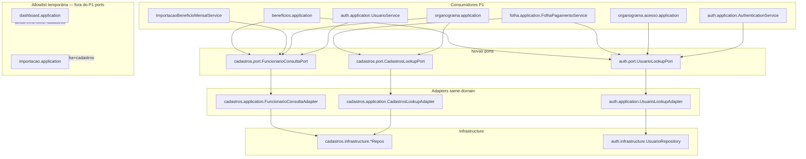

# Monólito Modular Fix — Design

**Spec**: `_docs/specs/features/modular-monolith-fix/spec.md`  
**Context**: `_docs/specs/features/modular-monolith-fix/context.md`  
**Parent**: `_docs/specs/features/modular-monolith/`  
**Status**: Approved  
**Approach**: **A** (ports mínimas Cadastros+Auth + ArchUnit application-layer com allowlist temporária `dashboard`/`importacao`)

---

## Architecture Overview

Follow-up fix-only sobre o monólito modular já migrado (AD-007/AD-008). Não reabre pacotes nem produto. Entrega três faixas:

1. **Contrato FE lint** — checklist + amendment da spec pai (AD-004): conformidade modular ≠ ESLint global.
2. **Isolamento application** — ports read-only em `cadastros.port` e `auth.port`; consumidores hot-path deixam de importar `*.infrastructure` estrangeira; ArchUnit reforça a regra com allowlist explícita só para `dashboard.application` e `importacao.application` (débito documentado → follow-up).
3. **Prova ACL HTTP/DTO** — teste unitário de `AuthenticationService` (P1); MockMvc de controllers permanece P2.



**Constraints ativas:** AD-001…AD-008. Este design **conforma** a AD-008 (cross-domain via `*.port`) e AD-004 (lint FE). **AD-009** (novo) registra a allowlist temporária + regra ArchUnit application-layer como padrão de projeto.

---

## Code Reuse Analysis

### Existing Components to Leverage

| Component | Location | How to Use |
| --------- | -------- | ---------- |
| `BeneficioConsultaPort` + adapter | `beneficios/port`, `beneficios/application/BeneficioConsultaAdapter` | Template de contrato + `@Service` adapter + unit tests Mockito |
| `OrganogramaAcessoPort` / `AccessContextDTO` | `organograma/acesso/port` | Já consumido; não reimplementar ACL |
| `AuthenticationService.obterAcessoUsuario*` | `auth/application/AuthenticationService.java` | Alvo do teste MODFIX-12–13 (map → `AcessoUsuarioDTO`) |
| `ModularArchitectureTest` | `arch/ModularArchitectureTest.java` | Adicionar regra; não relaxar existentes |
| `SecurityConfigTipoBeneficioTest` | `config/SecurityConfigTipoBeneficioTest.java` | Padrão `@WebMvcTest` para P2 MockMvc |
| `check-modular-compliance.sh` | `diversos/scripts/` | Clarificar mensagem AD-004 no bloco lint advisory |
| Repos Cadastros/Auth | `*.infrastructure` | Só dentro dos adapters do próprio domínio |

### Integration Points

| System | Integration Method |
| ------ | ------------------ |
| Spring DI | Adapters `@Service` implementam ports; consumidores injetam interface |
| ArchUnit | Nova regra + allowlist packages documentada no teste (`because(...)`) |
| Spec pai `modular-monolith` | Amendment mínimo MOD-11 / Success Criteria FE (lint advisory) |
| Parent re-validation | Gaps hard fechados; allowlist dashboard/importacao citada como débito aceito no fix (não FAIL se documentado) |

---

## Components

### 1. `FuncionarioConsultaPort` + adapter

- **Purpose:** Consulta de funcionário para domínios externos sem `FuncionarioRepository`.
- **Location:**
  - `backend/.../cadastros/port/FuncionarioConsultaPort.java`
  - `backend/.../cadastros/application/FuncionarioConsultaAdapter.java`
- **Interfaces:**

```java
public interface FuncionarioConsultaPort {
    Optional<Funcionario> findById(Long id);
    Optional<Funcionario> findByIdAndAtivoTrue(Long id);
    Optional<Funcionario> findByCpfAndAtivoTrue(String cpf);
}
```

- **Dependencies:** `FuncionarioRepository` (só no adapter).
- **Reuses:** Métodos existentes do repository; entity `cadastros.domain.Funcionario` (retorno de domínio — **não** vaza infrastructure).
- **Consumers P1:** `BeneficioMensalService`, `ImportacaoBeneficioMensalService`, `OrganogramaService`, `UsuarioService`.

### 2. `CadastrosLookupPort` + adapter

- **Purpose:** Lookups de Centro de Custo e Linha de Negócio usados por Folha/Organograma.
- **Location:**
  - `backend/.../cadastros/port/CadastrosLookupPort.java`
  - `backend/.../cadastros/application/CadastrosLookupAdapter.java`
- **Interfaces:**

```java
public interface CadastrosLookupPort {
    Optional<CentroCusto> findCentroCustoById(Long id);
    Optional<LinhaNegocio> findLinhaNegocioById(Long id);
}
```

- **Dependencies:** `CentroCustoRepository`, `LinhaNegocioRepository` no adapter.
- **Reuses:** `findById` existentes.
- **Consumers P1:** `FolhaPagamentoService`, `OrganogramaService`.
- **Nota:** Rubrica/TipoRubrica ficam no allowlist path (importação/dashboard) — fora deste port neste fix.

### 3. `UsuarioLookupPort` + adapter

- **Purpose:** Resolução de usuário por id/login sem `auth.infrastructure` em outros domínios (e sem duplicar queries em Folha/Benefícios/Organograma ACL).
- **Location:**
  - `backend/.../auth/port/UsuarioLookupPort.java`
  - `backend/.../auth/application/UsuarioLookupAdapter.java`
- **Interfaces:**

```java
public interface UsuarioLookupPort {
    Optional<Usuario> findById(Long id);
    Optional<Usuario> findByLoginAndAtivoTrue(String login);
}
```

- **Dependencies:** `UsuarioRepository` só no adapter (mesmo domínio auth).
- **Consumers P1:** `BeneficioMensalService`, `FolhaPagamentoService`, `OrganogramaAcessoService`.
- **Nota:** `AuthenticationService` / `UsuarioService` / `RefreshTokenService` **podem** continuar usando `UsuarioRepository` diretamente (same-domain application → own infrastructure).

### 4. Refactors dos consumidores P1

| Service | Remove | Inject |
| ------- | ------ | ------ |
| `BeneficioMensalService` | `FuncionarioRepository`, `UsuarioRepository` | `FuncionarioConsultaPort`, `UsuarioLookupPort` |
| `ImportacaoBeneficioMensalService` | `FuncionarioRepository` | `FuncionarioConsultaPort` |
| `FolhaPagamentoService` | `CentroCustoRepository`, `LinhaNegocioRepository`, `UsuarioRepository` | `CadastrosLookupPort`, `UsuarioLookupPort` |
| `OrganogramaService` | `FuncionarioRepository`, `CentroCustoRepository` | `FuncionarioConsultaPort`, `CadastrosLookupPort` |
| `OrganogramaAcessoService` | `UsuarioRepository` | `UsuarioLookupPort` |
| `UsuarioService` | `FuncionarioRepository` | `FuncionarioConsultaPort` |

Atualizar testes Mockito correspondentes (mocks de port, não de repo estrangeiro).

### 5. ArchUnit — application-layer foreign infrastructure

- **Purpose:** Fechar MODFIX-05/11; complementar regra de domain (não relaxar).
- **Location:** `ModularArchitectureTest.java`
- **Rule (intent):**

```text
noClasses()
  .that().resideInAnyPackage("..application..")
  .and().resideOutsideOfPackages(
      "..dashboard.application..",
      "..importacao.application.."
  )
  .should().dependOnClassesThat()
  .resideInAnyPackage(
      "..beneficios.infrastructure..",
      "..folha.infrastructure..",
      "..cadastros.infrastructure..",
      "..organograma.infrastructure..",
      "..auth.infrastructure.."
  )
  .AND same-domain exception:
     beneficios.application → beneficios.infrastructure OK
     folha.application → folha.infrastructure OK
     ...
```

Implementação preferida: regra customizada `ArchCondition` **ou** conjunto de regras por domínio (`beneficios.application` must not depend on `cadastros|auth|folha|organograma.infrastructure`, etc.) — espelhar estilo das regras Folha→Benefícios já existentes. Allowlist = packages `dashboard.application` e `importacao.application` omitidos das regras deste fix, com `because("deferred Approach A — follow-up ports Folha/Cadastros stats")`.

- **Gate:** `mvn test -Dtest=ModularArchitectureTest` + suite completa.

### 6. FE lint contract + parent amendment

- **Purpose:** MODFIX-01–04 / fechar Verifier gap MOD-11.
- **Location:**
  - `diversos/scripts/check-modular-compliance.sh` — mensagem lint advisory deve citar **AD-004** e “conformidade modular FE ≠ ESLint verde global”.
  - `_docs/specs/features/modular-monolith/spec.md` — amendment mínimo (**aplicado no Design**):
    - P1 FE AC5: `npm run build` exit 0 **mandatory**; `npm run lint` **advisory** (AD-004 / checklist).
    - Tabela FE + Success Criteria alinhados.
  - Escopo lint fix em Execute: apenas erros **introduzidos** por arquivos da migração; se zero → documentar contagem sem mass-fix.
  - Checklist: reforçar mensagem AD-004 no bloco lint advisory.

### 7. `AuthenticationServiceAcessoTest` (P1)

- **Purpose:** MODFIX-12–14 — prova de mapeamento DTO/ACL sem `@SpringBootTest`.
- **Location:** `backend/src/test/java/.../auth/application/AuthenticationServiceAcessoTest.java`
- **Interfaces / cases:**
  1. Mock `OrganogramaAcessoPort` → contexto `SEM_FUNCIONARIO` → assert campos em `AcessoUsuarioDTO` / retorno de `obterAcessoUsuario` / `obterAcessoUsuarioPorLogin`.
  2. Mock grant parcial (funcionário+nó, centros não vazios, `acessoTotal=false`).
- **Dependencies:** Mockito; espelhar padrão `OrganogramaAcessoServiceTest`.
- **Reuses:** Builder/factory de `AccessContextDTO` dos testes ACL.

### 8. P2 MockMvc (não bloqueia PASS)

- **Purpose:** MODFIX-15–16.
- **Location:** ex. `beneficios/api/BeneficioMensalControllerWebMvcTest`, `auth/api/AuthControllerAcessoWebMvcTest` (opcional).
- **Pattern:** `@WebMvcTest` + `@MockBean` service; verify delegação; status HTTP compatível.
- **Defer:** permitido se P1 completo; registrar em validation.

---

## Data Models

Sem novas tabelas/migrations. Ports reutilizam entities de domínio existentes:

| Type | Package | Role |
| ---- | ------- | ---- |
| `Funcionario`, `CentroCusto`, `LinhaNegocio` | `cadastros.domain` | Retornos das ports Cadastros |
| `Usuario` | `auth.domain` | Retorno de `UsuarioLookupPort` |
| `AcessoUsuarioDTO` | `auth.api` (ou path atual) | Asserts do teste P1 |
| `AccessContextDTO`, `MotivoNegacaoAcesso` | `organograma.acesso.port` | Fixtures do teste |

**Regra:** ports **não** retornam tipos de `*.infrastructure` (projections/repos). Domínio/port DTOs ok.

---

## Error Handling Strategy

| Error Scenario | Handling | User Impact |
| -------------- | -------- | ----------- |
| Port `Optional.empty()` onde antes `orElseThrow` | Adapter/consumidor preserva mesma exceção (`FuncionarioNotFoundException`, etc.) | Mesmos status HTTP |
| Login inexistente em `UsuarioLookupPort` | Mesmo comportamento atual do service (empty → deny / not found) | Sem mudança de produto |
| ArchUnit violation em consumer esquecido | Build test falha | Bloqueia merge até port |
| Allowlist dashboard/importacao | Documentado; não falha regra deste fix | Débito follow-up |

---

## Risks & Concerns

| Concern | Location | Impact | Mitigation |
| ------- | -------- | ------ | ---------- |
| Allowlist dashboard/importacao deixa AD-008 incompleto | `DashboardService`, `ImportacaoFolhaAdpService` | Isolamento parcial; Verifier pai pode questionar | AD-009 + nota explícita no design/validation; follow-up feature obrigatória no ROADMAP/Deferred |
| Retornar entities JPA via port | ports Cadastros/Auth | Acoplamento a `*.domain` (aceitável) vs DTO puro | Aceito Approach A; proibir só infrastructure; futuro DTO se extrair microsserviço |
| Perf: adapter ainda faz entity load | Espelha uso atual dos repos | Sem regressão nova vs HEAD pós-migração | Fora deste fix (perf gaps pai ficam Deferred) |
| Empty `centrosCustoIds` ainda amplia query em Benefícios | `BeneficioMensalService` (code-review security) | ACL bypass residual | **Fora do escopo** da spec fix (context: não alterar semântica ACL); Deferred Ideas — recomendado próximo fix |
| Password/token logging | `UsuarioService`, `RefreshTokenService` | Security debt pré-existente movido | Fora do escopo fix; registrar em Deferred |
| Lint “introduzido” ambíguo | FE files tocados | Scope creep | Comparar lint só em paths alterados pela migração; se só dívida antiga → zero fix code |

---

## Tech Decisions

| Decision | Choice | Rationale |
| -------- | ------ | --------- |
| Approach | **A** | Fecha Verifier hard gaps sem big-bang Folha ports |
| Ports | `FuncionarioConsultaPort`, `CadastrosLookupPort`, `UsuarioLookupPort` | Cobre usos reais grepados; rubrica/folha stats deferidos |
| Port returns | Domain entities `Optional<T>` | Menor blast; mirrors current service code |
| ArchUnit | Per-domain “application must not depend on foreign infra” + omit dashboard/importacao | Implementável sem ArchCondition complexa; allowlist honesta |
| Auth proof P1 | Unit `AuthenticationService` | Alinha `TESTING.md` / Mockito; MockMvc = P2 |
| Parent amendment | Inline edit `modular-monolith/spec.md` MOD-11 + Success Criteria FE | Fecha lacuna literal do Verifier |
| Same-domain repos | Permitidos em `auth.application` → `auth.infrastructure` | MODFIX-05 same-domain exception |

### Project-level → AD-009

Ver `_docs/specs/STATE.md` — ArchUnit application-layer foreign-infra + allowlist temporária dashboard/importacao até ports Folha/Cadastros stats.

---

## Requirement mapping (Design → Components)

| ID | Component |
| -- | --------- |
| MODFIX-01–04 | §6 FE lint + parent amendment |
| MODFIX-05, 11 | §5 ArchUnit |
| MODFIX-06–10 | §1–4 ports + consumer refactors |
| MODFIX-12–14 | §7 AuthenticationServiceAcessoTest |
| MODFIX-15–16 | §8 P2 MockMvc (optional) |

---

## Out of scope reminders (Approach A)

- Ports para `DashboardService` / `ImportacaoFolhaAdpService` (leitura/escrita Folha + Rubrica)
- Mass ESLint brownfield
- Fix security logging / empty-centros ACL bypass (Deferred)
- Perf redesign de `BeneficioConsultaAdapter` aggregates

---

## Confirmation

Approach **A** approved by user (2026-07-26).  
**Next:** user approves this design → Tasks phase.
