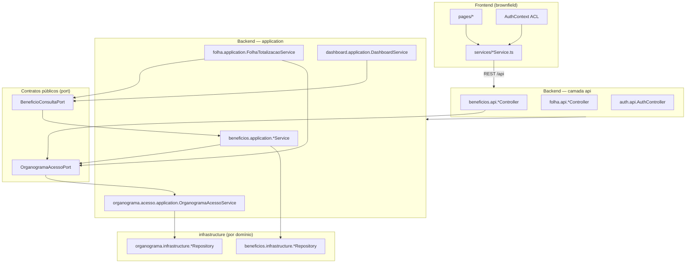

# Monólito Modular — Design

**Spec:** `_docs/specs/features/modular-monolith/spec.md`  
**Context:** `_docs/specs/features/modular-monolith/context.md`  
**Status:** Approved (Tasks drafted)  
**Approach:** A (confirmado pelo usuário)

---

## Approach Exploration (Complex)

| Approach | Ideia | Prós | Contras |
| -------- | ----- | ---- | ------- |
| **A — Pacotes por domínio + ports (escolhido)** | Maven único; `{dominio}.{api\|application\|domain\|infrastructure\|port}`; ports síncronas | Alinha AD-007 / context 3B; scan Spring OK; ArchUnit incremental | Diffs de move; período híbrido |
| B — Multi-módulo Maven | JARs `beneficios`, `folha`, … | Fronteira física | Overkill para 1 time; fora de refactor-only leve |
| C — ArchUnit sem mover pacotes | Só ports + drop legado + ACL | Diff menor | Falha MOD-06; Pattern 3 não resolvido |

**Escolha:** Approach A.

---

## Architecture Overview

Refatoração estrutural **refactor-only** do monólito Spring Boot + React SPA para **monólito modular in-process** (AD-007), sem multi-módulo Maven. Abordagem escolhida:

**A — módulo Maven único**, pacotes por bounded context:

```text
br.com.techne.sistemafolha.{dominio}.{camada}
  camadas: api | application | domain | infrastructure | port
```

`SistemaFolhaApplication` permanece em `br.com.techne.sistemafolha` com `@SpringBootApplication`, que **escaneia todos os subpacotes** — não é necessário `@ComponentScan` extra após mover classes para `{dominio}.*`.

Comunicação cross-domain exclusivamente via **ports síncronas in-process** (`BeneficioConsultaPort`, `OrganogramaAcessoPort`). Consumidores (Folha, Dashboard, Benefícios Mensais) **não** injetam repositories de outros domínios. Controllers permanecem finos (delegam a application services). Frontend alinhado ao **mínimo 5A** (AD-004): services por domínio, sem rewrite para skills FE target.



### Ordem de migração incremental (3B)

Cada leva mantém build verde antes da próxima. ArchUnit cresce **P2** (regras build-breaking após P1 estável).

| Fase | Escopo | Domínios / entregáveis | Req IDs |
| ---- | ------ | ---------------------- | ------- |
| **P1** | Vertical slice demonstrável | **Benefícios** (pacote completo + remoção legado); **ports** (`BeneficioConsultaPort`, `OrganogramaAcessoPort` + submodule `organograma.acesso`); **ACL fix**; **controllers finos** dos já tocados; **SecurityConfig** paths; **FE mínimo**; consumo de port em Folha/Dashboard (classes ainda em pacote plano) | MOD-01–14, MOD-27–29 |
| **P2 leva 1** | Folha | Migrar `folha.*`; extrair/confirmar `FolhaPagamentoService`, `ResumoFolhaPagamentoService`, `FolhaTotalizacaoService`; ArchUnit Folha ↔ Benefícios via port | MOD-17, MOD-20 |
| **P2 leva 2** | Cadastros | `cadastros.*` (Funcionário, Cargo, Centro, Rubrica, Linha) — subpacotes por agregado permitidos | MOD-18 |
| **P2 leva 3** | Organograma | `organograma.*` + consolidar `organograma.acesso`; mover entidades nó/vínculo | MOD-18, MOD-10 |
| **P2 leva 4** | Importação | `importacao.*` (Folha ADP, Benefícios mensais já em beneficios) | MOD-19 |
| **P2 leva 5** | Auth / Security / Dashboard | `auth.*`, `security.*` compartilhado mínimo; `dashboard.*`; logging `domain=` | MOD-19, MOD-21–22 |
| **P2 transversal** | Enforcement | ArchUnit 1.4.2 junit5 — regras cumulativas, nunca relaxar anteriores | MOD-15, MOD-16 |
| **P3** | Conformidade | `validation.md`, checklist BE+FE, `ARCHITECTURE.md` | MOD-23–26, MOD-30 |

**Inventário Benefícios (P1):** ~24 arquivos Java (+ testes) saem de `controller/`, `service/`, `repository/`, `model/`, `dto/`, `exception/` planos e vão para `beneficios.*` (exclui `Beneficio.java` / `BeneficioRepository.java`, **deletados**).

---

## Code Reuse Analysis

### Existing Components to Leverage

| Component | Location | How to Use |
| --------- | -------- | ---------- |
| `BeneficioMensalService` | `service/BeneficioMensalService.java` | Move para `beneficios.application`; base do adapter `BeneficioConsultaPort` |
| `TipoBeneficioService` | `service/TipoBeneficioService.java` | Move para `beneficios.application` |
| `ImportacaoBeneficioMensalService` | `service/ImportacaoBeneficioMensalService.java` | Move para `beneficios.application` |
| `OrganogramaAcessoService` | `service/OrganogramaAcessoService.java` | Refatorar lógica ACL; implementa `OrganogramaAcessoPort` em `organograma.acesso.application` |
| `FolhaTotalizacaoService` | `service/FolhaTotalizacaoService.java` (~74–91 dual branch) | Remover branch legado; injetar `BeneficioConsultaPort`; P2 move para `folha.application` |
| `DashboardService` | `service/DashboardService.java` | Substituir `BeneficioRepository` por `BeneficioConsultaPort`; P2 move para `dashboard.application` |
| `FolhaPagamentoController` | `controller/FolhaPagamentoController.java` | Extrair queries para novo `FolhaPagamentoService` (P1 thin controller) |
| `ResumoFolhaPagamentoController` | `controller/ResumoFolhaPagamentoController.java` | Extrair para `ResumoFolhaPagamentoService` |
| `SecurityConfig` | `config/SecurityConfig.java` | Corrigir matchers sem prefixo `/api` duplicado |
| `GlobalExceptionHandler` | `exception/GlobalExceptionHandler.java` | Permanece cross-cutting (shared mínimo) até P2 |
| `folhaPagamentoService.ts` | `frontend/src/services/folhaPagamentoService.ts` | Pages delegam a ele; remover import direto de `api.ts` em FolhaPagamento |
| `funcionarioService.ts` | `frontend/src/services/funcionarioService.ts` | Idem para `Funcionarios/index.tsx` |
| `AuthContext` | `frontend/src/contexts/AuthContext.tsx` | Interpretar DTO ACL evoluído (MOD-29) |
| Flyway chain | `db/migration/V1.0`–`V1.13` | Próxima: `V1.14__drop_beneficios_legado.sql` |

### Integration Points

| System | Integration Method |
| ------ | ------------------ |
| PostgreSQL | Flyway V1.14 `DROP TABLE IF EXISTS beneficios`; demais tabelas inalteradas |
| Spring component scan | `@SpringBootApplication` na raiz — beans em `{dominio}.*` registrados automaticamente |
| JWT / Auth | Inalterado; `AuthenticationService` passa a montar `AcessoUsuarioDTO` via `OrganogramaAcessoPort` |
| OpenAPI | DTOs de port/API permanecem records/classes com `@Schema`; breaking change documentado em `/auth/acesso` e login `TokenDTO.acessoUsuario` |
| Frontend HTTP | `services/api.ts` permanece cliente único; pages **não** importam `api.ts` (AD-004: sem rewrite `api-client` skill) |

---

## Components

### 1. Domínio Benefícios — pacote `beneficios.*` (P1)

- **Purpose:** Bounded context coeso para tipos, lançamentos mensais e importação XLSX; expõe `BeneficioConsultaPort` como única superfície para outros domínios.
- **Location:** `backend/src/main/java/br/com/techne/sistemafolha/beneficios/`
- **Interfaces:**
  - `beneficios.api.TipoBeneficioController`, `BeneficioMensalController`, `ImportacaoBeneficioMensalController` — rotas inalteradas
  - `beneficios.port.BeneficioConsultaPort` — contrato público cross-domain
  - `beneficios.application.BeneficioConsultaAdapter` — `@Service` implementando port
- **Dependencies:** `OrganogramaAcessoPort` (filtro ACL em listagens); repositories próprios em `beneficios.infrastructure`
- **Reuses:** Services/controllers/repos existentes movidos; testes `*Beneficio*`, `*TipoBeneficio*`, `*ImportacaoBeneficioMensal*` atualizados de pacote
- **Req:** MOD-06, MOD-07

### 2. `BeneficioConsultaPort` + adapter mensal-only (P1)

- **Purpose:** Folha e Dashboard consultam custos agregados de benefícios **somente** via `beneficio_mensal`, sem entities JPA vazando.
- **Location:** `beneficios/port/BeneficioConsultaPort.java`, `beneficios/application/BeneficioConsultaAdapter.java`
- **Interfaces:**

```java
public interface BeneficioConsultaPort {
    BigDecimal somarValorPorFuncionarioECompetencia(Long funcionarioId, LocalDate competenciaInicio, LocalDate competenciaFim);
    int contarLancamentosPorFuncionarioECompetencia(Long funcionarioId, LocalDate competenciaInicio, LocalDate competenciaFim);
    boolean existeDadosMensaisNaCompetencia(LocalDate competenciaInicio, LocalDate competenciaFim);
    long contarLancamentosAtivosNaCompetencia(LocalDate competenciaInicio, LocalDate competenciaFim); // Dashboard
}
```

  - IDs nulos → `IllegalArgumentException` (MOD-14 validação de port)
  - Sem lançamentos → `BigDecimal.ZERO` / `0` / `false` (sem exceção, sem fallback legado)
- **Dependencies:** `BeneficioMensalRepository`, `TipoBeneficioRepository` (infra do domínio Benefícios apenas)
- **Reuses:** Queries já presentes em `BeneficioMensalRepository`; lógica de agregação hoje inline em `FolhaTotalizacaoService` (~74–91)
- **Req:** MOD-02, MOD-03, MOD-28

### 3. Remoção legado `Beneficio` (P1)

- **Purpose:** Eliminar dual model; `beneficio_mensal` como fonte única de custo.
- **Location:** Deletar `model/Beneficio.java`, `repository/BeneficioRepository.java`; migration `V1.14__drop_beneficios_legado.sql`
- **Interfaces:** N/A (remoção)
- **Dependencies:** Nenhum consumidor restante após refactor de `FolhaTotalizacaoService` e `DashboardService`
- **Reuses:** N/A
- **Req:** MOD-01

**Flyway V1.14 (idempotente):**

```sql
DROP INDEX IF EXISTS idx_beneficios_data;
DROP INDEX IF EXISTS idx_beneficios_funcionario;
DROP INDEX IF EXISTS idx_beneficios_ativo;
DROP TABLE IF EXISTS beneficios;
```

### 4. Submodule `organograma.acesso` + `OrganogramaAcessoPort` (P1)

- **Purpose:** Contrato explícito de ACL hierárquica; corrige conflação `Optional.empty()` / `Set` vazio = acesso total.
- **Location:**
  - `organograma/acesso/port/OrganogramaAcessoPort.java`
  - `organograma/acesso/application/OrganogramaAcessoService.java` (implementação)
  - `organograma/acesso/port/AccessContextDTO.java`
  - `organograma/acesso/port/MotivoNegacaoAcesso.java` (enum)
- **Interfaces:**

```java
public interface OrganogramaAcessoPort {
    Set<Long> obterCentrosCustoAcessiveis(Long usuarioId);
    boolean usuarioPodeAcessarCentroCusto(Long usuarioId, Long centroCustoId);
    AccessContextDTO obterContextoAcesso(Long usuarioId);
}
```

**Regras (substituem Javadoc atual em `OrganogramaAcessoService`):**

| Cenário | `temFuncionarioVinculado` | `temNoOrganograma` | `acessoTotal` | `centrosCustoIds` | `motivoNegacao` | `usuarioPodeAcessarCentroCusto` |
| ------- | ------------------------- | ------------------ | ------------- | ----------------- | --------------- | ------------------------------- |
| Sem funcionário | `false` | `false` | `false` | `∅` | `SEM_FUNCIONARIO` | **false** (qualquer centro) |
| Com funcionário, sem nó | `true` | `false` | `false` | `∅` | `SEM_NO_ORGANOGRAMA` | **false** |
| Com funcionário e nó | `true` | `true` | `false`* | IDs nó + descendentes | `null` | `centrosCustoIds.contains(id)` |
| Admin global explícito (futuro) | `true` | `true` | `true` | `∅` | `null` | `true` — **somente** via flag/role dedicada, nunca via empty set ambíguo |

\* `acessoTotal=true` **proibido** como derivado de `Set.isEmpty()` ou `Optional.empty()`.

- **Dependencies:** Repositories organograma (`Usuario`, `FuncionarioOrganograma`, `NoOrganograma`, `CentroCustoOrganograma`) — internos ao submódulo; **não** expostos
- **Reuses:** Algoritmo recursivo `coletarCentrosCustoRecursivo` existente; substituir retornos ambíguos
- **Req:** MOD-08, MOD-09, MOD-10

### 5. `AcessoUsuarioDTO` evoluído — borda HTTP/FE (P1)

- **Purpose:** Resposta tipada de login, refresh e `GET /auth/acesso`; substitui `Map<String,Object>`.
- **Location:** `organograma/acesso/api/AcessoUsuarioDTO.java` (ou `auth/api` se preferir borda auth — implementação mapeia de `AccessContextDTO`)
- **Interfaces:** Record/class com campos:

```java
// Campos novos + metadados existentes preservados quando aplicável
boolean temFuncionarioVinculado;
boolean temNoOrganograma;
boolean acessoTotal;
Set<Long> centrosCustoIds;
MotivoNegacaoAcesso motivoNegacao; // null quando acesso concedido (restrito ou total explícito)
Long noOrganogramaId;              // opcional, quando temNoOrganograma
String noOrganogramaNome;
Integer nivel;
int quantidadeCentrosAcessiveis;
```

  - **Breaking change controlado:** remover semântica “empty set = total”; FE deve negar quando `!temFuncionarioVinculado || !temNoOrganograma`
  - Deprecar alias `centrosCustoAcessiveis` → `centrosCustoIds` no JSON (ou manter ambos uma release — tasks decidem; design exige campos distintos)
- **Dependencies:** `OrganogramaAcessoPort.obterContextoAcesso`
- **Reuses:** `AuthenticationService.obterAcessoUsuario`, `AuthController GET /auth/acesso`
- **Req:** MOD-29

### 6. Controllers finos + application services extraídos (P1)

- **Purpose:** Borda HTTP sem `*Repository`; lógica de persistência na application layer.
- **Location:**

| Controller (atual) | Service a criar/expandir | Ação |
| ------------------ | -------------------------- | ---- |
| `BeneficioMensalController` | `BeneficioMensalService` | Remover injeção de repos; delegar resolução usuário + CRUD |
| `FolhaPagamentoController` | **`FolhaPagamentoService`** (novo) | Mover queries, soft-delete, map DTO, filtro ACL |
| `ResumoFolhaPagamentoController` | **`ResumoFolhaPagamentoService`** (novo) | Mover queries de resumo |
| `AuthController` | **`UsuarioService`** ou método em `AuthenticationService` | Remover `UsuarioRepository` do controller |

- **Interfaces:** Controllers mantêm `@Valid`, status HTTP e contratos JSON
- **Dependencies:** Application services do domínio; ports cross-domain onde necessário
- **Reuses:** Corpo dos métodos hoje inline nos controllers
- **Req:** MOD-04, MOD-05, MOD-14

### 7. `FolhaTotalizacaoService` — consumidor de port (P1 refactor, P2 pacote)

- **Purpose:** Totalização de folha usa **apenas** `BeneficioConsultaPort`; elimina branch dual ~74–91.
- **Location:** P1: `service/FolhaTotalizacaoService.java`; P2: `folha/application/FolhaTotalizacaoService.java`
- **Interfaces:** `calcularTotaisPorFuncionario(List<FolhaPagamento>)` — inalterado na assinatura pública
- **Dependencies:** `BeneficioConsultaPort` (substitui `BeneficioRepository` + `BeneficioMensalRepository`)
- **Reuses:** Coeficientes de rubrica, DTO `FolhaTotaisFuncionarioDTO`
- **Req:** MOD-02, MOD-03

### 8. `DashboardService` — consumidor de port (P1)

- **Purpose:** Estatísticas de benefícios derivadas de `beneficio_mensal` via port.
- **Location:** P1: `service/DashboardService.java`; P2: `dashboard/application/DashboardService.java`
- **Interfaces:** `getStats()` — substituir `beneficioRepository.countBy...` por `BeneficioConsultaPort.contarLancamentosAtivosNaCompetencia` ou equivalente agregado da competência recente
- **Dependencies:** `BeneficioConsultaPort`; repos próprios de folha/funcionário até migração P2
- **Reuses:** Agregações existentes por linha/centro/cargo
- **Req:** MOD-28

### 9. `SecurityConfig` — alinhamento de paths (P1)

- **Purpose:** Matchers consistentes com `server.servlet.context-path: /api` — paths **sem** prefixo `/api` duplicado.
- **Location:** `config/SecurityConfig.java` (P2 opcional: `shared/config` ou `auth/config`)
- **Interfaces:** `SecurityFilterChain` — exemplo pós-correção:

```java
.requestMatchers(HttpMethod.POST, "/auth/login").permitAll()
.requestMatchers("/swagger-ui/**", "/api-docs/**").permitAll()
.requestMatchers("/funcionarios/**").authenticated()
.requestMatchers("/folha-pagamento/**").authenticated()
.requestMatchers("/beneficio-mensal/**").authenticated()
.requestMatchers(HttpMethod.GET, "/tipo-beneficio", "/tipo-beneficio/**").authenticated()
.requestMatchers(HttpMethod.POST, "/tipo-beneficio").hasRole("ADMIN")
// remover: "/api/beneficios/**", "/api/usuarios/**", etc.
```

- **Dependencies:** Nenhuma nova
- **Reuses:** JWT filter existente; adicionar teste MockMvc mínimo POST `/tipo-beneficio` 403 vs ADMIN 2xx
- **Req:** MOD-13

### 10. Frontend mínimo 5A (P1)

- **Purpose:** Fronteiras HTTP na camada `services/`; remover órfãos; ACL correta — sem rewrite `src/features/`.
- **Location:** `frontend/src/services/`, `frontend/src/pages/`, `frontend/src/contexts/AuthContext.tsx`, `frontend/src/types/index.ts`
- **Interfaces:**
  - Remover `beneficioService.ts`, `pages/Example/`, `App.tsx`/`App.css` fora do grafo de `main.tsx`
  - `FolhaPagamento/index.tsx`, `Funcionarios/index.tsx` — **zero** `import api from '.../api'`; usar `folhaPagamentoService`, `funcionarioService`, etc.
  - `AcessoUsuario` type alinhado a DTO evoluído (`temFuncionarioVinculado`, `temNoOrganograma`, `centrosCustoIds`, `motivoNegacao`)
  - `AuthContext.podeAcessarCentroCusto`: negar se `!acessoUsuario`; negar se `!temFuncionarioVinculado || !temNoOrganograma`; `acessoTotal` só quando flags explícitas — **nunca** fallback `return true` quando sem info
- **Dependencies:** Services de domínio existentes
- **Reuses:** Layout brownfield `pages/` + `components/`
- **Req:** MOD-11, MOD-12, MOD-27, MOD-29

### 11. ArchUnit — enforcement crescente (P2)

- **Purpose:** Violações de fronteira quebram o build.
- **Location:** `backend/src/test/java/br/com/techne/sistemafolha/arch/ModularArchitectureTest.java`
- **Interfaces:** Regras cumulativas (exemplos):
  - `folha..` não importa `beneficios.infrastructure..` — só `beneficios.port..`
  - `dashboard..` idem
  - Controllers só em `..api..` e sem campos `*Repository`
  - Domínios não importam `infrastructure` de outros domínios
- **Dependencies:** `com.tngtech.archunit:archunit-junit5:1.4.2`
- **Reuses:** Pacotes migrados P1 como template de nomenclatura
- **Req:** MOD-15, MOD-16, MOD-20

### 12. Migração P2 — Folha, Cadastros, Organograma, Importação, Auth, Dashboard

- **Purpose:** Completar 3B; código legado plano restante move para `{dominio}.{camada}`.
- **Location:** Ver tabela de fases acima
- **Interfaces:** Rotas Swagger inalteradas; ports permanecem superfície pública
- **Dependencies:** P1 ports estáveis
- **Reuses:** Move mecânico + ajuste imports; `ImportacaoFolhaAdpService` → `importacao.application`
- **Req:** MOD-17, MOD-18, MOD-19

### 13. Logging estruturado por domínio (P2)

- **Purpose:** Observabilidade por módulo (princípio 9).
- **Location:** Application services migrados; especialmente `OrganogramaAcessoService` em negação
- **Interfaces:** MDC ou prefixo `domain=beneficios|folha|organograma` + `usuarioId` + `motivoNegacao` (sem PII além de ID)
- **Dependencies:** Logback existente — retrocompatível
- **Reuses:** SLF4J já usado
- **Req:** MOD-21, MOD-22

### 14. Shared kernel mínimo (transversal)

- **Purpose:** Tipos verdadeiramente cross-cutting sem virar “god package”.
- **Location:** `br.com.techne.sistemafolha.shared/` (ou manter `config/`, `exception/` na raiz até P2)
- **Interfaces:** `GlobalExceptionHandler`, `SecurityConfig`, `WebConfig`, exceções HTTP genéricas
- **Dependencies:** Nenhum domain infrastructure
- **Reuses:** Código existente — **não** mover DTOs de domínio para shared

---

## Data Models

### `AccessContextDTO` (port interno — Organograma)

```java
public record AccessContextDTO(
    boolean temFuncionarioVinculado,
    boolean temNoOrganograma,
    boolean acessoTotal,
    Set<Long> centrosCustoIds,
    MotivoNegacaoAcesso motivoNegacao,
    Long noOrganogramaId,
    String noOrganogramaNome,
    Integer nivel
) {}
```

**Relacionamentos:** Produzido exclusivamente por `OrganogramaAcessoPort`; mapeado para `AcessoUsuarioDTO` na borda auth.

### `MotivoNegacaoAcesso` (enum)

```java
public enum MotivoNegacaoAcesso {
    SEM_FUNCIONARIO,
    SEM_NO_ORGANOGRAMA
}
```

### `AcessoUsuarioDTO` (API / FE — evoluído)

Espelha `AccessContextDTO` na borda HTTP + campos de exibição (`noOrganogramaNome`, `quantidadeCentrosAcessiveis`). JSON de `GET /auth/acesso` e `TokenDTO.acessoUsuario` passa a usar sinais distintos (MOD-29).

### Frontend `AcessoUsuario` (TypeScript)

```typescript
export interface AcessoUsuario {
  temFuncionarioVinculado: boolean;
  temNoOrganograma: boolean;
  acessoTotal: boolean;
  centrosCustoIds: number[];
  motivoNegacao?: 'SEM_FUNCIONARIO' | 'SEM_NO_ORGANOGRAMA';
  noOrganogramaId?: number;
  noOrganogramaNome?: string;
  nivel?: number;
  quantidadeCentrosAcessiveis: number;
}
```

Remover tipos `Beneficio` legado de `types/index.ts` se ainda presentes (MOD-27).

### Schema — remoção `beneficios`

| Artefato | Ação P1 |
| -------- | ------- |
| Tabela `beneficios` | DROP via V1.14 |
| Índices `idx_beneficios_*` | DROP na mesma migration |
| Entity `Beneficio` | Deletar |
| `BeneficioRepository` | Deletar |

Tabelas `tipo_beneficio`, `beneficio_mensal` **inalteradas**.

### Contratos de agregação — `BeneficioConsultaPort`

| Método | Retorno | Sem dados |
| ------ | ------- | --------- |
| `somarValorPorFuncionarioECompetencia` | `BigDecimal` | `ZERO` |
| `contarLancamentosPorFuncionarioECompetencia` | `int` | `0` |
| `existeDadosMensaisNaCompetencia` | `boolean` | `false` |

---

## Error Handling Strategy

| Error Scenario | Handling | User Impact |
| -------------- | -------- | ----------- |
| Competência sem lançamentos mensais | Port retorna zero/false; totalização continua | Totais com custo benefício = 0 |
| Drop `beneficios` em DB já limpo | Flyway idempotente `IF EXISTS` | Nenhum |
| Usuário sem funcionário / sem nó | `OrganogramaAcessoPort` nega; `motivoNegacao` preenchido; log WARN P2 | Listagens vazias / 403; FE não mostra dados globais |
| ID nulo em método de port | `IllegalArgumentException` → 400 via `GlobalExceptionHandler` | Mensagem de validação |
| POST `/tipo-beneficio` sem ADMIN | 403 Spring Security (matcher corrigido) | Operador vê forbidden |
| Controller delega a service inexistente | Fail-fast no startup (bean missing) | App não sobe — preferível a runtime parcial |
| FE recebe ACL negado | `AuthContext` trata `motivoNegacao`; empty state | Sem lista completa indevida |
| Importação/competência parcial mensal | Soma por funcionário individual via port | Funcionários sem lançamento = zero naquele funcionário |

---

## Risks & Concerns

| Concern | Location (file:line) | Impact | Mitigation |
| ------- | -------------------- | ------ | ---------- |
| Dual branch benefícios legado/mensal | `FolhaTotalizacaoService.java:74-91` | Custo inconsistente; bloqueia port limpa | MOD-01 + MOD-02: remover branch; só port |
| ACL: empty set = acesso total | `OrganogramaAcessoService.java:88-91`, `149-151` | Vazamento de dados cross-centro | MOD-09: estados distintos + negação nos dois primeiros cenários |
| ACL DTO conflante | `OrganogramaAcessoService.java:170-171`, `AcessoUsuarioDTO.java:38-44` | FE interpreta total indevido | MOD-29: `AccessContextDTO` + FE `AuthContext` |
| Security matchers `/api` duplicado | `SecurityConfig.java:35-43` | Regras ADMIN/ authenticated podem não aplicar | MOD-13: paths relativos ao context-path |
| Matcher obsoleto benefícios | `SecurityConfig.java:39` | Falsa sensação de proteção | Remover `/api/beneficios/**` |
| Controllers com repository | `BeneficioMensalController.java:37-39`, `FolhaPagamentoController.java:39-42`, `ResumoFolhaPagamentoController.java:22`, `AuthController.java:26` | Viola fronteira modular | MOD-04/05/14: extrair services |
| Dashboard usa legado | `DashboardService.java:38-39`, `49`, `79` | Métricas erradas pós-drop | MOD-28: `BeneficioConsultaPort` |
| Perda dados históricos `beneficios` | Flyway V1.14 | Aceito (AD-007) | Documentar; operação importa mensal |
| Move de pacote quebra scan | `SistemaFolhaApplication.java:7-8` | Beans não registrados | Subpacotes escaneados; teste smoke boot após cada leva |
| FE import direto `api.ts` | `FolhaPagamento/index.tsx:36`, `Funcionarios/index.tsx:22` | Acoplamento HTTP na UI | MOD-11: delegar a services |
| Órfãos FE | `beneficioService.ts`, `pages/Example/`, `App.tsx` | Ruído, falsa API legado | MOD-12/27: remover |
| AuthContext fallback permissivo | `AuthContext.tsx:144` | UI mostra tudo sem ACL | MOD-29: negar default quando sem contexto válido |
| Competência parcial mensal | `FolhaTotalizacaoService` (exists global) | Comportamento mudou vs legado | Port consulta por funcionário; testes unitários |
| ArchUnit ausente hoje | `pom.xml` (sem archunit) | Regressões de acoplamento | MOD-15 P2: 1.4.2 junit5 |
| Import ADP transação ampla | `ImportacaoFolhaAdpService.java` | Fora do escopo direto | Não refatorar além do move P2; registrar em CONCERNS |
| Relatórios sem backend | `relatorioService.ts` | Fora de escopo | Não tocar (spec Out of Scope) |

---

## Tech Decisions (only non-obvious ones)

| Decision | Choice | Rationale |
| -------- | ------ | --------- |
| Estrutura de deploy | Monólito Maven único (Abordagem A) | AD-007; decomposição lógica sem overhead multi-módulo |
| Layout de pacote por domínio | `br.com.techne.sistemafolha.{dominio}.{api\|application\|domain\|infrastructure\|port}` | Skills modular-decomposition; Spring scan na raiz cobre subpacotes → **AD-008 candidate** |
| Submodule ACL | `organograma.acesso` dentro de Organograma (2B) | Contrato único; evita shared kernel solto |
| Folha ↔ Benefícios | Port síncrona in-process, mensal-only (4A) | Elimina dual model; sem CQRS/eventos |
| Migração | Incremental 3B com ordem Benefícios → Folha → Cadastros → Organograma → Importação → Auth/Dashboard | Reduz big-bang; gates por leva |
| Legado `Beneficio` | DROP tabela V1.14 + delete código | Usuário confirmou remoção total; sem migração de dados |
| ACL sem funcionário / sem nó | Negar ambos (6A) | Corrige bug segurança; breaking change documentado |
| Empty `centrosCustoIds` | **Não** implica acesso total | Só `acessoTotal=true` com regra explícita (admin futuro) |
| Security paths | Matchers **sem** `/api` prefix | `context-path` já é `/api`; corrige mismatch atual |
| ArchUnit | `archunit-junit5:1.4.2`, regras P2 incrementais | Compatível Java 17 / Boot 3.2 |
| Controllers finos | Criar `FolhaPagamentoService`, `ResumoFolhaPagamentoService` | Repositories hoje no controller violam fronteira |
| Frontend | Mínimo 5A — `pages/` + `services/` (AD-004) | Conformidade modular sem rewrite target |
| DTO ACL | `AccessContextDTO` (port) + `AcessoUsuarioDTO` (HTTP) | Princípio 5 — contrato explícito vs `Map<String,Object>` |
| Shared kernel | Mínimo: config, exception handler, security infra | DTOs de domínio ficam no domínio dono |
| Testes | Unitários com mocks de port; MockMvc mínimo Security | Sem Testcontainers em massa (spec) |
| Logging domínio | MDC `domain=` P2 | Observabilidade pós-fronteiras |

> **Project-level decisions:** Layout de pacote `{dominio}.{camada}` registrado como **AD-008** em `_docs/specs/STATE.md` (Approach A confirmada).

---

## Requirement Traceability (Design)

| Req ID | Componente / seção design |
| ------ | ------------------------- |
| MOD-01 | §3 Remoção legado, Flyway V1.14 |
| MOD-02, MOD-03 | §2 BeneficioConsultaPort, §7 FolhaTotalizacaoService |
| MOD-04, MOD-05, MOD-14 | §6 Controllers finos |
| MOD-06, MOD-07 | §1 Domínio Benefícios |
| MOD-08, MOD-10 | §4 OrganogramaAcessoPort |
| MOD-09 | §4 regras ACL, § Risks |
| MOD-11, MOD-12 | §10 Frontend mínimo |
| MOD-13 | §9 SecurityConfig |
| MOD-15, MOD-16, MOD-20 | §11 ArchUnit |
| MOD-17 | §12 Folha P2 |
| MOD-18 | §12 Cadastros + Organograma P2 |
| MOD-19 | §12 Importação, Auth, Dashboard P2 |
| MOD-21, MOD-22 | §13 Logging |
| MOD-27 | §10, Data Models FE |
| MOD-28 | §8 DashboardService |
| MOD-29 | §5 AcessoUsuarioDTO, §4 AccessContextDTO |

**Próximo passo:** Usuário aprova `tasks.md` → fase **Execute**.

**Checklist P3:** `./diversos/scripts/check-modular-compliance.sh` (MOD-24, MOD-25, MOD-30) — ver também `_docs/specs/ARCHITECTURE.md` § Compliance Verification.
