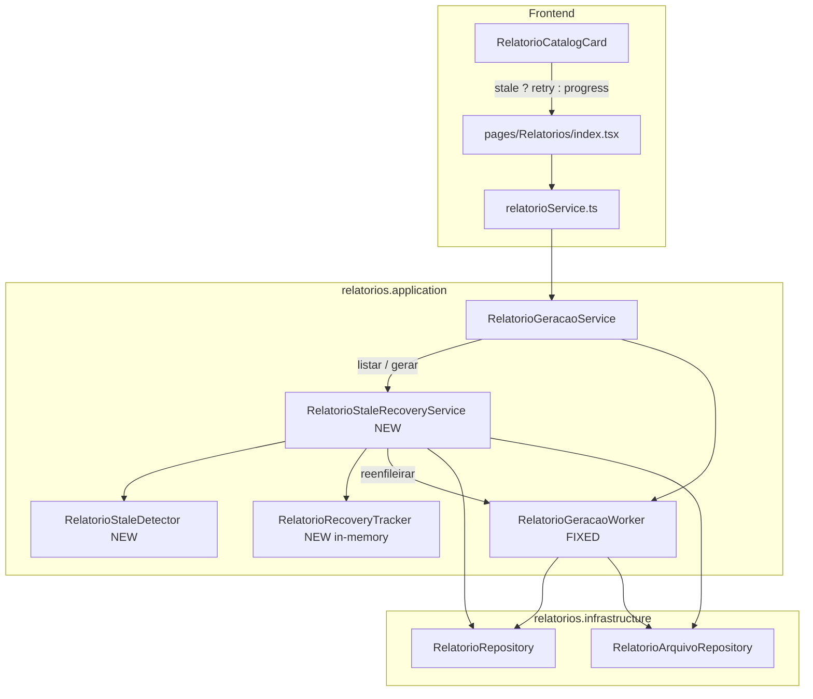

# relatorios-executivos-fix1 — Design

**Spec**: `_docs/specs/features/relatorios-executivos-fix1/spec.md`  
**Parent**: `_docs/specs/features/relatorios-executivos/`  
**Status**: Draft — Tasks complete; aguardando aprovação antes de Execute  
**Constraints**: AD-008 (`relatorios.{camada}`); AD-011 (ACL); AD-015 (async PDF, BYTEA, polling 2s); sem filas externas; sem migration Flyway salvo P2 BYTEA (mapeamento JPA only)

---

## Architecture Overview

Fix cirúrgico no **ciclo de vida do job** já existente (`RelatorioGeracaoService` → `RelatorioGeracaoWorker`). Não altera renderização PDF, hub layout ou ACL. Três eixos:

1. **Integridade terminal do worker** — todo caminho de saída leva a `PROCESSADO` ou `ERRO`.
2. **Recovery lazy de jobs stale** — detectar, reenfileirar uma vez, promover a `ERRO` na segunda detecção; rodar em `listar*` / `gerar*` antes de contagem 429.
3. **Frontend acionável** — timeout POST ≥65s, toasts por status HTTP, card por usuário logado, retry em `PENDENTE` stale.



**Fluxo stale (lazy recovery):**

```text
GET listar* / POST gerar*
  → RelatorioStaleRecoveryService.recuperarParaUsuario(usuarioId)
      para cada PENDENTE sem blob:
        se isStale(relatorio):
          se recoveryAttempted(id) == false:
            log INFO; reenfileirar worker; marcar attempted
          senão:
            log WARN; status=ERRO, erro="Tempo esgotado na geração"
  → contagem 429 só sobre PENDENTE non-stale
  → retorna DTOs com dataCriacao + stale
```

**Threshold stale (spec default):**

```text
stale ⟺ status=PENDENTE
        ∧ sem linha em relatorio_arquivo
        ∧ (data_criacao == null ∨ now − data_criacao > timeoutSegundos + staleGraceSegundos)
```

Defaults: `timeoutSegundos=60`, `staleGraceSegundos=120` → **180s**.

---

## Code Reuse Analysis

### Existing Components to Leverage

| Component | Location | How to Use |
| --------- | -------- | ---------- |
| `RelatorioGeracaoService` | `relatorios/application/` | Estender com hooks de recovery antes de listar/gerar/contar |
| `RelatorioGeracaoWorker` | `relatorios/application/` | Corrigir caminhos de saída; manter `@Async("relatorioExecutor")` |
| `RelatorioGeracaoProperties` | `relatorios/application/` | Adicionar `staleGraceSegundos`; defaults em `application.yml` |
| `RelatorioRepository` | `relatorios/infrastructure/` | Trocar listagem tenant-wide por query por `usuarioId` (já existe); nova query `findByUsuarioIdAndStatusAndAtivoTrue` para sweep stale |
| `RelatorioCatalogCard` | `frontend/src/pages/Relatorios/` | Estender com estado `stale` — botão retry vs progress |
| `relatorioService.ts` | `frontend/src/services/` | Timeout 65s já presente; adicionar helper de erro HTTP |
| `GlobalExceptionHandler` | `exception/` | 429/403/409 já mapeados — FE só precisa ler `response.status` + `message`/`detail` |
| `RelatorioGeracaoServiceTest` / `RelatorioGeracaoWorkerTest` | `backend/src/test/...` | Base para cenários stale, 429, worker terminal |
| `Relatorios.test.tsx` | `frontend/src/pages/Relatorios/` | Estender mocks 429/403/timeout/stale |

### Integration Points

| System | Integration Method |
| ------ | ------------------ |
| PostgreSQL | Sem DDL novo; Flyway `V1.28` já define `pdf_bytes BYTEA` |
| Spring `@Async` | Reuso de `relatorioExecutor`; reenqueue via `enfileirarProcessamentoAposCommit` existente |
| Spring Security | Inalterado; listagem passa a filtrar por `usuarioId` do token |
| `application.yml` | Novas chaves sob `relatorios.geracao.stale-grace-segundos` |

---

## Components

### `RelatorioStaleDetector`

- **Purpose**: Centralizar regra FIX1-05 de stale (PENDENTE + sem blob + idade).
- **Location**: `relatorios/application/RelatorioStaleDetector.java`
- **Interfaces**:
  - `boolean isStale(Relatorio relatorio, boolean hasPdfBlob)` — usa `Clock` injetável
  - `Duration staleThreshold()` — `timeoutSegundos + staleGraceSegundos`
- **Dependencies**: `RelatorioGeracaoProperties`, `Clock`
- **Reuses**: Constante de erro `"Tempo esgotado na geração"` compartilhada com recovery

### `RelatorioRecoveryTracker`

- **Purpose**: Registrar tentativa única de reenqueue por `relatorioId` **sem coluna DB** (spec: in-process OK).
- **Location**: `relatorios/application/RelatorioRecoveryTracker.java`
- **Interfaces**:
  - `boolean hasAttempted(Long relatorioId)`
  - `void markAttempted(Long relatorioId)`
  - `void clear(Long relatorioId)` — chamado quando job atinge estado terminal
- **Dependencies**: Nenhuma ( `ConcurrentHashMap<Long, Boolean>` )
- **Reuses**: Padrão stateless `@Component` singleton Spring
- **Nota**: Restart do container zera mapa → job stale recebe mais uma reenqueue (edge case aceito pela spec).

### `RelatorioStaleRecoveryService`

- **Purpose**: Orquestrar sweep lazy FIX1-06/07/08 em listar e gerar.
- **Location**: `relatorios/application/RelatorioStaleRecoveryService.java`
- **Interfaces**:
  - `void recuperarParaUsuario(Long usuarioId)` — processa todos PENDENTE do usuário
  - `void recuperarRelatorio(Relatorio relatorio)` — foco em tupla do POST
  - `long contarPendentesAtivos(Long usuarioId)` — pós-recovery, exclui stale remanescente
- **Dependencies**: `RelatorioRepository`, `RelatorioArquivoRepository`, `RelatorioStaleDetector`, `RelatorioRecoveryTracker`, `RelatorioGeracaoWorker` (reenfileirar), `TransactionTemplate`, `RelatorioGeracaoProperties`
- **Reuses**: Mesmo padrão `enfileirarProcessamentoAposCommit` extraído para método package-private em `RelatorioGeracaoService` ou delegado via callback injetado (evitar dependência circular: recovery chama `Consumer<Long> enqueueFn` wired no config/service)

**Serialização por tupla:** reenqueue usa o registro existente `(usuarioId, tipo, mes, ano)` — não cria duplicata (unique constraint).

### `RelatorioGeracaoWorker` (fix)

- **Purpose**: Garantir estados terminais FIX1-01…04.
- **Location**: `relatorios/application/RelatorioGeracaoWorker.java`
- **Changes**:
  - `findById` null → WARN + return (nada a corrigir).
  - `ativo=false` **e** `status=PENDENTE` → `marcarErro(..., "Relatório indisponível")` + WARN.
  - `try/catch` existente mantido; adicionar `finally` safety-net: se ainda `PENDENTE` após bloco, `marcarErro` genérico.
  - Logs INFO início/fim com `relatorioId`, `login`, `tipo`, `competencia`.
  - `marcarErro` / sucesso → `recoveryTracker.clear(relatorioId)`.
- **Dependencies**: + `RelatorioRecoveryTracker`
- **Reuses**: `marcarErro`, `truncarErro`, render/persist existentes

### `RelatorioGeracaoService` (fix)

- **Purpose**: Integrar recovery + limite 429 correto + listagem scoped.
- **Location**: `relatorios/application/RelatorioGeracaoService.java`
- **Changes**:
  - `listarFolha` / `listarBeneficio`: `@Transactional` read-write (ou `TransactionTemplate` para writes de recovery); chamar `recuperarParaUsuario` **antes** do map DTO; usar `findByUsuarioIdAndTipoAndAtivoTrueOrderByAnoDescMesDesc`.
  - `iniciarGeracao`: `recuperarParaUsuario` + `recuperarRelatorio` na tupla alvo **antes** do limite; substituir `countByUsuarioIdAndStatus` por `contarPendentesAtivos`; manter reenqueue quando `jaPendente && !stale`.
  - `toFolhaDto` / `toBeneficioDto`: incluir `dataCriacao`, `stale` (computed).
- **Dependencies**: + `RelatorioStaleRecoveryService`
- **Reuses**: `ProcessamentoHandle`, `aguardarProcessamento`, ACL, upsert tupla

### DTOs `RelatorioFolhaDTO` / `RelatorioBeneficioDTO`

- **Purpose**: Expor metadados para card por usuário e hint stale no FE.
- **Location**: `relatorios/api/RelatorioFolhaDTO.java`, `RelatorioBeneficioDTO.java`
- **Interfaces** (campos novos no record):
  - `LocalDateTime dataCriacao`
  - `boolean stale` — `true` iff `status==PENDENTE && isStale`
- **Dependencies**: Nenhuma
- **Reuses**: Records existentes; OpenAPI regenerado no FE quando aplicável

**Decisão FIX1-19:** filtrar no **backend** por `usuarioId` autenticado (query já existe). **Não** expor `usuarioId` no DTO — FE infere ownership implicitamente. Atende FIX1-20/21 sem match client-side em lista tenant-wide.

### `relatorioService.ts` + `Relatorios/index.tsx`

- **Purpose**: Timeout, erros acionáveis, retry stale FIX1-13…18.
- **Location**: `frontend/src/services/relatorioService.ts`, `frontend/src/pages/Relatorios/index.tsx`
- **Interfaces**:
  - `resolveRelatorioApiError(error: unknown): string` — mapeia 429, 403, `ECONNABORTED`, fallback
  - Tipos `RelatorioFolha` / `RelatorioBeneficio`: + `dataCriacao?`, `stale?`
- **Changes em `index.tsx`**:
  - Remover early-return cego em `gerar*` quando `PENDENTE` — permitir quando `stale===true`.
  - Usar `resolveRelatorioApiError` nos `catch` de gerar.
  - Passar `stale` ao card; polling continua enquanto `PENDENTE && !stale`.
- **Changes em `RelatorioCatalogCard`**:
  - Prop `stale?: boolean`
  - `PENDENTE && stale` → botão **"Tentar novamente"** (chama `onRetry`) em vez de "Gerando…" desabilitado
  - `PENDENTE && !stale` → progress + botão desabilitado (REL-24)

### `RelatorioArquivo` entity (P2)

- **Purpose**: Mapeamento BYTEA confiável FIX1-22/23 em perfil `dev` (`ddl-auto: update`).
- **Location**: `relatorios/domain/RelatorioArquivo.java`
- **Changes**: Remover `@Lob`; usar `@Column(name = "pdf_bytes", nullable = false, columnDefinition = "bytea")` **ou** `@JdbcTypeCode(SqlTypes.VARBINARY)` (Hibernate 6). Sem alter Flyway — schema já é BYTEA.
- **Reuses**: Coluna existente `V1.28`

---

## Data Models

### DTO estendido (API response)

```java
public record RelatorioFolhaDTO(
    Long id,
    Integer mes,
    Integer ano,
    Integer totalFuncionarios,
    BigDecimal totalFolha,
    BigDecimal totalBeneficios,
    RelatorioStatus status,
    LocalDateTime dataProcessamento,
    String erro,
    LocalDateTime dataCriacao,  // NEW
    boolean stale               // NEW — server-computed
) {}
```

`RelatorioBeneficioDTO` — mesmos dois campos finais.

### Config (`RelatorioGeracaoProperties`)

```java
private int timeoutSegundos = 60;
private int maxTamanhoMb = 50;
private int maxJobsSimultaneosPorUsuario = 3;
private int staleGraceSegundos = 120;  // NEW
```

`application.yml`:

```yaml
relatorios:
  geracao:
    timeout-segundos: 60
    stale-grace-segundos: 120
    max-tamanho-mb: 50
    max-jobs-simultaneos-por-usuario: 3
```

### Repository addition

```java
List<Relatorio> findByUsuarioIdAndStatusAndAtivoTrue(
    Long usuarioId, RelatorioStatus status);
```

Usado pelo recovery sweep (volume baixo: ≤3 ativos + stale histórico).

---

## Error Handling Strategy

| Error Scenario | Handling | User Impact |
| -------------- | -------- | ----------- |
| Job stale (1ª detecção) | Reenqueue worker; DTO `stale=true` | Card mostra retry ou progress breve até polling |
| Job stale (2ª detecção) | `status=ERRO`, erro fixo | Botão "Tentar novamente"; libera slot 429 |
| Worker falha render/persist | `marcarErro` (existente) | Card ERRO + retry |
| Worker id inexistente pós-commit | WARN log only | Recovery lazy tratará se registro reaparecer; caso raro |
| ≥3 PENDENTE non-stale | `RelatorioGeracaoLimiteException` → 429 | Toast: limite de gerações simultâneas |
| ACL negado | `RelatorioAcessoNegadoException` → 403 | Toast: acesso negado |
| POST axios timeout 65s | Job continua no servidor | Toast: tempo esgotado; sugere aguardar polling |
| Download PENDENTE/ERRO | `RelatorioIndisponivelException` → 409 | Toast download indisponível (paridade REL-05) |

---

## Risks & Concerns

| Concern | Location | Impact | Mitigation |
| ------- | -------- | ------ | ---------- |
| Worker retorna sem terminal state | `RelatorioGeracaoWorker.java:47-50` | Órfãos PENDENTE | `finally` safety-net + stale recovery |
| `@Lob` → OID em dev Hibernate | `RelatorioArquivo.java:25-28` | Falha silenciosa ao persistir PDF | P2: mapeamento BYTEA explícito |
| Listagem tenant-wide | `RelatorioGeracaoService.java:78-79` | Card mostra PENDENTE de outro usuário | Trocar para query por `usuarioId` |
| `listar*` read-only impede recovery writes | `RelatorioGeracaoService.java:75` | Stale não promovido no GET | Transaction read-write ou `TransactionTemplate` para sub-transação de recovery |
| Dependência circular Service↔Recovery | Novo wiring | Falha de contexto Spring | Injetar `Consumer<Long>` / `@Lazy` para enqueue |
| `recoveryAttempted` in-memory | `RelatorioRecoveryTracker` | Perde estado no restart | Aceito — nova reenqueue; segunda janela stale → ERRO |
| FE timeout global 10s em `api.ts` | `frontend/src/services/api.ts:20` | POST aborta cedo se override falhar | Manter override 65s **por request** em `relatorioService` (já feito); validar em teste |
| Contagem 429 antes de recovery | `RelatorioGeracaoService.java:124-127` | Deadlock com órfãos | Recovery **sempre** antes de `contarPendentesAtivos` |
| Teste worker id inexistente ausente | `RelatorioGeracaoWorkerTest.java` | Regressão FIX1-03 | Novo teste assert no save + WARN |

---

## Tech Decisions

| Decision | Choice | Rationale |
| -------- | ------ | --------- |
| Stale recovery trigger | **Lazy** em listar/gerar (sem scheduler) | Spec default; suficiente para MVP operacional |
| `recoveryAttempted` storage | **In-memory** `ConcurrentHashMap` | Spec permite; evita Flyway; restart = 1 reenqueue extra |
| FIX1-19 ownership | **Backend filter** por `usuarioId` | Query já existe; menos payload; FE simplifica |
| Stale hint no FE | **`stale` boolean no DTO** + `dataCriacao` | Evita duplicar threshold no FE; card decisão trivial |
| BYTEA fix | **JPA mapping only** (`columnDefinition` / `@JdbcTypeCode`) | Flyway já BYTEA; sem migration |
| Enqueue delegation | **Package-private** `enqueueProcessamento(id)` em service | Recovery reusa mesmo afterCommit do POST |
| Limite 429 | **Promote-then-count** | Stale vira ERRO antes da contagem; atende FIX1-08/11 |
| Mensagem ERRO stale | Texto exato `"Tempo esgotado na geração"` | Spec FIX1-07 |

> Decisões feature-local — nenhum novo AD project-level necessário (AD-015 já cobre async/BYTEA).

---

## Requirement → Design Mapping

| ID | Component(s) |
| -- | ------------ |
| FIX1-01…04 | `RelatorioGeracaoWorker` + tests |
| FIX1-05…08 | `RelatorioStaleDetector`, `RelatorioStaleRecoveryService`, `RelatorioRecoveryTracker` |
| FIX1-09…12 | `RelatorioGeracaoService.iniciarGeracao` + WebMvc/service tests |
| FIX1-13…18 | `relatorioService.ts`, `Relatorios/index.tsx`, `RelatorioCatalogCard` |
| FIX1-19…21 | `RelatorioGeracaoService.listar*` query por usuário |
| FIX1-22…23 | `RelatorioArquivo` mapping + worker persist test |

---

## Suggested Task Breakdown (preview for Tasks phase)

| # | Task | Requirements |
| - | ---- | ------------ |
| T1 | `RelatorioStaleDetector` + `RelatorioRecoveryTracker` + properties/yml | FIX1-05 |
| T2 | `RelatorioStaleRecoveryService` + repository query + service hooks listar/gerar/429 | FIX1-06…09, FIX1-11 |
| T3 | `RelatorioGeracaoWorker` terminal paths + tests | FIX1-01…04 |
| T4 | DTO `dataCriacao`/`stale` + listagem por usuário | FIX1-19…21, FIX1-05 |
| T5 | FE error helper + timeout verify + stale retry card | FIX1-13…18 |
| T6 | Vitest 429/403/timeout/stale/multi-user | FIX1-14…18, FIX1-21 |
| T7 | `RelatorioArquivo` BYTEA mapping + persist test (P2) | FIX1-22…23 |

Estimativa: **7 tasks**, cabível em **1 batch** de Execute (~≤8).

---

## Verification Notes (for Tasks/Execute)

- Backend gate: `mvn test -Dtest=RelatorioGeracaoWorkerTest,RelatorioGeracaoServiceTest,RelatorioFolhaControllerWebMvcTest,RelatorioBeneficioControllerWebMvcTest`
- Frontend gate: `npm run test -- src/pages/Relatorios`
- Manual Docker: reproduzir 3× PENDENTE órfãos → após GET `/relatorios/folha`, slots liberados e nova competência gera sem 429

**Branch:** `feat/relatorios-executivos` · **Commit prefix:** `fix1:`
