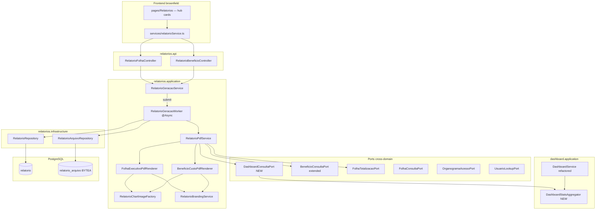

# Relatórios Executivos — Design

**Spec**: `_docs/specs/features/relatorios-executivos/spec.md`  
**Status**: Draft — aguardando aprovação antes de Execute  
**Constraints**: AD-001…AD-014; **AD-008** (`relatorios.{camada}` + ports cross-domain); **AD-010** (application só via `*.port`); **AD-011** (`ACESSO_TOTAL` explícito); **AD-012** (custo empresa via motor folha + benefícios)

---

## Approach Exploration

Três abordagens viáveis para PDFs **premium + úteis** dentro do escopo da spec:

| Approach | Descrição | Prós | Contras |
| -------- | --------- | ---- | ------- |
| **A — OpenPDF programático + Java2D** ⭐ | Layout PDF via OpenPDF 2.0.x (Java 17); gráficos como PNG gerados com `BufferedImage` | ACL server-side; blob persistido; testável (bytes + strings no PDF); LGPL; zero browser | Layout verbose; mais código de template |
| **B — HTML/CSS → PDF (OpenPDF-html / Flying Saucer)** | Templates Thymeleaf/HTML estilizados convertidos em PDF | Visual “marketing” rápido com CSS | Testes frágeis; deps extras; mapeamento HTML↔dados mais difícil |
| **C — PDF no frontend (react-pdf / print)** | React renderiza e exporta no browser | Reusa Recharts | Quebra ACL auditável; sem persistência server; fora da spec |

**Recomendação: Approach A.** Entrega controle visual (capa, KPI boxes, cores Techne, tabelas premium) com arquitetura alinhada ao monólito modular e aos requisitos de paridade com dashboard/ACL.

---

## Architecture Overview

Novo domínio **`relatorios`** com geração assíncrona controlada, persistência de metadados + blob PDF, e consumo de dados **somente via ports** existentes (estendidas onde necessário).



**Fluxo de geração (POST → download):**

```text
1. POST /relatorios/{folha|beneficio} { mes, ano }
   → valida competência (não futura), ACL (403 se negado)
   → upsert metadados (tipo, mes, ano, usuarioId) status=PENDENTE
   → submete RelatorioGeracaoWorker

2. Worker (pool dedicado, max 3 jobs/usuário):
   → resolve AccessContext + competenciaInicio/Fim
   → carrega agregados via DashboardConsultaPort / BeneficioConsultaPort
   → renderiza PDF (OpenPDF) → valida tamanho ≤ 50 MB
   → persiste BYTEA + totais + status=PROCESSADO
   → em falha: status=ERRO, erro truncado 500 chars

3. POST aguarda future.get(60s):
   → se concluir: retorna DTO com status final
   → se timeout: retorna PENDENTE (FE faz polling GET lista 2s)

4. GET /relatorios/{tipo}/{id}/download
   → 200 application/pdf se PROCESSADO
   → 409 se PENDENTE/ERRO
```

---

## Code Reuse Analysis

### Existing Components to Leverage

| Component | Location | How to Use |
| --------- | -------- | ---------- |
| `relatorioService.ts` + `Relatorios/index.tsx` | `frontend/src/` | Evoluir UI; manter contrato REST base (`/relatorios/folha`, `/beneficio`) |
| `DashboardService` agregações | `dashboard/application/DashboardService.java` | Extrair para `DashboardStatsAggregator`; reutilizar lógica CC/LN/cargo/rubricas/evolução |
| `FolhaTotalizacaoPort` | `folha/port/` | Custo folha consolidado no relatório benefícios |
| `OrganogramaAcessoPort` | `organograma/acesso/port/` | ACL idêntica folha/dashboard |
| `BeneficioMensalService.resumoPorCompetencia` | `beneficios/application/` | Lógica espelhada no port (não injetar service cross-domain) |
| `formatMoneyDisplay` | `frontend/src/utils/money.ts` | Formatação BRL na UI |
| `Dashboard` cards/charts estilo | `frontend/src/pages/Dashboard/index.tsx` | Referência visual (cores pie, spacing MUI v7) |
| `GlobalExceptionHandler` | `exception/` | Novas exceções domínio → 400/403/404/409 |
| `ModularArchitectureTest` | `arch/ModularArchitectureTest.java` | Garantir `relatorios.application` sem infra estrangeira |

### Integration Points

| System | Integration Method |
| ------ | ------------------ |
| PostgreSQL | Flyway `V1.28__create_relatorio.sql` |
| Spring Security | `/relatorios/**` → `authenticated()`; POST bloqueado para API Key read-only (AD-013) |
| Dashboard | Novo `DashboardConsultaPort` — stats por competência |
| Benefícios | Extensão `BeneficioConsultaPort` — resumo/drill-down/matriz |
| Folha | `FolhaConsultaPort` + `FolhaTotalizacaoPort` (ficha priorizada via linhas existentes) |
| Branding | `classpath:branding/logo.png` + `application.yml` `relatorios.branding.*` |

---

## Components

### `DashboardStatsAggregator` + `DashboardConsultaPort`

- **Purpose**: Fonte única de agregados gerenciais por competência — paridade dashboard ↔ PDF folha (REL-08).
- **Location**: `dashboard/application/DashboardStatsAggregator.java`, `dashboard/port/DashboardConsultaPort.java`, `dashboard/application/DashboardConsultaAdapter.java`
- **Interfaces**:
  - `DashboardStatsDTO getStatsForCompetencia(String login, LocalDate competenciaInicio, LocalDate competenciaFim, boolean decimoTerceiro)` — stats scoped/global para competência **especificada** (não “mais recente”)
  - `List<EvolucaoMensalDTO> getEvolucaoMeses(String login, LocalDate fimInclusive, int quantidadeMeses, boolean decimoTerceiro)` — últimos 6 meses terminando na competência do relatório
- **Dependencies**: `FolhaConsultaPort`, `FolhaTotalizacaoPort`, `BeneficioConsultaPort`, `OrganogramaAcessoPort`, `UsuarioLookupPort`, `CadastrosImportLookupPort`
- **Reuses**: Métodos privados atuais de `DashboardService` (`calcularStatsPorCentroCusto`, `topProventos`, etc.) movidos/refatorados para aggregator
- **Refactor**: `DashboardService.getStats()` chama `getStatsForCompetencia` usando `findResumoMaisRecente()` — zero mudança de comportamento do dashboard atual

### `BeneficioConsultaPort` (extensão)

- **Purpose**: Dados read-only para PDF benefícios sem acoplar `relatorios` à infra de benefícios.
- **Location**: `beneficios/port/BeneficioConsultaPort.java` + `BeneficioConsultaAdapter`
- **Novos métodos**:
  - `List<BeneficioTipoResumoSnapshot> resumoPorTipo(competenciaInicio, competenciaFim, Set<Long> centrosCustoIds)`
  - `List<BeneficioFuncionarioValorSnapshot> topFuncionariosPorTipo(Long tipoBeneficioId, ..., int limit)`
  - `List<BeneficioCcTipoSnapshot> matrizCentroCustoPorTipo(..., int topCc, int topTipos)`
- **Reuses**: Queries JPQL já usadas em `BeneficioMensalRepository` / projeções existentes

### `RelatorioGeracaoService`

- **Purpose**: Orquestra validação, idempotência, limites de concorrência e disparo do worker.
- **Location**: `relatorios/application/RelatorioGeracaoService.java`
- **Interfaces**:
  - `RelatorioFolhaDTO gerarFolha(String login, int mes, int ano)`
  - `RelatorioBeneficioDTO gerarBeneficio(String login, int mes, int ano)`
  - `List<RelatorioFolhaDTO> listarFolha(String login)` / `listarBeneficio`
  - `Optional<byte[]> downloadPdf(String login, Long id, RelatorioTipo tipo)`
- **Dependencies**: `RelatorioRepository`, `RelatorioGeracaoWorker`, ports ACL
- **Regras**:
  - Upsert por `(tipo, mes, ano, usuarioId)` — invalida PDF anterior (REL spec re-geração)
  - Max 3 jobs `PENDENTE` simultâneos por `usuarioId` → HTTP 429
  - Lock pessimista ou `@Transactional` + `SELECT FOR UPDATE` por `(tipo, mes, ano)` global para serializar processamento pesado

### `RelatorioGeracaoWorker`

- **Purpose**: Executa renderização fora do thread HTTP.
- **Location**: `relatorios/application/RelatorioGeracaoWorker.java`
- **Interfaces**: `@Async void processar(Long relatorioId)`
- **Dependencies**: `RelatorioPdfService`, repositories
- **Config**: `RelatorioAsyncConfig` — `ThreadPoolTaskExecutor` (core=2, max=4, queue=20, prefix=`relatorio-`)

### `RelatorioPdfService` + Renderers

- **Purpose**: Monta modelos de view e delega renderização por tipo.
- **Location**: `relatorios/application/pdf/`
- **Interfaces**:
  - `byte[] renderFolhaExecutivo(RelatorioFolhaModel model)`
  - `byte[] renderBeneficioCusto(RelatorioBeneficioModel model)`
- **Renderers**:
  - `FolhaExecutivoPdfRenderer` — capa KPI 2×2, seções CC/LN, top rubricas, gráfico evolução
  - `BeneficioCustoPdfRenderer` — capa KPI, tabela tipos, sub-seções top 10, matriz 5×5
- **Reuses**: `RelatorioBrandingService`, `RelatorioChartImageFactory`, `RelatorioLayoutHelper` (tabelas zebradas, cabeçalhos coloridos, rodapé)

### `RelatorioBrandingService`

- **Purpose**: Identidade visual Techne configurável.
- **Location**: `relatorios/application/RelatorioBrandingService.java`
- **Interfaces**: `BrandingTheme load()` → logo `Optional<byte[]>`, cores hex, fontes
- **Config** (`application.yml`):

```yaml
relatorios:
  branding:
    primary-color: "#1976d2"
    secondary-color: "#dc004e"
    text-color: "#1e293b"
    muted-background: "#f8fafc"
    logo-path: "classpath:branding/logo.png"
  geracao:
    timeout-segundos: 60
    max-tamanho-mb: 50
    max-jobs-simultaneos-por-usuario: 3
```

- **Fallback**: Se logo ausente → desenhar wordmark `"TECHNE"` em `primary-color` na capa

### `RelatorioChartImageFactory`

- **Purpose**: Gráficos estáticos “executivos” embutidos no PDF.
- **Location**: `relatorios/application/pdf/RelatorioChartImageFactory.java`
- **Interfaces**:
  - `byte[] lineChart(List<String> labels, List<BigDecimal> values, BrandingTheme theme)`
  - `byte[] horizontalBarChart(Map<String, BigDecimal> data, BrandingTheme theme, int maxBars)`
- **Implementation**: Java2D (`BufferedImage` → PNG bytes) — sem JFreeChart no MVP (menos deps); barras arredondadas, gradiente primary→secondary
- **Reuses**: Paleta alinhada ao Dashboard (`pieColors` como referência)

### `RelatorioFolhaController` / `RelatorioBeneficioController`

- **Purpose**: REST fino — espelha contrato frontend existente.
- **Location**: `relatorios/api/`
- **Endpoints**:

| Método | Path | Response |
| ------ | ---- | -------- |
| POST | `/relatorios/folha` | `RelatorioFolhaDTO` |
| GET | `/relatorios/folha` | `List<RelatorioFolhaDTO>` |
| GET | `/relatorios/folha/{id}/download` | `application/pdf` |
| POST | `/relatorios/beneficio` | `RelatorioBeneficioDTO` |
| GET | `/relatorios/beneficio` | `List<RelatorioBeneficioDTO>` |
| GET | `/relatorios/beneficio/{id}/download` | `application/pdf` |

- **DTO records**: Alinhar campos a `relatorioService.ts` (`id`, `mes`, `ano`, totais, `status`, `dataProcessamento`, `erro`)

### Frontend — Hub de Relatórios

- **Purpose**: UX premium + a11y; brownfield em `pages/Relatorios/` (AD-004).
- **Location**: `frontend/src/pages/Relatorios/index.tsx`, subcomponentes colocalizados
- **Componentes novos**:
  - `RelatorioCatalogCard` — ícone MUI (`Assessment`, `CardGiftcard`), badge status, ações Gerar/Baixar/Tentar novamente
  - `CompetenciaPicker` — `MonthPicker` MUI (`LocalizationProvider` + `DatePicker` views=`['year','month']`)
  - `RelatorioStatusBadge` — `PENDENTE`/`PROCESSADO`/`ERRO` com cores semânticas
- **Polling**: `useQuery` ou `useEffect` interval 2s enquanto existir card `PENDENTE` na competência selecionada
- **Thumbnail (REL-25)**: MVP = ícone `PictureAsPdf` estilizado em card; **sem** endpoint thumbnail (defer P2 — render primeira página exige PDFBox extra)
- **Reuses**: Padrões Dashboard (Cards, `formatMoneyDisplay`, Notification hook)

---

## Data Models

### Flyway `V1.28__create_relatorio.sql`

```sql
CREATE TABLE relatorio (
    id              BIGSERIAL PRIMARY KEY,
    tipo            VARCHAR(20) NOT NULL,  -- FOLHA | BENEFICIO
    mes             INT NOT NULL CHECK (mes BETWEEN 1 AND 12),
    ano             INT NOT NULL CHECK (ano BETWEEN 2000 AND 2100),
    status          VARCHAR(20) NOT NULL DEFAULT 'PENDENTE',
    usuario_id      BIGINT NOT NULL REFERENCES usuarios(id),
    total_funcionarios INT,
    total_folha     NUMERIC(19,2),
    total_beneficios NUMERIC(19,2),
    total_valor     NUMERIC(19,2),         -- benefício: total_valor; folha: pode espelhar total_folha
    erro            VARCHAR(500),
    data_criacao    TIMESTAMP NOT NULL DEFAULT CURRENT_TIMESTAMP,
    data_processamento TIMESTAMP,
    ativo           BOOLEAN NOT NULL DEFAULT TRUE,
    CONSTRAINT uk_relatorio_usuario_tipo_comp UNIQUE (usuario_id, tipo, mes, ano)
);

CREATE TABLE relatorio_arquivo (
    relatorio_id BIGINT PRIMARY KEY REFERENCES relatorio(id) ON DELETE CASCADE,
    pdf_bytes    BYTEA NOT NULL,
    tamanho_bytes BIGINT NOT NULL,
    data_criacao TIMESTAMP NOT NULL DEFAULT CURRENT_TIMESTAMP
);

CREATE INDEX idx_relatorio_tipo_comp ON relatorio (tipo, ano DESC, mes DESC) WHERE ativo = TRUE;
CREATE INDEX idx_relatorio_status ON relatorio (status) WHERE ativo = TRUE;
```

### JPA Entities

```java
// relatorios/domain/Relatorio.java
@Entity @Table(name = "relatorio")
@Data
class Relatorio {
  @Id @GeneratedValue Long id;
  @Enumerated(EnumType.STRING) RelatorioTipo tipo;
  Integer mes; Integer ano;
  @Enumerated(EnumType.STRING) RelatorioStatus status;
  @ManyToOne Usuario usuario;  // ou Long usuarioId se preferir desacoplar auth entity
  Integer totalFuncionarios;
  BigDecimal totalFolha, totalBeneficios, totalValor;
  String erro;
  LocalDateTime dataCriacao, dataProcessamento;
  Boolean ativo;
}

// relatorios/domain/RelatorioArquivo.java — @OneToOne, LAZY, pdfBytes
```

### View Models (application, não persistidos)

```java
record RelatorioFolhaModel(
    BrandingTheme branding,
    String competenciaLabel,
    String geradoPor,
    LocalDateTime geradoEm,
    DashboardStatsDTO stats,
    List<EvolucaoMensalDTO> evolucao6Meses,
    boolean semDados
) {}

record RelatorioBeneficioModel(
    BrandingTheme branding,
    String competenciaLabel,
    String geradoPor,
    LocalDateTime geradoEm,
    BigDecimal totalBeneficios,
    long qtdLancamentos,
    BigDecimal totalCustoFolha,
    BigDecimal custoConsolidado,
    List<BeneficioTipoResumoSnapshot> porTipo,
    Map<Long, List<BeneficioFuncionarioValorSnapshot>> top10PorTipo,
    List<BeneficioCcTipoSnapshot> matrizCcTipo,
    boolean semBeneficios,
    boolean semFolha
) {}
```

---

## PDF Visual Design System

Layout premium fixo (não editor) — “executive briefing”:

| Elemento | Especificação |
| -------- | ------------- |
| **Capa** | Faixa superior `primary-color` (72 pt); logo/wordmark centralizado; título 24 pt branco; competência 18 pt; faixa inferior com 4 KPI boxes (borda arredondada simulada, fundo `muted-background`) |
| **Tipografia** | Helvetica/OpenPDF built-in: título 16 pt bold, corpo 10 pt, KPI valor 14 pt bold |
| **Tabelas** | Cabeçalho fundo `primary-color` texto branco; linhas zebradas `#f1f5f9`; padding 6 pt |
| **Gráficos** | PNG inline max 480×200 pt; legenda abaixo |
| **Rodapé** | Todas páginas exceto capa: `"Gerado pelo Sistema de Folha — Techne | Página X de Y"` 8 pt cinza |
| **Moeda** | `NumberFormat` pt-BR currency BRL em todo renderer |

**Prioridade ficha vs ADP (spec):** Worker consulta `FolhaConsultaPort.findLinhasAtivasPorCompetencia` com `decimoTerceiro=false` default; se existir snapshot ficha (`existsByCompetencia` no adapter), linhas vêm de `ficha_linha` (já implementado no adapter pós-processamento).

---

## Error Handling Strategy

| Error Scenario | Handling | User Impact | HTTP |
| -------------- | -------- | ----------- | ---- |
| Competência futura | Bean Validation / guard | Toast "Competência futura não permitida" | 400 |
| ACL negado (sem organograma) | `OrganogramaAcessoPort` | Toast "Acesso negado" | 403 |
| Download PENDENTE/ERRO | `RelatorioIndisponivelException` | Botão download disabled; 409 se forçado | 409 |
| PDF > 50 MB | Catch no worker | status ERRO, msg truncada | POST retorna ERRO |
| Render exception | Log + ERRO | "Erro ao gerar relatório" + Tentar novamente | POST retorna ERRO |
| Id não encontrado | `RelatorioNotFoundException` | Toast erro | 404 |
| 3 jobs simultâneos | Counter em memória/DB | "Aguarde gerações em andamento" | 429 |
| API Key POST gerar | `ApiKeyWriteGuardFilter` | 403 (geração = mutação) | 403 |

---

## Risks & Concerns

| Concern | Location | Impact | Mitigation |
| ------- | -------- | ------ | ---------- |
| Dashboard só stats “mais recente” | `DashboardService.getStats():72` | PDF competência passada divergiria do dashboard | `DashboardConsultaPort.getStatsForCompetencia` + teste paridade REL-08 |
| Sem `@Async` no projeto | — | Bloqueio thread Tomcat | `RelatorioAsyncConfig` + timeout 60s com fallback PENDENTE |
| OpenPDF 2.1+ exige Java 21 | OpenPDF releases | Incompatível com bytecode 17 | Fixar **`openpdf:2.0.3`** (branch 2.0.x, Java 17) |
| BYTEA grande no PostgreSQL | `relatorio_arquivo` | Backup/IO | Limite 50 MB; purge P3; índice só em metadados |
| N+1 drill-down benefícios | `BeneficioMensalRepository` | Lentidão PDF benefícios | Queries agregadas batch no port extension; top 10 por tipo em 1 query/tipo (max ~10 tipos) |
| UI Relatórios mockada sem backend | `relatorioService.ts` | Regressão se contrato mudar | Manter paths; WebMvc tests; Vitest atualizado |
| API Key read-only vs POST gerar | AD-013 | Integrações não geram PDF | Documentado; POST exige JWT humano |
| Logo ausente | branding/ | Capa sem polish | Wordmark TECHNE até asset do usuário |
| ArchUnit cross-domain | `ModularArchitectureTest` | Build fail se violar ports | Code review + teste arquitetura desde T1 |

---

## Tech Decisions

| Decision | Choice | Rationale |
| -------- | ------ | ----------- |
| PDF library | **OpenPDF 2.0.3** (`com.github.librepdf:openpdf`) | Java 17; LGPL; sem iText AGPL; tables/images nativos |
| Chart strategy | **Java2D → PNG** embed | Evita JFreeChart dep; suficiente para bar/line executivo |
| Async model | **@Async + optional wait 60s** | Atende spec; FE polling para jobs longos |
| PDF storage | **PostgreSQL BYTEA** | Monólito single-tenant; simplicidade ops |
| Stats source | **`DashboardConsultaPort`** | Paridade REL-08; DRY com dashboard |
| Thumbnail preview | **Ícone PDF no MVP** | Spec permite fallback; PDFBox defer P2 |
| CSV export | **P2 separado** | Endpoints `/download-csv` ou query `?format=csv` |
| Frontend structure | **Brownfield `pages/Relatorios/`** | AD-004; sem migrar para `features/` nesta entrega |

**Project-level decision (propor AD-015 no Execute):** Relatórios PDF gerados server-side com OpenPDF 2.0.x; agregados gerenciais cross-feature via `DashboardConsultaPort` — domínio `relatorios` não duplica lógica de dashboard.

---

## Requirement Traceability → Design Mapping

| ID | Design anchor |
| -- | ------------- |
| REL-01…06 | `RelatorioGeracaoService`, controllers, worker, Flyway |
| REL-07…15 | `FolhaExecutivoPdfRenderer` + `DashboardConsultaPort` |
| REL-16…21 | `BeneficioCustoPdfRenderer` + port extensions |
| REL-22…27 | Frontend hub components + polling |
| REL-28…29 | P2 — `RelatorioCsvExporter` |
| REL-30 | P2 — `CustoFuncionarioPdfRenderer` |
| REL-31 | `RelatorioBrandingService` + yml |
| REL-32…33 | P3 — `MomDeltaDecorator`, `RelatorioPurgeJob` |

**Coverage:** 33 requirements — 27 mapped in MVP/P2 design, 6 deferred P2/P3 explicit ⚠️

---

## Testing Strategy (for Tasks phase)

| Layer | Focus |
| ----- | ----- |
| Unit | `DashboardStatsAggregator` paridade; renderers assert `%PDF` + strings chave ("Relatório Executivo", competência) |
| Unit | `RelatorioGeracaoService` idempotência, limites, status transitions |
| WebMvc | `RelatorioFolhaControllerWebMvcTest` — 401/403/400/409/200 download |
| ArchUnit | `relatorios_application_must_not_access_foreign_infrastructure` |
| Integration | Gerar PDF com fixtures H2/Testcontainers opcional P2; MVP mocks nos renderers |
| FE Vitest | CompetenciaPicker payload; cards estados PENDENTE/PROCESSADO/ERRO |

---

## P2/P3 Deferred (design stubs only)

- **CSV**: `RelatorioCsvExporter` streaming `text/csv; charset=utf-8`, sep=`;`, BOM UTF-8
- **Custo/funcionário PDF**: reutiliza `FolhaTotalizacaoPort.consultarTotais` + tabela paginada 50/pg
- **MoM delta**: aggregator compara competência N vs N-1; decorator na capa
- **Purge**: `@Scheduled` daily 03:00 — soft-delete + delete arquivo
- **Thumbnail**: OpenPDF render page 1 → PNG endpoint (avaliar dep)

---

## Assets Required from User

| Asset | Path destino | Bloqueia |
| ----- | ------------ | -------- |
| Logo colorido PNG/SVG | `backend/src/main/resources/branding/logo.png` | Polish capa (não MVP funcional) |
| Cores institucionais confirmadas | `application.yml` | Polish |
| Logo monocromática (opcional) | `branding/logo-mono.png` | Rodapé P2 |

---

**Próximo passo:** Execute após aprovação do [`tasks.md`](tasks.md).
