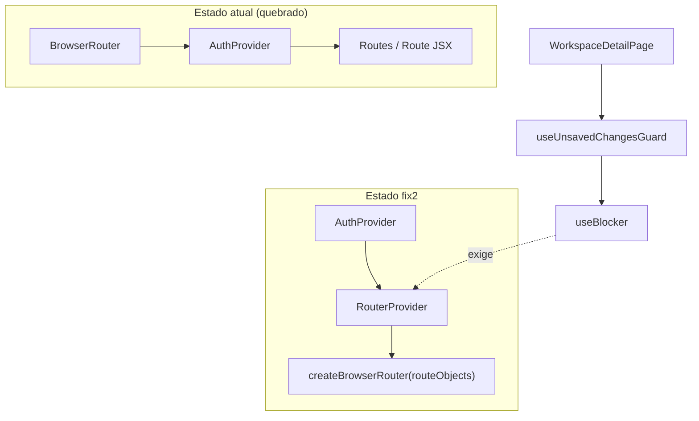

# workspace-usuario-v2-fix2 — Design

**Spec**: `_docs/specs/features/workspace-usuario-v2-fix2/spec.md`  
**Parent**: `_docs/specs/features/workspace-usuario-v2/` (WKS2-09)  
**Status**: Approved for Execute  
**Approach**: Opção A — migrar roteamento global para data router (`createBrowserRouter` + `RouterProvider`)

---

## Architecture Overview

Bug: `WorkspaceDetailPage` monta `useUnsavedChangesGuard` → `useBlocker`, que exige data router. A app usa `<BrowserRouter>` declarativo em `frontend/src/routes/index.tsx`.

Solução: substituir `<BrowserRouter><Routes>` por `createBrowserRouter(routes)` + `<RouterProvider router={router}>`, preservando a árvore de rotas e guards existentes.



**Ordem de providers (fix2):**

```text
AuthProvider
  └── RouterProvider (createBrowserRouter)
        └── route tree (PrivateRoute → Layout → …)
```

`AuthProvider` permanece **fora** do router para que `useAuth` funcione em `PrivateRoute`, `AdminRoute`, `WorkspaceRoute` sem mudança de comportamento.

---

## Component Changes

| Component | Location | Change |
| --- | --- | --- |
| `RouterWithAuth` | `frontend/src/routes/index.tsx` | Exportar `routeObjects: RouteObject[]`; `createBrowserRouter`; `RouterProvider`; remover `BrowserRouter` |
| `main.tsx` | `frontend/src/main.tsx` | Sem alteração (continua `<RouterWithAuth />`) |
| Guards | `PrivateRoute`, `AdminRoute`, `WorkspaceRoute`, `ApiKeyRoute`, `DashboardCustomRoute` | Adaptar apenas se necessário para `RouteObject` (layout routes com `element` + `children`) |
| `useUnsavedChangesGuard` | `hooks/useUnsavedChangesGuard.ts` | **Sem alteração** — já correto |
| `WorkspaceDetailPage.test.tsx` | page test | Manter mocks existentes; **novo** arquivo de integração sem mock do guard |

---

## Route Tree Mapping

Converter JSX aninhado 1:1 para `RouteObject[]`:

| Path pattern | Guard wrapper | Page |
| --- | --- | --- |
| `/login` | — | `Login` |
| `/*` private | `PrivateRoute` → `Layout` | nested |
| `/dashboard` | Layout | `Dashboard` |
| `/meu-dashboard` | `DashboardCustomRoute` | `MeuDashboard` |
| `/workspace/**` | `WorkspaceRoute` | hub, datasets, templates, detail, etc. |
| `/funcionarios`, … | Layout | cadastros |
| `/api-keys` | `ApiKeyRoute` | `ApiKeys` |
| admin routes | `AdminRoute` | usuarios, rubricas, … |
| `/` | redirect → `/dashboard` | |
| `*` | redirect → `/dashboard` | |

Ordem das rotas workspace **literal antes de param** — preservar ordem atual de `index.tsx:72-82`.

---

## Test Harness Strategy

| Harness | Uso | Data router? |
| --- | --- | --- |
| `renderWithProviders` (MemoryRouter) | Testes legados de página | Não — mantido |
| `createMemoryRouter` + `RouterProvider` | Smoke de rotas + integração detail/guard | Sim |
| `useUnsavedChangesGuard.test.tsx` | Unit do hook | Sim — já verde |

**Novo helper:** `renderWithDataRouter(ui, { routes, initialEntries, authContext })` em `frontend/src/test/renderWithDataRouter.tsx` — espelha `renderWithProviders` mas usa `createMemoryRouter` + `RouterProvider`.

**Novo teste:** `WorkspaceDetailPage.integration.test.tsx` — **sem** `vi.mock('./hooks/useUnsavedChangesGuard')`; usa `RouterProvider`; valida WKS2F2-01…03 e navegação guard WKS2F2-09…11 via fluxo edit mode.

**Smoke:** `frontend/src/routes/index.test.tsx` — importa factory de rotas ou espelha árvore mínima; assert elementos característicos + redirect login + alerta workspace ACL.

---

## Risks & Concerns

| Risk | Mitigation |
| --- | --- |
| Blast radius global de router | Smoke test em `routes/index.test.tsx`; gate full `npm test` + `npm run build` (T6) |
| `AuthProvider` dentro vs fora do router | Manter AuthProvider envolvendo RouterProvider (spec assumption) |
| Testes legados com MemoryRouter | Não migrar bulk — apenas helper novo para ACs fix2 |
| Double router em hot reload | Single `createBrowserRouter` call inside component or memoized — follow React Router v7 patterns |

---

## Requirement Mapping

| AC | Implementation |
| --- | --- |
| WKS2F2-01…03 | Data router + integration test detail page |
| WKS2F2-04…07 | T1 migration + T2 route smoke |
| WKS2F2-08…11 | Hook test existente + T5 integration detail |
| WKS2F2-12…14 | T6 regression gate (baseline ≥980 tests) |
